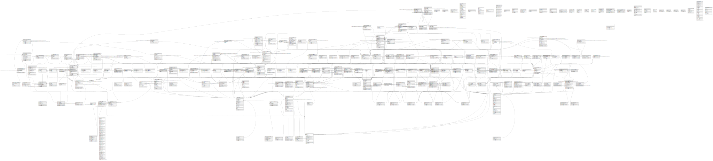

# neotoma

## Description

The remote Neotoma database.

## Viewpoints

| # | Name                                        | Description                                                      |
| - | ------------------------------------------- | ---------------------------------------------------------------- |
| 1 | [Controlled Vocabularies](viewpoint-0.md)   | Tables with controlled vocabularies.                             |
| 2 | [Hierarchical Tables](viewpoint-1.md)       | Tables with internal hierarchies.                                |
| 3 | [Taxonomic Tables](viewpoint-2.md)          | Tables related to species, observations and specimens.           |
| 4 | [Dataset related tables](viewpoint-3.md)    | Tables that help define and structure datasets.                  |
| 5 | [Contact related tables](viewpoint-4.md)    | Tables that relate to people, or are connected to the contactid. |
| 6 | [Chronology related tables](viewpoint-5.md) | Tables related to chronology and age assignments.                |

## Tables

| #   | Name                                                                              | Columns | Comment                                                                                                                                                                                                                                                                                                                                                                                                                                                                                                                                                                                                                                                                                                                                                                                                                                                                                                                                                                                                                                                                                                                                                                                                                                                                                                                                                                                                                                                                                                                                                                                                                                                                                                                                                                                                                                                                                                                                                                                                                                                                                                                                                                                                                                                                                                                                                                                                                                                       | Type              |
| --- | --------------------------------------------------------------------------------- | ------- | ------------------------------------------------------------------------------------------------------------------------------------------------------------------------------------------------------------------------------------------------------------------------------------------------------------------------------------------------------------------------------------------------------------------------------------------------------------------------------------------------------------------------------------------------------------------------------------------------------------------------------------------------------------------------------------------------------------------------------------------------------------------------------------------------------------------------------------------------------------------------------------------------------------------------------------------------------------------------------------------------------------------------------------------------------------------------------------------------------------------------------------------------------------------------------------------------------------------------------------------------------------------------------------------------------------------------------------------------------------------------------------------------------------------------------------------------------------------------------------------------------------------------------------------------------------------------------------------------------------------------------------------------------------------------------------------------------------------------------------------------------------------------------------------------------------------------------------------------------------------------------------------------------------------------------------------------------------------------------------------------------------------------------------------------------------------------------------------------------------------------------------------------------------------------------------------------------------------------------------------------------------------------------------------------------------------------------------------------------------------------------------------------------------------------------------------------------------- | ----------------- |
| 1   | [ap.datasetkeywords](ap.datasetkeywords.md)                                       | 2       |                                                                                                                                                                                                                                                                                                                                                                                                                                                                                                                                                                                                                                                                                                                                                                                                                                                                                                                                                                                                                                                                                                                                                                                                                                                                                                                                                                                                                                                                                                                                                                                                                                                                                                                                                                                                                                                                                                                                                                                                                                                                                                                                                                                                                                                                                                                                                                                                                                                               | VIEW              |
| 2   | [ap.datasetpisauthors](ap.datasetpisauthors.md)                                   | 2       |                                                                                                                                                                                                                                                                                                                                                                                                                                                                                                                                                                                                                                                                                                                                                                                                                                                                                                                                                                                                                                                                                                                                                                                                                                                                                                                                                                                                                                                                                                                                                                                                                                                                                                                                                                                                                                                                                                                                                                                                                                                                                                                                                                                                                                                                                                                                                                                                                                                               | VIEW              |
| 3   | [ap.faunranges](ap.faunranges.md)                                                 | 4       |                                                                                                                                                                                                                                                                                                                                                                                                                                                                                                                                                                                                                                                                                                                                                                                                                                                                                                                                                                                                                                                                                                                                                                                                                                                                                                                                                                                                                                                                                                                                                                                                                                                                                                                                                                                                                                                                                                                                                                                                                                                                                                                                                                                                                                                                                                                                                                                                                                                               | BASE TABLE        |
| 4   | [ap.gadm](ap.gadm.md)                                                             | 56      |                                                                                                                                                                                                                                                                                                                                                                                                                                                                                                                                                                                                                                                                                                                                                                                                                                                                                                                                                                                                                                                                                                                                                                                                                                                                                                                                                                                                                                                                                                                                                                                                                                                                                                                                                                                                                                                                                                                                                                                                                                                                                                                                                                                                                                                                                                                                                                                                                                                               | BASE TABLE        |
| 5   | [ap.geopolnames](ap.geopolnames.md)                                               | 2       |                                                                                                                                                                                                                                                                                                                                                                                                                                                                                                                                                                                                                                                                                                                                                                                                                                                                                                                                                                                                                                                                                                                                                                                                                                                                                                                                                                                                                                                                                                                                                                                                                                                                                                                                                                                                                                                                                                                                                                                                                                                                                                                                                                                                                                                                                                                                                                                                                                                               | MATERIALIZED VIEW |
| 6   | [ap.globalmammals](ap.globalmammals.md)                                           | 9       |                                                                                                                                                                                                                                                                                                                                                                                                                                                                                                                                                                                                                                                                                                                                                                                                                                                                                                                                                                                                                                                                                                                                                                                                                                                                                                                                                                                                                                                                                                                                                                                                                                                                                                                                                                                                                                                                                                                                                                                                                                                                                                                                                                                                                                                                                                                                                                                                                                                               | BASE TABLE        |
| 7   | [ap.hydrolakes](ap.hydrolakes.md)                                                 | 25      |                                                                                                                                                                                                                                                                                                                                                                                                                                                                                                                                                                                                                                                                                                                                                                                                                                                                                                                                                                                                                                                                                                                                                                                                                                                                                                                                                                                                                                                                                                                                                                                                                                                                                                                                                                                                                                                                                                                                                                                                                                                                                                                                                                                                                                                                                                                                                                                                                                                               | BASE TABLE        |
| 8   | [ap.icesheets](ap.icesheets.md)                                                   | 8       |                                                                                                                                                                                                                                                                                                                                                                                                                                                                                                                                                                                                                                                                                                                                                                                                                                                                                                                                                                                                                                                                                                                                                                                                                                                                                                                                                                                                                                                                                                                                                                                                                                                                                                                                                                                                                                                                                                                                                                                                                                                                                                                                                                                                                                                                                                                                                                                                                                                               | BASE TABLE        |
| 9   | [ap.orcidlogins](ap.orcidlogins.md)                                               | 6       |                                                                                                                                                                                                                                                                                                                                                                                                                                                                                                                                                                                                                                                                                                                                                                                                                                                                                                                                                                                                                                                                                                                                                                                                                                                                                                                                                                                                                                                                                                                                                                                                                                                                                                                                                                                                                                                                                                                                                                                                                                                                                                                                                                                                                                                                                                                                                                                                                                                               | BASE TABLE        |
| 10  | [ap.pollensumgroups](ap.pollensumgroups.md)                                       | 3       |                                                                                                                                                                                                                                                                                                                                                                                                                                                                                                                                                                                                                                                                                                                                                                                                                                                                                                                                                                                                                                                                                                                                                                                                                                                                                                                                                                                                                                                                                                                                                                                                                                                                                                                                                                                                                                                                                                                                                                                                                                                                                                                                                                                                                                                                                                                                                                                                                                                               | BASE TABLE        |
| 11  | [ap.pollensums](ap.pollensums.md)                                                 | 15      |                                                                                                                                                                                                                                                                                                                                                                                                                                                                                                                                                                                                                                                                                                                                                                                                                                                                                                                                                                                                                                                                                                                                                                                                                                                                                                                                                                                                                                                                                                                                                                                                                                                                                                                                                                                                                                                                                                                                                                                                                                                                                                                                                                                                                                                                                                                                                                                                                                                               | BASE TABLE        |
| 12  | [ap.querytable](ap.querytable.md)                                                 | 20      |                                                                                                                                                                                                                                                                                                                                                                                                                                                                                                                                                                                                                                                                                                                                                                                                                                                                                                                                                                                                                                                                                                                                                                                                                                                                                                                                                                                                                                                                                                                                                                                                                                                                                                                                                                                                                                                                                                                                                                                                                                                                                                                                                                                                                                                                                                                                                                                                                                                               | BASE TABLE        |
| 13  | [ap.sitegadm](ap.sitegadm.md)                                                     | 2       |                                                                                                                                                                                                                                                                                                                                                                                                                                                                                                                                                                                                                                                                                                                                                                                                                                                                                                                                                                                                                                                                                                                                                                                                                                                                                                                                                                                                                                                                                                                                                                                                                                                                                                                                                                                                                                                                                                                                                                                                                                                                                                                                                                                                                                                                                                                                                                                                                                                               | BASE TABLE        |
| 14  | [ap.summaries](ap.summaries.md)                                                   | 5       |                                                                                                                                                                                                                                                                                                                                                                                                                                                                                                                                                                                                                                                                                                                                                                                                                                                                                                                                                                                                                                                                                                                                                                                                                                                                                                                                                                                                                                                                                                                                                                                                                                                                                                                                                                                                                                                                                                                                                                                                                                                                                                                                                                                                                                                                                                                                                                                                                                                               | BASE TABLE        |
| 15  | [ap.taxaindatasetview](ap.taxaindatasetview.md)                                   | 4       |                                                                                                                                                                                                                                                                                                                                                                                                                                                                                                                                                                                                                                                                                                                                                                                                                                                                                                                                                                                                                                                                                                                                                                                                                                                                                                                                                                                                                                                                                                                                                                                                                                                                                                                                                                                                                                                                                                                                                                                                                                                                                                                                                                                                                                                                                                                                                                                                                                                               | VIEW              |
| 16  | [doi.doimeta](doi.doimeta.md)                                                     | 5       |                                                                                                                                                                                                                                                                                                                                                                                                                                                                                                                                                                                                                                                                                                                                                                                                                                                                                                                                                                                                                                                                                                                                                                                                                                                                                                                                                                                                                                                                                                                                                                                                                                                                                                                                                                                                                                                                                                                                                                                                                                                                                                                                                                                                                                                                                                                                                                                                                                                               | BASE TABLE        |
| 17  | [doi.frozen](doi.frozen.md)                                                       | 4       |                                                                                                                                                                                                                                                                                                                                                                                                                                                                                                                                                                                                                                                                                                                                                                                                                                                                                                                                                                                                                                                                                                                                                                                                                                                                                                                                                                                                                                                                                                                                                                                                                                                                                                                                                                                                                                                                                                                                                                                                                                                                                                                                                                                                                                                                                                                                                                                                                                                               | BASE TABLE        |
| 18  | [ndb.accumulationrates](ndb.accumulationrates.md)                                 | 6       |                                                                                                                                                                                                                                                                                                                                                                                                                                                                                                                                                                                                                                                                                                                                                                                                                                                                                                                                                                                                                                                                                                                                                                                                                                                                                                                                                                                                                                                                                                                                                                                                                                                                                                                                                                                                                                                                                                                                                                                                                                                                                                                                                                                                                                                                                                                                                                                                                                                               | BASE TABLE        |
| 19  | [ndb.agetypes](ndb.agetypes.md)                                                   | 6       | Lookup table of Age Types or units. This table is referenced by the Chronologies and Geochronology tables.                                                                                                                                                                                                                                                                                                                                                                                                                                                                                                                                                                                                                                                                                                                                                                                                                                                                                                                                                                                                                                                                                                                                                                                                                                                                                                                                                                                                                                                                                                                                                                                                                                                                                                                                                                                                                                                                                                                                                                                                                                                                                                                                                                                                                                                                                                                                                    | BASE TABLE        |
| 20  | [ndb.aggregatechronologies](ndb.aggregatechronologies.md)                         | 10      | This table stores metadata for Aggregate Chronologies. An Aggregate Chronology refers to an explicit chronology assigned to a sample Aggregate. The individual Aggregate Samples have ages assigned in the AggregateSampleAges table. An Aggregate Chronology would be used, for example, for a set of packrat middens assigned to an AggregateDataset. The Aggregate Chronology is analogous to the Chronology assigned to samples from a single Collection Unit. An Aggregate may have more than one Aggregate Chronology, for example one in radiocarbon years and another in calibrated radiocarbon years. One Aggregate Chronology per Age Type may be designated the default, which is the Aggregate Chronology currently preferred by the database stewards.                                                                                                                                                                                                                                                                                                                                                                                                                                                                                                                                                                                                                                                                                                                                                                                                                                                                                                                                                                                                                                                                                                                                                                                                                                                                                                                                                                                                                                                                                                                                                                                                                                                                                        | BASE TABLE        |
| 21  | [ndb.aggregatedatasets](ndb.aggregatedatasets.md)                                 | 6       | Aggregate Datasets are aggregates of samples of a particular data type. Some examples:   * Plant macrofossil samples from a group of packrat middens collected from a particular valley, mountain range, or other similarly defined geographic area. Each midden is from a different Site or Collection Unit, but they are grouped into time series for that area and are published as a single dataset. * Samples collected from 32 cutbanks along several km of Roberts Creek, northeast Iowa. Each sample is from a different site, but they form a time series from 0-12,510 14C yr BP, and pollen, plant macrofossils, and beetles were published and graphed as if from a single site. * A set of pollen surface samples from a particular region or study that were published and analyzed as a single dataset and submitted to the database as a single dataset. The examples above are datasets predefined in the database. New aggregate datasets could be assembled for particular studies, for example all the pollen samples for a given time slice for a given geographic region.                                                                                                                                                                                                                                                                                                                                                                                                                                                                                                                                                                                                                                                                                                                                                                                                                                                                                                                                                                                                                                                                                                                                                                                                                                                                                                                                                   | BASE TABLE        |
| 22  | [ndb.aggregateordertypes](ndb.aggregateordertypes.md)                             | 5       | Lookup table for Aggregate Order Types. Table is referenced by the AggregateDatasets table.                                                                                                                                                                                                                                                                                                                                                                                                                                                                                                                                                                                                                                                                                                                                                                                                                                                                                                                                                                                                                                                                                                                                                                                                                                                                                                                                                                                                                                                                                                                                                                                                                                                                                                                                                                                                                                                                                                                                                                                                                                                                                                                                                                                                                                                                                                                                                                   | BASE TABLE        |
| 23  | [ndb.aggregatesampleages](ndb.aggregatesampleages.md)                             | 5       | This table stores the links to the ages of samples in an Aggregate Dataset. The table is necessary because samples may be from Collection Units with multiple chronologies, and this table stores the links to the sample ages desired for the Aggregate Dataset.                                                                                                                                                                                                                                                                                                                                                                                                                                                                                                                                                                                                                                                                                                                                                                                                                                                                                                                                                                                                                                                                                                                                                                                                                                                                                                                                                                                                                                                                                                                                                                                                                                                                                                                                                                                                                                                                                                                                                                                                                                                                                                                                                                                             | BASE TABLE        |
| 24  | [ndb.aggregatesamples](ndb.aggregatesamples.md)                                   | 4       | This table stores the samples in Aggregate Datasets.                                                                                                                                                                                                                                                                                                                                                                                                                                                                                                                                                                                                                                                                                                                                                                                                                                                                                                                                                                                                                                                                                                                                                                                                                                                                                                                                                                                                                                                                                                                                                                                                                                                                                                                                                                                                                                                                                                                                                                                                                                                                                                                                                                                                                                                                                                                                                                                                          | BASE TABLE        |
| 25  | [ndb.analysisunitaltdepths](ndb.analysisunitaltdepths.md)                         | 5       |                                                                                                                                                                                                                                                                                                                                                                                                                                                                                                                                                                                                                                                                                                                                                                                                                                                                                                                                                                                                                                                                                                                                                                                                                                                                                                                                                                                                                                                                                                                                                                                                                                                                                                                                                                                                                                                                                                                                                                                                                                                                                                                                                                                                                                                                                                                                                                                                                                                               | BASE TABLE        |
| 26  | [ndb.analysisunitaltdepthscales](ndb.analysisunitaltdepthscales.md)               | 7       |                                                                                                                                                                                                                                                                                                                                                                                                                                                                                                                                                                                                                                                                                                                                                                                                                                                                                                                                                                                                                                                                                                                                                                                                                                                                                                                                                                                                                                                                                                                                                                                                                                                                                                                                                                                                                                                                                                                                                                                                                                                                                                                                                                                                                                                                                                                                                                                                                                                               | BASE TABLE        |
| 27  | [ndb.analysisunitlithostrat](ndb.analysisunitlithostrat.md)                       | 4       |                                                                                                                                                                                                                                                                                                                                                                                                                                                                                                                                                                                                                                                                                                                                                                                                                                                                                                                                                                                                                                                                                                                                                                                                                                                                                                                                                                                                                                                                                                                                                                                                                                                                                                                                                                                                                                                                                                                                                                                                                                                                                                                                                                                                                                                                                                                                                                                                                                                               | BASE TABLE        |
| 28  | [ndb.analysisunits](ndb.analysisunits.md)                                         | 11      | This table stores the data for Analysis Units.                                                                                                                                                                                                                                                                                                                                                                                                                                                                                                                                                                                                                                                                                                                                                                                                                                                                                                                                                                                                                                                                                                                                                                                                                                                                                                                                                                                                                                                                                                                                                                                                                                                                                                                                                                                                                                                                                                                                                                                                                                                                                                                                                                                                                                                                                                                                                                                                                | BASE TABLE        |
| 29  | [ndb.calibrationcurves](ndb.calibrationcurves.md)                                 | 5       |                                                                                                                                                                                                                                                                                                                                                                                                                                                                                                                                                                                                                                                                                                                                                                                                                                                                                                                                                                                                                                                                                                                                                                                                                                                                                                                                                                                                                                                                                                                                                                                                                                                                                                                                                                                                                                                                                                                                                                                                                                                                                                                                                                                                                                                                                                                                                                                                                                                               | BASE TABLE        |
| 30  | [ndb.calibrationprograms](ndb.calibrationprograms.md)                             | 5       |                                                                                                                                                                                                                                                                                                                                                                                                                                                                                                                                                                                                                                                                                                                                                                                                                                                                                                                                                                                                                                                                                                                                                                                                                                                                                                                                                                                                                                                                                                                                                                                                                                                                                                                                                                                                                                                                                                                                                                                                                                                                                                                                                                                                                                                                                                                                                                                                                                                               | BASE TABLE        |
| 31  | [ndb.chroncontrolaccuracydirections](ndb.chroncontrolaccuracydirections.md)       | 4       |                                                                                                                                                                                                                                                                                                                                                                                                                                                                                                                                                                                                                                                                                                                                                                                                                                                                                                                                                                                                                                                                                                                                                                                                                                                                                                                                                                                                                                                                                                                                                                                                                                                                                                                                                                                                                                                                                                                                                                                                                                                                                                                                                                                                                                                                                                                                                                                                                                                               | BASE TABLE        |
| 32  | [ndb.chroncontrolaccuracydistributions](ndb.chroncontrolaccuracydistributions.md) | 4       |                                                                                                                                                                                                                                                                                                                                                                                                                                                                                                                                                                                                                                                                                                                                                                                                                                                                                                                                                                                                                                                                                                                                                                                                                                                                                                                                                                                                                                                                                                                                                                                                                                                                                                                                                                                                                                                                                                                                                                                                                                                                                                                                                                                                                                                                                                                                                                                                                                                               | BASE TABLE        |
| 33  | [ndb.chroncontrolaccuracyranks](ndb.chroncontrolaccuracyranks.md)                 | 4       |                                                                                                                                                                                                                                                                                                                                                                                                                                                                                                                                                                                                                                                                                                                                                                                                                                                                                                                                                                                                                                                                                                                                                                                                                                                                                                                                                                                                                                                                                                                                                                                                                                                                                                                                                                                                                                                                                                                                                                                                                                                                                                                                                                                                                                                                                                                                                                                                                                                               | BASE TABLE        |
| 34  | [ndb.chroncontrolprecisionranks](ndb.chroncontrolprecisionranks.md)               | 4       |                                                                                                                                                                                                                                                                                                                                                                                                                                                                                                                                                                                                                                                                                                                                                                                                                                                                                                                                                                                                                                                                                                                                                                                                                                                                                                                                                                                                                                                                                                                                                                                                                                                                                                                                                                                                                                                                                                                                                                                                                                                                                                                                                                                                                                                                                                                                                                                                                                                               | BASE TABLE        |
| 35  | [ndb.chroncontrolranks](ndb.chroncontrolranks.md)                                 | 9       |                                                                                                                                                                                                                                                                                                                                                                                                                                                                                                                                                                                                                                                                                                                                                                                                                                                                                                                                                                                                                                                                                                                                                                                                                                                                                                                                                                                                                                                                                                                                                                                                                                                                                                                                                                                                                                                                                                                                                                                                                                                                                                                                                                                                                                                                                                                                                                                                                                                               | BASE TABLE        |
| 36  | [ndb.chroncontrols](ndb.chroncontrols.md)                                         | 13      | This table stores data for Chronology Controls, which are the age-depth control points used for age models. These controls may be geophysical controls, such as radiocarbon dates, but include many other kinds of age controls, such as biostratigraphic controls, archaeological cultural associations, and volcanic tephras. In the case of radiocarbon dates, a Chronology Control may not simply be the raw radiocarbon date reported by the laboratory, but perhaps a radiocarbon date corrected for an old carbon reservoir, a calibrated radiocarbon date, or an average of several radiocarbon dates from the same level. A common control for lake-sediment cores is the age of the top of the core, which may be the year the core was taken or perhaps an estimate of 0 BP if a few cm of surficial sediment were lost.                                                                                                                                                                                                                                                                                                                                                                                                                                                                                                                                                                                                                                                                                                                                                                                                                                                                                                                                                                                                                                                                                                                                                                                                                                                                                                                                                                                                                                                                                                                                                                                                                           | BASE TABLE        |
| 37  | [ndb.chroncontrolscal14c](ndb.chroncontrolscal14c.md)                             | 5       |                                                                                                                                                                                                                                                                                                                                                                                                                                                                                                                                                                                                                                                                                                                                                                                                                                                                                                                                                                                                                                                                                                                                                                                                                                                                                                                                                                                                                                                                                                                                                                                                                                                                                                                                                                                                                                                                                                                                                                                                                                                                                                                                                                                                                                                                                                                                                                                                                                                               | BASE TABLE        |
| 38  | [ndb.chroncontroltypes](ndb.chroncontroltypes.md)                                 | 5       | Lookup table of Chronology Control Types. This table is referenced by the ChronControls table.                                                                                                                                                                                                                                                                                                                                                                                                                                                                                                                                                                                                                                                                                                                                                                                                                                                                                                                                                                                                                                                                                                                                                                                                                                                                                                                                                                                                                                                                                                                                                                                                                                                                                                                                                                                                                                                                                                                                                                                                                                                                                                                                                                                                                                                                                                                                                                | BASE TABLE        |
| 39  | [ndb.chronologies](ndb.chronologies.md)                                           | 13      | This table stores Chronology data. A Chronology refers to an explicit chronology assigned to a Collection Unit. A Chronology has Chronology Controls, the actual age-depth control points, which are stored in the ChronControls table. A Chronology is also based on an Age Model, which may be a numerical method that fits a curve to a set of age-depth control points or may simply be individually dated Analysis Units. A Collection Unit may have more than one Chronology, for example one in radiocarbon years and another in calibrated radiocarbon years. There may be a Chronology developed by the original author and another developed by a later research project. Chronologies may be stored for archival reasons, even though they are now believed to have problems, if they were used for an important research project. One Chronology per Age Type may be designated the default Chronology, which is the Chronology currently preferred by the database stewards. Based upon the Chronology, which includes the Age Model and the Chron Controls, ages are assigned to individual samples, which are stored in the SampleAges table. A younger and older age bounds are assigned to the Chronology. Within these bounds the Chronology is regarded as reliable. Ages may be assigned to samples beyond the reliable age bounds, but these are not considered reliable                                                                                                                                                                                                                                                                                                                                                                                                                                                                                                                                                                                                                                                                                                                                                                                                                                                                                                                                                                                                                                                        | BASE TABLE        |
| 40  | [ndb.collectiontypes](ndb.collectiontypes.md)                                     | 4       | This table is a lookup table for types of Collection Units, or Collection Types. Table is referenced by the CollectionUnits table.                                                                                                                                                                                                                                                                                                                                                                                                                                                                                                                                                                                                                                                                                                                                                                                                                                                                                                                                                                                                                                                                                                                                                                                                                                                                                                                                                                                                                                                                                                                                                                                                                                                                                                                                                                                                                                                                                                                                                                                                                                                                                                                                                                                                                                                                                                                            | BASE TABLE        |
| 41  | [ndb.collectionunits](ndb.collectionunits.md)                                     | 20      | This table stores data for Collection Units.                                                                                                                                                                                                                                                                                                                                                                                                                                                                                                                                                                                                                                                                                                                                                                                                                                                                                                                                                                                                                                                                                                                                                                                                                                                                                                                                                                                                                                                                                                                                                                                                                                                                                                                                                                                                                                                                                                                                                                                                                                                                                                                                                                                                                                                                                                                                                                                                                  | BASE TABLE        |
| 42  | [ndb.collectors](ndb.collectors.md)                                               | 6       | The Collectors table lists the people who collected Collection Units.                                                                                                                                                                                                                                                                                                                                                                                                                                                                                                                                                                                                                                                                                                                                                                                                                                                                                                                                                                                                                                                                                                                                                                                                                                                                                                                                                                                                                                                                                                                                                                                                                                                                                                                                                                                                                                                                                                                                                                                                                                                                                                                                                                                                                                                                                                                                                                                         | BASE TABLE        |
| 43  | [ndb.constituentdatabases](ndb.constituentdatabases.md)                           | 7       |                                                                                                                                                                                                                                                                                                                                                                                                                                                                                                                                                                                                                                                                                                                                                                                                                                                                                                                                                                                                                                                                                                                                                                                                                                                                                                                                                                                                                                                                                                                                                                                                                                                                                                                                                                                                                                                                                                                                                                                                                                                                                                                                                                                                                                                                                                                                                                                                                                                               | BASE TABLE        |
| 44  | [ndb.contactreferences](ndb.contactreferences.md)                                 | 3       |                                                                                                                                                                                                                                                                                                                                                                                                                                                                                                                                                                                                                                                                                                                                                                                                                                                                                                                                                                                                                                                                                                                                                                                                                                                                                                                                                                                                                                                                                                                                                                                                                                                                                                                                                                                                                                                                                                                                                                                                                                                                                                                                                                                                                                                                                                                                                                                                                                                               | BASE TABLE        |
| 45  | [ndb.contacts](ndb.contacts.md)                                                   | 17      | This table lists persons and organizations referenced by the Chronologies, Collectors, DatasetPIs, DatasetSubmissions, Projects, PublicationAuthors, SampleAnalysts, and SiteImages tables.                                                                                                                                                                                                                                                                                                                                                                                                                                                                                                                                                                                                                                                                                                                                                                                                                                                                                                                                                                                                                                                                                                                                                                                                                                                                                                                                                                                                                                                                                                                                                                                                                                                                                                                                                                                                                                                                                                                                                                                                                                                                                                                                                                                                                                                                   | BASE TABLE        |
| 46  | [ndb.contactstatuses](ndb.contactstatuses.md)                                     | 5       | Lookup table of Contact Statuses. Table is referenced by the Contacts table.                                                                                                                                                                                                                                                                                                                                                                                                                                                                                                                                                                                                                                                                                                                                                                                                                                                                                                                                                                                                                                                                                                                                                                                                                                                                                                                                                                                                                                                                                                                                                                                                                                                                                                                                                                                                                                                                                                                                                                                                                                                                                                                                                                                                                                                                                                                                                                                  | BASE TABLE        |
| 47  | [ndb.contextsdatasettypes](ndb.contextsdatasettypes.md)                           | 4       |                                                                                                                                                                                                                                                                                                                                                                                                                                                                                                                                                                                                                                                                                                                                                                                                                                                                                                                                                                                                                                                                                                                                                                                                                                                                                                                                                                                                                                                                                                                                                                                                                                                                                                                                                                                                                                                                                                                                                                                                                                                                                                                                                                                                                                                                                                                                                                                                                                                               | BASE TABLE        |
| 48  | [ndb.data](ndb.data.md)                                                           | 6       | The primary data table in the database. Each occurrence of a Variable in a sample comprises a record in the Data table.                                                                                                                                                                                                                                                                                                                                                                                                                                                                                                                                                                                                                                                                                                                                                                                                                                                                                                                                                                                                                                                                                                                                                                                                                                                                                                                                                                                                                                                                                                                                                                                                                                                                                                                                                                                                                                                                                                                                                                                                                                                                                                                                                                                                                                                                                                                                       | BASE TABLE        |
| 49  | [ndb.dataprocessors](ndb.dataprocessors.md)                                       | 4       |                                                                                                                                                                                                                                                                                                                                                                                                                                                                                                                                                                                                                                                                                                                                                                                                                                                                                                                                                                                                                                                                                                                                                                                                                                                                                                                                                                                                                                                                                                                                                                                                                                                                                                                                                                                                                                                                                                                                                                                                                                                                                                                                                                                                                                                                                                                                                                                                                                                               | BASE TABLE        |
| 50  | [ndb.datasetdatabases](ndb.datasetdatabases.md)                                   | 4       |                                                                                                                                                                                                                                                                                                                                                                                                                                                                                                                                                                                                                                                                                                                                                                                                                                                                                                                                                                                                                                                                                                                                                                                                                                                                                                                                                                                                                                                                                                                                                                                                                                                                                                                                                                                                                                                                                                                                                                                                                                                                                                                                                                                                                                                                                                                                                                                                                                                               | BASE TABLE        |
| 51  | [ndb.datasetdoi](ndb.datasetdoi.md)                                               | 5       |                                                                                                                                                                                                                                                                                                                                                                                                                                                                                                                                                                                                                                                                                                                                                                                                                                                                                                                                                                                                                                                                                                                                                                                                                                                                                                                                                                                                                                                                                                                                                                                                                                                                                                                                                                                                                                                                                                                                                                                                                                                                                                                                                                                                                                                                                                                                                                                                                                                               | BASE TABLE        |
| 52  | [ndb.datasetpis](ndb.datasetpis.md)                                               | 5       |                                                                                                                                                                                                                                                                                                                                                                                                                                                                                                                                                                                                                                                                                                                                                                                                                                                                                                                                                                                                                                                                                                                                                                                                                                                                                                                                                                                                                                                                                                                                                                                                                                                                                                                                                                                                                                                                                                                                                                                                                                                                                                                                                                                                                                                                                                                                                                                                                                                               | BASE TABLE        |
| 53  | [ndb.datasetpublications](ndb.datasetpublications.md)                             | 5       | This table lists the publications for datasets.                                                                                                                                                                                                                                                                                                                                                                                                                                                                                                                                                                                                                                                                                                                                                                                                                                                                                                                                                                                                                                                                                                                                                                                                                                                                                                                                                                                                                                                                                                                                                                                                                                                                                                                                                                                                                                                                                                                                                                                                                                                                                                                                                                                                                                                                                                                                                                                                               | BASE TABLE        |
| 54  | [ndb.datasets](ndb.datasets.md)                                                   | 8       | This table stores the data for Datasets. A Dataset is the set of samples for a particular data type from a Collection Unit. A Collection Unit may have multiple Datasets for different data types, for example one dataset for pollen and another for plant macrofossils. Every Sample is assigned to a Dataset, and every Dataset is assigned to a Collection Unit. Samples from different Collection Units cannot be assigned to the same Dataset (although they may be assigned to Aggregate Datasets).                                                                                                                                                                                                                                                                                                                                                                                                                                                                                                                                                                                                                                                                                                                                                                                                                                                                                                                                                                                                                                                                                                                                                                                                                                                                                                                                                                                                                                                                                                                                                                                                                                                                                                                                                                                                                                                                                                                                                    | BASE TABLE        |
| 55  | [ndb.datasetsubmissions](ndb.datasetsubmissions.md)                               | 9       | Submissions to the database are of Datasets. Submissions may be original submissions, resubmissions, compilations from other databases, or recompilations. See the description of the DatasetSubmissionTypes table.                                                                                                                                                                                                                                                                                                                                                                                                                                                                                                                                                                                                                                                                                                                                                                                                                                                                                                                                                                                                                                                                                                                                                                                                                                                                                                                                                                                                                                                                                                                                                                                                                                                                                                                                                                                                                                                                                                                                                                                                                                                                                                                                                                                                                                           | BASE TABLE        |
| 56  | [ndb.datasetsubmissiontypes](ndb.datasetsubmissiontypes.md)                       | 4       | Lookup table of Dataset Submission Types. Table is referenced by the DatasetSubmissions table.                                                                                                                                                                                                                                                                                                                                                                                                                                                                                                                                                                                                                                                                                                                                                                                                                                                                                                                                                                                                                                                                                                                                                                                                                                                                                                                                                                                                                                                                                                                                                                                                                                                                                                                                                                                                                                                                                                                                                                                                                                                                                                                                                                                                                                                                                                                                                                | BASE TABLE        |
| 57  | [ndb.datasettaxagrouptypes](ndb.datasettaxagrouptypes.md)                         | 4       |                                                                                                                                                                                                                                                                                                                                                                                                                                                                                                                                                                                                                                                                                                                                                                                                                                                                                                                                                                                                                                                                                                                                                                                                                                                                                                                                                                                                                                                                                                                                                                                                                                                                                                                                                                                                                                                                                                                                                                                                                                                                                                                                                                                                                                                                                                                                                                                                                                                               | BASE TABLE        |
| 58  | [ndb.datasettaxonnotes](ndb.datasettaxonnotes.md)                                 | 7       |                                                                                                                                                                                                                                                                                                                                                                                                                                                                                                                                                                                                                                                                                                                                                                                                                                                                                                                                                                                                                                                                                                                                                                                                                                                                                                                                                                                                                                                                                                                                                                                                                                                                                                                                                                                                                                                                                                                                                                                                                                                                                                                                                                                                                                                                                                                                                                                                                                                               | BASE TABLE        |
| 59  | [ndb.datasettypes](ndb.datasettypes.md)                                           | 4       | Lookup table for Dataset Types. Table is referenced by the Datasets table.                                                                                                                                                                                                                                                                                                                                                                                                                                                                                                                                                                                                                                                                                                                                                                                                                                                                                                                                                                                                                                                                                                                                                                                                                                                                                                                                                                                                                                                                                                                                                                                                                                                                                                                                                                                                                                                                                                                                                                                                                                                                                                                                                                                                                                                                                                                                                                                    | BASE TABLE        |
| 60  | [ndb.datasetvariables](ndb.datasetvariables.md)                                   | 5       |                                                                                                                                                                                                                                                                                                                                                                                                                                                                                                                                                                                                                                                                                                                                                                                                                                                                                                                                                                                                                                                                                                                                                                                                                                                                                                                                                                                                                                                                                                                                                                                                                                                                                                                                                                                                                                                                                                                                                                                                                                                                                                                                                                                                                                                                                                                                                                                                                                                               | BASE TABLE        |
| 61  | [ndb.datataxonnotes](ndb.datataxonnotes.md)                                       | 7       |                                                                                                                                                                                                                                                                                                                                                                                                                                                                                                                                                                                                                                                                                                                                                                                                                                                                                                                                                                                                                                                                                                                                                                                                                                                                                                                                                                                                                                                                                                                                                                                                                                                                                                                                                                                                                                                                                                                                                                                                                                                                                                                                                                                                                                                                                                                                                                                                                                                               | BASE TABLE        |
| 62  | [ndb.datauncertainties](ndb.datauncertainties.md)                                 | 5       |                                                                                                                                                                                                                                                                                                                                                                                                                                                                                                                                                                                                                                                                                                                                                                                                                                                                                                                                                                                                                                                                                                                                                                                                                                                                                                                                                                                                                                                                                                                                                                                                                                                                                                                                                                                                                                                                                                                                                                                                                                                                                                                                                                                                                                                                                                                                                                                                                                                               | BASE TABLE        |
| 63  | [ndb.decayconstants](ndb.decayconstants.md)                                       | 4       |                                                                                                                                                                                                                                                                                                                                                                                                                                                                                                                                                                                                                                                                                                                                                                                                                                                                                                                                                                                                                                                                                                                                                                                                                                                                                                                                                                                                                                                                                                                                                                                                                                                                                                                                                                                                                                                                                                                                                                                                                                                                                                                                                                                                                                                                                                                                                                                                                                                               | BASE TABLE        |
| 64  | [ndb.depagents](ndb.depagents.md)                                                 | 4       | Deposition Agents for Analysis Units. Individual Analysis Units may be listed multiple times with different Deposition Agents.                                                                                                                                                                                                                                                                                                                                                                                                                                                                                                                                                                                                                                                                                                                                                                                                                                                                                                                                                                                                                                                                                                                                                                                                                                                                                                                                                                                                                                                                                                                                                                                                                                                                                                                                                                                                                                                                                                                                                                                                                                                                                                                                                                                                                                                                                                                                | BASE TABLE        |
| 65  | [ndb.depagenttypes](ndb.depagenttypes.md)                                         | 4       | Lookup table of Depositional Agents. Table is referenced by the DepAgents table.                                                                                                                                                                                                                                                                                                                                                                                                                                                                                                                                                                                                                                                                                                                                                                                                                                                                                                                                                                                                                                                                                                                                                                                                                                                                                                                                                                                                                                                                                                                                                                                                                                                                                                                                                                                                                                                                                                                                                                                                                                                                                                                                                                                                                                                                                                                                                                              | BASE TABLE        |
| 66  | [ndb.depenvttypes](ndb.depenvttypes.md)                                           | 5       | Lookup table of Depositional Environment Types. Table is referenced by the CollectionUnits table.                                                                                                                                                                                                                                                                                                                                                                                                                                                                                                                                                                                                                                                                                                                                                                                                                                                                                                                                                                                                                                                                                                                                                                                                                                                                                                                                                                                                                                                                                                                                                                                                                                                                                                                                                                                                                                                                                                                                                                                                                                                                                                                                                                                                                                                                                                                                                             | BASE TABLE        |
| 67  | [ndb.depthreferencesystem](ndb.depthreferencesystem.md)                           | 4       |                                                                                                                                                                                                                                                                                                                                                                                                                                                                                                                                                                                                                                                                                                                                                                                                                                                                                                                                                                                                                                                                                                                                                                                                                                                                                                                                                                                                                                                                                                                                                                                                                                                                                                                                                                                                                                                                                                                                                                                                                                                                                                                                                                                                                                                                                                                                                                                                                                                               | BASE TABLE        |
| 68  | [ndb.dsageranges](ndb.dsageranges.md)                                             | 4       |                                                                                                                                                                                                                                                                                                                                                                                                                                                                                                                                                                                                                                                                                                                                                                                                                                                                                                                                                                                                                                                                                                                                                                                                                                                                                                                                                                                                                                                                                                                                                                                                                                                                                                                                                                                                                                                                                                                                                                                                                                                                                                                                                                                                                                                                                                                                                                                                                                                               | VIEW              |
| 69  | [ndb.dsdatasample](ndb.dsdatasample.md)                                           | 4       |                                                                                                                                                                                                                                                                                                                                                                                                                                                                                                                                                                                                                                                                                                                                                                                                                                                                                                                                                                                                                                                                                                                                                                                                                                                                                                                                                                                                                                                                                                                                                                                                                                                                                                                                                                                                                                                                                                                                                                                                                                                                                                                                                                                                                                                                                                                                                                                                                                                               | VIEW              |
| 70  | [ndb.dslinks](ndb.dslinks.md)                                                     | 3       |                                                                                                                                                                                                                                                                                                                                                                                                                                                                                                                                                                                                                                                                                                                                                                                                                                                                                                                                                                                                                                                                                                                                                                                                                                                                                                                                                                                                                                                                                                                                                                                                                                                                                                                                                                                                                                                                                                                                                                                                                                                                                                                                                                                                                                                                                                                                                                                                                                                               | VIEW              |
| 71  | [ndb.dssampdata](ndb.dssampdata.md)                                               | 3       |                                                                                                                                                                                                                                                                                                                                                                                                                                                                                                                                                                                                                                                                                                                                                                                                                                                                                                                                                                                                                                                                                                                                                                                                                                                                                                                                                                                                                                                                                                                                                                                                                                                                                                                                                                                                                                                                                                                                                                                                                                                                                                                                                                                                                                                                                                                                                                                                                                                               | VIEW              |
| 72  | [ndb.ecolgroups](ndb.ecolgroups.md)                                               | 5       | Taxa are assigned to Sets of Ecological Groups. A taxon may be assigned to more than one Set of Ecological Groups, representing different schemes for organizing taxa.                                                                                                                                                                                                                                                                                                                                                                                                                                                                                                                                                                                                                                                                                                                                                                                                                                                                                                                                                                                                                                                                                                                                                                                                                                                                                                                                                                                                                                                                                                                                                                                                                                                                                                                                                                                                                                                                                                                                                                                                                                                                                                                                                                                                                                                                                        | BASE TABLE        |
| 73  | [ndb.ecolgrouptypes](ndb.ecolgrouptypes.md)                                       | 4       | Lookup table of Ecological Group Types. Table is referenced by the EcolGroups table.                                                                                                                                                                                                                                                                                                                                                                                                                                                                                                                                                                                                                                                                                                                                                                                                                                                                                                                                                                                                                                                                                                                                                                                                                                                                                                                                                                                                                                                                                                                                                                                                                                                                                                                                                                                                                                                                                                                                                                                                                                                                                                                                                                                                                                                                                                                                                                          | BASE TABLE        |
| 74  | [ndb.ecolsettypes](ndb.ecolsettypes.md)                                           | 4       | Lookup table of Ecological Set Types. Table is referenced by the EcolGroups table.                                                                                                                                                                                                                                                                                                                                                                                                                                                                                                                                                                                                                                                                                                                                                                                                                                                                                                                                                                                                                                                                                                                                                                                                                                                                                                                                                                                                                                                                                                                                                                                                                                                                                                                                                                                                                                                                                                                                                                                                                                                                                                                                                                                                                                                                                                                                                                            | BASE TABLE        |
| 75  | [ndb.elementdatasettaxagroups](ndb.elementdatasettaxagroups.md)                   | 5       |                                                                                                                                                                                                                                                                                                                                                                                                                                                                                                                                                                                                                                                                                                                                                                                                                                                                                                                                                                                                                                                                                                                                                                                                                                                                                                                                                                                                                                                                                                                                                                                                                                                                                                                                                                                                                                                                                                                                                                                                                                                                                                                                                                                                                                                                                                                                                                                                                                                               | BASE TABLE        |
| 76  | [ndb.elementmaturities](ndb.elementmaturities.md)                                 | 4       |                                                                                                                                                                                                                                                                                                                                                                                                                                                                                                                                                                                                                                                                                                                                                                                                                                                                                                                                                                                                                                                                                                                                                                                                                                                                                                                                                                                                                                                                                                                                                                                                                                                                                                                                                                                                                                                                                                                                                                                                                                                                                                                                                                                                                                                                                                                                                                                                                                                               | BASE TABLE        |
| 77  | [ndb.elementportions](ndb.elementportions.md)                                     | 4       |                                                                                                                                                                                                                                                                                                                                                                                                                                                                                                                                                                                                                                                                                                                                                                                                                                                                                                                                                                                                                                                                                                                                                                                                                                                                                                                                                                                                                                                                                                                                                                                                                                                                                                                                                                                                                                                                                                                                                                                                                                                                                                                                                                                                                                                                                                                                                                                                                                                               | BASE TABLE        |
| 78  | [ndb.elementsymmetries](ndb.elementsymmetries.md)                                 | 4       |                                                                                                                                                                                                                                                                                                                                                                                                                                                                                                                                                                                                                                                                                                                                                                                                                                                                                                                                                                                                                                                                                                                                                                                                                                                                                                                                                                                                                                                                                                                                                                                                                                                                                                                                                                                                                                                                                                                                                                                                                                                                                                                                                                                                                                                                                                                                                                                                                                                               | BASE TABLE        |
| 79  | [ndb.elementtaxagroupmaturities](ndb.elementtaxagroupmaturities.md)               | 4       |                                                                                                                                                                                                                                                                                                                                                                                                                                                                                                                                                                                                                                                                                                                                                                                                                                                                                                                                                                                                                                                                                                                                                                                                                                                                                                                                                                                                                                                                                                                                                                                                                                                                                                                                                                                                                                                                                                                                                                                                                                                                                                                                                                                                                                                                                                                                                                                                                                                               | BASE TABLE        |
| 80  | [ndb.elementtaxagroupportions](ndb.elementtaxagroupportions.md)                   | 4       |                                                                                                                                                                                                                                                                                                                                                                                                                                                                                                                                                                                                                                                                                                                                                                                                                                                                                                                                                                                                                                                                                                                                                                                                                                                                                                                                                                                                                                                                                                                                                                                                                                                                                                                                                                                                                                                                                                                                                                                                                                                                                                                                                                                                                                                                                                                                                                                                                                                               | BASE TABLE        |
| 81  | [ndb.elementtaxagroups](ndb.elementtaxagroups.md)                                 | 5       |                                                                                                                                                                                                                                                                                                                                                                                                                                                                                                                                                                                                                                                                                                                                                                                                                                                                                                                                                                                                                                                                                                                                                                                                                                                                                                                                                                                                                                                                                                                                                                                                                                                                                                                                                                                                                                                                                                                                                                                                                                                                                                                                                                                                                                                                                                                                                                                                                                                               | BASE TABLE        |
| 82  | [ndb.elementtaxagroupsymmetries](ndb.elementtaxagroupsymmetries.md)               | 4       |                                                                                                                                                                                                                                                                                                                                                                                                                                                                                                                                                                                                                                                                                                                                                                                                                                                                                                                                                                                                                                                                                                                                                                                                                                                                                                                                                                                                                                                                                                                                                                                                                                                                                                                                                                                                                                                                                                                                                                                                                                                                                                                                                                                                                                                                                                                                                                                                                                                               | BASE TABLE        |
| 83  | [ndb.elementtypes](ndb.elementtypes.md)                                           | 4       |                                                                                                                                                                                                                                                                                                                                                                                                                                                                                                                                                                                                                                                                                                                                                                                                                                                                                                                                                                                                                                                                                                                                                                                                                                                                                                                                                                                                                                                                                                                                                                                                                                                                                                                                                                                                                                                                                                                                                                                                                                                                                                                                                                                                                                                                                                                                                                                                                                                               | BASE TABLE        |
| 84  | [ndb.embargo](ndb.embargo.md)                                                     | 3       |                                                                                                                                                                                                                                                                                                                                                                                                                                                                                                                                                                                                                                                                                                                                                                                                                                                                                                                                                                                                                                                                                                                                                                                                                                                                                                                                                                                                                                                                                                                                                                                                                                                                                                                                                                                                                                                                                                                                                                                                                                                                                                                                                                                                                                                                                                                                                                                                                                                               | BASE TABLE        |
| 85  | [ndb.entitycovers](ndb.entitycovers.md)                                           | 4       |                                                                                                                                                                                                                                                                                                                                                                                                                                                                                                                                                                                                                                                                                                                                                                                                                                                                                                                                                                                                                                                                                                                                                                                                                                                                                                                                                                                                                                                                                                                                                                                                                                                                                                                                                                                                                                                                                                                                                                                                                                                                                                                                                                                                                                                                                                                                                                                                                                                               | BASE TABLE        |
| 86  | [ndb.entitycovertypes](ndb.entitycovertypes.md)                                   | 3       |                                                                                                                                                                                                                                                                                                                                                                                                                                                                                                                                                                                                                                                                                                                                                                                                                                                                                                                                                                                                                                                                                                                                                                                                                                                                                                                                                                                                                                                                                                                                                                                                                                                                                                                                                                                                                                                                                                                                                                                                                                                                                                                                                                                                                                                                                                                                                                                                                                                               | BASE TABLE        |
| 87  | [ndb.entitydripheight](ndb.entitydripheight.md)                                   | 4       |                                                                                                                                                                                                                                                                                                                                                                                                                                                                                                                                                                                                                                                                                                                                                                                                                                                                                                                                                                                                                                                                                                                                                                                                                                                                                                                                                                                                                                                                                                                                                                                                                                                                                                                                                                                                                                                                                                                                                                                                                                                                                                                                                                                                                                                                                                                                                                                                                                                               | BASE TABLE        |
| 88  | [ndb.entitygeology](ndb.entitygeology.md)                                         | 3       |                                                                                                                                                                                                                                                                                                                                                                                                                                                                                                                                                                                                                                                                                                                                                                                                                                                                                                                                                                                                                                                                                                                                                                                                                                                                                                                                                                                                                                                                                                                                                                                                                                                                                                                                                                                                                                                                                                                                                                                                                                                                                                                                                                                                                                                                                                                                                                                                                                                               | BASE TABLE        |
| 89  | [ndb.entitylandusecover](ndb.entitylandusecover.md)                               | 4       |                                                                                                                                                                                                                                                                                                                                                                                                                                                                                                                                                                                                                                                                                                                                                                                                                                                                                                                                                                                                                                                                                                                                                                                                                                                                                                                                                                                                                                                                                                                                                                                                                                                                                                                                                                                                                                                                                                                                                                                                                                                                                                                                                                                                                                                                                                                                                                                                                                                               | BASE TABLE        |
| 90  | [ndb.entityrelationship](ndb.entityrelationship.md)                               | 4       |                                                                                                                                                                                                                                                                                                                                                                                                                                                                                                                                                                                                                                                                                                                                                                                                                                                                                                                                                                                                                                                                                                                                                                                                                                                                                                                                                                                                                                                                                                                                                                                                                                                                                                                                                                                                                                                                                                                                                                                                                                                                                                                                                                                                                                                                                                                                                                                                                                                               | BASE TABLE        |
| 91  | [ndb.entitysamples](ndb.entitysamples.md)                                         | 8       |                                                                                                                                                                                                                                                                                                                                                                                                                                                                                                                                                                                                                                                                                                                                                                                                                                                                                                                                                                                                                                                                                                                                                                                                                                                                                                                                                                                                                                                                                                                                                                                                                                                                                                                                                                                                                                                                                                                                                                                                                                                                                                                                                                                                                                                                                                                                                                                                                                                               | BASE TABLE        |
| 92  | [ndb.entityvegetationcover](ndb.entityvegetationcover.md)                         | 4       |                                                                                                                                                                                                                                                                                                                                                                                                                                                                                                                                                                                                                                                                                                                                                                                                                                                                                                                                                                                                                                                                                                                                                                                                                                                                                                                                                                                                                                                                                                                                                                                                                                                                                                                                                                                                                                                                                                                                                                                                                                                                                                                                                                                                                                                                                                                                                                                                                                                               | BASE TABLE        |
| 93  | [ndb.eventchronology](ndb.eventchronology.md)                                     | 7       |                                                                                                                                                                                                                                                                                                                                                                                                                                                                                                                                                                                                                                                                                                                                                                                                                                                                                                                                                                                                                                                                                                                                                                                                                                                                                                                                                                                                                                                                                                                                                                                                                                                                                                                                                                                                                                                                                                                                                                                                                                                                                                                                                                                                                                                                                                                                                                                                                                                               | BASE TABLE        |
| 94  | [ndb.eventpublications](ndb.eventpublications.md)                                 | 4       |                                                                                                                                                                                                                                                                                                                                                                                                                                                                                                                                                                                                                                                                                                                                                                                                                                                                                                                                                                                                                                                                                                                                                                                                                                                                                                                                                                                                                                                                                                                                                                                                                                                                                                                                                                                                                                                                                                                                                                                                                                                                                                                                                                                                                                                                                                                                                                                                                                                               | BASE TABLE        |
| 95  | [ndb.events](ndb.events.md)                                                       | 12      |                                                                                                                                                                                                                                                                                                                                                                                                                                                                                                                                                                                                                                                                                                                                                                                                                                                                                                                                                                                                                                                                                                                                                                                                                                                                                                                                                                                                                                                                                                                                                                                                                                                                                                                                                                                                                                                                                                                                                                                                                                                                                                                                                                                                                                                                                                                                                                                                                                                               | BASE TABLE        |
| 96  | [ndb.eventtypes](ndb.eventtypes.md)                                               | 5       |                                                                                                                                                                                                                                                                                                                                                                                                                                                                                                                                                                                                                                                                                                                                                                                                                                                                                                                                                                                                                                                                                                                                                                                                                                                                                                                                                                                                                                                                                                                                                                                                                                                                                                                                                                                                                                                                                                                                                                                                                                                                                                                                                                                                                                                                                                                                                                                                                                                               | BASE TABLE        |
| 97  | [ndb.externalcontacts](ndb.externalcontacts.md)                                   | 3       |                                                                                                                                                                                                                                                                                                                                                                                                                                                                                                                                                                                                                                                                                                                                                                                                                                                                                                                                                                                                                                                                                                                                                                                                                                                                                                                                                                                                                                                                                                                                                                                                                                                                                                                                                                                                                                                                                                                                                                                                                                                                                                                                                                                                                                                                                                                                                                                                                                                               | BASE TABLE        |
| 98  | [ndb.externaldatabases](ndb.externaldatabases.md)                                 | 6       |                                                                                                                                                                                                                                                                                                                                                                                                                                                                                                                                                                                                                                                                                                                                                                                                                                                                                                                                                                                                                                                                                                                                                                                                                                                                                                                                                                                                                                                                                                                                                                                                                                                                                                                                                                                                                                                                                                                                                                                                                                                                                                                                                                                                                                                                                                                                                                                                                                                               | BASE TABLE        |
| 99  | [ndb.externalgeochronology](ndb.externalgeochronology.md)                         | 3       |                                                                                                                                                                                                                                                                                                                                                                                                                                                                                                                                                                                                                                                                                                                                                                                                                                                                                                                                                                                                                                                                                                                                                                                                                                                                                                                                                                                                                                                                                                                                                                                                                                                                                                                                                                                                                                                                                                                                                                                                                                                                                                                                                                                                                                                                                                                                                                                                                                                               | BASE TABLE        |
| 100 | [ndb.externalpublications](ndb.externalpublications.md)                           | 5       |                                                                                                                                                                                                                                                                                                                                                                                                                                                                                                                                                                                                                                                                                                                                                                                                                                                                                                                                                                                                                                                                                                                                                                                                                                                                                                                                                                                                                                                                                                                                                                                                                                                                                                                                                                                                                                                                                                                                                                                                                                                                                                                                                                                                                                                                                                                                                                                                                                                               | BASE TABLE        |
| 101 | [ndb.externalspeleothemdata](ndb.externalspeleothemdata.md)                       | 4       |                                                                                                                                                                                                                                                                                                                                                                                                                                                                                                                                                                                                                                                                                                                                                                                                                                                                                                                                                                                                                                                                                                                                                                                                                                                                                                                                                                                                                                                                                                                                                                                                                                                                                                                                                                                                                                                                                                                                                                                                                                                                                                                                                                                                                                                                                                                                                                                                                                                               | BASE TABLE        |
| 102 | [ndb.externaltaxa](ndb.externaltaxa.md)                                           | 6       |                                                                                                                                                                                                                                                                                                                                                                                                                                                                                                                                                                                                                                                                                                                                                                                                                                                                                                                                                                                                                                                                                                                                                                                                                                                                                                                                                                                                                                                                                                                                                                                                                                                                                                                                                                                                                                                                                                                                                                                                                                                                                                                                                                                                                                                                                                                                                                                                                                                               | BASE TABLE        |
| 103 | [ndb.faciestypes](ndb.faciestypes.md)                                             | 4       | Lookup table of Facies Types. Table is referenced by the AnalysisUnits table.                                                                                                                                                                                                                                                                                                                                                                                                                                                                                                                                                                                                                                                                                                                                                                                                                                                                                                                                                                                                                                                                                                                                                                                                                                                                                                                                                                                                                                                                                                                                                                                                                                                                                                                                                                                                                                                                                                                                                                                                                                                                                                                                                                                                                                                                                                                                                                                 | BASE TABLE        |
| 104 | [ndb.formtaxa](ndb.formtaxa.md)                                                   | 7       |                                                                                                                                                                                                                                                                                                                                                                                                                                                                                                                                                                                                                                                                                                                                                                                                                                                                                                                                                                                                                                                                                                                                                                                                                                                                                                                                                                                                                                                                                                                                                                                                                                                                                                                                                                                                                                                                                                                                                                                                                                                                                                                                                                                                                                                                                                                                                                                                                                                               | BASE TABLE        |
| 105 | [ndb.fractiondated](ndb.fractiondated.md)                                         | 4       |                                                                                                                                                                                                                                                                                                                                                                                                                                                                                                                                                                                                                                                                                                                                                                                                                                                                                                                                                                                                                                                                                                                                                                                                                                                                                                                                                                                                                                                                                                                                                                                                                                                                                                                                                                                                                                                                                                                                                                                                                                                                                                                                                                                                                                                                                                                                                                                                                                                               | BASE TABLE        |
| 106 | [ndb.geochroncontrols](ndb.geochroncontrols.md)                                   | 4       |                                                                                                                                                                                                                                                                                                                                                                                                                                                                                                                                                                                                                                                                                                                                                                                                                                                                                                                                                                                                                                                                                                                                                                                                                                                                                                                                                                                                                                                                                                                                                                                                                                                                                                                                                                                                                                                                                                                                                                                                                                                                                                                                                                                                                                                                                                                                                                                                                                                               | BASE TABLE        |
| 107 | [ndb.geochronology](ndb.geochronology.md)                                         | 14      | This table stores geochronologic data. Geochronologic measurements are from geochronologic samples, which are from Analysis Units, which may have a depth and thickness. Geochronologic measurements may be from the same or different Analysis Units as fossils. In the case of faunal excavations, geochronologic samples are typically from the same Analysis Units as the fossils, and there may be multiple geochronologic samples from a single Analysis Unit. In the case of cores used for microfossil analysis, geochronologic samples are often from separate Analysis Units; dated core sections are often thicker than microfossil Analysis Units.                                                                                                                                                                                                                                                                                                                                                                                                                                                                                                                                                                                                                                                                                                                                                                                                                                                                                                                                                                                                                                                                                                                                                                                                                                                                                                                                                                                                                                                                                                                                                                                                                                                                                                                                                                                                | BASE TABLE        |
| 108 | [ndb.geochronpublications](ndb.geochronpublications.md)                           | 4       | Publications in which Geochronologic measurements are reported. Many older radiocarbon dates are reported in the journal Radiocarbon. Dates may be reported in multiple publications. The publication could be a database such as the online Canadian Archaeological Radiocarbon Database.                                                                                                                                                                                                                                                                                                                                                                                                                                                                                                                                                                                                                                                                                                                                                                                                                                                                                                                                                                                                                                                                                                                                                                                                                                                                                                                                                                                                                                                                                                                                                                                                                                                                                                                                                                                                                                                                                                                                                                                                                                                                                                                                                                  | BASE TABLE        |
| 109 | [ndb.geochrontypes](ndb.geochrontypes.md)                                         | 4       | Lookup table for Geochronology Types. Table is referenced by the Geochronology table.                                                                                                                                                                                                                                                                                                                                                                                                                                                                                                                                                                                                                                                                                                                                                                                                                                                                                                                                                                                                                                                                                                                                                                                                                                                                                                                                                                                                                                                                                                                                                                                                                                                                                                                                                                                                                                                                                                                                                                                                                                                                                                                                                                                                                                                                                                                                                                         | BASE TABLE        |
| 110 | [ndb.geopaths](ndb.geopaths.md)                                                   | 2       |                                                                                                                                                                                                                                                                                                                                                                                                                                                                                                                                                                                                                                                                                                                                                                                                                                                                                                                                                                                                                                                                                                                                                                                                                                                                                                                                                                                                                                                                                                                                                                                                                                                                                                                                                                                                                                                                                                                                                                                                                                                                                                                                                                                                                                                                                                                                                                                                                                                               | BASE TABLE        |
| 111 | [ndb.geopoldepth](ndb.geopoldepth.md)                                             | 5       |                                                                                                                                                                                                                                                                                                                                                                                                                                                                                                                                                                                                                                                                                                                                                                                                                                                                                                                                                                                                                                                                                                                                                                                                                                                                                                                                                                                                                                                                                                                                                                                                                                                                                                                                                                                                                                                                                                                                                                                                                                                                                                                                                                                                                                                                                                                                                                                                                                                               | VIEW              |
| 112 | [ndb.geopoliticalunits](ndb.geopoliticalunits.md)                                 | 7       | Lookup table of GeoPoliticalUnits. Table is referenced by the SiteGeoPolitical table. These are countries and various subdivisions. Countries and subdivisions were acquired from the U.S. Central Intelligence Agency World Factbook8 and the ISO 3166-1 and ISO 3166-2 databases9. Each GeoPolitical Unit has a rank. GeoPolitical Units with Rank 1 are generally countries. There are a few exceptions, including Antarctica and island territories, such as Greenland, which although a Danish territory, is geographically separate and distinct. Rank 2 units are generally secondary political divisions with various designations: e.g. states in the United States, provinces in Canada, and regions in France. For some countries, the secondary divisions are not political but rather distinct geographic entities, such as islands. The secondary divisions of some island nations include either groups of islands or sections of more highly populated islands; however, the actual island on which a site is located is more important information. Some countries also have Rank 3 units, e.g. counties in the United States and metropolitan departments in France. In addition to purely political units, various other administrative regions and geographic entities can be contained in this table. Examples of administrative regions are National Parks and Forests. It might be quite useful, for example, to have a record of all the sites in Yellowstone National Park. These additional units are Rank 4, and they can be added to the database as warranted.                                                                                                                                                                                                                                                                                                                                                                                                                                                                                                                                                                                                                                                                                                                                                                                                                                                                | BASE TABLE        |
| 113 | [ndb.hiatuschronology](ndb.hiatuschronology.md)                                   | 4       |                                                                                                                                                                                                                                                                                                                                                                                                                                                                                                                                                                                                                                                                                                                                                                                                                                                                                                                                                                                                                                                                                                                                                                                                                                                                                                                                                                                                                                                                                                                                                                                                                                                                                                                                                                                                                                                                                                                                                                                                                                                                                                                                                                                                                                                                                                                                                                                                                                                               | BASE TABLE        |
| 114 | [ndb.hiatuses](ndb.hiatuses.md)                                                   | 4       |                                                                                                                                                                                                                                                                                                                                                                                                                                                                                                                                                                                                                                                                                                                                                                                                                                                                                                                                                                                                                                                                                                                                                                                                                                                                                                                                                                                                                                                                                                                                                                                                                                                                                                                                                                                                                                                                                                                                                                                                                                                                                                                                                                                                                                                                                                                                                                                                                                                               | BASE TABLE        |
| 115 | [ndb.isobiomarkerbandtypes](ndb.isobiomarkerbandtypes.md)                         | 5       |                                                                                                                                                                                                                                                                                                                                                                                                                                                                                                                                                                                                                                                                                                                                                                                                                                                                                                                                                                                                                                                                                                                                                                                                                                                                                                                                                                                                                                                                                                                                                                                                                                                                                                                                                                                                                                                                                                                                                                                                                                                                                                                                                                                                                                                                                                                                                                                                                                                               | BASE TABLE        |
| 116 | [ndb.isobiomarkertypes](ndb.isobiomarkertypes.md)                                 | 4       |                                                                                                                                                                                                                                                                                                                                                                                                                                                                                                                                                                                                                                                                                                                                                                                                                                                                                                                                                                                                                                                                                                                                                                                                                                                                                                                                                                                                                                                                                                                                                                                                                                                                                                                                                                                                                                                                                                                                                                                                                                                                                                                                                                                                                                                                                                                                                                                                                                                               | BASE TABLE        |
| 117 | [ndb.isoinstrumentation](ndb.isoinstrumentation.md)                               | 10      |                                                                                                                                                                                                                                                                                                                                                                                                                                                                                                                                                                                                                                                                                                                                                                                                                                                                                                                                                                                                                                                                                                                                                                                                                                                                                                                                                                                                                                                                                                                                                                                                                                                                                                                                                                                                                                                                                                                                                                                                                                                                                                                                                                                                                                                                                                                                                                                                                                                               | BASE TABLE        |
| 118 | [ndb.isoinstrumentationtypes](ndb.isoinstrumentationtypes.md)                     | 4       |                                                                                                                                                                                                                                                                                                                                                                                                                                                                                                                                                                                                                                                                                                                                                                                                                                                                                                                                                                                                                                                                                                                                                                                                                                                                                                                                                                                                                                                                                                                                                                                                                                                                                                                                                                                                                                                                                                                                                                                                                                                                                                                                                                                                                                                                                                                                                                                                                                                               | BASE TABLE        |
| 119 | [ndb.isomatanalsubstrate](ndb.isomatanalsubstrate.md)                             | 4       |                                                                                                                                                                                                                                                                                                                                                                                                                                                                                                                                                                                                                                                                                                                                                                                                                                                                                                                                                                                                                                                                                                                                                                                                                                                                                                                                                                                                                                                                                                                                                                                                                                                                                                                                                                                                                                                                                                                                                                                                                                                                                                                                                                                                                                                                                                                                                                                                                                                               | BASE TABLE        |
| 120 | [ndb.isomaterialanalyzedtypes](ndb.isomaterialanalyzedtypes.md)                   | 4       |                                                                                                                                                                                                                                                                                                                                                                                                                                                                                                                                                                                                                                                                                                                                                                                                                                                                                                                                                                                                                                                                                                                                                                                                                                                                                                                                                                                                                                                                                                                                                                                                                                                                                                                                                                                                                                                                                                                                                                                                                                                                                                                                                                                                                                                                                                                                                                                                                                                               | BASE TABLE        |
| 121 | [ndb.isometadata](ndb.isometadata.md)                                             | 13      |                                                                                                                                                                                                                                                                                                                                                                                                                                                                                                                                                                                                                                                                                                                                                                                                                                                                                                                                                                                                                                                                                                                                                                                                                                                                                                                                                                                                                                                                                                                                                                                                                                                                                                                                                                                                                                                                                                                                                                                                                                                                                                                                                                                                                                                                                                                                                                                                                                                               | BASE TABLE        |
| 122 | [ndb.isopretreatmenttypes](ndb.isopretreatmenttypes.md)                           | 5       |                                                                                                                                                                                                                                                                                                                                                                                                                                                                                                                                                                                                                                                                                                                                                                                                                                                                                                                                                                                                                                                                                                                                                                                                                                                                                                                                                                                                                                                                                                                                                                                                                                                                                                                                                                                                                                                                                                                                                                                                                                                                                                                                                                                                                                                                                                                                                                                                                                                               | BASE TABLE        |
| 123 | [ndb.isosampleintrosystemtypes](ndb.isosampleintrosystemtypes.md)                 | 4       |                                                                                                                                                                                                                                                                                                                                                                                                                                                                                                                                                                                                                                                                                                                                                                                                                                                                                                                                                                                                                                                                                                                                                                                                                                                                                                                                                                                                                                                                                                                                                                                                                                                                                                                                                                                                                                                                                                                                                                                                                                                                                                                                                                                                                                                                                                                                                                                                                                                               | BASE TABLE        |
| 124 | [ndb.isosampleorigintypes](ndb.isosampleorigintypes.md)                           | 4       |                                                                                                                                                                                                                                                                                                                                                                                                                                                                                                                                                                                                                                                                                                                                                                                                                                                                                                                                                                                                                                                                                                                                                                                                                                                                                                                                                                                                                                                                                                                                                                                                                                                                                                                                                                                                                                                                                                                                                                                                                                                                                                                                                                                                                                                                                                                                                                                                                                                               | BASE TABLE        |
| 125 | [ndb.isosamplepretreatments](ndb.isosamplepretreatments.md)                       | 6       |                                                                                                                                                                                                                                                                                                                                                                                                                                                                                                                                                                                                                                                                                                                                                                                                                                                                                                                                                                                                                                                                                                                                                                                                                                                                                                                                                                                                                                                                                                                                                                                                                                                                                                                                                                                                                                                                                                                                                                                                                                                                                                                                                                                                                                                                                                                                                                                                                                                               | BASE TABLE        |
| 126 | [ndb.isoscaletypes](ndb.isoscaletypes.md)                                         | 5       |                                                                                                                                                                                                                                                                                                                                                                                                                                                                                                                                                                                                                                                                                                                                                                                                                                                                                                                                                                                                                                                                                                                                                                                                                                                                                                                                                                                                                                                                                                                                                                                                                                                                                                                                                                                                                                                                                                                                                                                                                                                                                                                                                                                                                                                                                                                                                                                                                                                               | BASE TABLE        |
| 127 | [ndb.isospecimendata](ndb.isospecimendata.md)                                     | 6       |                                                                                                                                                                                                                                                                                                                                                                                                                                                                                                                                                                                                                                                                                                                                                                                                                                                                                                                                                                                                                                                                                                                                                                                                                                                                                                                                                                                                                                                                                                                                                                                                                                                                                                                                                                                                                                                                                                                                                                                                                                                                                                                                                                                                                                                                                                                                                                                                                                                               | BASE TABLE        |
| 128 | [ndb.isosrmetadata](ndb.isosrmetadata.md)                                         | 6       |                                                                                                                                                                                                                                                                                                                                                                                                                                                                                                                                                                                                                                                                                                                                                                                                                                                                                                                                                                                                                                                                                                                                                                                                                                                                                                                                                                                                                                                                                                                                                                                                                                                                                                                                                                                                                                                                                                                                                                                                                                                                                                                                                                                                                                                                                                                                                                                                                                                               | BASE TABLE        |
| 129 | [ndb.isostandards](ndb.isostandards.md)                                           | 6       |                                                                                                                                                                                                                                                                                                                                                                                                                                                                                                                                                                                                                                                                                                                                                                                                                                                                                                                                                                                                                                                                                                                                                                                                                                                                                                                                                                                                                                                                                                                                                                                                                                                                                                                                                                                                                                                                                                                                                                                                                                                                                                                                                                                                                                                                                                                                                                                                                                                               | BASE TABLE        |
| 130 | [ndb.isostandardtypes](ndb.isostandardtypes.md)                                   | 5       |                                                                                                                                                                                                                                                                                                                                                                                                                                                                                                                                                                                                                                                                                                                                                                                                                                                                                                                                                                                                                                                                                                                                                                                                                                                                                                                                                                                                                                                                                                                                                                                                                                                                                                                                                                                                                                                                                                                                                                                                                                                                                                                                                                                                                                                                                                                                                                                                                                                               | BASE TABLE        |
| 131 | [ndb.isostratdata](ndb.isostratdata.md)                                           | 6       |                                                                                                                                                                                                                                                                                                                                                                                                                                                                                                                                                                                                                                                                                                                                                                                                                                                                                                                                                                                                                                                                                                                                                                                                                                                                                                                                                                                                                                                                                                                                                                                                                                                                                                                                                                                                                                                                                                                                                                                                                                                                                                                                                                                                                                                                                                                                                                                                                                                               | BASE TABLE        |
| 132 | [ndb.isosubstratetypes](ndb.isosubstratetypes.md)                                 | 4       |                                                                                                                                                                                                                                                                                                                                                                                                                                                                                                                                                                                                                                                                                                                                                                                                                                                                                                                                                                                                                                                                                                                                                                                                                                                                                                                                                                                                                                                                                                                                                                                                                                                                                                                                                                                                                                                                                                                                                                                                                                                                                                                                                                                                                                                                                                                                                                                                                                                               | BASE TABLE        |
| 133 | [ndb.isovariablescaletypes](ndb.isovariablescaletypes.md)                         | 4       |                                                                                                                                                                                                                                                                                                                                                                                                                                                                                                                                                                                                                                                                                                                                                                                                                                                                                                                                                                                                                                                                                                                                                                                                                                                                                                                                                                                                                                                                                                                                                                                                                                                                                                                                                                                                                                                                                                                                                                                                                                                                                                                                                                                                                                                                                                                                                                                                                                                               | BASE TABLE        |
| 134 | [ndb.keywords](ndb.keywords.md)                                                   | 4       | Lookup table of Keywords referenced by the SampleKeywords table. The table provides a means to identify samples sharing a common attribute. For example, the keyword modern sample identifies modern surface samples in the database. These samples include individual surface samples, as well as core tops. Although not implemented, a pre-European settlement keyword would be a means to identify samples just predating European settlement.                                                                                                                                                                                                                                                                                                                                                                                                                                                                                                                                                                                                                                                                                                                                                                                                                                                                                                                                                                                                                                                                                                                                                                                                                                                                                                                                                                                                                                                                                                                                                                                                                                                                                                                                                                                                                                                                                                                                                                                                        | BASE TABLE        |
| 135 | [ndb.lakeparameters](ndb.lakeparameters.md)                                       | 5       |                                                                                                                                                                                                                                                                                                                                                                                                                                                                                                                                                                                                                                                                                                                                                                                                                                                                                                                                                                                                                                                                                                                                                                                                                                                                                                                                                                                                                                                                                                                                                                                                                                                                                                                                                                                                                                                                                                                                                                                                                                                                                                                                                                                                                                                                                                                                                                                                                                                               | BASE TABLE        |
| 136 | [ndb.lakeparametertypes](ndb.lakeparametertypes.md)                               | 6       | A set of variables associated with lakes, including area, depth and volume.                                                                                                                                                                                                                                                                                                                                                                                                                                                                                                                                                                                                                                                                                                                                                                                                                                                                                                                                                                                                                                                                                                                                                                                                                                                                                                                                                                                                                                                                                                                                                                                                                                                                                                                                                                                                                                                                                                                                                                                                                                                                                                                                                                                                                                                                                                                                                                                   | BASE TABLE        |
| 137 | [ndb.landusetypes](ndb.landusetypes.md)                                           | 4       |                                                                                                                                                                                                                                                                                                                                                                                                                                                                                                                                                                                                                                                                                                                                                                                                                                                                                                                                                                                                                                                                                                                                                                                                                                                                                                                                                                                                                                                                                                                                                                                                                                                                                                                                                                                                                                                                                                                                                                                                                                                                                                                                                                                                                                                                                                                                                                                                                                                               | BASE TABLE        |
| 138 | [ndb.leadmodelbasis](ndb.leadmodelbasis.md)                                       | 2       |                                                                                                                                                                                                                                                                                                                                                                                                                                                                                                                                                                                                                                                                                                                                                                                                                                                                                                                                                                                                                                                                                                                                                                                                                                                                                                                                                                                                                                                                                                                                                                                                                                                                                                                                                                                                                                                                                                                                                                                                                                                                                                                                                                                                                                                                                                                                                                                                                                                               | BASE TABLE        |
| 139 | [ndb.leadmodels](ndb.leadmodels.md)                                               | 3       |                                                                                                                                                                                                                                                                                                                                                                                                                                                                                                                                                                                                                                                                                                                                                                                                                                                                                                                                                                                                                                                                                                                                                                                                                                                                                                                                                                                                                                                                                                                                                                                                                                                                                                                                                                                                                                                                                                                                                                                                                                                                                                                                                                                                                                                                                                                                                                                                                                                               | BASE TABLE        |
| 140 | [ndb.lithology](ndb.lithology.md)                                                 | 8       | This table stores the lithologic descriptions of Collection Units.                                                                                                                                                                                                                                                                                                                                                                                                                                                                                                                                                                                                                                                                                                                                                                                                                                                                                                                                                                                                                                                                                                                                                                                                                                                                                                                                                                                                                                                                                                                                                                                                                                                                                                                                                                                                                                                                                                                                                                                                                                                                                                                                                                                                                                                                                                                                                                                            | BASE TABLE        |
| 141 | [ndb.lithostrat](ndb.lithostrat.md)                                               | 6       |                                                                                                                                                                                                                                                                                                                                                                                                                                                                                                                                                                                                                                                                                                                                                                                                                                                                                                                                                                                                                                                                                                                                                                                                                                                                                                                                                                                                                                                                                                                                                                                                                                                                                                                                                                                                                                                                                                                                                                                                                                                                                                                                                                                                                                                                                                                                                                                                                                                               | BASE TABLE        |
| 142 | [ndb.lithostratunits](ndb.lithostratunits.md)                                     | 5       |                                                                                                                                                                                                                                                                                                                                                                                                                                                                                                                                                                                                                                                                                                                                                                                                                                                                                                                                                                                                                                                                                                                                                                                                                                                                                                                                                                                                                                                                                                                                                                                                                                                                                                                                                                                                                                                                                                                                                                                                                                                                                                                                                                                                                                                                                                                                                                                                                                                               | BASE TABLE        |
| 143 | [ndb.publicationauthors](ndb.publicationauthors.md)                               | 9       | This table lists authors as their names are given in publications. Only the initials are stored for authors given names. The ContactID links to the authors full name and contact data in the Contacts table. Thus, for a bibliographic entry, Charles Robert Darwin is listed as C. R. Darwin, or as C. Darwin if the publication did not include his middle name. Book editors are also stored in this table if the entire book is cited. However, if a book chapter or section is cited, authors are stored in this table, but the book editors are stored in the PublicationEditors table. Thus, for the following reference, G. C. Frison is stored in the PublicationAuthors table. Frison, G. C., editor. 1996. The Mill Iron site. University of New Mexico Press, Albuquerque, New Mexico, USA. Whereas for the following publication, L. S. Cummings is listed in the PublicationAuthors table, and G. C. Frison is listed in the PublicationEditors table. Cummings, L. S. 1996. Paleoenvironmental interpretations for the Mill Iron site: stratigraphic pollen and phyrolith analysis. Pages 177-193 in G. C. Frison, editor. The Mill Iron site. University of New Mexico Press, Albuquerque, New Mexico, USA.                                                                                                                                                                                                                                                                                                                                                                                                                                                                                                                                                                                                                                                                                                                                                                                                                                                                                                                                                                                                                                                                                                                                                                                                                       | BASE TABLE        |
| 144 | [ndb.publicationeditors](ndb.publicationeditors.md)                               | 8       | This table stores the editors of publications for which chapters or sections are the primary bibliographic entries. Chapter authors are stored in the PublicatonAuthors table, where they are linked to the Contacts table. However, publication editors are not cross-referenced in the Contacts table, because chapter authors are the principal citation.                                                                                                                                                                                                                                                                                                                                                                                                                                                                                                                                                                                                                                                                                                                                                                                                                                                                                                                                                                                                                                                                                                                                                                                                                                                                                                                                                                                                                                                                                                                                                                                                                                                                                                                                                                                                                                                                                                                                                                                                                                                                                                  | BASE TABLE        |
| 145 | [ndb.publications](ndb.publications.md)                                           | 28      | This table stores publication or bibliographic data. The table is designed with fields for bibliographic data so that bibliographies can be formatted in different styles and potentially exported to bibliographic software such EndNote. In the constituent databases that were originally merged into Neotoma, bibliographic entries were not parsed into separate fields, but rather were stored as free-form text. Because complete parsing of these thousands of legacy bibliographic entries into individual fields would have been prohibitively time consuming, the existing bibliographic data were ingested as is with a PubTypeID = Other. However, for legacy publications, the year of publication was added to the Year field, and authors were parsed into the PublicationAuthors table and added to the Contacts table. In addition, some global changes were made. For example, Pp. was changed to Pages, Ed. to Editor, and Eds. to Editors. Also for FAUNMAP entries, abbreviated journal names were changed to fully spelled out names. The merged databases used different bibliographic styles, and data entry personnel working on the same database sometimes followed different conventions. Consequently, the current bibliographic entries are not stylistically uniform. Eventually, the legacy bibliographic data will be parsed into separate fields. The Publications table has fields to accommodate a number of different types of publications. Some fields contain different kinds of data for different kinds of publications. For example, the BookTitle field stores the titles of books, but stores the journal name for journal articles. The Publisher field stores the name of the publisher for books, but the name of the university for theses and dissertations. Authors are stored in the PublicationAuthors table. Editors are also stored in the PublicationAuthors table if the entire publication is cited. The PublicationAuthors table has a ContactID field, which links to the Contacts table, where full names and contact information is stored for authors and editors. The PubTypeID Authored Book or Edited Book indicates whether the Publication Authors records are authors or editors. If a book chapter or section is the primary bibliographic entry, then the book editors are stored in the PublicationEditors table, which does not have a ContactID field. | BASE TABLE        |
| 146 | [ndb.publicationtranslators](ndb.publicationtranslators.md)                       | 8       |                                                                                                                                                                                                                                                                                                                                                                                                                                                                                                                                                                                                                                                                                                                                                                                                                                                                                                                                                                                                                                                                                                                                                                                                                                                                                                                                                                                                                                                                                                                                                                                                                                                                                                                                                                                                                                                                                                                                                                                                                                                                                                                                                                                                                                                                                                                                                                                                                                                               | BASE TABLE        |
| 147 | [ndb.publicationtypes](ndb.publicationtypes.md)                                   | 4       | Lookup table of Publication Types. This table is referenced by the Publications table.                                                                                                                                                                                                                                                                                                                                                                                                                                                                                                                                                                                                                                                                                                                                                                                                                                                                                                                                                                                                                                                                                                                                                                                                                                                                                                                                                                                                                                                                                                                                                                                                                                                                                                                                                                                                                                                                                                                                                                                                                                                                                                                                                                                                                                                                                                                                                                        | BASE TABLE        |
| 148 | [ndb.pubtsv](ndb.pubtsv.md)                                                       | 2       |                                                                                                                                                                                                                                                                                                                                                                                                                                                                                                                                                                                                                                                                                                                                                                                                                                                                                                                                                                                                                                                                                                                                                                                                                                                                                                                                                                                                                                                                                                                                                                                                                                                                                                                                                                                                                                                                                                                                                                                                                                                                                                                                                                                                                                                                                                                                                                                                                                                               | VIEW              |
| 149 | [ndb.radiocarbon](ndb.radiocarbon.md)                                             | 12      |                                                                                                                                                                                                                                                                                                                                                                                                                                                                                                                                                                                                                                                                                                                                                                                                                                                                                                                                                                                                                                                                                                                                                                                                                                                                                                                                                                                                                                                                                                                                                                                                                                                                                                                                                                                                                                                                                                                                                                                                                                                                                                                                                                                                                                                                                                                                                                                                                                                               | BASE TABLE        |
| 150 | [ndb.radiocarboncalibration](ndb.radiocarboncalibration.md)                       | 2       | Radiocarbon calibration table. This table is intended for quick calibration of age-model radiocarbon dates. These calibrated dates are for perusal and data exploration only. Please see Section 2.5 for a full discussion.                                                                                                                                                                                                                                                                                                                                                                                                                                                                                                                                                                                                                                                                                                                                                                                                                                                                                                                                                                                                                                                                                                                                                                                                                                                                                                                                                                                                                                                                                                                                                                                                                                                                                                                                                                                                                                                                                                                                                                                                                                                                                                                                                                                                                                   | BASE TABLE        |
| 151 | [ndb.radiocarbonmethods](ndb.radiocarbonmethods.md)                               | 4       |                                                                                                                                                                                                                                                                                                                                                                                                                                                                                                                                                                                                                                                                                                                                                                                                                                                                                                                                                                                                                                                                                                                                                                                                                                                                                                                                                                                                                                                                                                                                                                                                                                                                                                                                                                                                                                                                                                                                                                                                                                                                                                                                                                                                                                                                                                                                                                                                                                                               | BASE TABLE        |
| 152 | [ndb.relativeagepublications](ndb.relativeagepublications.md)                     | 4       | This table stores Publications in which Relative Ages are reported for CollectionUnits.                                                                                                                                                                                                                                                                                                                                                                                                                                                                                                                                                                                                                                                                                                                                                                                                                                                                                                                                                                                                                                                                                                                                                                                                                                                                                                                                                                                                                                                                                                                                                                                                                                                                                                                                                                                                                                                                                                                                                                                                                                                                                                                                                                                                                                                                                                                                                                       | BASE TABLE        |
| 153 | [ndb.relativeages](ndb.relativeages.md)                                           | 11      | Lookup table of RelativeAges. Table is referenced by the RelativeChronology table.                                                                                                                                                                                                                                                                                                                                                                                                                                                                                                                                                                                                                                                                                                                                                                                                                                                                                                                                                                                                                                                                                                                                                                                                                                                                                                                                                                                                                                                                                                                                                                                                                                                                                                                                                                                                                                                                                                                                                                                                                                                                                                                                                                                                                                                                                                                                                                            | BASE TABLE        |
| 154 | [ndb.relativeagescales](ndb.relativeagescales.md)                                 | 4       | Lookup table of Relative Age Scales. Table is referenced by the RelativeAges table.                                                                                                                                                                                                                                                                                                                                                                                                                                                                                                                                                                                                                                                                                                                                                                                                                                                                                                                                                                                                                                                                                                                                                                                                                                                                                                                                                                                                                                                                                                                                                                                                                                                                                                                                                                                                                                                                                                                                                                                                                                                                                                                                                                                                                                                                                                                                                                           | BASE TABLE        |
| 155 | [ndb.relativeageunits](ndb.relativeageunits.md)                                   | 4       | Lookup table of RelativeAgeUnits. Table is referenced by the RelativeAges table.                                                                                                                                                                                                                                                                                                                                                                                                                                                                                                                                                                                                                                                                                                                                                                                                                                                                                                                                                                                                                                                                                                                                                                                                                                                                                                                                                                                                                                                                                                                                                                                                                                                                                                                                                                                                                                                                                                                                                                                                                                                                                                                                                                                                                                                                                                                                                                              | BASE TABLE        |
| 156 | [ndb.relativechronology](ndb.relativechronology.md)                               | 7       | This table stores relative chronologic data. Relative Ages are assigned to Analysis Units, The Relative Age data along with any possible Geochronology and Tephrachronology data are used to create a chronology.                                                                                                                                                                                                                                                                                                                                                                                                                                                                                                                                                                                                                                                                                                                                                                                                                                                                                                                                                                                                                                                                                                                                                                                                                                                                                                                                                                                                                                                                                                                                                                                                                                                                                                                                                                                                                                                                                                                                                                                                                                                                                                                                                                                                                                             | BASE TABLE        |
| 157 | [ndb.repositoryinstitutions](ndb.repositoryinstitutions.md)                       | 6       | A lookup table of institutions that are repositories for fossil specimens. Table is referenced by the RepositorySpecimens table.                                                                                                                                                                                                                                                                                                                                                                                                                                                                                                                                                                                                                                                                                                                                                                                                                                                                                                                                                                                                                                                                                                                                                                                                                                                                                                                                                                                                                                                                                                                                                                                                                                                                                                                                                                                                                                                                                                                                                                                                                                                                                                                                                                                                                                                                                                                              | BASE TABLE        |
| 158 | [ndb.repositoryspecimens](ndb.repositoryspecimens.md)                             | 5       | This table lists the repositories in which fossil specimens have been accessioned or reposited. The inventory in Neotoma is by Dataset, which is the collection of specimens from a Collection Unit. Occasionally, specimens from a single Collection Unit have been reposited at different institutions, in which case multiple records for that Dataset occur in the table.                                                                                                                                                                                                                                                                                                                                                                                                                                                                                                                                                                                                                                                                                                                                                                                                                                                                                                                                                                                                                                                                                                                                                                                                                                                                                                                                                                                                                                                                                                                                                                                                                                                                                                                                                                                                                                                                                                                                                                                                                                                                                 | BASE TABLE        |
| 159 | [ndb.rocktypes](ndb.rocktypes.md)                                                 | 6       |                                                                                                                                                                                                                                                                                                                                                                                                                                                                                                                                                                                                                                                                                                                                                                                                                                                                                                                                                                                                                                                                                                                                                                                                                                                                                                                                                                                                                                                                                                                                                                                                                                                                                                                                                                                                                                                                                                                                                                                                                                                                                                                                                                                                                                                                                                                                                                                                                                                               | BASE TABLE        |
| 160 | [ndb.sampleages](ndb.sampleages.md)                                               | 8       | This table stores sample ages. Ages are assigned to a Chronology. Because there may be more than one Chronology for a Collection Unit, samples may be assigned different ages for different Chronologies. A simple example is one sample age in radiocarbon years and another in calibrated radiocarbon years. The age units are an attribute of the Chronology.                                                                                                                                                                                                                                                                                                                                                                                                                                                                                                                                                                                                                                                                                                                                                                                                                                                                                                                                                                                                                                                                                                                                                                                                                                                                                                                                                                                                                                                                                                                                                                                                                                                                                                                                                                                                                                                                                                                                                                                                                                                                                              | BASE TABLE        |
| 161 | [ndb.sampleanalysts](ndb.sampleanalysts.md)                                       | 6       | This table lists the Sample Analysts.                                                                                                                                                                                                                                                                                                                                                                                                                                                                                                                                                                                                                                                                                                                                                                                                                                                                                                                                                                                                                                                                                                                                                                                                                                                                                                                                                                                                                                                                                                                                                                                                                                                                                                                                                                                                                                                                                                                                                                                                                                                                                                                                                                                                                                                                                                                                                                                                                         | BASE TABLE        |
| 162 | [ndb.samplekeywords](ndb.samplekeywords.md)                                       | 4       | This table lists the Sample Analysts.                                                                                                                                                                                                                                                                                                                                                                                                                                                                                                                                                                                                                                                                                                                                                                                                                                                                                                                                                                                                                                                                                                                                                                                                                                                                                                                                                                                                                                                                                                                                                                                                                                                                                                                                                                                                                                                                                                                                                                                                                                                                                                                                                                                                                                                                                                                                                                                                                         | BASE TABLE        |
| 163 | [ndb.samples](ndb.samples.md)                                                     | 12      | This table stores sample data. Samples belong to Analysis Units, which belong to Collection Units, which belong to Sites. Samples also belong to a Dataset, and the Dataset determines the type of sample. Thus, there could be two different samples from the same Analysis Unit, one belonging to a pollen dataset, the other to a plant macrofossil dataset.                                                                                                                                                                                                                                                                                                                                                                                                                                                                                                                                                                                                                                                                                                                                                                                                                                                                                                                                                                                                                                                                                                                                                                                                                                                                                                                                                                                                                                                                                                                                                                                                                                                                                                                                                                                                                                                                                                                                                                                                                                                                                               | BASE TABLE        |
| 164 | [ndb.sitegeopolitical](ndb.sitegeopolitical.md)                                   | 6       | This table lists the GeoPolitical units in which sites occur.                                                                                                                                                                                                                                                                                                                                                                                                                                                                                                                                                                                                                                                                                                                                                                                                                                                                                                                                                                                                                                                                                                                                                                                                                                                                                                                                                                                                                                                                                                                                                                                                                                                                                                                                                                                                                                                                                                                                                                                                                                                                                                                                                                                                                                                                                                                                                                                                 | BASE TABLE        |
| 165 | [ndb.siteimages](ndb.siteimages.md)                                               | 9       | This table stores hyperlinks to jpeg images of sites.                                                                                                                                                                                                                                                                                                                                                                                                                                                                                                                                                                                                                                                                                                                                                                                                                                                                                                                                                                                                                                                                                                                                                                                                                                                                                                                                                                                                                                                                                                                                                                                                                                                                                                                                                                                                                                                                                                                                                                                                                                                                                                                                                                                                                                                                                                                                                                                                         | BASE TABLE        |
| 166 | [ndb.sitelandusecover](ndb.sitelandusecover.md)                                   | 4       |                                                                                                                                                                                                                                                                                                                                                                                                                                                                                                                                                                                                                                                                                                                                                                                                                                                                                                                                                                                                                                                                                                                                                                                                                                                                                                                                                                                                                                                                                                                                                                                                                                                                                                                                                                                                                                                                                                                                                                                                                                                                                                                                                                                                                                                                                                                                                                                                                                                               | BASE TABLE        |
| 167 | [ndb.sites](ndb.sites.md)                                                         | 13      | The Sites table stores information about sites or localities, including name, geographic coordinates, and description. Sites generally have an areal extent and can be circumscribed by a latitude-longitude box. However, site data ingested from legacy databases have included only point locations. The lat-long box can be used either to circumscribe the aerial extent of a site or to provide purposeful imprecision to the site location. Site location may be imprecise because the original description was vague, e.g. a gravel bar 5 miles east of town, or because the investigators, land owner, or land management agency may not want the exact location made public, perhaps to prevent looting and vandalism. In the first case, the lat-long box can be made sufficiently large to encompass the true location and in the second case to prevent exact location.                                                                                                                                                                                                                                                                                                                                                                                                                                                                                                                                                                                                                                                                                                                                                                                                                                                                                                                                                                                                                                                                                                                                                                                                                                                                                                                                                                                                                                                                                                                                                                        | BASE TABLE        |
| 168 | [ndb.sitestemp](ndb.sitestemp.md)                                                 | 13      |                                                                                                                                                                                                                                                                                                                                                                                                                                                                                                                                                                                                                                                                                                                                                                                                                                                                                                                                                                                                                                                                                                                                                                                                                                                                                                                                                                                                                                                                                                                                                                                                                                                                                                                                                                                                                                                                                                                                                                                                                                                                                                                                                                                                                                                                                                                                                                                                                                                               | BASE TABLE        |
| 169 | [ndb.sitevegetationcover](ndb.sitevegetationcover.md)                             | 4       |                                                                                                                                                                                                                                                                                                                                                                                                                                                                                                                                                                                                                                                                                                                                                                                                                                                                                                                                                                                                                                                                                                                                                                                                                                                                                                                                                                                                                                                                                                                                                                                                                                                                                                                                                                                                                                                                                                                                                                                                                                                                                                                                                                                                                                                                                                                                                                                                                                                               | BASE TABLE        |
| 170 | [ndb.specimendates](ndb.specimendates.md)                                         | 10      | This table enables queries for dated specimens of individual taxa. Although the MaterialDated field in the Geochronology table may list the taxa dated, this protocol is not enforced, and the field is not linked to the taxa table.                                                                                                                                                                                                                                                                                                                                                                                                                                                                                                                                                                                                                                                                                                                                                                                                                                                                                                                                                                                                                                                                                                                                                                                                                                                                                                                                                                                                                                                                                                                                                                                                                                                                                                                                                                                                                                                                                                                                                                                                                                                                                                                                                                                                                         | BASE TABLE        |
| 171 | [ndb.specimendatescal](ndb.specimendatescal.md)                                   | 10      |                                                                                                                                                                                                                                                                                                                                                                                                                                                                                                                                                                                                                                                                                                                                                                                                                                                                                                                                                                                                                                                                                                                                                                                                                                                                                                                                                                                                                                                                                                                                                                                                                                                                                                                                                                                                                                                                                                                                                                                                                                                                                                                                                                                                                                                                                                                                                                                                                                                               | BASE TABLE        |
| 172 | [ndb.specimendomesticstatustypes](ndb.specimendomesticstatustypes.md)             | 4       |                                                                                                                                                                                                                                                                                                                                                                                                                                                                                                                                                                                                                                                                                                                                                                                                                                                                                                                                                                                                                                                                                                                                                                                                                                                                                                                                                                                                                                                                                                                                                                                                                                                                                                                                                                                                                                                                                                                                                                                                                                                                                                                                                                                                                                                                                                                                                                                                                                                               | BASE TABLE        |
| 173 | [ndb.specimengenbank](ndb.specimengenbank.md)                                     | 2       |                                                                                                                                                                                                                                                                                                                                                                                                                                                                                                                                                                                                                                                                                                                                                                                                                                                                                                                                                                                                                                                                                                                                                                                                                                                                                                                                                                                                                                                                                                                                                                                                                                                                                                                                                                                                                                                                                                                                                                                                                                                                                                                                                                                                                                                                                                                                                                                                                                                               | BASE TABLE        |
| 174 | [ndb.specimens](ndb.specimens.md)                                                 | 17      |                                                                                                                                                                                                                                                                                                                                                                                                                                                                                                                                                                                                                                                                                                                                                                                                                                                                                                                                                                                                                                                                                                                                                                                                                                                                                                                                                                                                                                                                                                                                                                                                                                                                                                                                                                                                                                                                                                                                                                                                                                                                                                                                                                                                                                                                                                                                                                                                                                                               | BASE TABLE        |
| 175 | [ndb.specimensextypes](ndb.specimensextypes.md)                                   | 4       |                                                                                                                                                                                                                                                                                                                                                                                                                                                                                                                                                                                                                                                                                                                                                                                                                                                                                                                                                                                                                                                                                                                                                                                                                                                                                                                                                                                                                                                                                                                                                                                                                                                                                                                                                                                                                                                                                                                                                                                                                                                                                                                                                                                                                                                                                                                                                                                                                                                               | BASE TABLE        |
| 176 | [ndb.specimentaphonomy](ndb.specimentaphonomy.md)                                 | 4       |                                                                                                                                                                                                                                                                                                                                                                                                                                                                                                                                                                                                                                                                                                                                                                                                                                                                                                                                                                                                                                                                                                                                                                                                                                                                                                                                                                                                                                                                                                                                                                                                                                                                                                                                                                                                                                                                                                                                                                                                                                                                                                                                                                                                                                                                                                                                                                                                                                                               | BASE TABLE        |
| 177 | [ndb.speleothemcollectionunits](ndb.speleothemcollectionunits.md)                 | 3       |                                                                                                                                                                                                                                                                                                                                                                                                                                                                                                                                                                                                                                                                                                                                                                                                                                                                                                                                                                                                                                                                                                                                                                                                                                                                                                                                                                                                                                                                                                                                                                                                                                                                                                                                                                                                                                                                                                                                                                                                                                                                                                                                                                                                                                                                                                                                                                                                                                                               | BASE TABLE        |
| 178 | [ndb.speleothemdriptypes](ndb.speleothemdriptypes.md)                             | 4       |                                                                                                                                                                                                                                                                                                                                                                                                                                                                                                                                                                                                                                                                                                                                                                                                                                                                                                                                                                                                                                                                                                                                                                                                                                                                                                                                                                                                                                                                                                                                                                                                                                                                                                                                                                                                                                                                                                                                                                                                                                                                                                                                                                                                                                                                                                                                                                                                                                                               | BASE TABLE        |
| 179 | [ndb.speleothementitystatuses](ndb.speleothementitystatuses.md)                   | 2       |                                                                                                                                                                                                                                                                                                                                                                                                                                                                                                                                                                                                                                                                                                                                                                                                                                                                                                                                                                                                                                                                                                                                                                                                                                                                                                                                                                                                                                                                                                                                                                                                                                                                                                                                                                                                                                                                                                                                                                                                                                                                                                                                                                                                                                                                                                                                                                                                                                                               | BASE TABLE        |
| 180 | [ndb.speleothems](ndb.speleothems.md)                                             | 8       |                                                                                                                                                                                                                                                                                                                                                                                                                                                                                                                                                                                                                                                                                                                                                                                                                                                                                                                                                                                                                                                                                                                                                                                                                                                                                                                                                                                                                                                                                                                                                                                                                                                                                                                                                                                                                                                                                                                                                                                                                                                                                                                                                                                                                                                                                                                                                                                                                                                               | BASE TABLE        |
| 181 | [ndb.speleothemtypes](ndb.speleothemtypes.md)                                     | 4       |                                                                                                                                                                                                                                                                                                                                                                                                                                                                                                                                                                                                                                                                                                                                                                                                                                                                                                                                                                                                                                                                                                                                                                                                                                                                                                                                                                                                                                                                                                                                                                                                                                                                                                                                                                                                                                                                                                                                                                                                                                                                                                                                                                                                                                                                                                                                                                                                                                                               | BASE TABLE        |
| 182 | [ndb.summarydatataphonomy](ndb.summarydatataphonomy.md)                           | 4       |                                                                                                                                                                                                                                                                                                                                                                                                                                                                                                                                                                                                                                                                                                                                                                                                                                                                                                                                                                                                                                                                                                                                                                                                                                                                                                                                                                                                                                                                                                                                                                                                                                                                                                                                                                                                                                                                                                                                                                                                                                                                                                                                                                                                                                                                                                                                                                                                                                                               | BASE TABLE        |
| 183 | [ndb.synonyms](ndb.synonyms.md)                                                   | 6       | This table lists common synonyms for taxa in the Taxa table. No effort has been made to provide a complete taxonomic synonymy, but rather to list synonyms commonly used in recent literature.  This table is not the same as the Synonomy table, also present in Neotoma, which links a specific synonymy to a dataset                                                                                                                                                                                                                                                                                                                                                                                                                                                                                                                                                                                                                                                                                                                                                                                                                                                                                                                                                                                                                                                                                                                                                                                                                                                                                                                                                                                                                                                                                                                                                                                                                                                                                                                                                                                                                                                                                                                                                                                                                                                                                                                                       | BASE TABLE        |
| 184 | [ndb.synonymtypes](ndb.synonymtypes.md)                                           | 4       | Lookup table of Synonym Types. Table is referenced by the Synonyms table.                                                                                                                                                                                                                                                                                                                                                                                                                                                                                                                                                                                                                                                                                                                                                                                                                                                                                                                                                                                                                                                                                                                                                                                                                                                                                                                                                                                                                                                                                                                                                                                                                                                                                                                                                                                                                                                                                                                                                                                                                                                                                                                                                                                                                                                                                                                                                                                     | BASE TABLE        |
| 185 | [ndb.synonymy](ndb.synonymy.md)                                                   | 11      | The synonymy table links dataset-level synonymies to particular publications or contacts.  This allows users to maintain the original taxonomic information within a table, but tie it to newer and more authoritative taxonomic information.                                                                                                                                                                                                                                                                                                                                                                                                                                                                                                                                                                                                                                                                                                                                                                                                                                                                                                                                                                                                                                                                                                                                                                                                                                                                                                                                                                                                                                                                                                                                                                                                                                                                                                                                                                                                                                                                                                                                                                                                                                                                                                                                                                                                                 | BASE TABLE        |
| 186 | [ndb.sysdiagrams](ndb.sysdiagrams.md)                                             | 5       |                                                                                                                                                                                                                                                                                                                                                                                                                                                                                                                                                                                                                                                                                                                                                                                                                                                                                                                                                                                                                                                                                                                                                                                                                                                                                                                                                                                                                                                                                                                                                                                                                                                                                                                                                                                                                                                                                                                                                                                                                                                                                                                                                                                                                                                                                                                                                                                                                                                               | BASE TABLE        |
| 187 | [ndb.taphonomicsystems](ndb.taphonomicsystems.md)                                 | 5       |                                                                                                                                                                                                                                                                                                                                                                                                                                                                                                                                                                                                                                                                                                                                                                                                                                                                                                                                                                                                                                                                                                                                                                                                                                                                                                                                                                                                                                                                                                                                                                                                                                                                                                                                                                                                                                                                                                                                                                                                                                                                                                                                                                                                                                                                                                                                                                                                                                                               | BASE TABLE        |
| 188 | [ndb.taphonomicsystemsdatasettypes](ndb.taphonomicsystemsdatasettypes.md)         | 4       |                                                                                                                                                                                                                                                                                                                                                                                                                                                                                                                                                                                                                                                                                                                                                                                                                                                                                                                                                                                                                                                                                                                                                                                                                                                                                                                                                                                                                                                                                                                                                                                                                                                                                                                                                                                                                                                                                                                                                                                                                                                                                                                                                                                                                                                                                                                                                                                                                                                               | BASE TABLE        |
| 189 | [ndb.taphonomictypes](ndb.taphonomictypes.md)                                     | 6       |                                                                                                                                                                                                                                                                                                                                                                                                                                                                                                                                                                                                                                                                                                                                                                                                                                                                                                                                                                                                                                                                                                                                                                                                                                                                                                                                                                                                                                                                                                                                                                                                                                                                                                                                                                                                                                                                                                                                                                                                                                                                                                                                                                                                                                                                                                                                                                                                                                                               | BASE TABLE        |
| 190 | [ndb.taxa](ndb.taxa.md)                                                           | 14      | This table lists all taxa in the database. Most taxa are biological taxa; however, some are biometric measures and some are physical parameters.                                                                                                                                                                                                                                                                                                                                                                                                                                                                                                                                                                                                                                                                                                                                                                                                                                                                                                                                                                                                                                                                                                                                                                                                                                                                                                                                                                                                                                                                                                                                                                                                                                                                                                                                                                                                                                                                                                                                                                                                                                                                                                                                                                                                                                                                                                              | BASE TABLE        |
| 191 | [ndb.taxaalthierarchy](ndb.taxaalthierarchy.md)                                   | 3       |                                                                                                                                                                                                                                                                                                                                                                                                                                                                                                                                                                                                                                                                                                                                                                                                                                                                                                                                                                                                                                                                                                                                                                                                                                                                                                                                                                                                                                                                                                                                                                                                                                                                                                                                                                                                                                                                                                                                                                                                                                                                                                                                                                                                                                                                                                                                                                                                                                                               | BASE TABLE        |
| 192 | [ndb.taxaalthierarchytypes](ndb.taxaalthierarchytypes.md)                         | 3       |                                                                                                                                                                                                                                                                                                                                                                                                                                                                                                                                                                                                                                                                                                                                                                                                                                                                                                                                                                                                                                                                                                                                                                                                                                                                                                                                                                                                                                                                                                                                                                                                                                                                                                                                                                                                                                                                                                                                                                                                                                                                                                                                                                                                                                                                                                                                                                                                                                                               | BASE TABLE        |
| 193 | [ndb.taxagrouptypes](ndb.taxagrouptypes.md)                                       | 4       | Lookup table for Taxa Group Types. This table is referenced by the Taxa table.                                                                                                                                                                                                                                                                                                                                                                                                                                                                                                                                                                                                                                                                                                                                                                                                                                                                                                                                                                                                                                                                                                                                                                                                                                                                                                                                                                                                                                                                                                                                                                                                                                                                                                                                                                                                                                                                                                                                                                                                                                                                                                                                                                                                                                                                                                                                                                                | BASE TABLE        |
| 194 | [ndb.taxonpaths](ndb.taxonpaths.md)                                               | 2       |                                                                                                                                                                                                                                                                                                                                                                                                                                                                                                                                                                                                                                                                                                                                                                                                                                                                                                                                                                                                                                                                                                                                                                                                                                                                                                                                                                                                                                                                                                                                                                                                                                                                                                                                                                                                                                                                                                                                                                                                                                                                                                                                                                                                                                                                                                                                                                                                                                                               | BASE TABLE        |
| 195 | [ndb.tephras](ndb.tephras.md)                                                     | 6       | Tephras lookup table. This table stores recognized tephras with established ages. Referenced by the Tephrachronology table.                                                                                                                                                                                                                                                                                                                                                                                                                                                                                                                                                                                                                                                                                                                                                                                                                                                                                                                                                                                                                                                                                                                                                                                                                                                                                                                                                                                                                                                                                                                                                                                                                                                                                                                                                                                                                                                                                                                                                                                                                                                                                                                                                                                                                                                                                                                                   | BASE TABLE        |
| 196 | [ndb.uncertaintybases](ndb.uncertaintybases.md)                                   | 2       |                                                                                                                                                                                                                                                                                                                                                                                                                                                                                                                                                                                                                                                                                                                                                                                                                                                                                                                                                                                                                                                                                                                                                                                                                                                                                                                                                                                                                                                                                                                                                                                                                                                                                                                                                                                                                                                                                                                                                                                                                                                                                                                                                                                                                                                                                                                                                                                                                                                               | BASE TABLE        |
| 197 | [ndb.unitsdatasettypes](ndb.unitsdatasettypes.md)                                 | 4       | Join table, associating measurement units with various datasettypes.                                                                                                                                                                                                                                                                                                                                                                                                                                                                                                                                                                                                                                                                                                                                                                                                                                                                                                                                                                                                                                                                                                                                                                                                                                                                                                                                                                                                                                                                                                                                                                                                                                                                                                                                                                                                                                                                                                                                                                                                                                                                                                                                                                                                                                                                                                                                                                                          | BASE TABLE        |
| 198 | [ndb.uraniumseries](ndb.uraniumseries.md)                                         | 10      |                                                                                                                                                                                                                                                                                                                                                                                                                                                                                                                                                                                                                                                                                                                                                                                                                                                                                                                                                                                                                                                                                                                                                                                                                                                                                                                                                                                                                                                                                                                                                                                                                                                                                                                                                                                                                                                                                                                                                                                                                                                                                                                                                                                                                                                                                                                                                                                                                                                               | BASE TABLE        |
| 199 | [ndb.uraniumseriesdata](ndb.uraniumseriesdata.md)                                 | 2       |                                                                                                                                                                                                                                                                                                                                                                                                                                                                                                                                                                                                                                                                                                                                                                                                                                                                                                                                                                                                                                                                                                                                                                                                                                                                                                                                                                                                                                                                                                                                                                                                                                                                                                                                                                                                                                                                                                                                                                                                                                                                                                                                                                                                                                                                                                                                                                                                                                                               | BASE TABLE        |
| 200 | [ndb.variablecontexts](ndb.variablecontexts.md)                                   | 4       | Variable Contexts lookup table. Table is referenced by the Variables table.                                                                                                                                                                                                                                                                                                                                                                                                                                                                                                                                                                                                                                                                                                                                                                                                                                                                                                                                                                                                                                                                                                                                                                                                                                                                                                                                                                                                                                                                                                                                                                                                                                                                                                                                                                                                                                                                                                                                                                                                                                                                                                                                                                                                                                                                                                                                                                                   | BASE TABLE        |
| 201 | [ndb.variableelements](ndb.variableelements.md)                                   | 8       | Lookup table of Variable Elements. Table is referenced by the Variables table.                                                                                                                                                                                                                                                                                                                                                                                                                                                                                                                                                                                                                                                                                                                                                                                                                                                                                                                                                                                                                                                                                                                                                                                                                                                                                                                                                                                                                                                                                                                                                                                                                                                                                                                                                                                                                                                                                                                                                                                                                                                                                                                                                                                                                                                                                                                                                                                | BASE TABLE        |
| 202 | [ndb.variables](ndb.variables.md)                                                 | 7       | This table lists Variables, which always consist of a Taxon and Units of measurement. Variables can also have Elements, Contexts, and Modifications. Thus, the same taxon with different measurement units (e.g. present/absent, NISP, MNI) are different Variables.                                                                                                                                                                                                                                                                                                                                                                                                                                                                                                                                                                                                                                                                                                                                                                                                                                                                                                                                                                                                                                                                                                                                                                                                                                                                                                                                                                                                                                                                                                                                                                                                                                                                                                                                                                                                                                                                                                                                                                                                                                                                                                                                                                                          | BASE TABLE        |
| 203 | [ndb.variableunits](ndb.variableunits.md)                                         | 4       | Lookup table of Variable Units. Table is referenced by the Variables table.                                                                                                                                                                                                                                                                                                                                                                                                                                                                                                                                                                                                                                                                                                                                                                                                                                                                                                                                                                                                                                                                                                                                                                                                                                                                                                                                                                                                                                                                                                                                                                                                                                                                                                                                                                                                                                                                                                                                                                                                                                                                                                                                                                                                                                                                                                                                                                                   | BASE TABLE        |
| 204 | [ndb.vegetationcovertypes](ndb.vegetationcovertypes.md)                           | 4       |                                                                                                                                                                                                                                                                                                                                                                                                                                                                                                                                                                                                                                                                                                                                                                                                                                                                                                                                                                                                                                                                                                                                                                                                                                                                                                                                                                                                                                                                                                                                                                                                                                                                                                                                                                                                                                                                                                                                                                                                                                                                                                                                                                                                                                                                                                                                                                                                                                                               | BASE TABLE        |
| 205 | [ti.dslinks](ti.dslinks.md)                                                       | 3       |                                                                                                                                                                                                                                                                                                                                                                                                                                                                                                                                                                                                                                                                                                                                                                                                                                                                                                                                                                                                                                                                                                                                                                                                                                                                                                                                                                                                                                                                                                                                                                                                                                                                                                                                                                                                                                                                                                                                                                                                                                                                                                                                                                                                                                                                                                                                                                                                                                                               | VIEW              |
| 206 | [ti.geopol1](ti.geopol1.md)                                                       | 2       |                                                                                                                                                                                                                                                                                                                                                                                                                                                                                                                                                                                                                                                                                                                                                                                                                                                                                                                                                                                                                                                                                                                                                                                                                                                                                                                                                                                                                                                                                                                                                                                                                                                                                                                                                                                                                                                                                                                                                                                                                                                                                                                                                                                                                                                                                                                                                                                                                                                               | VIEW              |
| 207 | [ti.geopol2](ti.geopol2.md)                                                       | 2       |                                                                                                                                                                                                                                                                                                                                                                                                                                                                                                                                                                                                                                                                                                                                                                                                                                                                                                                                                                                                                                                                                                                                                                                                                                                                                                                                                                                                                                                                                                                                                                                                                                                                                                                                                                                                                                                                                                                                                                                                                                                                                                                                                                                                                                                                                                                                                                                                                                                               | VIEW              |
| 208 | [ti.geopol3](ti.geopol3.md)                                                       | 2       |                                                                                                                                                                                                                                                                                                                                                                                                                                                                                                                                                                                                                                                                                                                                                                                                                                                                                                                                                                                                                                                                                                                                                                                                                                                                                                                                                                                                                                                                                                                                                                                                                                                                                                                                                                                                                                                                                                                                                                                                                                                                                                                                                                                                                                                                                                                                                                                                                                                               | VIEW              |
| 209 | [ti.geopol4](ti.geopol4.md)                                                       | 2       |                                                                                                                                                                                                                                                                                                                                                                                                                                                                                                                                                                                                                                                                                                                                                                                                                                                                                                                                                                                                                                                                                                                                                                                                                                                                                                                                                                                                                                                                                                                                                                                                                                                                                                                                                                                                                                                                                                                                                                                                                                                                                                                                                                                                                                                                                                                                                                                                                                                               | VIEW              |
| 210 | [ti.stewarddatabases](ti.stewarddatabases.md)                                     | 2       |                                                                                                                                                                                                                                                                                                                                                                                                                                                                                                                                                                                                                                                                                                                                                                                                                                                                                                                                                                                                                                                                                                                                                                                                                                                                                                                                                                                                                                                                                                                                                                                                                                                                                                                                                                                                                                                                                                                                                                                                                                                                                                                                                                                                                                                                                                                                                                                                                                                               | BASE TABLE        |
| 211 | [ti.stewards](ti.stewards.md)                                                     | 7       |                                                                                                                                                                                                                                                                                                                                                                                                                                                                                                                                                                                                                                                                                                                                                                                                                                                                                                                                                                                                                                                                                                                                                                                                                                                                                                                                                                                                                                                                                                                                                                                                                                                                                                                                                                                                                                                                                                                                                                                                                                                                                                                                                                                                                                                                                                                                                                                                                                                               | BASE TABLE        |
| 212 | [ti.stewardupdates](ti.stewardupdates.md)                                         | 9       |                                                                                                                                                                                                                                                                                                                                                                                                                                                                                                                                                                                                                                                                                                                                                                                                                                                                                                                                                                                                                                                                                                                                                                                                                                                                                                                                                                                                                                                                                                                                                                                                                                                                                                                                                                                                                                                                                                                                                                                                                                                                                                                                                                                                                                                                                                                                                                                                                                                               | BASE TABLE        |
| 213 | [ts.stewardauthorization](ts.stewardauthorization.md)                             | 6       |                                                                                                                                                                                                                                                                                                                                                                                                                                                                                                                                                                                                                                                                                                                                                                                                                                                                                                                                                                                                                                                                                                                                                                                                                                                                                                                                                                                                                                                                                                                                                                                                                                                                                                                                                                                                                                                                                                                                                                                                                                                                                                                                                                                                                                                                                                                                                                                                                                                               | VIEW              |

## Stored procedures and functions

| #    | Name                                               | ReturnType           | Arguments                                                                                                                                                                                                                                                                                                                                                                                                                                                                                                                                                                                                                                                                                                                                                                                                                                                                                                                                                                                                                                                                                                                                                                                                                                                                                                                                                                                      | Type     |
| ---- | -------------------------------------------------- | -------------------- | ---------------------------------------------------------------------------------------------------------------------------------------------------------------------------------------------------------------------------------------------------------------------------------------------------------------------------------------------------------------------------------------------------------------------------------------------------------------------------------------------------------------------------------------------------------------------------------------------------------------------------------------------------------------------------------------------------------------------------------------------------------------------------------------------------------------------------------------------------------------------------------------------------------------------------------------------------------------------------------------------------------------------------------------------------------------------------------------------------------------------------------------------------------------------------------------------------------------------------------------------------------------------------------------------------------------------------------------------------------------------------------------------- | -------- |
| 1    | ap.collectionunitobject                            | record               | _collectionunitid integer                                                                                                                                                                                                                                                                                                                                                                                                                                                                                                                                                                                                                                                                                                                                                                                                                                                                                                                                                                                                                                                                                                                                                                                                                                                                                                                                                                      | FUNCTION |
| 2    | ap.dailyquerytable                                 | record               | _interval character varying                                                                                                                                                                                                                                                                                                                                                                                                                                                                                                                                                                                                                                                                                                                                                                                                                                                                                                                                                                                                                                                                                                                                                                                                                                                                                                                                                                    | FUNCTION |
| 3    | ap.dailysummaries                                  | record               | _interval character varying DEFAULT '1'::character varying                                                                                                                                                                                                                                                                                                                                                                                                                                                                                                                                                                                                                                                                                                                                                                                                                                                                                                                                                                                                                                                                                                                                                                                                                                                                                                                                     | FUNCTION |
| 4    | ap.datasetobject                                   | record               | _datasetid integer                                                                                                                                                                                                                                                                                                                                                                                                                                                                                                                                                                                                                                                                                                                                                                                                                                                                                                                                                                                                                                                                                                                                                                                                                                                                                                                                                                             | FUNCTION |
| 5    | ap.explorersearch                                  | record               | _taxonids integer[] DEFAULT NULL::integer[], _elemtypeids integer[] DEFAULT NULL::integer[], _taphtypeids integer[] DEFAULT NULL::integer[], _depenvids integer[] DEFAULT NULL::integer[], _abundpct integer DEFAULT NULL::integer, _datasettypeid integer DEFAULT NULL::integer, _keywordid integer DEFAULT NULL::integer, _coords character varying DEFAULT NULL::character varying, _gpid integer DEFAULT NULL::integer, _altmin integer DEFAULT NULL::integer, _altmax integer DEFAULT NULL::integer, _coltypeid integer DEFAULT NULL::integer, _dbid integer DEFAULT NULL::integer, _sitename character varying DEFAULT NULL::character varying, _contactid integer DEFAULT NULL::integer, _ageold integer DEFAULT NULL::integer, _ageyoung integer DEFAULT NULL::integer, _agedocontain boolean DEFAULT true, _agedirectdate boolean DEFAULT false, _subdate date DEFAULT NULL::date, _debug boolean DEFAULT false                                                                                                                                                                                                                                                                                                                                                                                                                                                                       | FUNCTION |
| 6    | ap.getauthors                                      | record               |                                                                                                                                                                                                                                                                                                                                                                                                                                                                                                                                                                                                                                                                                                                                                                                                                                                                                                                                                                                                                                                                                                                                                                                                                                                                                                                                                                                                | FUNCTION |
| 7    | ap.getcollectiontypes                              | record               |                                                                                                                                                                                                                                                                                                                                                                                                                                                                                                                                                                                                                                                                                                                                                                                                                                                                                                                                                                                                                                                                                                                                                                                                                                                                                                                                                                                                | FUNCTION |
| 8    | ap.getdatasettypes                                 | record               |                                                                                                                                                                                                                                                                                                                                                                                                                                                                                                                                                                                                                                                                                                                                                                                                                                                                                                                                                                                                                                                                                                                                                                                                                                                                                                                                                                                                | FUNCTION |
| 9    | ap.getdeptenvtypes                                 | record               | _depenvtid integer                                                                                                                                                                                                                                                                                                                                                                                                                                                                                                                                                                                                                                                                                                                                                                                                                                                                                                                                                                                                                                                                                                                                                                                                                                                                                                                                                                             | FUNCTION |
| 10   | ap.getdeptenvtypesroot                             | record               |                                                                                                                                                                                                                                                                                                                                                                                                                                                                                                                                                                                                                                                                                                                                                                                                                                                                                                                                                                                                                                                                                                                                                                                                                                                                                                                                                                                                | FUNCTION |
| 11   | ap.getelementtypes                                 | record               | _taxagroupid character varying                                                                                                                                                                                                                                                                                                                                                                                                                                                                                                                                                                                                                                                                                                                                                                                                                                                                                                                                                                                                                                                                                                                                                                                                                                                                                                                                                                 | FUNCTION |
| 12   | ap.getelementtypesbytaxonid                        | record               | _taxonid integer                                                                                                                                                                                                                                                                                                                                                                                                                                                                                                                                                                                                                                                                                                                                                                                                                                                                                                                                                                                                                                                                                                                                                                                                                                                                                                                                                                               | FUNCTION |
| 13   | ap.getgeochrondatasetbyassociateddatasetid         | record               | _datasetid integer                                                                                                                                                                                                                                                                                                                                                                                                                                                                                                                                                                                                                                                                                                                                                                                                                                                                                                                                                                                                                                                                                                                                                                                                                                                                                                                                                                             | FUNCTION |
| 14   | ap.getkeywords                                     | record               |                                                                                                                                                                                                                                                                                                                                                                                                                                                                                                                                                                                                                                                                                                                                                                                                                                                                                                                                                                                                                                                                                                                                                                                                                                                                                                                                                                                                | FUNCTION |
| 15   | ap.getpeople                                       | record               |                                                                                                                                                                                                                                                                                                                                                                                                                                                                                                                                                                                                                                                                                                                                                                                                                                                                                                                                                                                                                                                                                                                                                                                                                                                                                                                                                                                                | FUNCTION |
| 16   | ap.gettaphonomicsystems                            | record               | datasettypeid integer                                                                                                                                                                                                                                                                                                                                                                                                                                                                                                                                                                                                                                                                                                                                                                                                                                                                                                                                                                                                                                                                                                                                                                                                                                                                                                                                                                          | FUNCTION |
| 17   | ap.gettaphonomictypes                              | record               | _taphonomicsystemid integer                                                                                                                                                                                                                                                                                                                                                                                                                                                                                                                                                                                                                                                                                                                                                                                                                                                                                                                                                                                                                                                                                                                                                                                                                                                                                                                                                                    | FUNCTION |
| 18   | ap.gettaxagrouptypes                               | record               |                                                                                                                                                                                                                                                                                                                                                                                                                                                                                                                                                                                                                                                                                                                                                                                                                                                                                                                                                                                                                                                                                                                                                                                                                                                                                                                                                                                                | FUNCTION |
| 19   | ap.sample                                          | record               | _datasetid integer                                                                                                                                                                                                                                                                                                                                                                                                                                                                                                                                                                                                                                                                                                                                                                                                                                                                                                                                                                                                                                                                                                                                                                                                                                                                                                                                                                             | FUNCTION |
| 20   | ap.searchsitename                                  | record               | _sitename character varying                                                                                                                                                                                                                                                                                                                                                                                                                                                                                                                                                                                                                                                                                                                                                                                                                                                                                                                                                                                                                                                                                                                                                                                                                                                                                                                                                                    | FUNCTION |
| 21   | ap.sitelink                                        | record               | _siteid integer                                                                                                                                                                                                                                                                                                                                                                                                                                                                                                                                                                                                                                                                                                                                                                                                                                                                                                                                                                                                                                                                                                                                                                                                                                                                                                                                                                                | FUNCTION |
| 22   | ap.siteobject                                      | record               | _siteid integer                                                                                                                                                                                                                                                                                                                                                                                                                                                                                                                                                                                                                                                                                                                                                                                                                                                                                                                                                                                                                                                                                                                                                                                                                                                                                                                                                                                | FUNCTION |
| 23   | ap.siteobject                                      | record               | _siteid integer[]                                                                                                                                                                                                                                                                                                                                                                                                                                                                                                                                                                                                                                                                                                                                                                                                                                                                                                                                                                                                                                                                                                                                                                                                                                                                                                                                                                              | FUNCTION |
| 24   | ap.updategpsites                                   | trigger              |                                                                                                                                                                                                                                                                                                                                                                                                                                                                                                                                                                                                                                                                                                                                                                                                                                                                                                                                                                                                                                                                                                                                                                                                                                                                                                                                                                                                | FUNCTION |
| 25   | cron.alter_job                                     | void                 | job_id bigint, schedule text DEFAULT NULL::text, command text DEFAULT NULL::text, database text DEFAULT NULL::text, username text DEFAULT NULL::text, active boolean DEFAULT NULL::boolean                                                                                                                                                                                                                                                                                                                                                                                                                                                                                                                                                                                                                                                                                                                                                                                                                                                                                                                                                                                                                                                                                                                                                                                                     | FUNCTION |
| 26   | cron.job_cache_invalidate                          | trigger              |                                                                                                                                                                                                                                                                                                                                                                                                                                                                                                                                                                                                                                                                                                                                                                                                                                                                                                                                                                                                                                                                                                                                                                                                                                                                                                                                                                                                | FUNCTION |
| 27   | cron.schedule                                      | int8                 | job_name text, schedule text, command text                                                                                                                                                                                                                                                                                                                                                                                                                                                                                                                                                                                                                                                                                                                                                                                                                                                                                                                                                                                                                                                                                                                                                                                                                                                                                                                                                     | FUNCTION |
| 28   | cron.schedule                                      | int8                 | schedule text, command text                                                                                                                                                                                                                                                                                                                                                                                                                                                                                                                                                                                                                                                                                                                                                                                                                                                                                                                                                                                                                                                                                                                                                                                                                                                                                                                                                                    | FUNCTION |
| 29   | cron.schedule_in_database                          | int8                 | job_name text, schedule text, command text, database text, username text DEFAULT NULL::text, active boolean DEFAULT true                                                                                                                                                                                                                                                                                                                                                                                                                                                                                                                                                                                                                                                                                                                                                                                                                                                                                                                                                                                                                                                                                                                                                                                                                                                                       | FUNCTION |
| 30   | cron.unschedule                                    | bool                 | job_id bigint                                                                                                                                                                                                                                                                                                                                                                                                                                                                                                                                                                                                                                                                                                                                                                                                                                                                                                                                                                                                                                                                                                                                                                                                                                                                                                                                                                                  | FUNCTION |
| 31   | cron.unschedule                                    | bool                 | job_name text                                                                                                                                                                                                                                                                                                                                                                                                                                                                                                                                                                                                                                                                                                                                                                                                                                                                                                                                                                                                                                                                                                                                                                                                                                                                                                                                                                                  | FUNCTION |
| 32   | da.chronologybyid                                  | record               | _chronid integer                                                                                                                                                                                                                                                                                                                                                                                                                                                                                                                                                                                                                                                                                                                                                                                                                                                                                                                                                                                                                                                                                                                                                                                                                                                                                                                                                                               | FUNCTION |
| 33   | da.datasetbyid                                     | record               | _dataid integer                                                                                                                                                                                                                                                                                                                                                                                                                                                                                                                                                                                                                                                                                                                                                                                                                                                                                                                                                                                                                                                                                                                                                                                                                                                                                                                                                                                | FUNCTION |
| 34   | doi.agerange                                       | record               | dsid integer                                                                                                                                                                                                                                                                                                                                                                                                                                                                                                                                                                                                                                                                                                                                                                                                                                                                                                                                                                                                                                                                                                                                                                                                                                                                                                                                                                                   | FUNCTION |
| 35   | doi.agerange                                       | record               | dsid integer[]                                                                                                                                                                                                                                                                                                                                                                                                                                                                                                                                                                                                                                                                                                                                                                                                                                                                                                                                                                                                                                                                                                                                                                                                                                                                                                                                                                                 | FUNCTION |
| 36   | doi.chronmeta                                      | record               | dsid integer[]                                                                                                                                                                                                                                                                                                                                                                                                                                                                                                                                                                                                                                                                                                                                                                                                                                                                                                                                                                                                                                                                                                                                                                                                                                                                                                                                                                                 | FUNCTION |
| 37   | doi.datasetauthors                                 | record               | dsid integer                                                                                                                                                                                                                                                                                                                                                                                                                                                                                                                                                                                                                                                                                                                                                                                                                                                                                                                                                                                                                                                                                                                                                                                                                                                                                                                                                                                   | FUNCTION |
| 38   | doi.datasetauthors                                 | record               | dsid integer[]                                                                                                                                                                                                                                                                                                                                                                                                                                                                                                                                                                                                                                                                                                                                                                                                                                                                                                                                                                                                                                                                                                                                                                                                                                                                                                                                                                                 | FUNCTION |
| 39   | doi.datasetchanged                                 | record               |                                                                                                                                                                                                                                                                                                                                                                                                                                                                                                                                                                                                                                                                                                                                                                                                                                                                                                                                                                                                                                                                                                                                                                                                                                                                                                                                                                                                | FUNCTION |
| 40   | doi.datasetinfo                                    | record               | dsid integer                                                                                                                                                                                                                                                                                                                                                                                                                                                                                                                                                                                                                                                                                                                                                                                                                                                                                                                                                                                                                                                                                                                                                                                                                                                                                                                                                                                   | FUNCTION |
| 41   | doi.datasetinfo                                    | record               | dsid integer[]                                                                                                                                                                                                                                                                                                                                                                                                                                                                                                                                                                                                                                                                                                                                                                                                                                                                                                                                                                                                                                                                                                                                                                                                                                                                                                                                                                                 | FUNCTION |
| 42   | doi.doiapi                                         | jsonb                | dsid integer[]                                                                                                                                                                                                                                                                                                                                                                                                                                                                                                                                                                                                                                                                                                                                                                                                                                                                                                                                                                                                                                                                                                                                                                                                                                                                                                                                                                                 | FUNCTION |
| 43   | doi.doifreeze                                      | record               | dsid integer[]                                                                                                                                                                                                                                                                                                                                                                                                                                                                                                                                                                                                                                                                                                                                                                                                                                                                                                                                                                                                                                                                                                                                                                                                                                                                                                                                                                                 | FUNCTION |
| 44   | doi.doireturn                                      | record               | dsid integer                                                                                                                                                                                                                                                                                                                                                                                                                                                                                                                                                                                                                                                                                                                                                                                                                                                                                                                                                                                                                                                                                                                                                                                                                                                                                                                                                                                   | FUNCTION |
| 45   | doi.doireturn                                      | record               | dsid integer[]                                                                                                                                                                                                                                                                                                                                                                                                                                                                                                                                                                                                                                                                                                                                                                                                                                                                                                                                                                                                                                                                                                                                                                                                                                                                                                                                                                                 | FUNCTION |
| 46   | doi.inds                                           | bool                 | dsid integer                                                                                                                                                                                                                                                                                                                                                                                                                                                                                                                                                                                                                                                                                                                                                                                                                                                                                                                                                                                                                                                                                                                                                                                                                                                                                                                                                                                   | FUNCTION |
| 47   | doi.lastdayds                                      | record               |                                                                                                                                                                                                                                                                                                                                                                                                                                                                                                                                                                                                                                                                                                                                                                                                                                                                                                                                                                                                                                                                                                                                                                                                                                                                                                                                                                                                | FUNCTION |
| 48   | doi.ndbdata                                        | record               | dsid integer                                                                                                                                                                                                                                                                                                                                                                                                                                                                                                                                                                                                                                                                                                                                                                                                                                                                                                                                                                                                                                                                                                                                                                                                                                                                                                                                                                                   | FUNCTION |
| 49   | doi.ndbdata                                        | record               | dsid integer[]                                                                                                                                                                                                                                                                                                                                                                                                                                                                                                                                                                                                                                                                                                                                                                                                                                                                                                                                                                                                                                                                                                                                                                                                                                                                                                                                                                                 | FUNCTION |
| 50   | ndb.compute_cnratio                                | trigger              |                                                                                                                                                                                                                                                                                                                                                                                                                                                                                                                                                                                                                                                                                                                                                                                                                                                                                                                                                                                                                                                                                                                                                                                                                                                                                                                                                                                                | FUNCTION |
| 51   | ndb.contacts_delete_fn                             | trigger              |                                                                                                                                                                                                                                                                                                                                                                                                                                                                                                                                                                                                                                                                                                                                                                                                                                                                                                                                                                                                                                                                                                                                                                                                                                                                                                                                                                                                | FUNCTION |
| 52   | ndb.datasetconstitdb                               | record               | startperiod integer DEFAULT 0, endperiod integer DEFAULT 1                                                                                                                                                                                                                                                                                                                                                                                                                                                                                                                                                                                                                                                                                                                                                                                                                                                                                                                                                                                                                                                                                                                                                                                                                                                                                                                                     | FUNCTION |
| 53   | ndb.datasetcontribs                                | record               | startperiod integer DEFAULT 0, endperiod integer DEFAULT 1                                                                                                                                                                                                                                                                                                                                                                                                                                                                                                                                                                                                                                                                                                                                                                                                                                                                                                                                                                                                                                                                                                                                                                                                                                                                                                                                     | FUNCTION |
| 54   | ndb.datasetsummary                                 | record               | startperiod integer DEFAULT 0, endperiod integer DEFAULT 1                                                                                                                                                                                                                                                                                                                                                                                                                                                                                                                                                                                                                                                                                                                                                                                                                                                                                                                                                                                                                                                                                                                                                                                                                                                                                                                                     | FUNCTION |
| 55   | ndb.datasettypecontrib                             | record               | startperiod integer DEFAULT 0, endperiod integer DEFAULT 1                                                                                                                                                                                                                                                                                                                                                                                                                                                                                                                                                                                                                                                                                                                                                                                                                                                                                                                                                                                                                                                                                                                                                                                                                                                                                                                                     | FUNCTION |
| 56   | ndb.getalltables                                   | record               | _schema text                                                                                                                                                                                                                                                                                                                                                                                                                                                                                                                                                                                                                                                                                                                                                                                                                                                                                                                                                                                                                                                                                                                                                                                                                                                                                                                                                                                   | FUNCTION |
| 57   | ndb.rawbymonth                                     | record               | startperiod integer DEFAULT 0, endperiod integer DEFAULT 1                                                                                                                                                                                                                                                                                                                                                                                                                                                                                                                                                                                                                                                                                                                                                                                                                                                                                                                                                                                                                                                                                                                                                                                                                                                                                                                                     | FUNCTION |
| 58   | ndb.sites_update_bbox_fn                           | trigger              |                                                                                                                                                                                                                                                                                                                                                                                                                                                                                                                                                                                                                                                                                                                                                                                                                                                                                                                                                                                                                                                                                                                                                                                                                                                                                                                                                                                                | FUNCTION |
| 59   | ndb.stewardcontrib                                 | record               | startperiod integer DEFAULT 0, endperiod integer DEFAULT 1                                                                                                                                                                                                                                                                                                                                                                                                                                                                                                                                                                                                                                                                                                                                                                                                                                                                                                                                                                                                                                                                                                                                                                                                                                                                                                                                     | FUNCTION |
| 60   | ndb.update_recdatecreated                          | trigger              |                                                                                                                                                                                                                                                                                                                                                                                                                                                                                                                                                                                                                                                                                                                                                                                                                                                                                                                                                                                                                                                                                                                                                                                                                                                                                                                                                                                                | FUNCTION |
| 61   | ndb.update_recdatemodified                         | trigger              |                                                                                                                                                                                                                                                                                                                                                                                                                                                                                                                                                                                                                                                                                                                                                                                                                                                                                                                                                                                                                                                                                                                                                                                                                                                                                                                                                                                                | FUNCTION |
| 62   | pganalyze.get_column_stats                         | pg_stats             |                                                                                                                                                                                                                                                                                                                                                                                                                                                                                                                                                                                                                                                                                                                                                                                                                                                                                                                                                                                                                                                                                                                                                                                                                                                                                                                                                                                                | FUNCTION |
| 63   | pganalyze.get_relation_stats_ext                   | record               |                                                                                                                                                                                                                                                                                                                                                                                                                                                                                                                                                                                                                                                                                                                                                                                                                                                                                                                                                                                                                                                                                                                                                                                                                                                                                                                                                                                                | FUNCTION |
| 64   | public._int_contained                              | bool                 | integer[], integer[]                                                                                                                                                                                                                                                                                                                                                                                                                                                                                                                                                                                                                                                                                                                                                                                                                                                                                                                                                                                                                                                                                                                                                                                                                                                                                                                                                                           | FUNCTION |
| 65   | public._int_contained_joinsel                      | float8               | internal, oid, internal, smallint, internal                                                                                                                                                                                                                                                                                                                                                                                                                                                                                                                                                                                                                                                                                                                                                                                                                                                                                                                                                                                                                                                                                                                                                                                                                                                                                                                                                    | FUNCTION |
| 66   | public._int_contained_sel                          | float8               | internal, oid, internal, integer                                                                                                                                                                                                                                                                                                                                                                                                                                                                                                                                                                                                                                                                                                                                                                                                                                                                                                                                                                                                                                                                                                                                                                                                                                                                                                                                                               | FUNCTION |
| 67   | public._int_contains                               | bool                 | integer[], integer[]                                                                                                                                                                                                                                                                                                                                                                                                                                                                                                                                                                                                                                                                                                                                                                                                                                                                                                                                                                                                                                                                                                                                                                                                                                                                                                                                                                           | FUNCTION |
| 68   | public._int_contains_joinsel                       | float8               | internal, oid, internal, smallint, internal                                                                                                                                                                                                                                                                                                                                                                                                                                                                                                                                                                                                                                                                                                                                                                                                                                                                                                                                                                                                                                                                                                                                                                                                                                                                                                                                                    | FUNCTION |
| 69   | public._int_contains_sel                           | float8               | internal, oid, internal, integer                                                                                                                                                                                                                                                                                                                                                                                                                                                                                                                                                                                                                                                                                                                                                                                                                                                                                                                                                                                                                                                                                                                                                                                                                                                                                                                                                               | FUNCTION |
| 70   | public._int_different                              | bool                 | integer[], integer[]                                                                                                                                                                                                                                                                                                                                                                                                                                                                                                                                                                                                                                                                                                                                                                                                                                                                                                                                                                                                                                                                                                                                                                                                                                                                                                                                                                           | FUNCTION |
| 71   | public._int_inter                                  | _int4                | integer[], integer[]                                                                                                                                                                                                                                                                                                                                                                                                                                                                                                                                                                                                                                                                                                                                                                                                                                                                                                                                                                                                                                                                                                                                                                                                                                                                                                                                                                           | FUNCTION |
| 72   | public._int_matchsel                               | float8               | internal, oid, internal, integer                                                                                                                                                                                                                                                                                                                                                                                                                                                                                                                                                                                                                                                                                                                                                                                                                                                                                                                                                                                                                                                                                                                                                                                                                                                                                                                                                               | FUNCTION |
| 73   | public._int_overlap                                | bool                 | integer[], integer[]                                                                                                                                                                                                                                                                                                                                                                                                                                                                                                                                                                                                                                                                                                                                                                                                                                                                                                                                                                                                                                                                                                                                                                                                                                                                                                                                                                           | FUNCTION |
| 74   | public._int_overlap_joinsel                        | float8               | internal, oid, internal, smallint, internal                                                                                                                                                                                                                                                                                                                                                                                                                                                                                                                                                                                                                                                                                                                                                                                                                                                                                                                                                                                                                                                                                                                                                                                                                                                                                                                                                    | FUNCTION |
| 75   | public._int_overlap_sel                            | float8               | internal, oid, internal, integer                                                                                                                                                                                                                                                                                                                                                                                                                                                                                                                                                                                                                                                                                                                                                                                                                                                                                                                                                                                                                                                                                                                                                                                                                                                                                                                                                               | FUNCTION |
| 76   | public._int_same                                   | bool                 | integer[], integer[]                                                                                                                                                                                                                                                                                                                                                                                                                                                                                                                                                                                                                                                                                                                                                                                                                                                                                                                                                                                                                                                                                                                                                                                                                                                                                                                                                                           | FUNCTION |
| 77   | public._int_union                                  | _int4                | integer[], integer[]                                                                                                                                                                                                                                                                                                                                                                                                                                                                                                                                                                                                                                                                                                                                                                                                                                                                                                                                                                                                                                                                                                                                                                                                                                                                                                                                                                           | FUNCTION |
| 78   | public._intbig_in                                  | intbig_gkey          | cstring                                                                                                                                                                                                                                                                                                                                                                                                                                                                                                                                                                                                                                                                                                                                                                                                                                                                                                                                                                                                                                                                                                                                                                                                                                                                                                                                                                                        | FUNCTION |
| 79   | public._intbig_out                                 | cstring              | intbig_gkey                                                                                                                                                                                                                                                                                                                                                                                                                                                                                                                                                                                                                                                                                                                                                                                                                                                                                                                                                                                                                                                                                                                                                                                                                                                                                                                                                                                    | FUNCTION |
| 80   | public._postgis_deprecate                          | void                 | oldname text, newname text, version text                                                                                                                                                                                                                                                                                                                                                                                                                                                                                                                                                                                                                                                                                                                                                                                                                                                                                                                                                                                                                                                                                                                                                                                                                                                                                                                                                       | FUNCTION |
| 81   | public._postgis_index_extent                       | box2d                | tbl regclass, col text                                                                                                                                                                                                                                                                                                                                                                                                                                                                                                                                                                                                                                                                                                                                                                                                                                                                                                                                                                                                                                                                                                                                                                                                                                                                                                                                                                         | FUNCTION |
| 82   | public._postgis_join_selectivity                   | float8               | regclass, text, regclass, text, text DEFAULT '2'::text                                                                                                                                                                                                                                                                                                                                                                                                                                                                                                                                                                                                                                                                                                                                                                                                                                                                                                                                                                                                                                                                                                                                                                                                                                                                                                                                         | FUNCTION |
| 83   | public._postgis_pgsql_version                      | text                 |                                                                                                                                                                                                                                                                                                                                                                                                                                                                                                                                                                                                                                                                                                                                                                                                                                                                                                                                                                                                                                                                                                                                                                                                                                                                                                                                                                                                | FUNCTION |
| 84   | public._postgis_scripts_pgsql_version              | text                 |                                                                                                                                                                                                                                                                                                                                                                                                                                                                                                                                                                                                                                                                                                                                                                                                                                                                                                                                                                                                                                                                                                                                                                                                                                                                                                                                                                                                | FUNCTION |
| 85   | public._postgis_selectivity                        | float8               | tbl regclass, att_name text, geom geometry, mode text DEFAULT '2'::text                                                                                                                                                                                                                                                                                                                                                                                                                                                                                                                                                                                                                                                                                                                                                                                                                                                                                                                                                                                                                                                                                                                                                                                                                                                                                                                        | FUNCTION |
| 86   | public._postgis_stats                              | text                 | tbl regclass, att_name text, text DEFAULT '2'::text                                                                                                                                                                                                                                                                                                                                                                                                                                                                                                                                                                                                                                                                                                                                                                                                                                                                                                                                                                                                                                                                                                                                                                                                                                                                                                                                            | FUNCTION |
| 87   | public._st_3ddfullywithin                          | bool                 | geom1 geometry, geom2 geometry, double precision                                                                                                                                                                                                                                                                                                                                                                                                                                                                                                                                                                                                                                                                                                                                                                                                                                                                                                                                                                                                                                                                                                                                                                                                                                                                                                                                               | FUNCTION |
| 88   | public._st_3ddwithin                               | bool                 | geom1 geometry, geom2 geometry, double precision                                                                                                                                                                                                                                                                                                                                                                                                                                                                                                                                                                                                                                                                                                                                                                                                                                                                                                                                                                                                                                                                                                                                                                                                                                                                                                                                               | FUNCTION |
| 89   | public._st_3dintersects                            | bool                 | geom1 geometry, geom2 geometry                                                                                                                                                                                                                                                                                                                                                                                                                                                                                                                                                                                                                                                                                                                                                                                                                                                                                                                                                                                                                                                                                                                                                                                                                                                                                                                                                                 | FUNCTION |
| 90   | public._st_asgml                                   | text                 | integer, geometry, integer, integer, text, text                                                                                                                                                                                                                                                                                                                                                                                                                                                                                                                                                                                                                                                                                                                                                                                                                                                                                                                                                                                                                                                                                                                                                                                                                                                                                                                                                | FUNCTION |
| 91   | public._st_asx3d                                   | text                 | integer, geometry, integer, integer, text                                                                                                                                                                                                                                                                                                                                                                                                                                                                                                                                                                                                                                                                                                                                                                                                                                                                                                                                                                                                                                                                                                                                                                                                                                                                                                                                                      | FUNCTION |
| 92   | public._st_bestsrid                                | int4                 | geography                                                                                                                                                                                                                                                                                                                                                                                                                                                                                                                                                                                                                                                                                                                                                                                                                                                                                                                                                                                                                                                                                                                                                                                                                                                                                                                                                                                      | FUNCTION |
| 93   | public._st_bestsrid                                | int4                 | geography, geography                                                                                                                                                                                                                                                                                                                                                                                                                                                                                                                                                                                                                                                                                                                                                                                                                                                                                                                                                                                                                                                                                                                                                                                                                                                                                                                                                                           | FUNCTION |
| 94   | public._st_contains                                | bool                 | geom1 geometry, geom2 geometry                                                                                                                                                                                                                                                                                                                                                                                                                                                                                                                                                                                                                                                                                                                                                                                                                                                                                                                                                                                                                                                                                                                                                                                                                                                                                                                                                                 | FUNCTION |
| 95   | public._st_containsproperly                        | bool                 | geom1 geometry, geom2 geometry                                                                                                                                                                                                                                                                                                                                                                                                                                                                                                                                                                                                                                                                                                                                                                                                                                                                                                                                                                                                                                                                                                                                                                                                                                                                                                                                                                 | FUNCTION |
| 96   | public._st_coveredby                               | bool                 | geog1 geography, geog2 geography                                                                                                                                                                                                                                                                                                                                                                                                                                                                                                                                                                                                                                                                                                                                                                                                                                                                                                                                                                                                                                                                                                                                                                                                                                                                                                                                                               | FUNCTION |
| 97   | public._st_coveredby                               | bool                 | geom1 geometry, geom2 geometry                                                                                                                                                                                                                                                                                                                                                                                                                                                                                                                                                                                                                                                                                                                                                                                                                                                                                                                                                                                                                                                                                                                                                                                                                                                                                                                                                                 | FUNCTION |
| 98   | public._st_covers                                  | bool                 | geog1 geography, geog2 geography                                                                                                                                                                                                                                                                                                                                                                                                                                                                                                                                                                                                                                                                                                                                                                                                                                                                                                                                                                                                                                                                                                                                                                                                                                                                                                                                                               | FUNCTION |
| 99   | public._st_covers                                  | bool                 | geom1 geometry, geom2 geometry                                                                                                                                                                                                                                                                                                                                                                                                                                                                                                                                                                                                                                                                                                                                                                                                                                                                                                                                                                                                                                                                                                                                                                                                                                                                                                                                                                 | FUNCTION |
| 100  | public._st_crosses                                 | bool                 | geom1 geometry, geom2 geometry                                                                                                                                                                                                                                                                                                                                                                                                                                                                                                                                                                                                                                                                                                                                                                                                                                                                                                                                                                                                                                                                                                                                                                                                                                                                                                                                                                 | FUNCTION |
| 101  | public._st_dfullywithin                            | bool                 | geom1 geometry, geom2 geometry, double precision                                                                                                                                                                                                                                                                                                                                                                                                                                                                                                                                                                                                                                                                                                                                                                                                                                                                                                                                                                                                                                                                                                                                                                                                                                                                                                                                               | FUNCTION |
| 102  | public._st_distancetree                            | float8               | geography, geography                                                                                                                                                                                                                                                                                                                                                                                                                                                                                                                                                                                                                                                                                                                                                                                                                                                                                                                                                                                                                                                                                                                                                                                                                                                                                                                                                                           | FUNCTION |
| 103  | public._st_distancetree                            | float8               | geography, geography, double precision, boolean                                                                                                                                                                                                                                                                                                                                                                                                                                                                                                                                                                                                                                                                                                                                                                                                                                                                                                                                                                                                                                                                                                                                                                                                                                                                                                                                                | FUNCTION |
| 104  | public._st_distanceuncached                        | float8               | geography, geography                                                                                                                                                                                                                                                                                                                                                                                                                                                                                                                                                                                                                                                                                                                                                                                                                                                                                                                                                                                                                                                                                                                                                                                                                                                                                                                                                                           | FUNCTION |
| 105  | public._st_distanceuncached                        | float8               | geography, geography, boolean                                                                                                                                                                                                                                                                                                                                                                                                                                                                                                                                                                                                                                                                                                                                                                                                                                                                                                                                                                                                                                                                                                                                                                                                                                                                                                                                                                  | FUNCTION |
| 106  | public._st_distanceuncached                        | float8               | geography, geography, double precision, boolean                                                                                                                                                                                                                                                                                                                                                                                                                                                                                                                                                                                                                                                                                                                                                                                                                                                                                                                                                                                                                                                                                                                                                                                                                                                                                                                                                | FUNCTION |
| 107  | public._st_dwithin                                 | bool                 | geog1 geography, geog2 geography, tolerance double precision, use_spheroid boolean DEFAULT true                                                                                                                                                                                                                                                                                                                                                                                                                                                                                                                                                                                                                                                                                                                                                                                                                                                                                                                                                                                                                                                                                                                                                                                                                                                                                                | FUNCTION |
| 108  | public._st_dwithin                                 | bool                 | geom1 geometry, geom2 geometry, double precision                                                                                                                                                                                                                                                                                                                                                                                                                                                                                                                                                                                                                                                                                                                                                                                                                                                                                                                                                                                                                                                                                                                                                                                                                                                                                                                                               | FUNCTION |
| 109  | public._st_dwithinuncached                         | bool                 | geography, geography, double precision                                                                                                                                                                                                                                                                                                                                                                                                                                                                                                                                                                                                                                                                                                                                                                                                                                                                                                                                                                                                                                                                                                                                                                                                                                                                                                                                                         | FUNCTION |
| 110  | public._st_dwithinuncached                         | bool                 | geography, geography, double precision, boolean                                                                                                                                                                                                                                                                                                                                                                                                                                                                                                                                                                                                                                                                                                                                                                                                                                                                                                                                                                                                                                                                                                                                                                                                                                                                                                                                                | FUNCTION |
| 111  | public._st_equals                                  | bool                 | geom1 geometry, geom2 geometry                                                                                                                                                                                                                                                                                                                                                                                                                                                                                                                                                                                                                                                                                                                                                                                                                                                                                                                                                                                                                                                                                                                                                                                                                                                                                                                                                                 | FUNCTION |
| 112  | public._st_expand                                  | geography            | geography, double precision                                                                                                                                                                                                                                                                                                                                                                                                                                                                                                                                                                                                                                                                                                                                                                                                                                                                                                                                                                                                                                                                                                                                                                                                                                                                                                                                                                    | FUNCTION |
| 113  | public._st_geomfromgml                             | geometry             | text, integer                                                                                                                                                                                                                                                                                                                                                                                                                                                                                                                                                                                                                                                                                                                                                                                                                                                                                                                                                                                                                                                                                                                                                                                                                                                                                                                                                                                  | FUNCTION |
| 114  | public._st_intersects                              | bool                 | geom1 geometry, geom2 geometry                                                                                                                                                                                                                                                                                                                                                                                                                                                                                                                                                                                                                                                                                                                                                                                                                                                                                                                                                                                                                                                                                                                                                                                                                                                                                                                                                                 | FUNCTION |
| 115  | public._st_linecrossingdirection                   | int4                 | line1 geometry, line2 geometry                                                                                                                                                                                                                                                                                                                                                                                                                                                                                                                                                                                                                                                                                                                                                                                                                                                                                                                                                                                                                                                                                                                                                                                                                                                                                                                                                                 | FUNCTION |
| 116  | public._st_longestline                             | geometry             | geom1 geometry, geom2 geometry                                                                                                                                                                                                                                                                                                                                                                                                                                                                                                                                                                                                                                                                                                                                                                                                                                                                                                                                                                                                                                                                                                                                                                                                                                                                                                                                                                 | FUNCTION |
| 117  | public._st_maxdistance                             | float8               | geom1 geometry, geom2 geometry                                                                                                                                                                                                                                                                                                                                                                                                                                                                                                                                                                                                                                                                                                                                                                                                                                                                                                                                                                                                                                                                                                                                                                                                                                                                                                                                                                 | FUNCTION |
| 118  | public._st_orderingequals                          | bool                 | geom1 geometry, geom2 geometry                                                                                                                                                                                                                                                                                                                                                                                                                                                                                                                                                                                                                                                                                                                                                                                                                                                                                                                                                                                                                                                                                                                                                                                                                                                                                                                                                                 | FUNCTION |
| 119  | public._st_overlaps                                | bool                 | geom1 geometry, geom2 geometry                                                                                                                                                                                                                                                                                                                                                                                                                                                                                                                                                                                                                                                                                                                                                                                                                                                                                                                                                                                                                                                                                                                                                                                                                                                                                                                                                                 | FUNCTION |
| 120  | public._st_pointoutside                            | geography            | geography                                                                                                                                                                                                                                                                                                                                                                                                                                                                                                                                                                                                                                                                                                                                                                                                                                                                                                                                                                                                                                                                                                                                                                                                                                                                                                                                                                                      | FUNCTION |
| 121  | public._st_sortablehash                            | int8                 | geom geometry                                                                                                                                                                                                                                                                                                                                                                                                                                                                                                                                                                                                                                                                                                                                                                                                                                                                                                                                                                                                                                                                                                                                                                                                                                                                                                                                                                                  | FUNCTION |
| 122  | public._st_touches                                 | bool                 | geom1 geometry, geom2 geometry                                                                                                                                                                                                                                                                                                                                                                                                                                                                                                                                                                                                                                                                                                                                                                                                                                                                                                                                                                                                                                                                                                                                                                                                                                                                                                                                                                 | FUNCTION |
| 123  | public._st_voronoi                                 | geometry             | g1 geometry, clip geometry DEFAULT NULL::geometry, tolerance double precision DEFAULT 0.0, return_polygons boolean DEFAULT true                                                                                                                                                                                                                                                                                                                                                                                                                                                                                                                                                                                                                                                                                                                                                                                                                                                                                                                                                                                                                                                                                                                                                                                                                                                                | FUNCTION |
| 124  | public._st_within                                  | bool                 | geom1 geometry, geom2 geometry                                                                                                                                                                                                                                                                                                                                                                                                                                                                                                                                                                                                                                                                                                                                                                                                                                                                                                                                                                                                                                                                                                                                                                                                                                                                                                                                                                 | FUNCTION |
| 125  | public.addauth                                     | bool                 | text                                                                                                                                                                                                                                                                                                                                                                                                                                                                                                                                                                                                                                                                                                                                                                                                                                                                                                                                                                                                                                                                                                                                                                                                                                                                                                                                                                                           | FUNCTION |
| 126  | public.addgeometrycolumn                           | text                 | catalog_name character varying, schema_name character varying, table_name character varying, column_name character varying, new_srid_in integer, new_type character varying, new_dim integer, use_typmod boolean DEFAULT true                                                                                                                                                                                                                                                                                                                                                                                                                                                                                                                                                                                                                                                                                                                                                                                                                                                                                                                                                                                                                                                                                                                                                                  | FUNCTION |
| 127  | public.addgeometrycolumn                           | text                 | schema_name character varying, table_name character varying, column_name character varying, new_srid integer, new_type character varying, new_dim integer, use_typmod boolean DEFAULT true                                                                                                                                                                                                                                                                                                                                                                                                                                                                                                                                                                                                                                                                                                                                                                                                                                                                                                                                                                                                                                                                                                                                                                                                     | FUNCTION |
| 128  | public.addgeometrycolumn                           | text                 | table_name character varying, column_name character varying, new_srid integer, new_type character varying, new_dim integer, use_typmod boolean DEFAULT true                                                                                                                                                                                                                                                                                                                                                                                                                                                                                                                                                                                                                                                                                                                                                                                                                                                                                                                                                                                                                                                                                                                                                                                                                                    | FUNCTION |
| 129  | public.boolop                                      | bool                 | integer[], query_int                                                                                                                                                                                                                                                                                                                                                                                                                                                                                                                                                                                                                                                                                                                                                                                                                                                                                                                                                                                                                                                                                                                                                                                                                                                                                                                                                                           | FUNCTION |
| 130  | public.box                                         | box                  | box3d                                                                                                                                                                                                                                                                                                                                                                                                                                                                                                                                                                                                                                                                                                                                                                                                                                                                                                                                                                                                                                                                                                                                                                                                                                                                                                                                                                                          | FUNCTION |
| 131  | public.box                                         | box                  | geometry                                                                                                                                                                                                                                                                                                                                                                                                                                                                                                                                                                                                                                                                                                                                                                                                                                                                                                                                                                                                                                                                                                                                                                                                                                                                                                                                                                                       | FUNCTION |
| 132  | public.box2d                                       | box2d                | box3d                                                                                                                                                                                                                                                                                                                                                                                                                                                                                                                                                                                                                                                                                                                                                                                                                                                                                                                                                                                                                                                                                                                                                                                                                                                                                                                                                                                          | FUNCTION |
| 133  | public.box2d                                       | box2d                | geometry                                                                                                                                                                                                                                                                                                                                                                                                                                                                                                                                                                                                                                                                                                                                                                                                                                                                                                                                                                                                                                                                                                                                                                                                                                                                                                                                                                                       | FUNCTION |
| 134  | public.box2d_in                                    | box2d                | cstring                                                                                                                                                                                                                                                                                                                                                                                                                                                                                                                                                                                                                                                                                                                                                                                                                                                                                                                                                                                                                                                                                                                                                                                                                                                                                                                                                                                        | FUNCTION |
| 135  | public.box2d_out                                   | cstring              | box2d                                                                                                                                                                                                                                                                                                                                                                                                                                                                                                                                                                                                                                                                                                                                                                                                                                                                                                                                                                                                                                                                                                                                                                                                                                                                                                                                                                                          | FUNCTION |
| 136  | public.box2df_in                                   | box2df               | cstring                                                                                                                                                                                                                                                                                                                                                                                                                                                                                                                                                                                                                                                                                                                                                                                                                                                                                                                                                                                                                                                                                                                                                                                                                                                                                                                                                                                        | FUNCTION |
| 137  | public.box2df_out                                  | cstring              | box2df                                                                                                                                                                                                                                                                                                                                                                                                                                                                                                                                                                                                                                                                                                                                                                                                                                                                                                                                                                                                                                                                                                                                                                                                                                                                                                                                                                                         | FUNCTION |
| 138  | public.box3d                                       | box3d                | box2d                                                                                                                                                                                                                                                                                                                                                                                                                                                                                                                                                                                                                                                                                                                                                                                                                                                                                                                                                                                                                                                                                                                                                                                                                                                                                                                                                                                          | FUNCTION |
| 139  | public.box3d                                       | box3d                | geometry                                                                                                                                                                                                                                                                                                                                                                                                                                                                                                                                                                                                                                                                                                                                                                                                                                                                                                                                                                                                                                                                                                                                                                                                                                                                                                                                                                                       | FUNCTION |
| 140  | public.box3d_in                                    | box3d                | cstring                                                                                                                                                                                                                                                                                                                                                                                                                                                                                                                                                                                                                                                                                                                                                                                                                                                                                                                                                                                                                                                                                                                                                                                                                                                                                                                                                                                        | FUNCTION |
| 141  | public.box3d_out                                   | cstring              | box3d                                                                                                                                                                                                                                                                                                                                                                                                                                                                                                                                                                                                                                                                                                                                                                                                                                                                                                                                                                                                                                                                                                                                                                                                                                                                                                                                                                                          | FUNCTION |
| 142  | public.box3dtobox                                  | box                  | box3d                                                                                                                                                                                                                                                                                                                                                                                                                                                                                                                                                                                                                                                                                                                                                                                                                                                                                                                                                                                                                                                                                                                                                                                                                                                                                                                                                                                          | FUNCTION |
| 143  | public.bqarr_in                                    | query_int            | cstring                                                                                                                                                                                                                                                                                                                                                                                                                                                                                                                                                                                                                                                                                                                                                                                                                                                                                                                                                                                                                                                                                                                                                                                                                                                                                                                                                                                        | FUNCTION |
| 144  | public.bqarr_out                                   | cstring              | query_int                                                                                                                                                                                                                                                                                                                                                                                                                                                                                                                                                                                                                                                                                                                                                                                                                                                                                                                                                                                                                                                                                                                                                                                                                                                                                                                                                                                      | FUNCTION |
| 145  | public.bytea                                       | bytea                | geography                                                                                                                                                                                                                                                                                                                                                                                                                                                                                                                                                                                                                                                                                                                                                                                                                                                                                                                                                                                                                                                                                                                                                                                                                                                                                                                                                                                      | FUNCTION |
| 146  | public.bytea                                       | bytea                | geometry                                                                                                                                                                                                                                                                                                                                                                                                                                                                                                                                                                                                                                                                                                                                                                                                                                                                                                                                                                                                                                                                                                                                                                                                                                                                                                                                                                                       | FUNCTION |
| 147  | public.checkauth                                   | int4                 | text, text                                                                                                                                                                                                                                                                                                                                                                                                                                                                                                                                                                                                                                                                                                                                                                                                                                                                                                                                                                                                                                                                                                                                                                                                                                                                                                                                                                                     | FUNCTION |
| 148  | public.checkauth                                   | int4                 | text, text, text                                                                                                                                                                                                                                                                                                                                                                                                                                                                                                                                                                                                                                                                                                                                                                                                                                                                                                                                                                                                                                                                                                                                                                                                                                                                                                                                                                               | FUNCTION |
| 149  | public.checkauthtrigger                            | trigger              |                                                                                                                                                                                                                                                                                                                                                                                                                                                                                                                                                                                                                                                                                                                                                                                                                                                                                                                                                                                                                                                                                                                                                                                                                                                                                                                                                                                                | FUNCTION |
| 150  | public.connectby                                   | record               | text, text, text, text, integer                                                                                                                                                                                                                                                                                                                                                                                                                                                                                                                                                                                                                                                                                                                                                                                                                                                                                                                                                                                                                                                                                                                                                                                                                                                                                                                                                                | FUNCTION |
| 151  | public.connectby                                   | record               | text, text, text, text, integer, text                                                                                                                                                                                                                                                                                                                                                                                                                                                                                                                                                                                                                                                                                                                                                                                                                                                                                                                                                                                                                                                                                                                                                                                                                                                                                                                                                          | FUNCTION |
| 152  | public.connectby                                   | record               | text, text, text, text, text, integer                                                                                                                                                                                                                                                                                                                                                                                                                                                                                                                                                                                                                                                                                                                                                                                                                                                                                                                                                                                                                                                                                                                                                                                                                                                                                                                                                          | FUNCTION |
| 153  | public.connectby                                   | record               | text, text, text, text, text, integer, text                                                                                                                                                                                                                                                                                                                                                                                                                                                                                                                                                                                                                                                                                                                                                                                                                                                                                                                                                                                                                                                                                                                                                                                                                                                                                                                                                    | FUNCTION |
| 154  | public.contains_2d                                 | bool                 | box2df, box2df                                                                                                                                                                                                                                                                                                                                                                                                                                                                                                                                                                                                                                                                                                                                                                                                                                                                                                                                                                                                                                                                                                                                                                                                                                                                                                                                                                                 | FUNCTION |
| 155  | public.contains_2d                                 | bool                 | box2df, geometry                                                                                                                                                                                                                                                                                                                                                                                                                                                                                                                                                                                                                                                                                                                                                                                                                                                                                                                                                                                                                                                                                                                                                                                                                                                                                                                                                                               | FUNCTION |
| 156  | public.contains_2d                                 | bool                 | geometry, box2df                                                                                                                                                                                                                                                                                                                                                                                                                                                                                                                                                                                                                                                                                                                                                                                                                                                                                                                                                                                                                                                                                                                                                                                                                                                                                                                                                                               | FUNCTION |
| 157  | public.crosstab                                    | record               | text                                                                                                                                                                                                                                                                                                                                                                                                                                                                                                                                                                                                                                                                                                                                                                                                                                                                                                                                                                                                                                                                                                                                                                                                                                                                                                                                                                                           | FUNCTION |
| 158  | public.crosstab                                    | record               | text, integer                                                                                                                                                                                                                                                                                                                                                                                                                                                                                                                                                                                                                                                                                                                                                                                                                                                                                                                                                                                                                                                                                                                                                                                                                                                                                                                                                                                  | FUNCTION |
| 159  | public.crosstab                                    | record               | text, text                                                                                                                                                                                                                                                                                                                                                                                                                                                                                                                                                                                                                                                                                                                                                                                                                                                                                                                                                                                                                                                                                                                                                                                                                                                                                                                                                                                     | FUNCTION |
| 160  | public.crosstab2                                   | tablefunc_crosstab_2 | text                                                                                                                                                                                                                                                                                                                                                                                                                                                                                                                                                                                                                                                                                                                                                                                                                                                                                                                                                                                                                                                                                                                                                                                                                                                                                                                                                                                           | FUNCTION |
| 161  | public.crosstab3                                   | tablefunc_crosstab_3 | text                                                                                                                                                                                                                                                                                                                                                                                                                                                                                                                                                                                                                                                                                                                                                                                                                                                                                                                                                                                                                                                                                                                                                                                                                                                                                                                                                                                           | FUNCTION |
| 162  | public.crosstab4                                   | tablefunc_crosstab_4 | text                                                                                                                                                                                                                                                                                                                                                                                                                                                                                                                                                                                                                                                                                                                                                                                                                                                                                                                                                                                                                                                                                                                                                                                                                                                                                                                                                                                           | FUNCTION |
| 163  | public.datasetchanged                              | record               |                                                                                                                                                                                                                                                                                                                                                                                                                                                                                                                                                                                                                                                                                                                                                                                                                                                                                                                                                                                                                                                                                                                                                                                                                                                                                                                                                                                                | FUNCTION |
| 164  | public.disablelongtransactions                     | text                 |                                                                                                                                                                                                                                                                                                                                                                                                                                                                                                                                                                                                                                                                                                                                                                                                                                                                                                                                                                                                                                                                                                                                                                                                                                                                                                                                                                                                | FUNCTION |
| 165  | public.dropgeometrycolumn                          | text                 | catalog_name character varying, schema_name character varying, table_name character varying, column_name character varying                                                                                                                                                                                                                                                                                                                                                                                                                                                                                                                                                                                                                                                                                                                                                                                                                                                                                                                                                                                                                                                                                                                                                                                                                                                                     | FUNCTION |
| 166  | public.dropgeometrycolumn                          | text                 | schema_name character varying, table_name character varying, column_name character varying                                                                                                                                                                                                                                                                                                                                                                                                                                                                                                                                                                                                                                                                                                                                                                                                                                                                                                                                                                                                                                                                                                                                                                                                                                                                                                     | FUNCTION |
| 167  | public.dropgeometrycolumn                          | text                 | table_name character varying, column_name character varying                                                                                                                                                                                                                                                                                                                                                                                                                                                                                                                                                                                                                                                                                                                                                                                                                                                                                                                                                                                                                                                                                                                                                                                                                                                                                                                                    | FUNCTION |
| 168  | public.dropgeometrytable                           | text                 | catalog_name character varying, schema_name character varying, table_name character varying                                                                                                                                                                                                                                                                                                                                                                                                                                                                                                                                                                                                                                                                                                                                                                                                                                                                                                                                                                                                                                                                                                                                                                                                                                                                                                    | FUNCTION |
| 169  | public.dropgeometrytable                           | text                 | schema_name character varying, table_name character varying                                                                                                                                                                                                                                                                                                                                                                                                                                                                                                                                                                                                                                                                                                                                                                                                                                                                                                                                                                                                                                                                                                                                                                                                                                                                                                                                    | FUNCTION |
| 170  | public.dropgeometrytable                           | text                 | table_name character varying                                                                                                                                                                                                                                                                                                                                                                                                                                                                                                                                                                                                                                                                                                                                                                                                                                                                                                                                                                                                                                                                                                                                                                                                                                                                                                                                                                   | FUNCTION |
| 171  | public.enablelongtransactions                      | text                 |                                                                                                                                                                                                                                                                                                                                                                                                                                                                                                                                                                                                                                                                                                                                                                                                                                                                                                                                                                                                                                                                                                                                                                                                                                                                                                                                                                                                | FUNCTION |
| 172  | public.equals                                      | bool                 | geom1 geometry, geom2 geometry                                                                                                                                                                                                                                                                                                                                                                                                                                                                                                                                                                                                                                                                                                                                                                                                                                                                                                                                                                                                                                                                                                                                                                                                                                                                                                                                                                 | FUNCTION |
| 173  | public.find_srid                                   | int4                 | character varying, character varying, character varying                                                                                                                                                                                                                                                                                                                                                                                                                                                                                                                                                                                                                                                                                                                                                                                                                                                                                                                                                                                                                                                                                                                                                                                                                                                                                                                                        | FUNCTION |
| 174  | public.g_int_compress                              | internal             | internal                                                                                                                                                                                                                                                                                                                                                                                                                                                                                                                                                                                                                                                                                                                                                                                                                                                                                                                                                                                                                                                                                                                                                                                                                                                                                                                                                                                       | FUNCTION |
| 175  | public.g_int_consistent                            | bool                 | internal, integer[], smallint, oid, internal                                                                                                                                                                                                                                                                                                                                                                                                                                                                                                                                                                                                                                                                                                                                                                                                                                                                                                                                                                                                                                                                                                                                                                                                                                                                                                                                                   | FUNCTION |
| 176  | public.g_int_decompress                            | internal             | internal                                                                                                                                                                                                                                                                                                                                                                                                                                                                                                                                                                                                                                                                                                                                                                                                                                                                                                                                                                                                                                                                                                                                                                                                                                                                                                                                                                                       | FUNCTION |
| 177  | public.g_int_options                               | void                 | internal                                                                                                                                                                                                                                                                                                                                                                                                                                                                                                                                                                                                                                                                                                                                                                                                                                                                                                                                                                                                                                                                                                                                                                                                                                                                                                                                                                                       | FUNCTION |
| 178  | public.g_int_penalty                               | internal             | internal, internal, internal                                                                                                                                                                                                                                                                                                                                                                                                                                                                                                                                                                                                                                                                                                                                                                                                                                                                                                                                                                                                                                                                                                                                                                                                                                                                                                                                                                   | FUNCTION |
| 179  | public.g_int_picksplit                             | internal             | internal, internal                                                                                                                                                                                                                                                                                                                                                                                                                                                                                                                                                                                                                                                                                                                                                                                                                                                                                                                                                                                                                                                                                                                                                                                                                                                                                                                                                                             | FUNCTION |
| 180  | public.g_int_same                                  | internal             | integer[], integer[], internal                                                                                                                                                                                                                                                                                                                                                                                                                                                                                                                                                                                                                                                                                                                                                                                                                                                                                                                                                                                                                                                                                                                                                                                                                                                                                                                                                                 | FUNCTION |
| 181  | public.g_int_union                                 | _int4                | internal, internal                                                                                                                                                                                                                                                                                                                                                                                                                                                                                                                                                                                                                                                                                                                                                                                                                                                                                                                                                                                                                                                                                                                                                                                                                                                                                                                                                                             | FUNCTION |
| 182  | public.g_intbig_compress                           | internal             | internal                                                                                                                                                                                                                                                                                                                                                                                                                                                                                                                                                                                                                                                                                                                                                                                                                                                                                                                                                                                                                                                                                                                                                                                                                                                                                                                                                                                       | FUNCTION |
| 183  | public.g_intbig_consistent                         | bool                 | internal, integer[], smallint, oid, internal                                                                                                                                                                                                                                                                                                                                                                                                                                                                                                                                                                                                                                                                                                                                                                                                                                                                                                                                                                                                                                                                                                                                                                                                                                                                                                                                                   | FUNCTION |
| 184  | public.g_intbig_decompress                         | internal             | internal                                                                                                                                                                                                                                                                                                                                                                                                                                                                                                                                                                                                                                                                                                                                                                                                                                                                                                                                                                                                                                                                                                                                                                                                                                                                                                                                                                                       | FUNCTION |
| 185  | public.g_intbig_options                            | void                 | internal                                                                                                                                                                                                                                                                                                                                                                                                                                                                                                                                                                                                                                                                                                                                                                                                                                                                                                                                                                                                                                                                                                                                                                                                                                                                                                                                                                                       | FUNCTION |
| 186  | public.g_intbig_penalty                            | internal             | internal, internal, internal                                                                                                                                                                                                                                                                                                                                                                                                                                                                                                                                                                                                                                                                                                                                                                                                                                                                                                                                                                                                                                                                                                                                                                                                                                                                                                                                                                   | FUNCTION |
| 187  | public.g_intbig_picksplit                          | internal             | internal, internal                                                                                                                                                                                                                                                                                                                                                                                                                                                                                                                                                                                                                                                                                                                                                                                                                                                                                                                                                                                                                                                                                                                                                                                                                                                                                                                                                                             | FUNCTION |
| 188  | public.g_intbig_same                               | internal             | intbig_gkey, intbig_gkey, internal                                                                                                                                                                                                                                                                                                                                                                                                                                                                                                                                                                                                                                                                                                                                                                                                                                                                                                                                                                                                                                                                                                                                                                                                                                                                                                                                                             | FUNCTION |
| 189  | public.g_intbig_union                              | intbig_gkey          | internal, internal                                                                                                                                                                                                                                                                                                                                                                                                                                                                                                                                                                                                                                                                                                                                                                                                                                                                                                                                                                                                                                                                                                                                                                                                                                                                                                                                                                             | FUNCTION |
| 190  | public.geog_brin_inclusion_add_value               | bool                 | internal, internal, internal, internal                                                                                                                                                                                                                                                                                                                                                                                                                                                                                                                                                                                                                                                                                                                                                                                                                                                                                                                                                                                                                                                                                                                                                                                                                                                                                                                                                         | FUNCTION |
| 191  | public.geography                                   | geography            | bytea                                                                                                                                                                                                                                                                                                                                                                                                                                                                                                                                                                                                                                                                                                                                                                                                                                                                                                                                                                                                                                                                                                                                                                                                                                                                                                                                                                                          | FUNCTION |
| 192  | public.geography                                   | geography            | geography, integer, boolean                                                                                                                                                                                                                                                                                                                                                                                                                                                                                                                                                                                                                                                                                                                                                                                                                                                                                                                                                                                                                                                                                                                                                                                                                                                                                                                                                                    | FUNCTION |
| 193  | public.geography                                   | geography            | geometry                                                                                                                                                                                                                                                                                                                                                                                                                                                                                                                                                                                                                                                                                                                                                                                                                                                                                                                                                                                                                                                                                                                                                                                                                                                                                                                                                                                       | FUNCTION |
| 194  | public.geography_analyze                           | bool                 | internal                                                                                                                                                                                                                                                                                                                                                                                                                                                                                                                                                                                                                                                                                                                                                                                                                                                                                                                                                                                                                                                                                                                                                                                                                                                                                                                                                                                       | FUNCTION |
| 195  | public.geography_cmp                               | int4                 | geography, geography                                                                                                                                                                                                                                                                                                                                                                                                                                                                                                                                                                                                                                                                                                                                                                                                                                                                                                                                                                                                                                                                                                                                                                                                                                                                                                                                                                           | FUNCTION |
| 196  | public.geography_distance_knn                      | float8               | geography, geography                                                                                                                                                                                                                                                                                                                                                                                                                                                                                                                                                                                                                                                                                                                                                                                                                                                                                                                                                                                                                                                                                                                                                                                                                                                                                                                                                                           | FUNCTION |
| 197  | public.geography_eq                                | bool                 | geography, geography                                                                                                                                                                                                                                                                                                                                                                                                                                                                                                                                                                                                                                                                                                                                                                                                                                                                                                                                                                                                                                                                                                                                                                                                                                                                                                                                                                           | FUNCTION |
| 198  | public.geography_ge                                | bool                 | geography, geography                                                                                                                                                                                                                                                                                                                                                                                                                                                                                                                                                                                                                                                                                                                                                                                                                                                                                                                                                                                                                                                                                                                                                                                                                                                                                                                                                                           | FUNCTION |
| 199  | public.geography_gist_compress                     | internal             | internal                                                                                                                                                                                                                                                                                                                                                                                                                                                                                                                                                                                                                                                                                                                                                                                                                                                                                                                                                                                                                                                                                                                                                                                                                                                                                                                                                                                       | FUNCTION |
| 200  | public.geography_gist_consistent                   | bool                 | internal, geography, integer                                                                                                                                                                                                                                                                                                                                                                                                                                                                                                                                                                                                                                                                                                                                                                                                                                                                                                                                                                                                                                                                                                                                                                                                                                                                                                                                                                   | FUNCTION |
| 201  | public.geography_gist_decompress                   | internal             | internal                                                                                                                                                                                                                                                                                                                                                                                                                                                                                                                                                                                                                                                                                                                                                                                                                                                                                                                                                                                                                                                                                                                                                                                                                                                                                                                                                                                       | FUNCTION |
| 202  | public.geography_gist_distance                     | float8               | internal, geography, integer                                                                                                                                                                                                                                                                                                                                                                                                                                                                                                                                                                                                                                                                                                                                                                                                                                                                                                                                                                                                                                                                                                                                                                                                                                                                                                                                                                   | FUNCTION |
| 203  | public.geography_gist_penalty                      | internal             | internal, internal, internal                                                                                                                                                                                                                                                                                                                                                                                                                                                                                                                                                                                                                                                                                                                                                                                                                                                                                                                                                                                                                                                                                                                                                                                                                                                                                                                                                                   | FUNCTION |
| 204  | public.geography_gist_picksplit                    | internal             | internal, internal                                                                                                                                                                                                                                                                                                                                                                                                                                                                                                                                                                                                                                                                                                                                                                                                                                                                                                                                                                                                                                                                                                                                                                                                                                                                                                                                                                             | FUNCTION |
| 205  | public.geography_gist_same                         | internal             | box2d, box2d, internal                                                                                                                                                                                                                                                                                                                                                                                                                                                                                                                                                                                                                                                                                                                                                                                                                                                                                                                                                                                                                                                                                                                                                                                                                                                                                                                                                                         | FUNCTION |
| 206  | public.geography_gist_union                        | internal             | bytea, internal                                                                                                                                                                                                                                                                                                                                                                                                                                                                                                                                                                                                                                                                                                                                                                                                                                                                                                                                                                                                                                                                                                                                                                                                                                                                                                                                                                                | FUNCTION |
| 207  | public.geography_gt                                | bool                 | geography, geography                                                                                                                                                                                                                                                                                                                                                                                                                                                                                                                                                                                                                                                                                                                                                                                                                                                                                                                                                                                                                                                                                                                                                                                                                                                                                                                                                                           | FUNCTION |
| 208  | public.geography_in                                | geography            | cstring, oid, integer                                                                                                                                                                                                                                                                                                                                                                                                                                                                                                                                                                                                                                                                                                                                                                                                                                                                                                                                                                                                                                                                                                                                                                                                                                                                                                                                                                          | FUNCTION |
| 209  | public.geography_le                                | bool                 | geography, geography                                                                                                                                                                                                                                                                                                                                                                                                                                                                                                                                                                                                                                                                                                                                                                                                                                                                                                                                                                                                                                                                                                                                                                                                                                                                                                                                                                           | FUNCTION |
| 210  | public.geography_lt                                | bool                 | geography, geography                                                                                                                                                                                                                                                                                                                                                                                                                                                                                                                                                                                                                                                                                                                                                                                                                                                                                                                                                                                                                                                                                                                                                                                                                                                                                                                                                                           | FUNCTION |
| 211  | public.geography_out                               | cstring              | geography                                                                                                                                                                                                                                                                                                                                                                                                                                                                                                                                                                                                                                                                                                                                                                                                                                                                                                                                                                                                                                                                                                                                                                                                                                                                                                                                                                                      | FUNCTION |
| 212  | public.geography_overlaps                          | bool                 | geography, geography                                                                                                                                                                                                                                                                                                                                                                                                                                                                                                                                                                                                                                                                                                                                                                                                                                                                                                                                                                                                                                                                                                                                                                                                                                                                                                                                                                           | FUNCTION |
| 213  | public.geography_recv                              | geography            | internal, oid, integer                                                                                                                                                                                                                                                                                                                                                                                                                                                                                                                                                                                                                                                                                                                                                                                                                                                                                                                                                                                                                                                                                                                                                                                                                                                                                                                                                                         | FUNCTION |
| 214  | public.geography_send                              | bytea                | geography                                                                                                                                                                                                                                                                                                                                                                                                                                                                                                                                                                                                                                                                                                                                                                                                                                                                                                                                                                                                                                                                                                                                                                                                                                                                                                                                                                                      | FUNCTION |
| 215  | public.geography_spgist_choose_nd                  | void                 | internal, internal                                                                                                                                                                                                                                                                                                                                                                                                                                                                                                                                                                                                                                                                                                                                                                                                                                                                                                                                                                                                                                                                                                                                                                                                                                                                                                                                                                             | FUNCTION |
| 216  | public.geography_spgist_compress_nd                | internal             | internal                                                                                                                                                                                                                                                                                                                                                                                                                                                                                                                                                                                                                                                                                                                                                                                                                                                                                                                                                                                                                                                                                                                                                                                                                                                                                                                                                                                       | FUNCTION |
| 217  | public.geography_spgist_config_nd                  | void                 | internal, internal                                                                                                                                                                                                                                                                                                                                                                                                                                                                                                                                                                                                                                                                                                                                                                                                                                                                                                                                                                                                                                                                                                                                                                                                                                                                                                                                                                             | FUNCTION |
| 218  | public.geography_spgist_inner_consistent_nd        | void                 | internal, internal                                                                                                                                                                                                                                                                                                                                                                                                                                                                                                                                                                                                                                                                                                                                                                                                                                                                                                                                                                                                                                                                                                                                                                                                                                                                                                                                                                             | FUNCTION |
| 219  | public.geography_spgist_leaf_consistent_nd         | bool                 | internal, internal                                                                                                                                                                                                                                                                                                                                                                                                                                                                                                                                                                                                                                                                                                                                                                                                                                                                                                                                                                                                                                                                                                                                                                                                                                                                                                                                                                             | FUNCTION |
| 220  | public.geography_spgist_picksplit_nd               | void                 | internal, internal                                                                                                                                                                                                                                                                                                                                                                                                                                                                                                                                                                                                                                                                                                                                                                                                                                                                                                                                                                                                                                                                                                                                                                                                                                                                                                                                                                             | FUNCTION |
| 221  | public.geography_typmod_in                         | int4                 | cstring[]                                                                                                                                                                                                                                                                                                                                                                                                                                                                                                                                                                                                                                                                                                                                                                                                                                                                                                                                                                                                                                                                                                                                                                                                                                                                                                                                                                                      | FUNCTION |
| 222  | public.geography_typmod_out                        | cstring              | integer                                                                                                                                                                                                                                                                                                                                                                                                                                                                                                                                                                                                                                                                                                                                                                                                                                                                                                                                                                                                                                                                                                                                                                                                                                                                                                                                                                                        | FUNCTION |
| 223  | public.geom2d_brin_inclusion_add_value             | bool                 | internal, internal, internal, internal                                                                                                                                                                                                                                                                                                                                                                                                                                                                                                                                                                                                                                                                                                                                                                                                                                                                                                                                                                                                                                                                                                                                                                                                                                                                                                                                                         | FUNCTION |
| 224  | public.geom3d_brin_inclusion_add_value             | bool                 | internal, internal, internal, internal                                                                                                                                                                                                                                                                                                                                                                                                                                                                                                                                                                                                                                                                                                                                                                                                                                                                                                                                                                                                                                                                                                                                                                                                                                                                                                                                                         | FUNCTION |
| 225  | public.geom4d_brin_inclusion_add_value             | bool                 | internal, internal, internal, internal                                                                                                                                                                                                                                                                                                                                                                                                                                                                                                                                                                                                                                                                                                                                                                                                                                                                                                                                                                                                                                                                                                                                                                                                                                                                                                                                                         | FUNCTION |
| 226  | public.geometry                                    | geometry             | box2d                                                                                                                                                                                                                                                                                                                                                                                                                                                                                                                                                                                                                                                                                                                                                                                                                                                                                                                                                                                                                                                                                                                                                                                                                                                                                                                                                                                          | FUNCTION |
| 227  | public.geometry                                    | geometry             | box3d                                                                                                                                                                                                                                                                                                                                                                                                                                                                                                                                                                                                                                                                                                                                                                                                                                                                                                                                                                                                                                                                                                                                                                                                                                                                                                                                                                                          | FUNCTION |
| 228  | public.geometry                                    | geometry             | bytea                                                                                                                                                                                                                                                                                                                                                                                                                                                                                                                                                                                                                                                                                                                                                                                                                                                                                                                                                                                                                                                                                                                                                                                                                                                                                                                                                                                          | FUNCTION |
| 229  | public.geometry                                    | geometry             | geography                                                                                                                                                                                                                                                                                                                                                                                                                                                                                                                                                                                                                                                                                                                                                                                                                                                                                                                                                                                                                                                                                                                                                                                                                                                                                                                                                                                      | FUNCTION |
| 230  | public.geometry                                    | geometry             | geometry, integer, boolean                                                                                                                                                                                                                                                                                                                                                                                                                                                                                                                                                                                                                                                                                                                                                                                                                                                                                                                                                                                                                                                                                                                                                                                                                                                                                                                                                                     | FUNCTION |
| 231  | public.geometry                                    | geometry             | path                                                                                                                                                                                                                                                                                                                                                                                                                                                                                                                                                                                                                                                                                                                                                                                                                                                                                                                                                                                                                                                                                                                                                                                                                                                                                                                                                                                           | FUNCTION |
| 232  | public.geometry                                    | geometry             | point                                                                                                                                                                                                                                                                                                                                                                                                                                                                                                                                                                                                                                                                                                                                                                                                                                                                                                                                                                                                                                                                                                                                                                                                                                                                                                                                                                                          | FUNCTION |
| 233  | public.geometry                                    | geometry             | polygon                                                                                                                                                                                                                                                                                                                                                                                                                                                                                                                                                                                                                                                                                                                                                                                                                                                                                                                                                                                                                                                                                                                                                                                                                                                                                                                                                                                        | FUNCTION |
| 234  | public.geometry                                    | geometry             | text                                                                                                                                                                                                                                                                                                                                                                                                                                                                                                                                                                                                                                                                                                                                                                                                                                                                                                                                                                                                                                                                                                                                                                                                                                                                                                                                                                                           | FUNCTION |
| 235  | public.geometry_above                              | bool                 | geom1 geometry, geom2 geometry                                                                                                                                                                                                                                                                                                                                                                                                                                                                                                                                                                                                                                                                                                                                                                                                                                                                                                                                                                                                                                                                                                                                                                                                                                                                                                                                                                 | FUNCTION |
| 236  | public.geometry_analyze                            | bool                 | internal                                                                                                                                                                                                                                                                                                                                                                                                                                                                                                                                                                                                                                                                                                                                                                                                                                                                                                                                                                                                                                                                                                                                                                                                                                                                                                                                                                                       | FUNCTION |
| 237  | public.geometry_below                              | bool                 | geom1 geometry, geom2 geometry                                                                                                                                                                                                                                                                                                                                                                                                                                                                                                                                                                                                                                                                                                                                                                                                                                                                                                                                                                                                                                                                                                                                                                                                                                                                                                                                                                 | FUNCTION |
| 238  | public.geometry_cmp                                | int4                 | geom1 geometry, geom2 geometry                                                                                                                                                                                                                                                                                                                                                                                                                                                                                                                                                                                                                                                                                                                                                                                                                                                                                                                                                                                                                                                                                                                                                                                                                                                                                                                                                                 | FUNCTION |
| 239  | public.geometry_contained_3d                       | bool                 | geom1 geometry, geom2 geometry                                                                                                                                                                                                                                                                                                                                                                                                                                                                                                                                                                                                                                                                                                                                                                                                                                                                                                                                                                                                                                                                                                                                                                                                                                                                                                                                                                 | FUNCTION |
| 240  | public.geometry_contains                           | bool                 | geom1 geometry, geom2 geometry                                                                                                                                                                                                                                                                                                                                                                                                                                                                                                                                                                                                                                                                                                                                                                                                                                                                                                                                                                                                                                                                                                                                                                                                                                                                                                                                                                 | FUNCTION |
| 241  | public.geometry_contains_3d                        | bool                 | geom1 geometry, geom2 geometry                                                                                                                                                                                                                                                                                                                                                                                                                                                                                                                                                                                                                                                                                                                                                                                                                                                                                                                                                                                                                                                                                                                                                                                                                                                                                                                                                                 | FUNCTION |
| 242  | public.geometry_contains_nd                        | bool                 | geometry, geometry                                                                                                                                                                                                                                                                                                                                                                                                                                                                                                                                                                                                                                                                                                                                                                                                                                                                                                                                                                                                                                                                                                                                                                                                                                                                                                                                                                             | FUNCTION |
| 243  | public.geometry_distance_box                       | float8               | geom1 geometry, geom2 geometry                                                                                                                                                                                                                                                                                                                                                                                                                                                                                                                                                                                                                                                                                                                                                                                                                                                                                                                                                                                                                                                                                                                                                                                                                                                                                                                                                                 | FUNCTION |
| 244  | public.geometry_distance_centroid                  | float8               | geom1 geometry, geom2 geometry                                                                                                                                                                                                                                                                                                                                                                                                                                                                                                                                                                                                                                                                                                                                                                                                                                                                                                                                                                                                                                                                                                                                                                                                                                                                                                                                                                 | FUNCTION |
| 245  | public.geometry_distance_centroid_nd               | float8               | geometry, geometry                                                                                                                                                                                                                                                                                                                                                                                                                                                                                                                                                                                                                                                                                                                                                                                                                                                                                                                                                                                                                                                                                                                                                                                                                                                                                                                                                                             | FUNCTION |
| 246  | public.geometry_distance_cpa                       | float8               | geometry, geometry                                                                                                                                                                                                                                                                                                                                                                                                                                                                                                                                                                                                                                                                                                                                                                                                                                                                                                                                                                                                                                                                                                                                                                                                                                                                                                                                                                             | FUNCTION |
| 247  | public.geometry_eq                                 | bool                 | geom1 geometry, geom2 geometry                                                                                                                                                                                                                                                                                                                                                                                                                                                                                                                                                                                                                                                                                                                                                                                                                                                                                                                                                                                                                                                                                                                                                                                                                                                                                                                                                                 | FUNCTION |
| 248  | public.geometry_ge                                 | bool                 | geom1 geometry, geom2 geometry                                                                                                                                                                                                                                                                                                                                                                                                                                                                                                                                                                                                                                                                                                                                                                                                                                                                                                                                                                                                                                                                                                                                                                                                                                                                                                                                                                 | FUNCTION |
| 249  | public.geometry_gist_compress_2d                   | internal             | internal                                                                                                                                                                                                                                                                                                                                                                                                                                                                                                                                                                                                                                                                                                                                                                                                                                                                                                                                                                                                                                                                                                                                                                                                                                                                                                                                                                                       | FUNCTION |
| 250  | public.geometry_gist_compress_nd                   | internal             | internal                                                                                                                                                                                                                                                                                                                                                                                                                                                                                                                                                                                                                                                                                                                                                                                                                                                                                                                                                                                                                                                                                                                                                                                                                                                                                                                                                                                       | FUNCTION |
| 251  | public.geometry_gist_consistent_2d                 | bool                 | internal, geometry, integer                                                                                                                                                                                                                                                                                                                                                                                                                                                                                                                                                                                                                                                                                                                                                                                                                                                                                                                                                                                                                                                                                                                                                                                                                                                                                                                                                                    | FUNCTION |
| 252  | public.geometry_gist_consistent_nd                 | bool                 | internal, geometry, integer                                                                                                                                                                                                                                                                                                                                                                                                                                                                                                                                                                                                                                                                                                                                                                                                                                                                                                                                                                                                                                                                                                                                                                                                                                                                                                                                                                    | FUNCTION |
| 253  | public.geometry_gist_decompress_2d                 | internal             | internal                                                                                                                                                                                                                                                                                                                                                                                                                                                                                                                                                                                                                                                                                                                                                                                                                                                                                                                                                                                                                                                                                                                                                                                                                                                                                                                                                                                       | FUNCTION |
| 254  | public.geometry_gist_decompress_nd                 | internal             | internal                                                                                                                                                                                                                                                                                                                                                                                                                                                                                                                                                                                                                                                                                                                                                                                                                                                                                                                                                                                                                                                                                                                                                                                                                                                                                                                                                                                       | FUNCTION |
| 255  | public.geometry_gist_distance_2d                   | float8               | internal, geometry, integer                                                                                                                                                                                                                                                                                                                                                                                                                                                                                                                                                                                                                                                                                                                                                                                                                                                                                                                                                                                                                                                                                                                                                                                                                                                                                                                                                                    | FUNCTION |
| 256  | public.geometry_gist_distance_nd                   | float8               | internal, geometry, integer                                                                                                                                                                                                                                                                                                                                                                                                                                                                                                                                                                                                                                                                                                                                                                                                                                                                                                                                                                                                                                                                                                                                                                                                                                                                                                                                                                    | FUNCTION |
| 257  | public.geometry_gist_penalty_2d                    | internal             | internal, internal, internal                                                                                                                                                                                                                                                                                                                                                                                                                                                                                                                                                                                                                                                                                                                                                                                                                                                                                                                                                                                                                                                                                                                                                                                                                                                                                                                                                                   | FUNCTION |
| 258  | public.geometry_gist_penalty_nd                    | internal             | internal, internal, internal                                                                                                                                                                                                                                                                                                                                                                                                                                                                                                                                                                                                                                                                                                                                                                                                                                                                                                                                                                                                                                                                                                                                                                                                                                                                                                                                                                   | FUNCTION |
| 259  | public.geometry_gist_picksplit_2d                  | internal             | internal, internal                                                                                                                                                                                                                                                                                                                                                                                                                                                                                                                                                                                                                                                                                                                                                                                                                                                                                                                                                                                                                                                                                                                                                                                                                                                                                                                                                                             | FUNCTION |
| 260  | public.geometry_gist_picksplit_nd                  | internal             | internal, internal                                                                                                                                                                                                                                                                                                                                                                                                                                                                                                                                                                                                                                                                                                                                                                                                                                                                                                                                                                                                                                                                                                                                                                                                                                                                                                                                                                             | FUNCTION |
| 261  | public.geometry_gist_same_2d                       | internal             | geom1 geometry, geom2 geometry, internal                                                                                                                                                                                                                                                                                                                                                                                                                                                                                                                                                                                                                                                                                                                                                                                                                                                                                                                                                                                                                                                                                                                                                                                                                                                                                                                                                       | FUNCTION |
| 262  | public.geometry_gist_same_nd                       | internal             | geometry, geometry, internal                                                                                                                                                                                                                                                                                                                                                                                                                                                                                                                                                                                                                                                                                                                                                                                                                                                                                                                                                                                                                                                                                                                                                                                                                                                                                                                                                                   | FUNCTION |
| 263  | public.geometry_gist_sortsupport_2d                | void                 | internal                                                                                                                                                                                                                                                                                                                                                                                                                                                                                                                                                                                                                                                                                                                                                                                                                                                                                                                                                                                                                                                                                                                                                                                                                                                                                                                                                                                       | FUNCTION |
| 264  | public.geometry_gist_union_2d                      | internal             | bytea, internal                                                                                                                                                                                                                                                                                                                                                                                                                                                                                                                                                                                                                                                                                                                                                                                                                                                                                                                                                                                                                                                                                                                                                                                                                                                                                                                                                                                | FUNCTION |
| 265  | public.geometry_gist_union_nd                      | internal             | bytea, internal                                                                                                                                                                                                                                                                                                                                                                                                                                                                                                                                                                                                                                                                                                                                                                                                                                                                                                                                                                                                                                                                                                                                                                                                                                                                                                                                                                                | FUNCTION |
| 266  | public.geometry_gt                                 | bool                 | geom1 geometry, geom2 geometry                                                                                                                                                                                                                                                                                                                                                                                                                                                                                                                                                                                                                                                                                                                                                                                                                                                                                                                                                                                                                                                                                                                                                                                                                                                                                                                                                                 | FUNCTION |
| 267  | public.geometry_hash                               | int4                 | geometry                                                                                                                                                                                                                                                                                                                                                                                                                                                                                                                                                                                                                                                                                                                                                                                                                                                                                                                                                                                                                                                                                                                                                                                                                                                                                                                                                                                       | FUNCTION |
| 268  | public.geometry_in                                 | geometry             | cstring                                                                                                                                                                                                                                                                                                                                                                                                                                                                                                                                                                                                                                                                                                                                                                                                                                                                                                                                                                                                                                                                                                                                                                                                                                                                                                                                                                                        | FUNCTION |
| 269  | public.geometry_le                                 | bool                 | geom1 geometry, geom2 geometry                                                                                                                                                                                                                                                                                                                                                                                                                                                                                                                                                                                                                                                                                                                                                                                                                                                                                                                                                                                                                                                                                                                                                                                                                                                                                                                                                                 | FUNCTION |
| 270  | public.geometry_left                               | bool                 | geom1 geometry, geom2 geometry                                                                                                                                                                                                                                                                                                                                                                                                                                                                                                                                                                                                                                                                                                                                                                                                                                                                                                                                                                                                                                                                                                                                                                                                                                                                                                                                                                 | FUNCTION |
| 271  | public.geometry_lt                                 | bool                 | geom1 geometry, geom2 geometry                                                                                                                                                                                                                                                                                                                                                                                                                                                                                                                                                                                                                                                                                                                                                                                                                                                                                                                                                                                                                                                                                                                                                                                                                                                                                                                                                                 | FUNCTION |
| 272  | public.geometry_out                                | cstring              | geometry                                                                                                                                                                                                                                                                                                                                                                                                                                                                                                                                                                                                                                                                                                                                                                                                                                                                                                                                                                                                                                                                                                                                                                                                                                                                                                                                                                                       | FUNCTION |
| 273  | public.geometry_overabove                          | bool                 | geom1 geometry, geom2 geometry                                                                                                                                                                                                                                                                                                                                                                                                                                                                                                                                                                                                                                                                                                                                                                                                                                                                                                                                                                                                                                                                                                                                                                                                                                                                                                                                                                 | FUNCTION |
| 274  | public.geometry_overbelow                          | bool                 | geom1 geometry, geom2 geometry                                                                                                                                                                                                                                                                                                                                                                                                                                                                                                                                                                                                                                                                                                                                                                                                                                                                                                                                                                                                                                                                                                                                                                                                                                                                                                                                                                 | FUNCTION |
| 275  | public.geometry_overlaps                           | bool                 | geom1 geometry, geom2 geometry                                                                                                                                                                                                                                                                                                                                                                                                                                                                                                                                                                                                                                                                                                                                                                                                                                                                                                                                                                                                                                                                                                                                                                                                                                                                                                                                                                 | FUNCTION |
| 276  | public.geometry_overlaps_3d                        | bool                 | geom1 geometry, geom2 geometry                                                                                                                                                                                                                                                                                                                                                                                                                                                                                                                                                                                                                                                                                                                                                                                                                                                                                                                                                                                                                                                                                                                                                                                                                                                                                                                                                                 | FUNCTION |
| 277  | public.geometry_overlaps_nd                        | bool                 | geometry, geometry                                                                                                                                                                                                                                                                                                                                                                                                                                                                                                                                                                                                                                                                                                                                                                                                                                                                                                                                                                                                                                                                                                                                                                                                                                                                                                                                                                             | FUNCTION |
| 278  | public.geometry_overleft                           | bool                 | geom1 geometry, geom2 geometry                                                                                                                                                                                                                                                                                                                                                                                                                                                                                                                                                                                                                                                                                                                                                                                                                                                                                                                                                                                                                                                                                                                                                                                                                                                                                                                                                                 | FUNCTION |
| 279  | public.geometry_overright                          | bool                 | geom1 geometry, geom2 geometry                                                                                                                                                                                                                                                                                                                                                                                                                                                                                                                                                                                                                                                                                                                                                                                                                                                                                                                                                                                                                                                                                                                                                                                                                                                                                                                                                                 | FUNCTION |
| 280  | public.geometry_recv                               | geometry             | internal                                                                                                                                                                                                                                                                                                                                                                                                                                                                                                                                                                                                                                                                                                                                                                                                                                                                                                                                                                                                                                                                                                                                                                                                                                                                                                                                                                                       | FUNCTION |
| 281  | public.geometry_right                              | bool                 | geom1 geometry, geom2 geometry                                                                                                                                                                                                                                                                                                                                                                                                                                                                                                                                                                                                                                                                                                                                                                                                                                                                                                                                                                                                                                                                                                                                                                                                                                                                                                                                                                 | FUNCTION |
| 282  | public.geometry_same                               | bool                 | geom1 geometry, geom2 geometry                                                                                                                                                                                                                                                                                                                                                                                                                                                                                                                                                                                                                                                                                                                                                                                                                                                                                                                                                                                                                                                                                                                                                                                                                                                                                                                                                                 | FUNCTION |
| 283  | public.geometry_same_3d                            | bool                 | geom1 geometry, geom2 geometry                                                                                                                                                                                                                                                                                                                                                                                                                                                                                                                                                                                                                                                                                                                                                                                                                                                                                                                                                                                                                                                                                                                                                                                                                                                                                                                                                                 | FUNCTION |
| 284  | public.geometry_same_nd                            | bool                 | geometry, geometry                                                                                                                                                                                                                                                                                                                                                                                                                                                                                                                                                                                                                                                                                                                                                                                                                                                                                                                                                                                                                                                                                                                                                                                                                                                                                                                                                                             | FUNCTION |
| 285  | public.geometry_send                               | bytea                | geometry                                                                                                                                                                                                                                                                                                                                                                                                                                                                                                                                                                                                                                                                                                                                                                                                                                                                                                                                                                                                                                                                                                                                                                                                                                                                                                                                                                                       | FUNCTION |
| 286  | public.geometry_sortsupport                        | void                 | internal                                                                                                                                                                                                                                                                                                                                                                                                                                                                                                                                                                                                                                                                                                                                                                                                                                                                                                                                                                                                                                                                                                                                                                                                                                                                                                                                                                                       | FUNCTION |
| 287  | public.geometry_spgist_choose_2d                   | void                 | internal, internal                                                                                                                                                                                                                                                                                                                                                                                                                                                                                                                                                                                                                                                                                                                                                                                                                                                                                                                                                                                                                                                                                                                                                                                                                                                                                                                                                                             | FUNCTION |
| 288  | public.geometry_spgist_choose_3d                   | void                 | internal, internal                                                                                                                                                                                                                                                                                                                                                                                                                                                                                                                                                                                                                                                                                                                                                                                                                                                                                                                                                                                                                                                                                                                                                                                                                                                                                                                                                                             | FUNCTION |
| 289  | public.geometry_spgist_choose_nd                   | void                 | internal, internal                                                                                                                                                                                                                                                                                                                                                                                                                                                                                                                                                                                                                                                                                                                                                                                                                                                                                                                                                                                                                                                                                                                                                                                                                                                                                                                                                                             | FUNCTION |
| 290  | public.geometry_spgist_compress_2d                 | internal             | internal                                                                                                                                                                                                                                                                                                                                                                                                                                                                                                                                                                                                                                                                                                                                                                                                                                                                                                                                                                                                                                                                                                                                                                                                                                                                                                                                                                                       | FUNCTION |
| 291  | public.geometry_spgist_compress_3d                 | internal             | internal                                                                                                                                                                                                                                                                                                                                                                                                                                                                                                                                                                                                                                                                                                                                                                                                                                                                                                                                                                                                                                                                                                                                                                                                                                                                                                                                                                                       | FUNCTION |
| 292  | public.geometry_spgist_compress_nd                 | internal             | internal                                                                                                                                                                                                                                                                                                                                                                                                                                                                                                                                                                                                                                                                                                                                                                                                                                                                                                                                                                                                                                                                                                                                                                                                                                                                                                                                                                                       | FUNCTION |
| 293  | public.geometry_spgist_config_2d                   | void                 | internal, internal                                                                                                                                                                                                                                                                                                                                                                                                                                                                                                                                                                                                                                                                                                                                                                                                                                                                                                                                                                                                                                                                                                                                                                                                                                                                                                                                                                             | FUNCTION |
| 294  | public.geometry_spgist_config_3d                   | void                 | internal, internal                                                                                                                                                                                                                                                                                                                                                                                                                                                                                                                                                                                                                                                                                                                                                                                                                                                                                                                                                                                                                                                                                                                                                                                                                                                                                                                                                                             | FUNCTION |
| 295  | public.geometry_spgist_config_nd                   | void                 | internal, internal                                                                                                                                                                                                                                                                                                                                                                                                                                                                                                                                                                                                                                                                                                                                                                                                                                                                                                                                                                                                                                                                                                                                                                                                                                                                                                                                                                             | FUNCTION |
| 296  | public.geometry_spgist_inner_consistent_2d         | void                 | internal, internal                                                                                                                                                                                                                                                                                                                                                                                                                                                                                                                                                                                                                                                                                                                                                                                                                                                                                                                                                                                                                                                                                                                                                                                                                                                                                                                                                                             | FUNCTION |
| 297  | public.geometry_spgist_inner_consistent_3d         | void                 | internal, internal                                                                                                                                                                                                                                                                                                                                                                                                                                                                                                                                                                                                                                                                                                                                                                                                                                                                                                                                                                                                                                                                                                                                                                                                                                                                                                                                                                             | FUNCTION |
| 298  | public.geometry_spgist_inner_consistent_nd         | void                 | internal, internal                                                                                                                                                                                                                                                                                                                                                                                                                                                                                                                                                                                                                                                                                                                                                                                                                                                                                                                                                                                                                                                                                                                                                                                                                                                                                                                                                                             | FUNCTION |
| 299  | public.geometry_spgist_leaf_consistent_2d          | bool                 | internal, internal                                                                                                                                                                                                                                                                                                                                                                                                                                                                                                                                                                                                                                                                                                                                                                                                                                                                                                                                                                                                                                                                                                                                                                                                                                                                                                                                                                             | FUNCTION |
| 300  | public.geometry_spgist_leaf_consistent_3d          | bool                 | internal, internal                                                                                                                                                                                                                                                                                                                                                                                                                                                                                                                                                                                                                                                                                                                                                                                                                                                                                                                                                                                                                                                                                                                                                                                                                                                                                                                                                                             | FUNCTION |
| 301  | public.geometry_spgist_leaf_consistent_nd          | bool                 | internal, internal                                                                                                                                                                                                                                                                                                                                                                                                                                                                                                                                                                                                                                                                                                                                                                                                                                                                                                                                                                                                                                                                                                                                                                                                                                                                                                                                                                             | FUNCTION |
| 302  | public.geometry_spgist_picksplit_2d                | void                 | internal, internal                                                                                                                                                                                                                                                                                                                                                                                                                                                                                                                                                                                                                                                                                                                                                                                                                                                                                                                                                                                                                                                                                                                                                                                                                                                                                                                                                                             | FUNCTION |
| 303  | public.geometry_spgist_picksplit_3d                | void                 | internal, internal                                                                                                                                                                                                                                                                                                                                                                                                                                                                                                                                                                                                                                                                                                                                                                                                                                                                                                                                                                                                                                                                                                                                                                                                                                                                                                                                                                             | FUNCTION |
| 304  | public.geometry_spgist_picksplit_nd                | void                 | internal, internal                                                                                                                                                                                                                                                                                                                                                                                                                                                                                                                                                                                                                                                                                                                                                                                                                                                                                                                                                                                                                                                                                                                                                                                                                                                                                                                                                                             | FUNCTION |
| 305  | public.geometry_typmod_in                          | int4                 | cstring[]                                                                                                                                                                                                                                                                                                                                                                                                                                                                                                                                                                                                                                                                                                                                                                                                                                                                                                                                                                                                                                                                                                                                                                                                                                                                                                                                                                                      | FUNCTION |
| 306  | public.geometry_typmod_out                         | cstring              | integer                                                                                                                                                                                                                                                                                                                                                                                                                                                                                                                                                                                                                                                                                                                                                                                                                                                                                                                                                                                                                                                                                                                                                                                                                                                                                                                                                                                        | FUNCTION |
| 307  | public.geometry_within                             | bool                 | geom1 geometry, geom2 geometry                                                                                                                                                                                                                                                                                                                                                                                                                                                                                                                                                                                                                                                                                                                                                                                                                                                                                                                                                                                                                                                                                                                                                                                                                                                                                                                                                                 | FUNCTION |
| 308  | public.geometry_within_nd                          | bool                 | geometry, geometry                                                                                                                                                                                                                                                                                                                                                                                                                                                                                                                                                                                                                                                                                                                                                                                                                                                                                                                                                                                                                                                                                                                                                                                                                                                                                                                                                                             | FUNCTION |
| 309  | public.geometrytype                                | text                 | geography                                                                                                                                                                                                                                                                                                                                                                                                                                                                                                                                                                                                                                                                                                                                                                                                                                                                                                                                                                                                                                                                                                                                                                                                                                                                                                                                                                                      | FUNCTION |
| 310  | public.geometrytype                                | text                 | geometry                                                                                                                                                                                                                                                                                                                                                                                                                                                                                                                                                                                                                                                                                                                                                                                                                                                                                                                                                                                                                                                                                                                                                                                                                                                                                                                                                                                       | FUNCTION |
| 311  | public.geomfromewkb                                | geometry             | bytea                                                                                                                                                                                                                                                                                                                                                                                                                                                                                                                                                                                                                                                                                                                                                                                                                                                                                                                                                                                                                                                                                                                                                                                                                                                                                                                                                                                          | FUNCTION |
| 312  | public.geomfromewkt                                | geometry             | text                                                                                                                                                                                                                                                                                                                                                                                                                                                                                                                                                                                                                                                                                                                                                                                                                                                                                                                                                                                                                                                                                                                                                                                                                                                                                                                                                                                           | FUNCTION |
| 313  | public.get_proj4_from_srid                         | text                 | integer                                                                                                                                                                                                                                                                                                                                                                                                                                                                                                                                                                                                                                                                                                                                                                                                                                                                                                                                                                                                                                                                                                                                                                                                                                                                                                                                                                                        | FUNCTION |
| 314  | public.getdatasettypeshavingdata                   | record               |                                                                                                                                                                                                                                                                                                                                                                                                                                                                                                                                                                                                                                                                                                                                                                                                                                                                                                                                                                                                                                                                                                                                                                                                                                                                                                                                                                                                | FUNCTION |
| 315  | public.getspecimenisotopedataset                   | record               | _datasetid integer                                                                                                                                                                                                                                                                                                                                                                                                                                                                                                                                                                                                                                                                                                                                                                                                                                                                                                                                                                                                                                                                                                                                                                                                                                                                                                                                                                             | FUNCTION |
| 316  | public.gettaphonomictypesbyidlist                  | record               | _taphonomictypeids character varying                                                                                                                                                                                                                                                                                                                                                                                                                                                                                                                                                                                                                                                                                                                                                                                                                                                                                                                                                                                                                                                                                                                                                                                                                                                                                                                                                           | FUNCTION |
| 317  | public.gettransactionid                            | xid                  |                                                                                                                                                                                                                                                                                                                                                                                                                                                                                                                                                                                                                                                                                                                                                                                                                                                                                                                                                                                                                                                                                                                                                                                                                                                                                                                                                                                                | FUNCTION |
| 318  | public.gidx_in                                     | gidx                 | cstring                                                                                                                                                                                                                                                                                                                                                                                                                                                                                                                                                                                                                                                                                                                                                                                                                                                                                                                                                                                                                                                                                                                                                                                                                                                                                                                                                                                        | FUNCTION |
| 319  | public.gidx_out                                    | cstring              | gidx                                                                                                                                                                                                                                                                                                                                                                                                                                                                                                                                                                                                                                                                                                                                                                                                                                                                                                                                                                                                                                                                                                                                                                                                                                                                                                                                                                                           | FUNCTION |
| 320  | public.gin_extract_query_trgm                      | internal             | text, internal, smallint, internal, internal, internal, internal                                                                                                                                                                                                                                                                                                                                                                                                                                                                                                                                                                                                                                                                                                                                                                                                                                                                                                                                                                                                                                                                                                                                                                                                                                                                                                                               | FUNCTION |
| 321  | public.gin_extract_value_trgm                      | internal             | text, internal                                                                                                                                                                                                                                                                                                                                                                                                                                                                                                                                                                                                                                                                                                                                                                                                                                                                                                                                                                                                                                                                                                                                                                                                                                                                                                                                                                                 | FUNCTION |
| 322  | public.gin_trgm_consistent                         | bool                 | internal, smallint, text, integer, internal, internal, internal, internal                                                                                                                                                                                                                                                                                                                                                                                                                                                                                                                                                                                                                                                                                                                                                                                                                                                                                                                                                                                                                                                                                                                                                                                                                                                                                                                      | FUNCTION |
| 323  | public.gin_trgm_triconsistent                      | char                 | internal, smallint, text, integer, internal, internal, internal                                                                                                                                                                                                                                                                                                                                                                                                                                                                                                                                                                                                                                                                                                                                                                                                                                                                                                                                                                                                                                                                                                                                                                                                                                                                                                                                | FUNCTION |
| 324  | public.ginint4_consistent                          | bool                 | internal, smallint, integer[], integer, internal, internal, internal, internal                                                                                                                                                                                                                                                                                                                                                                                                                                                                                                                                                                                                                                                                                                                                                                                                                                                                                                                                                                                                                                                                                                                                                                                                                                                                                                                 | FUNCTION |
| 325  | public.ginint4_queryextract                        | internal             | integer[], internal, smallint, internal, internal, internal, internal                                                                                                                                                                                                                                                                                                                                                                                                                                                                                                                                                                                                                                                                                                                                                                                                                                                                                                                                                                                                                                                                                                                                                                                                                                                                                                                          | FUNCTION |
| 326  | public.gserialized_gist_joinsel_2d                 | float8               | internal, oid, internal, smallint                                                                                                                                                                                                                                                                                                                                                                                                                                                                                                                                                                                                                                                                                                                                                                                                                                                                                                                                                                                                                                                                                                                                                                                                                                                                                                                                                              | FUNCTION |
| 327  | public.gserialized_gist_joinsel_nd                 | float8               | internal, oid, internal, smallint                                                                                                                                                                                                                                                                                                                                                                                                                                                                                                                                                                                                                                                                                                                                                                                                                                                                                                                                                                                                                                                                                                                                                                                                                                                                                                                                                              | FUNCTION |
| 328  | public.gserialized_gist_sel_2d                     | float8               | internal, oid, internal, integer                                                                                                                                                                                                                                                                                                                                                                                                                                                                                                                                                                                                                                                                                                                                                                                                                                                                                                                                                                                                                                                                                                                                                                                                                                                                                                                                                               | FUNCTION |
| 329  | public.gserialized_gist_sel_nd                     | float8               | internal, oid, internal, integer                                                                                                                                                                                                                                                                                                                                                                                                                                                                                                                                                                                                                                                                                                                                                                                                                                                                                                                                                                                                                                                                                                                                                                                                                                                                                                                                                               | FUNCTION |
| 330  | public.gtrgm_compress                              | internal             | internal                                                                                                                                                                                                                                                                                                                                                                                                                                                                                                                                                                                                                                                                                                                                                                                                                                                                                                                                                                                                                                                                                                                                                                                                                                                                                                                                                                                       | FUNCTION |
| 331  | public.gtrgm_consistent                            | bool                 | internal, text, smallint, oid, internal                                                                                                                                                                                                                                                                                                                                                                                                                                                                                                                                                                                                                                                                                                                                                                                                                                                                                                                                                                                                                                                                                                                                                                                                                                                                                                                                                        | FUNCTION |
| 332  | public.gtrgm_decompress                            | internal             | internal                                                                                                                                                                                                                                                                                                                                                                                                                                                                                                                                                                                                                                                                                                                                                                                                                                                                                                                                                                                                                                                                                                                                                                                                                                                                                                                                                                                       | FUNCTION |
| 333  | public.gtrgm_distance                              | float8               | internal, text, smallint, oid, internal                                                                                                                                                                                                                                                                                                                                                                                                                                                                                                                                                                                                                                                                                                                                                                                                                                                                                                                                                                                                                                                                                                                                                                                                                                                                                                                                                        | FUNCTION |
| 334  | public.gtrgm_in                                    | gtrgm                | cstring                                                                                                                                                                                                                                                                                                                                                                                                                                                                                                                                                                                                                                                                                                                                                                                                                                                                                                                                                                                                                                                                                                                                                                                                                                                                                                                                                                                        | FUNCTION |
| 335  | public.gtrgm_options                               | void                 | internal                                                                                                                                                                                                                                                                                                                                                                                                                                                                                                                                                                                                                                                                                                                                                                                                                                                                                                                                                                                                                                                                                                                                                                                                                                                                                                                                                                                       | FUNCTION |
| 336  | public.gtrgm_out                                   | cstring              | gtrgm                                                                                                                                                                                                                                                                                                                                                                                                                                                                                                                                                                                                                                                                                                                                                                                                                                                                                                                                                                                                                                                                                                                                                                                                                                                                                                                                                                                          | FUNCTION |
| 337  | public.gtrgm_penalty                               | internal             | internal, internal, internal                                                                                                                                                                                                                                                                                                                                                                                                                                                                                                                                                                                                                                                                                                                                                                                                                                                                                                                                                                                                                                                                                                                                                                                                                                                                                                                                                                   | FUNCTION |
| 338  | public.gtrgm_picksplit                             | internal             | internal, internal                                                                                                                                                                                                                                                                                                                                                                                                                                                                                                                                                                                                                                                                                                                                                                                                                                                                                                                                                                                                                                                                                                                                                                                                                                                                                                                                                                             | FUNCTION |
| 339  | public.gtrgm_same                                  | internal             | gtrgm, gtrgm, internal                                                                                                                                                                                                                                                                                                                                                                                                                                                                                                                                                                                                                                                                                                                                                                                                                                                                                                                                                                                                                                                                                                                                                                                                                                                                                                                                                                         | FUNCTION |
| 340  | public.gtrgm_union                                 | gtrgm                | internal, internal                                                                                                                                                                                                                                                                                                                                                                                                                                                                                                                                                                                                                                                                                                                                                                                                                                                                                                                                                                                                                                                                                                                                                                                                                                                                                                                                                                             | FUNCTION |
| 341  | public.icount                                      | int4                 | integer[]                                                                                                                                                                                                                                                                                                                                                                                                                                                                                                                                                                                                                                                                                                                                                                                                                                                                                                                                                                                                                                                                                                                                                                                                                                                                                                                                                                                      | FUNCTION |
| 342  | public.idx                                         | int4                 | integer[], integer                                                                                                                                                                                                                                                                                                                                                                                                                                                                                                                                                                                                                                                                                                                                                                                                                                                                                                                                                                                                                                                                                                                                                                                                                                                                                                                                                                             | FUNCTION |
| 343  | public.inds                                        | bool                 | dsid integer                                                                                                                                                                                                                                                                                                                                                                                                                                                                                                                                                                                                                                                                                                                                                                                                                                                                                                                                                                                                                                                                                                                                                                                                                                                                                                                                                                                   | FUNCTION |
| 344  | public.insert_data_uncertainty                     | void                 | _dataid numeric, _uncertaintyvalue numeric DEFAULT NULL::numeric, _uncertaintyunitid numeric DEFAULT NULL::numeric, _uncertaintybasisid numeric DEFAULT NULL::numeric, _notes character varying DEFAULT NULL::character varying                                                                                                                                                                                                                                                                                                                                                                                                                                                                                                                                                                                                                                                                                                                                                                                                                                                                                                                                                                                                                                                                                                                                                                | FUNCTION |
| 345  | public.insert_entitycovers                         | void                 | _entityid integer, _entitycoverid integer, _entitycoverthickness numeric DEFAULT NULL::numeric, _entitycoverunits numeric DEFAULT NULL::numeric                                                                                                                                                                                                                                                                                                                                                                                                                                                                                                                                                                                                                                                                                                                                                                                                                                                                                                                                                                                                                                                                                                                                                                                                                                                | FUNCTION |
| 346  | public.insert_entitydripheight                     | void                 | _entityid integer, _speleothemdriptypeid integer, _entitydripheight numeric DEFAULT NULL::numeric, _entitydripheightunit numeric DEFAULT NULL::numeric                                                                                                                                                                                                                                                                                                                                                                                                                                                                                                                                                                                                                                                                                                                                                                                                                                                                                                                                                                                                                                                                                                                                                                                                                                         | FUNCTION |
| 347  | public.insert_entitygeology                        | void                 | _entityid numeric, _speleothemgeologyid numeric DEFAULT NULL::numeric, _notes text DEFAULT NULL::text                                                                                                                                                                                                                                                                                                                                                                                                                                                                                                                                                                                                                                                                                                                                                                                                                                                                                                                                                                                                                                                                                                                                                                                                                                                                                          | FUNCTION |
| 348  | public.insert_entitylandusecover                   | void                 | _entityid numeric, _landusecovertypeid numeric, _landusecoverpercent numeric DEFAULT NULL::numeric, _landusecovernotes character varying DEFAULT NULL::character varying                                                                                                                                                                                                                                                                                                                                                                                                                                                                                                                                                                                                                                                                                                                                                                                                                                                                                                                                                                                                                                                                                                                                                                                                                       | FUNCTION |
| 349  | public.insert_entitysamples                        | void                 | _entityid integer, _organics boolean DEFAULT false, _fluid_inclusions boolean DEFAULT false, _mineralogy_petrology_fabric boolean DEFAULT false, _clumped_isotopes boolean DEFAULT false, _noble_gas_temperatures boolean DEFAULT false, _c14 boolean DEFAULT false, _odl boolean DEFAULT false                                                                                                                                                                                                                                                                                                                                                                                                                                                                                                                                                                                                                                                                                                                                                                                                                                                                                                                                                                                                                                                                                                | FUNCTION |
| 350  | public.insert_entityvegetationcover                | void                 | _entityid numeric, _vegetationcovertypeid numeric, _vegetationcoverpercent numeric DEFAULT NULL::numeric, _vegetationcovernotes character varying DEFAULT NULL::character varying                                                                                                                                                                                                                                                                                                                                                                                                                                                                                                                                                                                                                                                                                                                                                                                                                                                                                                                                                                                                                                                                                                                                                                                                              | FUNCTION |
| 351  | public.insert_externalspeleothem                   | void                 | _entityid numeric, _externalid character varying, _extdatabaseid numeric, _externaldescription character varying DEFAULT NULL::character varying                                                                                                                                                                                                                                                                                                                                                                                                                                                                                                                                                                                                                                                                                                                                                                                                                                                                                                                                                                                                                                                                                                                                                                                                                                               | FUNCTION |
| 352  | public.insert_hiatus                               | int4                 | _analysisunitstart integer, _analysisunitend integer, _notes character varying DEFAULT NULL::character varying                                                                                                                                                                                                                                                                                                                                                                                                                                                                                                                                                                                                                                                                                                                                                                                                                                                                                                                                                                                                                                                                                                                                                                                                                                                                                 | FUNCTION |
| 353  | public.insert_hiatuschronology                     | void                 | _hiatusid integer, _chronologyid integer, _hiatuslength numeric, _hiatusuncertainty numeric                                                                                                                                                                                                                                                                                                                                                                                                                                                                                                                                                                                                                                                                                                                                                                                                                                                                                                                                                                                                                                                                                                                                                                                                                                                                                                    | FUNCTION |
| 354  | public.insert_lead_model                           | void                 | _pbbasisid numeric, _analysisunitid numeric, _cumulativeinventory numeric                                                                                                                                                                                                                                                                                                                                                                                                                                                                                                                                                                                                                                                                                                                                                                                                                                                                                                                                                                                                                                                                                                                                                                                                                                                                                                                      | FUNCTION |
| 355  | public.insert_speleothem                           | int4                 | _siteid numeric, _entityname text DEFAULT NULL::text, _monitoring boolean DEFAULT NULL::boolean, _rockageid numeric DEFAULT NULL::numeric, _entrancedistance numeric DEFAULT NULL::numeric, _entrancedistanceunits integer DEFAULT NULL::integer, _speleothemtypeid integer DEFAULT NULL::integer                                                                                                                                                                                                                                                                                                                                                                                                                                                                                                                                                                                                                                                                                                                                                                                                                                                                                                                                                                                                                                                                                              | FUNCTION |
| 356  | public.insert_speleothem_cu                        | void                 | _entityid numeric DEFAULT NULL::numeric, _collectionunitid integer DEFAULT NULL::integer, _persistid text DEFAULT NULL::text                                                                                                                                                                                                                                                                                                                                                                                                                                                                                                                                                                                                                                                                                                                                                                                                                                                                                                                                                                                                                                                                                                                                                                                                                                                                   | FUNCTION |
| 357  | public.insert_uraniumseriesdata                    | void                 | _geochronid integer, _dataid integer                                                                                                                                                                                                                                                                                                                                                                                                                                                                                                                                                                                                                                                                                                                                                                                                                                                                                                                                                                                                                                                                                                                                                                                                                                                                                                                                                           | FUNCTION |
| 358  | public.insert_uthseries                            | void                 | _geochronid integer, _decayconstantid integer, _ratio230th232th numeric DEFAULT NULL::numeric, _ratiouncertainty230th232th numeric DEFAULT NULL::numeric, _activity230th238u numeric DEFAULT NULL::numeric, _activityuncertainty230th238u numeric DEFAULT NULL::numeric, _activity234u238u numeric DEFAULT NULL::numeric, _activityuncertainty234u238u numeric DEFAULT NULL::numeric, _iniratio230th232th numeric DEFAULT NULL::numeric, _iniratiouncertainty230th232th numeric DEFAULT NULL::numeric                                                                                                                                                                                                                                                                                                                                                                                                                                                                                                                                                                                                                                                                                                                                                                                                                                                                                          | FUNCTION |
| 359  | public.intarray_del_elem                           | _int4                | integer[], integer                                                                                                                                                                                                                                                                                                                                                                                                                                                                                                                                                                                                                                                                                                                                                                                                                                                                                                                                                                                                                                                                                                                                                                                                                                                                                                                                                                             | FUNCTION |
| 360  | public.intarray_push_array                         | _int4                | integer[], integer[]                                                                                                                                                                                                                                                                                                                                                                                                                                                                                                                                                                                                                                                                                                                                                                                                                                                                                                                                                                                                                                                                                                                                                                                                                                                                                                                                                                           | FUNCTION |
| 361  | public.intarray_push_elem                          | _int4                | integer[], integer                                                                                                                                                                                                                                                                                                                                                                                                                                                                                                                                                                                                                                                                                                                                                                                                                                                                                                                                                                                                                                                                                                                                                                                                                                                                                                                                                                             | FUNCTION |
| 362  | public.intset                                      | _int4                | integer                                                                                                                                                                                                                                                                                                                                                                                                                                                                                                                                                                                                                                                                                                                                                                                                                                                                                                                                                                                                                                                                                                                                                                                                                                                                                                                                                                                        | FUNCTION |
| 363  | public.intset_subtract                             | _int4                | integer[], integer[]                                                                                                                                                                                                                                                                                                                                                                                                                                                                                                                                                                                                                                                                                                                                                                                                                                                                                                                                                                                                                                                                                                                                                                                                                                                                                                                                                                           | FUNCTION |
| 364  | public.intset_union_elem                           | _int4                | integer[], integer                                                                                                                                                                                                                                                                                                                                                                                                                                                                                                                                                                                                                                                                                                                                                                                                                                                                                                                                                                                                                                                                                                                                                                                                                                                                                                                                                                             | FUNCTION |
| 365  | public.is_contained_2d                             | bool                 | box2df, box2df                                                                                                                                                                                                                                                                                                                                                                                                                                                                                                                                                                                                                                                                                                                                                                                                                                                                                                                                                                                                                                                                                                                                                                                                                                                                                                                                                                                 | FUNCTION |
| 366  | public.is_contained_2d                             | bool                 | box2df, geometry                                                                                                                                                                                                                                                                                                                                                                                                                                                                                                                                                                                                                                                                                                                                                                                                                                                                                                                                                                                                                                                                                                                                                                                                                                                                                                                                                                               | FUNCTION |
| 367  | public.is_contained_2d                             | bool                 | geometry, box2df                                                                                                                                                                                                                                                                                                                                                                                                                                                                                                                                                                                                                                                                                                                                                                                                                                                                                                                                                                                                                                                                                                                                                                                                                                                                                                                                                                               | FUNCTION |
| 368  | public.json                                        | json                 | geometry                                                                                                                                                                                                                                                                                                                                                                                                                                                                                                                                                                                                                                                                                                                                                                                                                                                                                                                                                                                                                                                                                                                                                                                                                                                                                                                                                                                       | FUNCTION |
| 369  | public.jsonb                                       | jsonb                | geometry                                                                                                                                                                                                                                                                                                                                                                                                                                                                                                                                                                                                                                                                                                                                                                                                                                                                                                                                                                                                                                                                                                                                                                                                                                                                                                                                                                                       | FUNCTION |
| 370  | public.lockrow                                     | int4                 | text, text, text                                                                                                                                                                                                                                                                                                                                                                                                                                                                                                                                                                                                                                                                                                                                                                                                                                                                                                                                                                                                                                                                                                                                                                                                                                                                                                                                                                               | FUNCTION |
| 371  | public.lockrow                                     | int4                 | text, text, text, text                                                                                                                                                                                                                                                                                                                                                                                                                                                                                                                                                                                                                                                                                                                                                                                                                                                                                                                                                                                                                                                                                                                                                                                                                                                                                                                                                                         | FUNCTION |
| 372  | public.lockrow                                     | int4                 | text, text, text, text, timestamp without time zone                                                                                                                                                                                                                                                                                                                                                                                                                                                                                                                                                                                                                                                                                                                                                                                                                                                                                                                                                                                                                                                                                                                                                                                                                                                                                                                                            | FUNCTION |
| 373  | public.lockrow                                     | int4                 | text, text, text, timestamp without time zone                                                                                                                                                                                                                                                                                                                                                                                                                                                                                                                                                                                                                                                                                                                                                                                                                                                                                                                                                                                                                                                                                                                                                                                                                                                                                                                                                  | FUNCTION |
| 374  | public.longtransactionsenabled                     | bool                 |                                                                                                                                                                                                                                                                                                                                                                                                                                                                                                                                                                                                                                                                                                                                                                                                                                                                                                                                                                                                                                                                                                                                                                                                                                                                                                                                                                                                | FUNCTION |
| 375  | public.ndbdata                                     | json                 | dsid integer                                                                                                                                                                                                                                                                                                                                                                                                                                                                                                                                                                                                                                                                                                                                                                                                                                                                                                                                                                                                                                                                                                                                                                                                                                                                                                                                                                                   | FUNCTION |
| 376  | public.normal_rand                                 | float8               | integer, double precision, double precision                                                                                                                                                                                                                                                                                                                                                                                                                                                                                                                                                                                                                                                                                                                                                                                                                                                                                                                                                                                                                                                                                                                                                                                                                                                                                                                                                    | FUNCTION |
| 377  | public.overlaps_2d                                 | bool                 | box2df, box2df                                                                                                                                                                                                                                                                                                                                                                                                                                                                                                                                                                                                                                                                                                                                                                                                                                                                                                                                                                                                                                                                                                                                                                                                                                                                                                                                                                                 | FUNCTION |
| 378  | public.overlaps_2d                                 | bool                 | box2df, geometry                                                                                                                                                                                                                                                                                                                                                                                                                                                                                                                                                                                                                                                                                                                                                                                                                                                                                                                                                                                                                                                                                                                                                                                                                                                                                                                                                                               | FUNCTION |
| 379  | public.overlaps_2d                                 | bool                 | geometry, box2df                                                                                                                                                                                                                                                                                                                                                                                                                                                                                                                                                                                                                                                                                                                                                                                                                                                                                                                                                                                                                                                                                                                                                                                                                                                                                                                                                                               | FUNCTION |
| 380  | public.overlaps_geog                               | bool                 | geography, gidx                                                                                                                                                                                                                                                                                                                                                                                                                                                                                                                                                                                                                                                                                                                                                                                                                                                                                                                                                                                                                                                                                                                                                                                                                                                                                                                                                                                | FUNCTION |
| 381  | public.overlaps_geog                               | bool                 | gidx, geography                                                                                                                                                                                                                                                                                                                                                                                                                                                                                                                                                                                                                                                                                                                                                                                                                                                                                                                                                                                                                                                                                                                                                                                                                                                                                                                                                                                | FUNCTION |
| 382  | public.overlaps_geog                               | bool                 | gidx, gidx                                                                                                                                                                                                                                                                                                                                                                                                                                                                                                                                                                                                                                                                                                                                                                                                                                                                                                                                                                                                                                                                                                                                                                                                                                                                                                                                                                                     | FUNCTION |
| 383  | public.overlaps_nd                                 | bool                 | geometry, gidx                                                                                                                                                                                                                                                                                                                                                                                                                                                                                                                                                                                                                                                                                                                                                                                                                                                                                                                                                                                                                                                                                                                                                                                                                                                                                                                                                                                 | FUNCTION |
| 384  | public.overlaps_nd                                 | bool                 | gidx, geometry                                                                                                                                                                                                                                                                                                                                                                                                                                                                                                                                                                                                                                                                                                                                                                                                                                                                                                                                                                                                                                                                                                                                                                                                                                                                                                                                                                                 | FUNCTION |
| 385  | public.overlaps_nd                                 | bool                 | gidx, gidx                                                                                                                                                                                                                                                                                                                                                                                                                                                                                                                                                                                                                                                                                                                                                                                                                                                                                                                                                                                                                                                                                                                                                                                                                                                                                                                                                                                     | FUNCTION |
| 386  | public.path                                        | path                 | geometry                                                                                                                                                                                                                                                                                                                                                                                                                                                                                                                                                                                                                                                                                                                                                                                                                                                                                                                                                                                                                                                                                                                                                                                                                                                                                                                                                                                       | FUNCTION |
| 387  | public.pg_stat_statements                          | record               | showtext boolean, OUT userid oid, OUT dbid oid, OUT toplevel boolean, OUT queryid bigint, OUT query text, OUT plans bigint, OUT total_plan_time double precision, OUT min_plan_time double precision, OUT max_plan_time double precision, OUT mean_plan_time double precision, OUT stddev_plan_time double precision, OUT calls bigint, OUT total_exec_time double precision, OUT min_exec_time double precision, OUT max_exec_time double precision, OUT mean_exec_time double precision, OUT stddev_exec_time double precision, OUT rows bigint, OUT shared_blks_hit bigint, OUT shared_blks_read bigint, OUT shared_blks_dirtied bigint, OUT shared_blks_written bigint, OUT local_blks_hit bigint, OUT local_blks_read bigint, OUT local_blks_dirtied bigint, OUT local_blks_written bigint, OUT temp_blks_read bigint, OUT temp_blks_written bigint, OUT blk_read_time double precision, OUT blk_write_time double precision, OUT temp_blk_read_time double precision, OUT temp_blk_write_time double precision, OUT wal_records bigint, OUT wal_fpi bigint, OUT wal_bytes numeric, OUT jit_functions bigint, OUT jit_generation_time double precision, OUT jit_inlining_count bigint, OUT jit_inlining_time double precision, OUT jit_optimization_count bigint, OUT jit_optimization_time double precision, OUT jit_emission_count bigint, OUT jit_emission_time double precision       | FUNCTION |
| 388  | public.pg_stat_statements_info                     | record               | OUT dealloc bigint, OUT stats_reset timestamp with time zone                                                                                                                                                                                                                                                                                                                                                                                                                                                                                                                                                                                                                                                                                                                                                                                                                                                                                                                                                                                                                                                                                                                                                                                                                                                                                                                                   | FUNCTION |
| 389  | public.pg_stat_statements_reset                    | void                 | userid oid DEFAULT 0, dbid oid DEFAULT 0, queryid bigint DEFAULT 0                                                                                                                                                                                                                                                                                                                                                                                                                                                                                                                                                                                                                                                                                                                                                                                                                                                                                                                                                                                                                                                                                                                                                                                                                                                                                                                             | FUNCTION |
| 390  | public.pgis_asflatgeobuf_finalfn                   | bytea                | internal                                                                                                                                                                                                                                                                                                                                                                                                                                                                                                                                                                                                                                                                                                                                                                                                                                                                                                                                                                                                                                                                                                                                                                                                                                                                                                                                                                                       | FUNCTION |
| 391  | public.pgis_asflatgeobuf_transfn                   | internal             | internal, anyelement                                                                                                                                                                                                                                                                                                                                                                                                                                                                                                                                                                                                                                                                                                                                                                                                                                                                                                                                                                                                                                                                                                                                                                                                                                                                                                                                                                           | FUNCTION |
| 392  | public.pgis_asflatgeobuf_transfn                   | internal             | internal, anyelement, boolean                                                                                                                                                                                                                                                                                                                                                                                                                                                                                                                                                                                                                                                                                                                                                                                                                                                                                                                                                                                                                                                                                                                                                                                                                                                                                                                                                                  | FUNCTION |
| 393  | public.pgis_asflatgeobuf_transfn                   | internal             | internal, anyelement, boolean, text                                                                                                                                                                                                                                                                                                                                                                                                                                                                                                                                                                                                                                                                                                                                                                                                                                                                                                                                                                                                                                                                                                                                                                                                                                                                                                                                                            | FUNCTION |
| 394  | public.pgis_asgeobuf_finalfn                       | bytea                | internal                                                                                                                                                                                                                                                                                                                                                                                                                                                                                                                                                                                                                                                                                                                                                                                                                                                                                                                                                                                                                                                                                                                                                                                                                                                                                                                                                                                       | FUNCTION |
| 395  | public.pgis_asgeobuf_transfn                       | internal             | internal, anyelement                                                                                                                                                                                                                                                                                                                                                                                                                                                                                                                                                                                                                                                                                                                                                                                                                                                                                                                                                                                                                                                                                                                                                                                                                                                                                                                                                                           | FUNCTION |
| 396  | public.pgis_asgeobuf_transfn                       | internal             | internal, anyelement, text                                                                                                                                                                                                                                                                                                                                                                                                                                                                                                                                                                                                                                                                                                                                                                                                                                                                                                                                                                                                                                                                                                                                                                                                                                                                                                                                                                     | FUNCTION |
| 397  | public.pgis_asmvt_combinefn                        | internal             | internal, internal                                                                                                                                                                                                                                                                                                                                                                                                                                                                                                                                                                                                                                                                                                                                                                                                                                                                                                                                                                                                                                                                                                                                                                                                                                                                                                                                                                             | FUNCTION |
| 398  | public.pgis_asmvt_deserialfn                       | internal             | bytea, internal                                                                                                                                                                                                                                                                                                                                                                                                                                                                                                                                                                                                                                                                                                                                                                                                                                                                                                                                                                                                                                                                                                                                                                                                                                                                                                                                                                                | FUNCTION |
| 399  | public.pgis_asmvt_finalfn                          | bytea                | internal                                                                                                                                                                                                                                                                                                                                                                                                                                                                                                                                                                                                                                                                                                                                                                                                                                                                                                                                                                                                                                                                                                                                                                                                                                                                                                                                                                                       | FUNCTION |
| 400  | public.pgis_asmvt_serialfn                         | bytea                | internal                                                                                                                                                                                                                                                                                                                                                                                                                                                                                                                                                                                                                                                                                                                                                                                                                                                                                                                                                                                                                                                                                                                                                                                                                                                                                                                                                                                       | FUNCTION |
| 401  | public.pgis_asmvt_transfn                          | internal             | internal, anyelement                                                                                                                                                                                                                                                                                                                                                                                                                                                                                                                                                                                                                                                                                                                                                                                                                                                                                                                                                                                                                                                                                                                                                                                                                                                                                                                                                                           | FUNCTION |
| 402  | public.pgis_asmvt_transfn                          | internal             | internal, anyelement, text                                                                                                                                                                                                                                                                                                                                                                                                                                                                                                                                                                                                                                                                                                                                                                                                                                                                                                                                                                                                                                                                                                                                                                                                                                                                                                                                                                     | FUNCTION |
| 403  | public.pgis_asmvt_transfn                          | internal             | internal, anyelement, text, integer                                                                                                                                                                                                                                                                                                                                                                                                                                                                                                                                                                                                                                                                                                                                                                                                                                                                                                                                                                                                                                                                                                                                                                                                                                                                                                                                                            | FUNCTION |
| 404  | public.pgis_asmvt_transfn                          | internal             | internal, anyelement, text, integer, text                                                                                                                                                                                                                                                                                                                                                                                                                                                                                                                                                                                                                                                                                                                                                                                                                                                                                                                                                                                                                                                                                                                                                                                                                                                                                                                                                      | FUNCTION |
| 405  | public.pgis_asmvt_transfn                          | internal             | internal, anyelement, text, integer, text, text                                                                                                                                                                                                                                                                                                                                                                                                                                                                                                                                                                                                                                                                                                                                                                                                                                                                                                                                                                                                                                                                                                                                                                                                                                                                                                                                                | FUNCTION |
| 406  | public.pgis_geometry_accum_transfn                 | internal             | internal, geometry                                                                                                                                                                                                                                                                                                                                                                                                                                                                                                                                                                                                                                                                                                                                                                                                                                                                                                                                                                                                                                                                                                                                                                                                                                                                                                                                                                             | FUNCTION |
| 407  | public.pgis_geometry_accum_transfn                 | internal             | internal, geometry, double precision                                                                                                                                                                                                                                                                                                                                                                                                                                                                                                                                                                                                                                                                                                                                                                                                                                                                                                                                                                                                                                                                                                                                                                                                                                                                                                                                                           | FUNCTION |
| 408  | public.pgis_geometry_accum_transfn                 | internal             | internal, geometry, double precision, integer                                                                                                                                                                                                                                                                                                                                                                                                                                                                                                                                                                                                                                                                                                                                                                                                                                                                                                                                                                                                                                                                                                                                                                                                                                                                                                                                                  | FUNCTION |
| 409  | public.pgis_geometry_clusterintersecting_finalfn   | _geometry            | internal                                                                                                                                                                                                                                                                                                                                                                                                                                                                                                                                                                                                                                                                                                                                                                                                                                                                                                                                                                                                                                                                                                                                                                                                                                                                                                                                                                                       | FUNCTION |
| 410  | public.pgis_geometry_clusterwithin_finalfn         | _geometry            | internal                                                                                                                                                                                                                                                                                                                                                                                                                                                                                                                                                                                                                                                                                                                                                                                                                                                                                                                                                                                                                                                                                                                                                                                                                                                                                                                                                                                       | FUNCTION |
| 411  | public.pgis_geometry_collect_finalfn               | geometry             | internal                                                                                                                                                                                                                                                                                                                                                                                                                                                                                                                                                                                                                                                                                                                                                                                                                                                                                                                                                                                                                                                                                                                                                                                                                                                                                                                                                                                       | FUNCTION |
| 412  | public.pgis_geometry_makeline_finalfn              | geometry             | internal                                                                                                                                                                                                                                                                                                                                                                                                                                                                                                                                                                                                                                                                                                                                                                                                                                                                                                                                                                                                                                                                                                                                                                                                                                                                                                                                                                                       | FUNCTION |
| 413  | public.pgis_geometry_polygonize_finalfn            | geometry             | internal                                                                                                                                                                                                                                                                                                                                                                                                                                                                                                                                                                                                                                                                                                                                                                                                                                                                                                                                                                                                                                                                                                                                                                                                                                                                                                                                                                                       | FUNCTION |
| 414  | public.pgis_geometry_union_parallel_combinefn      | internal             | internal, internal                                                                                                                                                                                                                                                                                                                                                                                                                                                                                                                                                                                                                                                                                                                                                                                                                                                                                                                                                                                                                                                                                                                                                                                                                                                                                                                                                                             | FUNCTION |
| 415  | public.pgis_geometry_union_parallel_deserialfn     | internal             | bytea, internal                                                                                                                                                                                                                                                                                                                                                                                                                                                                                                                                                                                                                                                                                                                                                                                                                                                                                                                                                                                                                                                                                                                                                                                                                                                                                                                                                                                | FUNCTION |
| 416  | public.pgis_geometry_union_parallel_finalfn        | geometry             | internal                                                                                                                                                                                                                                                                                                                                                                                                                                                                                                                                                                                                                                                                                                                                                                                                                                                                                                                                                                                                                                                                                                                                                                                                                                                                                                                                                                                       | FUNCTION |
| 417  | public.pgis_geometry_union_parallel_serialfn       | bytea                | internal                                                                                                                                                                                                                                                                                                                                                                                                                                                                                                                                                                                                                                                                                                                                                                                                                                                                                                                                                                                                                                                                                                                                                                                                                                                                                                                                                                                       | FUNCTION |
| 418  | public.pgis_geometry_union_parallel_transfn        | internal             | internal, geometry                                                                                                                                                                                                                                                                                                                                                                                                                                                                                                                                                                                                                                                                                                                                                                                                                                                                                                                                                                                                                                                                                                                                                                                                                                                                                                                                                                             | FUNCTION |
| 419  | public.pgis_geometry_union_parallel_transfn        | internal             | internal, geometry, double precision                                                                                                                                                                                                                                                                                                                                                                                                                                                                                                                                                                                                                                                                                                                                                                                                                                                                                                                                                                                                                                                                                                                                                                                                                                                                                                                                                           | FUNCTION |
| 420  | public.point                                       | point                | geometry                                                                                                                                                                                                                                                                                                                                                                                                                                                                                                                                                                                                                                                                                                                                                                                                                                                                                                                                                                                                                                                                                                                                                                                                                                                                                                                                                                                       | FUNCTION |
| 421  | public.polygon                                     | polygon              | geometry                                                                                                                                                                                                                                                                                                                                                                                                                                                                                                                                                                                                                                                                                                                                                                                                                                                                                                                                                                                                                                                                                                                                                                                                                                                                                                                                                                                       | FUNCTION |
| 422  | public.populate_geometry_columns                   | int4                 | tbl_oid oid, use_typmod boolean DEFAULT true                                                                                                                                                                                                                                                                                                                                                                                                                                                                                                                                                                                                                                                                                                                                                                                                                                                                                                                                                                                                                                                                                                                                                                                                                                                                                                                                                   | FUNCTION |
| 423  | public.populate_geometry_columns                   | text                 | use_typmod boolean DEFAULT true                                                                                                                                                                                                                                                                                                                                                                                                                                                                                                                                                                                                                                                                                                                                                                                                                                                                                                                                                                                                                                                                                                                                                                                                                                                                                                                                                                | FUNCTION |
| 424  | public.postgis_addbbox                             | geometry             | geometry                                                                                                                                                                                                                                                                                                                                                                                                                                                                                                                                                                                                                                                                                                                                                                                                                                                                                                                                                                                                                                                                                                                                                                                                                                                                                                                                                                                       | FUNCTION |
| 425  | public.postgis_cache_bbox                          | trigger              |                                                                                                                                                                                                                                                                                                                                                                                                                                                                                                                                                                                                                                                                                                                                                                                                                                                                                                                                                                                                                                                                                                                                                                                                                                                                                                                                                                                                | FUNCTION |
| 426  | public.postgis_constraint_dims                     | int4                 | geomschema text, geomtable text, geomcolumn text                                                                                                                                                                                                                                                                                                                                                                                                                                                                                                                                                                                                                                                                                                                                                                                                                                                                                                                                                                                                                                                                                                                                                                                                                                                                                                                                               | FUNCTION |
| 427  | public.postgis_constraint_srid                     | int4                 | geomschema text, geomtable text, geomcolumn text                                                                                                                                                                                                                                                                                                                                                                                                                                                                                                                                                                                                                                                                                                                                                                                                                                                                                                                                                                                                                                                                                                                                                                                                                                                                                                                                               | FUNCTION |
| 428  | public.postgis_constraint_type                     | varchar              | geomschema text, geomtable text, geomcolumn text                                                                                                                                                                                                                                                                                                                                                                                                                                                                                                                                                                                                                                                                                                                                                                                                                                                                                                                                                                                                                                                                                                                                                                                                                                                                                                                                               | FUNCTION |
| 429  | public.postgis_dropbbox                            | geometry             | geometry                                                                                                                                                                                                                                                                                                                                                                                                                                                                                                                                                                                                                                                                                                                                                                                                                                                                                                                                                                                                                                                                                                                                                                                                                                                                                                                                                                                       | FUNCTION |
| 430  | public.postgis_extensions_upgrade                  | text                 |                                                                                                                                                                                                                                                                                                                                                                                                                                                                                                                                                                                                                                                                                                                                                                                                                                                                                                                                                                                                                                                                                                                                                                                                                                                                                                                                                                                                | FUNCTION |
| 431  | public.postgis_full_version                        | text                 |                                                                                                                                                                                                                                                                                                                                                                                                                                                                                                                                                                                                                                                                                                                                                                                                                                                                                                                                                                                                                                                                                                                                                                                                                                                                                                                                                                                                | FUNCTION |
| 432  | public.postgis_geos_noop                           | geometry             | geometry                                                                                                                                                                                                                                                                                                                                                                                                                                                                                                                                                                                                                                                                                                                                                                                                                                                                                                                                                                                                                                                                                                                                                                                                                                                                                                                                                                                       | FUNCTION |
| 433  | public.postgis_geos_version                        | text                 |                                                                                                                                                                                                                                                                                                                                                                                                                                                                                                                                                                                                                                                                                                                                                                                                                                                                                                                                                                                                                                                                                                                                                                                                                                                                                                                                                                                                | FUNCTION |
| 434  | public.postgis_getbbox                             | box2d                | geometry                                                                                                                                                                                                                                                                                                                                                                                                                                                                                                                                                                                                                                                                                                                                                                                                                                                                                                                                                                                                                                                                                                                                                                                                                                                                                                                                                                                       | FUNCTION |
| 435  | public.postgis_hasbbox                             | bool                 | geometry                                                                                                                                                                                                                                                                                                                                                                                                                                                                                                                                                                                                                                                                                                                                                                                                                                                                                                                                                                                                                                                                                                                                                                                                                                                                                                                                                                                       | FUNCTION |
| 436  | public.postgis_index_supportfn                     | internal             | internal                                                                                                                                                                                                                                                                                                                                                                                                                                                                                                                                                                                                                                                                                                                                                                                                                                                                                                                                                                                                                                                                                                                                                                                                                                                                                                                                                                                       | FUNCTION |
| 437  | public.postgis_lib_build_date                      | text                 |                                                                                                                                                                                                                                                                                                                                                                                                                                                                                                                                                                                                                                                                                                                                                                                                                                                                                                                                                                                                                                                                                                                                                                                                                                                                                                                                                                                                | FUNCTION |
| 438  | public.postgis_lib_revision                        | text                 |                                                                                                                                                                                                                                                                                                                                                                                                                                                                                                                                                                                                                                                                                                                                                                                                                                                                                                                                                                                                                                                                                                                                                                                                                                                                                                                                                                                                | FUNCTION |
| 439  | public.postgis_lib_version                         | text                 |                                                                                                                                                                                                                                                                                                                                                                                                                                                                                                                                                                                                                                                                                                                                                                                                                                                                                                                                                                                                                                                                                                                                                                                                                                                                                                                                                                                                | FUNCTION |
| 440  | public.postgis_libjson_version                     | text                 |                                                                                                                                                                                                                                                                                                                                                                                                                                                                                                                                                                                                                                                                                                                                                                                                                                                                                                                                                                                                                                                                                                                                                                                                                                                                                                                                                                                                | FUNCTION |
| 441  | public.postgis_liblwgeom_version                   | text                 |                                                                                                                                                                                                                                                                                                                                                                                                                                                                                                                                                                                                                                                                                                                                                                                                                                                                                                                                                                                                                                                                                                                                                                                                                                                                                                                                                                                                | FUNCTION |
| 442  | public.postgis_libprotobuf_version                 | text                 |                                                                                                                                                                                                                                                                                                                                                                                                                                                                                                                                                                                                                                                                                                                                                                                                                                                                                                                                                                                                                                                                                                                                                                                                                                                                                                                                                                                                | FUNCTION |
| 443  | public.postgis_libxml_version                      | text                 |                                                                                                                                                                                                                                                                                                                                                                                                                                                                                                                                                                                                                                                                                                                                                                                                                                                                                                                                                                                                                                                                                                                                                                                                                                                                                                                                                                                                | FUNCTION |
| 444  | public.postgis_noop                                | geometry             | geometry                                                                                                                                                                                                                                                                                                                                                                                                                                                                                                                                                                                                                                                                                                                                                                                                                                                                                                                                                                                                                                                                                                                                                                                                                                                                                                                                                                                       | FUNCTION |
| 445  | public.postgis_proj_version                        | text                 |                                                                                                                                                                                                                                                                                                                                                                                                                                                                                                                                                                                                                                                                                                                                                                                                                                                                                                                                                                                                                                                                                                                                                                                                                                                                                                                                                                                                | FUNCTION |
| 446  | public.postgis_scripts_build_date                  | text                 |                                                                                                                                                                                                                                                                                                                                                                                                                                                                                                                                                                                                                                                                                                                                                                                                                                                                                                                                                                                                                                                                                                                                                                                                                                                                                                                                                                                                | FUNCTION |
| 447  | public.postgis_scripts_installed                   | text                 |                                                                                                                                                                                                                                                                                                                                                                                                                                                                                                                                                                                                                                                                                                                                                                                                                                                                                                                                                                                                                                                                                                                                                                                                                                                                                                                                                                                                | FUNCTION |
| 448  | public.postgis_scripts_released                    | text                 |                                                                                                                                                                                                                                                                                                                                                                                                                                                                                                                                                                                                                                                                                                                                                                                                                                                                                                                                                                                                                                                                                                                                                                                                                                                                                                                                                                                                | FUNCTION |
| 449  | public.postgis_svn_version                         | text                 |                                                                                                                                                                                                                                                                                                                                                                                                                                                                                                                                                                                                                                                                                                                                                                                                                                                                                                                                                                                                                                                                                                                                                                                                                                                                                                                                                                                                | FUNCTION |
| 450  | public.postgis_transform_geometry                  | geometry             | geom geometry, text, text, integer                                                                                                                                                                                                                                                                                                                                                                                                                                                                                                                                                                                                                                                                                                                                                                                                                                                                                                                                                                                                                                                                                                                                                                                                                                                                                                                                                             | FUNCTION |
| 451  | public.postgis_type_name                           | varchar              | geomname character varying, coord_dimension integer, use_new_name boolean DEFAULT true                                                                                                                                                                                                                                                                                                                                                                                                                                                                                                                                                                                                                                                                                                                                                                                                                                                                                                                                                                                                                                                                                                                                                                                                                                                                                                         | FUNCTION |
| 452  | public.postgis_typmod_dims                         | int4                 | integer                                                                                                                                                                                                                                                                                                                                                                                                                                                                                                                                                                                                                                                                                                                                                                                                                                                                                                                                                                                                                                                                                                                                                                                                                                                                                                                                                                                        | FUNCTION |
| 453  | public.postgis_typmod_srid                         | int4                 | integer                                                                                                                                                                                                                                                                                                                                                                                                                                                                                                                                                                                                                                                                                                                                                                                                                                                                                                                                                                                                                                                                                                                                                                                                                                                                                                                                                                                        | FUNCTION |
| 454  | public.postgis_typmod_type                         | text                 | integer                                                                                                                                                                                                                                                                                                                                                                                                                                                                                                                                                                                                                                                                                                                                                                                                                                                                                                                                                                                                                                                                                                                                                                                                                                                                                                                                                                                        | FUNCTION |
| 455  | public.postgis_version                             | text                 |                                                                                                                                                                                                                                                                                                                                                                                                                                                                                                                                                                                                                                                                                                                                                                                                                                                                                                                                                                                                                                                                                                                                                                                                                                                                                                                                                                                                | FUNCTION |
| 456  | public.postgis_wagyu_version                       | text                 |                                                                                                                                                                                                                                                                                                                                                                                                                                                                                                                                                                                                                                                                                                                                                                                                                                                                                                                                                                                                                                                                                                                                                                                                                                                                                                                                                                                                | FUNCTION |
| 457  | public.querytree                                   | text                 | query_int                                                                                                                                                                                                                                                                                                                                                                                                                                                                                                                                                                                                                                                                                                                                                                                                                                                                                                                                                                                                                                                                                                                                                                                                                                                                                                                                                                                      | FUNCTION |
| 458  | public.rboolop                                     | bool                 | query_int, integer[]                                                                                                                                                                                                                                                                                                                                                                                                                                                                                                                                                                                                                                                                                                                                                                                                                                                                                                                                                                                                                                                                                                                                                                                                                                                                                                                                                                           | FUNCTION |
| 459  | public.set_limit                                   | float4               | real                                                                                                                                                                                                                                                                                                                                                                                                                                                                                                                                                                                                                                                                                                                                                                                                                                                                                                                                                                                                                                                                                                                                                                                                                                                                                                                                                                                           | FUNCTION |
| 460  | public.show_limit                                  | float4               |                                                                                                                                                                                                                                                                                                                                                                                                                                                                                                                                                                                                                                                                                                                                                                                                                                                                                                                                                                                                                                                                                                                                                                                                                                                                                                                                                                                                | FUNCTION |
| 461  | public.show_trgm                                   | _text                | text                                                                                                                                                                                                                                                                                                                                                                                                                                                                                                                                                                                                                                                                                                                                                                                                                                                                                                                                                                                                                                                                                                                                                                                                                                                                                                                                                                                           | FUNCTION |
| 462  | public.similarity                                  | float4               | text, text                                                                                                                                                                                                                                                                                                                                                                                                                                                                                                                                                                                                                                                                                                                                                                                                                                                                                                                                                                                                                                                                                                                                                                                                                                                                                                                                                                                     | FUNCTION |
| 463  | public.similarity_dist                             | float4               | text, text                                                                                                                                                                                                                                                                                                                                                                                                                                                                                                                                                                                                                                                                                                                                                                                                                                                                                                                                                                                                                                                                                                                                                                                                                                                                                                                                                                                     | FUNCTION |
| 464  | public.similarity_op                               | bool                 | text, text                                                                                                                                                                                                                                                                                                                                                                                                                                                                                                                                                                                                                                                                                                                                                                                                                                                                                                                                                                                                                                                                                                                                                                                                                                                                                                                                                                                     | FUNCTION |
| 465  | public.sort                                        | _int4                | integer[]                                                                                                                                                                                                                                                                                                                                                                                                                                                                                                                                                                                                                                                                                                                                                                                                                                                                                                                                                                                                                                                                                                                                                                                                                                                                                                                                                                                      | FUNCTION |
| 466  | public.sort                                        | _int4                | integer[], text                                                                                                                                                                                                                                                                                                                                                                                                                                                                                                                                                                                                                                                                                                                                                                                                                                                                                                                                                                                                                                                                                                                                                                                                                                                                                                                                                                                | FUNCTION |
| 467  | public.sort_asc                                    | _int4                | integer[]                                                                                                                                                                                                                                                                                                                                                                                                                                                                                                                                                                                                                                                                                                                                                                                                                                                                                                                                                                                                                                                                                                                                                                                                                                                                                                                                                                                      | FUNCTION |
| 468  | public.sort_desc                                   | _int4                | integer[]                                                                                                                                                                                                                                                                                                                                                                                                                                                                                                                                                                                                                                                                                                                                                                                                                                                                                                                                                                                                                                                                                                                                                                                                                                                                                                                                                                                      | FUNCTION |
| 469  | public.spheroid_in                                 | spheroid             | cstring                                                                                                                                                                                                                                                                                                                                                                                                                                                                                                                                                                                                                                                                                                                                                                                                                                                                                                                                                                                                                                                                                                                                                                                                                                                                                                                                                                                        | FUNCTION |
| 470  | public.spheroid_out                                | cstring              | spheroid                                                                                                                                                                                                                                                                                                                                                                                                                                                                                                                                                                                                                                                                                                                                                                                                                                                                                                                                                                                                                                                                                                                                                                                                                                                                                                                                                                                       | FUNCTION |
| 471  | public.st_3dclosestpoint                           | geometry             | geom1 geometry, geom2 geometry                                                                                                                                                                                                                                                                                                                                                                                                                                                                                                                                                                                                                                                                                                                                                                                                                                                                                                                                                                                                                                                                                                                                                                                                                                                                                                                                                                 | FUNCTION |
| 472  | public.st_3ddfullywithin                           | bool                 | geom1 geometry, geom2 geometry, double precision                                                                                                                                                                                                                                                                                                                                                                                                                                                                                                                                                                                                                                                                                                                                                                                                                                                                                                                                                                                                                                                                                                                                                                                                                                                                                                                                               | FUNCTION |
| 473  | public.st_3ddistance                               | float8               | geom1 geometry, geom2 geometry                                                                                                                                                                                                                                                                                                                                                                                                                                                                                                                                                                                                                                                                                                                                                                                                                                                                                                                                                                                                                                                                                                                                                                                                                                                                                                                                                                 | FUNCTION |
| 474  | public.st_3ddwithin                                | bool                 | geom1 geometry, geom2 geometry, double precision                                                                                                                                                                                                                                                                                                                                                                                                                                                                                                                                                                                                                                                                                                                                                                                                                                                                                                                                                                                                                                                                                                                                                                                                                                                                                                                                               | FUNCTION |
| 475  | public.st_3dextent                                 | box3d                | geometry                                                                                                                                                                                                                                                                                                                                                                                                                                                                                                                                                                                                                                                                                                                                                                                                                                                                                                                                                                                                                                                                                                                                                                                                                                                                                                                                                                                       | a        |
| 476  | public.st_3dintersects                             | bool                 | geom1 geometry, geom2 geometry                                                                                                                                                                                                                                                                                                                                                                                                                                                                                                                                                                                                                                                                                                                                                                                                                                                                                                                                                                                                                                                                                                                                                                                                                                                                                                                                                                 | FUNCTION |
| 477  | public.st_3dlength                                 | float8               | geometry                                                                                                                                                                                                                                                                                                                                                                                                                                                                                                                                                                                                                                                                                                                                                                                                                                                                                                                                                                                                                                                                                                                                                                                                                                                                                                                                                                                       | FUNCTION |
| 478  | public.st_3dlineinterpolatepoint                   | geometry             | geometry, double precision                                                                                                                                                                                                                                                                                                                                                                                                                                                                                                                                                                                                                                                                                                                                                                                                                                                                                                                                                                                                                                                                                                                                                                                                                                                                                                                                                                     | FUNCTION |
| 479  | public.st_3dlongestline                            | geometry             | geom1 geometry, geom2 geometry                                                                                                                                                                                                                                                                                                                                                                                                                                                                                                                                                                                                                                                                                                                                                                                                                                                                                                                                                                                                                                                                                                                                                                                                                                                                                                                                                                 | FUNCTION |
| 480  | public.st_3dmakebox                                | box3d                | geom1 geometry, geom2 geometry                                                                                                                                                                                                                                                                                                                                                                                                                                                                                                                                                                                                                                                                                                                                                                                                                                                                                                                                                                                                                                                                                                                                                                                                                                                                                                                                                                 | FUNCTION |
| 481  | public.st_3dmaxdistance                            | float8               | geom1 geometry, geom2 geometry                                                                                                                                                                                                                                                                                                                                                                                                                                                                                                                                                                                                                                                                                                                                                                                                                                                                                                                                                                                                                                                                                                                                                                                                                                                                                                                                                                 | FUNCTION |
| 482  | public.st_3dperimeter                              | float8               | geometry                                                                                                                                                                                                                                                                                                                                                                                                                                                                                                                                                                                                                                                                                                                                                                                                                                                                                                                                                                                                                                                                                                                                                                                                                                                                                                                                                                                       | FUNCTION |
| 483  | public.st_3dshortestline                           | geometry             | geom1 geometry, geom2 geometry                                                                                                                                                                                                                                                                                                                                                                                                                                                                                                                                                                                                                                                                                                                                                                                                                                                                                                                                                                                                                                                                                                                                                                                                                                                                                                                                                                 | FUNCTION |
| 484  | public.st_addmeasure                               | geometry             | geometry, double precision, double precision                                                                                                                                                                                                                                                                                                                                                                                                                                                                                                                                                                                                                                                                                                                                                                                                                                                                                                                                                                                                                                                                                                                                                                                                                                                                                                                                                   | FUNCTION |
| 485  | public.st_addpoint                                 | geometry             | geom1 geometry, geom2 geometry                                                                                                                                                                                                                                                                                                                                                                                                                                                                                                                                                                                                                                                                                                                                                                                                                                                                                                                                                                                                                                                                                                                                                                                                                                                                                                                                                                 | FUNCTION |
| 486  | public.st_addpoint                                 | geometry             | geom1 geometry, geom2 geometry, integer                                                                                                                                                                                                                                                                                                                                                                                                                                                                                                                                                                                                                                                                                                                                                                                                                                                                                                                                                                                                                                                                                                                                                                                                                                                                                                                                                        | FUNCTION |
| 487  | public.st_affine                                   | geometry             | geometry, double precision, double precision, double precision, double precision, double precision, double precision                                                                                                                                                                                                                                                                                                                                                                                                                                                                                                                                                                                                                                                                                                                                                                                                                                                                                                                                                                                                                                                                                                                                                                                                                                                                           | FUNCTION |
| 488  | public.st_affine                                   | geometry             | geometry, double precision, double precision, double precision, double precision, double precision, double precision, double precision, double precision, double precision, double precision, double precision, double precision                                                                                                                                                                                                                                                                                                                                                                                                                                                                                                                                                                                                                                                                                                                                                                                                                                                                                                                                                                                                                                                                                                                                                               | FUNCTION |
| 489  | public.st_angle                                    | float8               | line1 geometry, line2 geometry                                                                                                                                                                                                                                                                                                                                                                                                                                                                                                                                                                                                                                                                                                                                                                                                                                                                                                                                                                                                                                                                                                                                                                                                                                                                                                                                                                 | FUNCTION |
| 490  | public.st_angle                                    | float8               | pt1 geometry, pt2 geometry, pt3 geometry, pt4 geometry DEFAULT '0101000000000000000000F87F000000000000F87F'::geometry                                                                                                                                                                                                                                                                                                                                                                                                                                                                                                                                                                                                                                                                                                                                                                                                                                                                                                                                                                                                                                                                                                                                                                                                                                                                          | FUNCTION |
| 491  | public.st_area                                     | float8               | geog geography, use_spheroid boolean DEFAULT true                                                                                                                                                                                                                                                                                                                                                                                                                                                                                                                                                                                                                                                                                                                                                                                                                                                                                                                                                                                                                                                                                                                                                                                                                                                                                                                                              | FUNCTION |
| 492  | public.st_area                                     | float8               | geometry                                                                                                                                                                                                                                                                                                                                                                                                                                                                                                                                                                                                                                                                                                                                                                                                                                                                                                                                                                                                                                                                                                                                                                                                                                                                                                                                                                                       | FUNCTION |
| 493  | public.st_area                                     | float8               | text                                                                                                                                                                                                                                                                                                                                                                                                                                                                                                                                                                                                                                                                                                                                                                                                                                                                                                                                                                                                                                                                                                                                                                                                                                                                                                                                                                                           | FUNCTION |
| 494  | public.st_area2d                                   | float8               | geometry                                                                                                                                                                                                                                                                                                                                                                                                                                                                                                                                                                                                                                                                                                                                                                                                                                                                                                                                                                                                                                                                                                                                                                                                                                                                                                                                                                                       | FUNCTION |
| 495  | public.st_asbinary                                 | bytea                | geography                                                                                                                                                                                                                                                                                                                                                                                                                                                                                                                                                                                                                                                                                                                                                                                                                                                                                                                                                                                                                                                                                                                                                                                                                                                                                                                                                                                      | FUNCTION |
| 496  | public.st_asbinary                                 | bytea                | geography, text                                                                                                                                                                                                                                                                                                                                                                                                                                                                                                                                                                                                                                                                                                                                                                                                                                                                                                                                                                                                                                                                                                                                                                                                                                                                                                                                                                                | FUNCTION |
| 497  | public.st_asbinary                                 | bytea                | geometry                                                                                                                                                                                                                                                                                                                                                                                                                                                                                                                                                                                                                                                                                                                                                                                                                                                                                                                                                                                                                                                                                                                                                                                                                                                                                                                                                                                       | FUNCTION |
| 498  | public.st_asbinary                                 | bytea                | geometry, text                                                                                                                                                                                                                                                                                                                                                                                                                                                                                                                                                                                                                                                                                                                                                                                                                                                                                                                                                                                                                                                                                                                                                                                                                                                                                                                                                                                 | FUNCTION |
| 499  | public.st_asencodedpolyline                        | text                 | geom geometry, nprecision integer DEFAULT 5                                                                                                                                                                                                                                                                                                                                                                                                                                                                                                                                                                                                                                                                                                                                                                                                                                                                                                                                                                                                                                                                                                                                                                                                                                                                                                                                                    | FUNCTION |
| 500  | public.st_asewkb                                   | bytea                | geometry                                                                                                                                                                                                                                                                                                                                                                                                                                                                                                                                                                                                                                                                                                                                                                                                                                                                                                                                                                                                                                                                                                                                                                                                                                                                                                                                                                                       | FUNCTION |
| 501  | public.st_asewkb                                   | bytea                | geometry, text                                                                                                                                                                                                                                                                                                                                                                                                                                                                                                                                                                                                                                                                                                                                                                                                                                                                                                                                                                                                                                                                                                                                                                                                                                                                                                                                                                                 | FUNCTION |
| 502  | public.st_asewkt                                   | text                 | geography                                                                                                                                                                                                                                                                                                                                                                                                                                                                                                                                                                                                                                                                                                                                                                                                                                                                                                                                                                                                                                                                                                                                                                                                                                                                                                                                                                                      | FUNCTION |
| 503  | public.st_asewkt                                   | text                 | geography, integer                                                                                                                                                                                                                                                                                                                                                                                                                                                                                                                                                                                                                                                                                                                                                                                                                                                                                                                                                                                                                                                                                                                                                                                                                                                                                                                                                                             | FUNCTION |
| 504  | public.st_asewkt                                   | text                 | geometry                                                                                                                                                                                                                                                                                                                                                                                                                                                                                                                                                                                                                                                                                                                                                                                                                                                                                                                                                                                                                                                                                                                                                                                                                                                                                                                                                                                       | FUNCTION |
| 505  | public.st_asewkt                                   | text                 | geometry, integer                                                                                                                                                                                                                                                                                                                                                                                                                                                                                                                                                                                                                                                                                                                                                                                                                                                                                                                                                                                                                                                                                                                                                                                                                                                                                                                                                                              | FUNCTION |
| 506  | public.st_asewkt                                   | text                 | text                                                                                                                                                                                                                                                                                                                                                                                                                                                                                                                                                                                                                                                                                                                                                                                                                                                                                                                                                                                                                                                                                                                                                                                                                                                                                                                                                                                           | FUNCTION |
| 507  | public.st_asflatgeobuf                             | bytea                | anyelement                                                                                                                                                                                                                                                                                                                                                                                                                                                                                                                                                                                                                                                                                                                                                                                                                                                                                                                                                                                                                                                                                                                                                                                                                                                                                                                                                                                     | a        |
| 508  | public.st_asflatgeobuf                             | bytea                | anyelement, boolean                                                                                                                                                                                                                                                                                                                                                                                                                                                                                                                                                                                                                                                                                                                                                                                                                                                                                                                                                                                                                                                                                                                                                                                                                                                                                                                                                                            | a        |
| 509  | public.st_asflatgeobuf                             | bytea                | anyelement, boolean, text                                                                                                                                                                                                                                                                                                                                                                                                                                                                                                                                                                                                                                                                                                                                                                                                                                                                                                                                                                                                                                                                                                                                                                                                                                                                                                                                                                      | a        |
| 510  | public.st_asgeobuf                                 | bytea                | anyelement                                                                                                                                                                                                                                                                                                                                                                                                                                                                                                                                                                                                                                                                                                                                                                                                                                                                                                                                                                                                                                                                                                                                                                                                                                                                                                                                                                                     | a        |
| 511  | public.st_asgeobuf                                 | bytea                | anyelement, text                                                                                                                                                                                                                                                                                                                                                                                                                                                                                                                                                                                                                                                                                                                                                                                                                                                                                                                                                                                                                                                                                                                                                                                                                                                                                                                                                                               | a        |
| 512  | public.st_asgeojson                                | text                 | geog geography, maxdecimaldigits integer DEFAULT 9, options integer DEFAULT 0                                                                                                                                                                                                                                                                                                                                                                                                                                                                                                                                                                                                                                                                                                                                                                                                                                                                                                                                                                                                                                                                                                                                                                                                                                                                                                                  | FUNCTION |
| 513  | public.st_asgeojson                                | text                 | geom geometry, maxdecimaldigits integer DEFAULT 9, options integer DEFAULT 8                                                                                                                                                                                                                                                                                                                                                                                                                                                                                                                                                                                                                                                                                                                                                                                                                                                                                                                                                                                                                                                                                                                                                                                                                                                                                                                   | FUNCTION |
| 514  | public.st_asgeojson                                | text                 | r record, geom_column text DEFAULT ''::text, maxdecimaldigits integer DEFAULT 9, pretty_bool boolean DEFAULT false                                                                                                                                                                                                                                                                                                                                                                                                                                                                                                                                                                                                                                                                                                                                                                                                                                                                                                                                                                                                                                                                                                                                                                                                                                                                             | FUNCTION |
| 515  | public.st_asgeojson                                | text                 | text                                                                                                                                                                                                                                                                                                                                                                                                                                                                                                                                                                                                                                                                                                                                                                                                                                                                                                                                                                                                                                                                                                                                                                                                                                                                                                                                                                                           | FUNCTION |
| 516  | public.st_asgml                                    | text                 | geog geography, maxdecimaldigits integer DEFAULT 15, options integer DEFAULT 0, nprefix text DEFAULT 'gml'::text, id text DEFAULT ''::text                                                                                                                                                                                                                                                                                                                                                                                                                                                                                                                                                                                                                                                                                                                                                                                                                                                                                                                                                                                                                                                                                                                                                                                                                                                     | FUNCTION |
| 517  | public.st_asgml                                    | text                 | geom geometry, maxdecimaldigits integer DEFAULT 15, options integer DEFAULT 0                                                                                                                                                                                                                                                                                                                                                                                                                                                                                                                                                                                                                                                                                                                                                                                                                                                                                                                                                                                                                                                                                                                                                                                                                                                                                                                  | FUNCTION |
| 518  | public.st_asgml                                    | text                 | text                                                                                                                                                                                                                                                                                                                                                                                                                                                                                                                                                                                                                                                                                                                                                                                                                                                                                                                                                                                                                                                                                                                                                                                                                                                                                                                                                                                           | FUNCTION |
| 519  | public.st_asgml                                    | text                 | version integer, geog geography, maxdecimaldigits integer DEFAULT 15, options integer DEFAULT 0, nprefix text DEFAULT 'gml'::text, id text DEFAULT ''::text                                                                                                                                                                                                                                                                                                                                                                                                                                                                                                                                                                                                                                                                                                                                                                                                                                                                                                                                                                                                                                                                                                                                                                                                                                    | FUNCTION |
| 520  | public.st_asgml                                    | text                 | version integer, geom geometry, maxdecimaldigits integer DEFAULT 15, options integer DEFAULT 0, nprefix text DEFAULT NULL::text, id text DEFAULT NULL::text                                                                                                                                                                                                                                                                                                                                                                                                                                                                                                                                                                                                                                                                                                                                                                                                                                                                                                                                                                                                                                                                                                                                                                                                                                    | FUNCTION |
| 521  | public.st_ashexewkb                                | text                 | geometry                                                                                                                                                                                                                                                                                                                                                                                                                                                                                                                                                                                                                                                                                                                                                                                                                                                                                                                                                                                                                                                                                                                                                                                                                                                                                                                                                                                       | FUNCTION |
| 522  | public.st_ashexewkb                                | text                 | geometry, text                                                                                                                                                                                                                                                                                                                                                                                                                                                                                                                                                                                                                                                                                                                                                                                                                                                                                                                                                                                                                                                                                                                                                                                                                                                                                                                                                                                 | FUNCTION |
| 523  | public.st_askml                                    | text                 | geog geography, maxdecimaldigits integer DEFAULT 15, nprefix text DEFAULT ''::text                                                                                                                                                                                                                                                                                                                                                                                                                                                                                                                                                                                                                                                                                                                                                                                                                                                                                                                                                                                                                                                                                                                                                                                                                                                                                                             | FUNCTION |
| 524  | public.st_askml                                    | text                 | geom geometry, maxdecimaldigits integer DEFAULT 15, nprefix text DEFAULT ''::text                                                                                                                                                                                                                                                                                                                                                                                                                                                                                                                                                                                                                                                                                                                                                                                                                                                                                                                                                                                                                                                                                                                                                                                                                                                                                                              | FUNCTION |
| 525  | public.st_askml                                    | text                 | text                                                                                                                                                                                                                                                                                                                                                                                                                                                                                                                                                                                                                                                                                                                                                                                                                                                                                                                                                                                                                                                                                                                                                                                                                                                                                                                                                                                           | FUNCTION |
| 526  | public.st_aslatlontext                             | text                 | geom geometry, tmpl text DEFAULT ''::text                                                                                                                                                                                                                                                                                                                                                                                                                                                                                                                                                                                                                                                                                                                                                                                                                                                                                                                                                                                                                                                                                                                                                                                                                                                                                                                                                      | FUNCTION |
| 527  | public.st_asmarc21                                 | text                 | geom geometry, format text DEFAULT 'hdddmmss'::text                                                                                                                                                                                                                                                                                                                                                                                                                                                                                                                                                                                                                                                                                                                                                                                                                                                                                                                                                                                                                                                                                                                                                                                                                                                                                                                                            | FUNCTION |
| 528  | public.st_asmvt                                    | bytea                | anyelement                                                                                                                                                                                                                                                                                                                                                                                                                                                                                                                                                                                                                                                                                                                                                                                                                                                                                                                                                                                                                                                                                                                                                                                                                                                                                                                                                                                     | a        |
| 529  | public.st_asmvt                                    | bytea                | anyelement, text                                                                                                                                                                                                                                                                                                                                                                                                                                                                                                                                                                                                                                                                                                                                                                                                                                                                                                                                                                                                                                                                                                                                                                                                                                                                                                                                                                               | a        |
| 530  | public.st_asmvt                                    | bytea                | anyelement, text, integer                                                                                                                                                                                                                                                                                                                                                                                                                                                                                                                                                                                                                                                                                                                                                                                                                                                                                                                                                                                                                                                                                                                                                                                                                                                                                                                                                                      | a        |
| 531  | public.st_asmvt                                    | bytea                | anyelement, text, integer, text                                                                                                                                                                                                                                                                                                                                                                                                                                                                                                                                                                                                                                                                                                                                                                                                                                                                                                                                                                                                                                                                                                                                                                                                                                                                                                                                                                | a        |
| 532  | public.st_asmvt                                    | bytea                | anyelement, text, integer, text, text                                                                                                                                                                                                                                                                                                                                                                                                                                                                                                                                                                                                                                                                                                                                                                                                                                                                                                                                                                                                                                                                                                                                                                                                                                                                                                                                                          | a        |
| 533  | public.st_asmvtgeom                                | geometry             | geom geometry, bounds box2d, extent integer DEFAULT 4096, buffer integer DEFAULT 256, clip_geom boolean DEFAULT true                                                                                                                                                                                                                                                                                                                                                                                                                                                                                                                                                                                                                                                                                                                                                                                                                                                                                                                                                                                                                                                                                                                                                                                                                                                                           | FUNCTION |
| 534  | public.st_assvg                                    | text                 | geog geography, rel integer DEFAULT 0, maxdecimaldigits integer DEFAULT 15                                                                                                                                                                                                                                                                                                                                                                                                                                                                                                                                                                                                                                                                                                                                                                                                                                                                                                                                                                                                                                                                                                                                                                                                                                                                                                                     | FUNCTION |
| 535  | public.st_assvg                                    | text                 | geom geometry, rel integer DEFAULT 0, maxdecimaldigits integer DEFAULT 15                                                                                                                                                                                                                                                                                                                                                                                                                                                                                                                                                                                                                                                                                                                                                                                                                                                                                                                                                                                                                                                                                                                                                                                                                                                                                                                      | FUNCTION |
| 536  | public.st_assvg                                    | text                 | text                                                                                                                                                                                                                                                                                                                                                                                                                                                                                                                                                                                                                                                                                                                                                                                                                                                                                                                                                                                                                                                                                                                                                                                                                                                                                                                                                                                           | FUNCTION |
| 537  | public.st_astext                                   | text                 | geography                                                                                                                                                                                                                                                                                                                                                                                                                                                                                                                                                                                                                                                                                                                                                                                                                                                                                                                                                                                                                                                                                                                                                                                                                                                                                                                                                                                      | FUNCTION |
| 538  | public.st_astext                                   | text                 | geography, integer                                                                                                                                                                                                                                                                                                                                                                                                                                                                                                                                                                                                                                                                                                                                                                                                                                                                                                                                                                                                                                                                                                                                                                                                                                                                                                                                                                             | FUNCTION |
| 539  | public.st_astext                                   | text                 | geometry                                                                                                                                                                                                                                                                                                                                                                                                                                                                                                                                                                                                                                                                                                                                                                                                                                                                                                                                                                                                                                                                                                                                                                                                                                                                                                                                                                                       | FUNCTION |
| 540  | public.st_astext                                   | text                 | geometry, integer                                                                                                                                                                                                                                                                                                                                                                                                                                                                                                                                                                                                                                                                                                                                                                                                                                                                                                                                                                                                                                                                                                                                                                                                                                                                                                                                                                              | FUNCTION |
| 541  | public.st_astext                                   | text                 | text                                                                                                                                                                                                                                                                                                                                                                                                                                                                                                                                                                                                                                                                                                                                                                                                                                                                                                                                                                                                                                                                                                                                                                                                                                                                                                                                                                                           | FUNCTION |
| 542  | public.st_astwkb                                   | bytea                | geom geometry, prec integer DEFAULT NULL::integer, prec_z integer DEFAULT NULL::integer, prec_m integer DEFAULT NULL::integer, with_sizes boolean DEFAULT NULL::boolean, with_boxes boolean DEFAULT NULL::boolean                                                                                                                                                                                                                                                                                                                                                                                                                                                                                                                                                                                                                                                                                                                                                                                                                                                                                                                                                                                                                                                                                                                                                                              | FUNCTION |
| 543  | public.st_astwkb                                   | bytea                | geom geometry[], ids bigint[], prec integer DEFAULT NULL::integer, prec_z integer DEFAULT NULL::integer, prec_m integer DEFAULT NULL::integer, with_sizes boolean DEFAULT NULL::boolean, with_boxes boolean DEFAULT NULL::boolean                                                                                                                                                                                                                                                                                                                                                                                                                                                                                                                                                                                                                                                                                                                                                                                                                                                                                                                                                                                                                                                                                                                                                              | FUNCTION |
| 544  | public.st_asx3d                                    | text                 | geom geometry, maxdecimaldigits integer DEFAULT 15, options integer DEFAULT 0                                                                                                                                                                                                                                                                                                                                                                                                                                                                                                                                                                                                                                                                                                                                                                                                                                                                                                                                                                                                                                                                                                                                                                                                                                                                                                                  | FUNCTION |
| 545  | public.st_azimuth                                  | float8               | geog1 geography, geog2 geography                                                                                                                                                                                                                                                                                                                                                                                                                                                                                                                                                                                                                                                                                                                                                                                                                                                                                                                                                                                                                                                                                                                                                                                                                                                                                                                                                               | FUNCTION |
| 546  | public.st_azimuth                                  | float8               | geom1 geometry, geom2 geometry                                                                                                                                                                                                                                                                                                                                                                                                                                                                                                                                                                                                                                                                                                                                                                                                                                                                                                                                                                                                                                                                                                                                                                                                                                                                                                                                                                 | FUNCTION |
| 547  | public.st_bdmpolyfromtext                          | geometry             | text, integer                                                                                                                                                                                                                                                                                                                                                                                                                                                                                                                                                                                                                                                                                                                                                                                                                                                                                                                                                                                                                                                                                                                                                                                                                                                                                                                                                                                  | FUNCTION |
| 548  | public.st_bdpolyfromtext                           | geometry             | text, integer                                                                                                                                                                                                                                                                                                                                                                                                                                                                                                                                                                                                                                                                                                                                                                                                                                                                                                                                                                                                                                                                                                                                                                                                                                                                                                                                                                                  | FUNCTION |
| 549  | public.st_boundary                                 | geometry             | geometry                                                                                                                                                                                                                                                                                                                                                                                                                                                                                                                                                                                                                                                                                                                                                                                                                                                                                                                                                                                                                                                                                                                                                                                                                                                                                                                                                                                       | FUNCTION |
| 550  | public.st_boundingdiagonal                         | geometry             | geom geometry, fits boolean DEFAULT false                                                                                                                                                                                                                                                                                                                                                                                                                                                                                                                                                                                                                                                                                                                                                                                                                                                                                                                                                                                                                                                                                                                                                                                                                                                                                                                                                      | FUNCTION |
| 551  | public.st_box2dfromgeohash                         | box2d                | text, integer DEFAULT NULL::integer                                                                                                                                                                                                                                                                                                                                                                                                                                                                                                                                                                                                                                                                                                                                                                                                                                                                                                                                                                                                                                                                                                                                                                                                                                                                                                                                                            | FUNCTION |
| 552  | public.st_buffer                                   | geography            | geography, double precision                                                                                                                                                                                                                                                                                                                                                                                                                                                                                                                                                                                                                                                                                                                                                                                                                                                                                                                                                                                                                                                                                                                                                                                                                                                                                                                                                                    | FUNCTION |
| 553  | public.st_buffer                                   | geography            | geography, double precision, integer                                                                                                                                                                                                                                                                                                                                                                                                                                                                                                                                                                                                                                                                                                                                                                                                                                                                                                                                                                                                                                                                                                                                                                                                                                                                                                                                                           | FUNCTION |
| 554  | public.st_buffer                                   | geography            | geography, double precision, text                                                                                                                                                                                                                                                                                                                                                                                                                                                                                                                                                                                                                                                                                                                                                                                                                                                                                                                                                                                                                                                                                                                                                                                                                                                                                                                                                              | FUNCTION |
| 555  | public.st_buffer                                   | geometry             | geom geometry, radius double precision, options text DEFAULT ''::text                                                                                                                                                                                                                                                                                                                                                                                                                                                                                                                                                                                                                                                                                                                                                                                                                                                                                                                                                                                                                                                                                                                                                                                                                                                                                                                          | FUNCTION |
| 556  | public.st_buffer                                   | geometry             | geom geometry, radius double precision, quadsegs integer                                                                                                                                                                                                                                                                                                                                                                                                                                                                                                                                                                                                                                                                                                                                                                                                                                                                                                                                                                                                                                                                                                                                                                                                                                                                                                                                       | FUNCTION |
| 557  | public.st_buffer                                   | geometry             | text, double precision                                                                                                                                                                                                                                                                                                                                                                                                                                                                                                                                                                                                                                                                                                                                                                                                                                                                                                                                                                                                                                                                                                                                                                                                                                                                                                                                                                         | FUNCTION |
| 558  | public.st_buffer                                   | geometry             | text, double precision, integer                                                                                                                                                                                                                                                                                                                                                                                                                                                                                                                                                                                                                                                                                                                                                                                                                                                                                                                                                                                                                                                                                                                                                                                                                                                                                                                                                                | FUNCTION |
| 559  | public.st_buffer                                   | geometry             | text, double precision, text                                                                                                                                                                                                                                                                                                                                                                                                                                                                                                                                                                                                                                                                                                                                                                                                                                                                                                                                                                                                                                                                                                                                                                                                                                                                                                                                                                   | FUNCTION |
| 560  | public.st_buildarea                                | geometry             | geometry                                                                                                                                                                                                                                                                                                                                                                                                                                                                                                                                                                                                                                                                                                                                                                                                                                                                                                                                                                                                                                                                                                                                                                                                                                                                                                                                                                                       | FUNCTION |
| 561  | public.st_centroid                                 | geography            | geography, use_spheroid boolean DEFAULT true                                                                                                                                                                                                                                                                                                                                                                                                                                                                                                                                                                                                                                                                                                                                                                                                                                                                                                                                                                                                                                                                                                                                                                                                                                                                                                                                                   | FUNCTION |
| 562  | public.st_centroid                                 | geometry             | geometry                                                                                                                                                                                                                                                                                                                                                                                                                                                                                                                                                                                                                                                                                                                                                                                                                                                                                                                                                                                                                                                                                                                                                                                                                                                                                                                                                                                       | FUNCTION |
| 563  | public.st_centroid                                 | geometry             | text                                                                                                                                                                                                                                                                                                                                                                                                                                                                                                                                                                                                                                                                                                                                                                                                                                                                                                                                                                                                                                                                                                                                                                                                                                                                                                                                                                                           | FUNCTION |
| 564  | public.st_chaikinsmoothing                         | geometry             | geometry, integer DEFAULT 1, boolean DEFAULT false                                                                                                                                                                                                                                                                                                                                                                                                                                                                                                                                                                                                                                                                                                                                                                                                                                                                                                                                                                                                                                                                                                                                                                                                                                                                                                                                             | FUNCTION |
| 565  | public.st_cleangeometry                            | geometry             | geometry                                                                                                                                                                                                                                                                                                                                                                                                                                                                                                                                                                                                                                                                                                                                                                                                                                                                                                                                                                                                                                                                                                                                                                                                                                                                                                                                                                                       | FUNCTION |
| 566  | public.st_clipbybox2d                              | geometry             | geom geometry, box box2d                                                                                                                                                                                                                                                                                                                                                                                                                                                                                                                                                                                                                                                                                                                                                                                                                                                                                                                                                                                                                                                                                                                                                                                                                                                                                                                                                                       | FUNCTION |
| 567  | public.st_closestpoint                             | geometry             | geom1 geometry, geom2 geometry                                                                                                                                                                                                                                                                                                                                                                                                                                                                                                                                                                                                                                                                                                                                                                                                                                                                                                                                                                                                                                                                                                                                                                                                                                                                                                                                                                 | FUNCTION |
| 568  | public.st_closestpointofapproach                   | float8               | geometry, geometry                                                                                                                                                                                                                                                                                                                                                                                                                                                                                                                                                                                                                                                                                                                                                                                                                                                                                                                                                                                                                                                                                                                                                                                                                                                                                                                                                                             | FUNCTION |
| 569  | public.st_clusterdbscan                            | int4                 | geometry, eps double precision, minpoints integer                                                                                                                                                                                                                                                                                                                                                                                                                                                                                                                                                                                                                                                                                                                                                                                                                                                                                                                                                                                                                                                                                                                                                                                                                                                                                                                                              | w        |
| 570  | public.st_clusterintersecting                      | _geometry            | geometry                                                                                                                                                                                                                                                                                                                                                                                                                                                                                                                                                                                                                                                                                                                                                                                                                                                                                                                                                                                                                                                                                                                                                                                                                                                                                                                                                                                       | a        |
| 571  | public.st_clusterintersecting                      | _geometry            | geometry[]                                                                                                                                                                                                                                                                                                                                                                                                                                                                                                                                                                                                                                                                                                                                                                                                                                                                                                                                                                                                                                                                                                                                                                                                                                                                                                                                                                                     | FUNCTION |
| 572  | public.st_clusterkmeans                            | int4                 | geom geometry, k integer, max_radius double precision DEFAULT NULL::double precision                                                                                                                                                                                                                                                                                                                                                                                                                                                                                                                                                                                                                                                                                                                                                                                                                                                                                                                                                                                                                                                                                                                                                                                                                                                                                                           | w        |
| 573  | public.st_clusterwithin                            | _geometry            | geometry, double precision                                                                                                                                                                                                                                                                                                                                                                                                                                                                                                                                                                                                                                                                                                                                                                                                                                                                                                                                                                                                                                                                                                                                                                                                                                                                                                                                                                     | a        |
| 574  | public.st_clusterwithin                            | _geometry            | geometry[], double precision                                                                                                                                                                                                                                                                                                                                                                                                                                                                                                                                                                                                                                                                                                                                                                                                                                                                                                                                                                                                                                                                                                                                                                                                                                                                                                                                                                   | FUNCTION |
| 575  | public.st_collect                                  | geometry             | geom1 geometry, geom2 geometry                                                                                                                                                                                                                                                                                                                                                                                                                                                                                                                                                                                                                                                                                                                                                                                                                                                                                                                                                                                                                                                                                                                                                                                                                                                                                                                                                                 | FUNCTION |
| 576  | public.st_collect                                  | geometry             | geometry                                                                                                                                                                                                                                                                                                                                                                                                                                                                                                                                                                                                                                                                                                                                                                                                                                                                                                                                                                                                                                                                                                                                                                                                                                                                                                                                                                                       | a        |
| 577  | public.st_collect                                  | geometry             | geometry[]                                                                                                                                                                                                                                                                                                                                                                                                                                                                                                                                                                                                                                                                                                                                                                                                                                                                                                                                                                                                                                                                                                                                                                                                                                                                                                                                                                                     | FUNCTION |
| 578  | public.st_collectionextract                        | geometry             | geometry                                                                                                                                                                                                                                                                                                                                                                                                                                                                                                                                                                                                                                                                                                                                                                                                                                                                                                                                                                                                                                                                                                                                                                                                                                                                                                                                                                                       | FUNCTION |
| 579  | public.st_collectionextract                        | geometry             | geometry, integer                                                                                                                                                                                                                                                                                                                                                                                                                                                                                                                                                                                                                                                                                                                                                                                                                                                                                                                                                                                                                                                                                                                                                                                                                                                                                                                                                                              | FUNCTION |
| 580  | public.st_collectionhomogenize                     | geometry             | geometry                                                                                                                                                                                                                                                                                                                                                                                                                                                                                                                                                                                                                                                                                                                                                                                                                                                                                                                                                                                                                                                                                                                                                                                                                                                                                                                                                                                       | FUNCTION |
| 581  | public.st_combinebbox                              | box2d                | box2d, geometry                                                                                                                                                                                                                                                                                                                                                                                                                                                                                                                                                                                                                                                                                                                                                                                                                                                                                                                                                                                                                                                                                                                                                                                                                                                                                                                                                                                | FUNCTION |
| 582  | public.st_combinebbox                              | box3d                | box3d, box3d                                                                                                                                                                                                                                                                                                                                                                                                                                                                                                                                                                                                                                                                                                                                                                                                                                                                                                                                                                                                                                                                                                                                                                                                                                                                                                                                                                                   | FUNCTION |
| 583  | public.st_combinebbox                              | box3d                | box3d, geometry                                                                                                                                                                                                                                                                                                                                                                                                                                                                                                                                                                                                                                                                                                                                                                                                                                                                                                                                                                                                                                                                                                                                                                                                                                                                                                                                                                                | FUNCTION |
| 584  | public.st_concavehull                              | geometry             | param_geom geometry, param_pctconvex double precision, param_allow_holes boolean DEFAULT false                                                                                                                                                                                                                                                                                                                                                                                                                                                                                                                                                                                                                                                                                                                                                                                                                                                                                                                                                                                                                                                                                                                                                                                                                                                                                                 | FUNCTION |
| 585  | public.st_contains                                 | bool                 | geom1 geometry, geom2 geometry                                                                                                                                                                                                                                                                                                                                                                                                                                                                                                                                                                                                                                                                                                                                                                                                                                                                                                                                                                                                                                                                                                                                                                                                                                                                                                                                                                 | FUNCTION |
| 586  | public.st_containsproperly                         | bool                 | geom1 geometry, geom2 geometry                                                                                                                                                                                                                                                                                                                                                                                                                                                                                                                                                                                                                                                                                                                                                                                                                                                                                                                                                                                                                                                                                                                                                                                                                                                                                                                                                                 | FUNCTION |
| 587  | public.st_convexhull                               | geometry             | geometry                                                                                                                                                                                                                                                                                                                                                                                                                                                                                                                                                                                                                                                                                                                                                                                                                                                                                                                                                                                                                                                                                                                                                                                                                                                                                                                                                                                       | FUNCTION |
| 588  | public.st_coorddim                                 | int2                 | geometry geometry                                                                                                                                                                                                                                                                                                                                                                                                                                                                                                                                                                                                                                                                                                                                                                                                                                                                                                                                                                                                                                                                                                                                                                                                                                                                                                                                                                              | FUNCTION |
| 589  | public.st_coveredby                                | bool                 | geog1 geography, geog2 geography                                                                                                                                                                                                                                                                                                                                                                                                                                                                                                                                                                                                                                                                                                                                                                                                                                                                                                                                                                                                                                                                                                                                                                                                                                                                                                                                                               | FUNCTION |
| 590  | public.st_coveredby                                | bool                 | geom1 geometry, geom2 geometry                                                                                                                                                                                                                                                                                                                                                                                                                                                                                                                                                                                                                                                                                                                                                                                                                                                                                                                                                                                                                                                                                                                                                                                                                                                                                                                                                                 | FUNCTION |
| 591  | public.st_coveredby                                | bool                 | text, text                                                                                                                                                                                                                                                                                                                                                                                                                                                                                                                                                                                                                                                                                                                                                                                                                                                                                                                                                                                                                                                                                                                                                                                                                                                                                                                                                                                     | FUNCTION |
| 592  | public.st_covers                                   | bool                 | geog1 geography, geog2 geography                                                                                                                                                                                                                                                                                                                                                                                                                                                                                                                                                                                                                                                                                                                                                                                                                                                                                                                                                                                                                                                                                                                                                                                                                                                                                                                                                               | FUNCTION |
| 593  | public.st_covers                                   | bool                 | geom1 geometry, geom2 geometry                                                                                                                                                                                                                                                                                                                                                                                                                                                                                                                                                                                                                                                                                                                                                                                                                                                                                                                                                                                                                                                                                                                                                                                                                                                                                                                                                                 | FUNCTION |
| 594  | public.st_covers                                   | bool                 | text, text                                                                                                                                                                                                                                                                                                                                                                                                                                                                                                                                                                                                                                                                                                                                                                                                                                                                                                                                                                                                                                                                                                                                                                                                                                                                                                                                                                                     | FUNCTION |
| 595  | public.st_cpawithin                                | bool                 | geometry, geometry, double precision                                                                                                                                                                                                                                                                                                                                                                                                                                                                                                                                                                                                                                                                                                                                                                                                                                                                                                                                                                                                                                                                                                                                                                                                                                                                                                                                                           | FUNCTION |
| 596  | public.st_crosses                                  | bool                 | geom1 geometry, geom2 geometry                                                                                                                                                                                                                                                                                                                                                                                                                                                                                                                                                                                                                                                                                                                                                                                                                                                                                                                                                                                                                                                                                                                                                                                                                                                                                                                                                                 | FUNCTION |
| 597  | public.st_curvetoline                              | geometry             | geom geometry, tol double precision DEFAULT 32, toltype integer DEFAULT 0, flags integer DEFAULT 0                                                                                                                                                                                                                                                                                                                                                                                                                                                                                                                                                                                                                                                                                                                                                                                                                                                                                                                                                                                                                                                                                                                                                                                                                                                                                             | FUNCTION |
| 598  | public.st_delaunaytriangles                        | geometry             | g1 geometry, tolerance double precision DEFAULT 0.0, flags integer DEFAULT 0                                                                                                                                                                                                                                                                                                                                                                                                                                                                                                                                                                                                                                                                                                                                                                                                                                                                                                                                                                                                                                                                                                                                                                                                                                                                                                                   | FUNCTION |
| 599  | public.st_dfullywithin                             | bool                 | geom1 geometry, geom2 geometry, double precision                                                                                                                                                                                                                                                                                                                                                                                                                                                                                                                                                                                                                                                                                                                                                                                                                                                                                                                                                                                                                                                                                                                                                                                                                                                                                                                                               | FUNCTION |
| 600  | public.st_difference                               | geometry             | geom1 geometry, geom2 geometry, gridsize double precision DEFAULT '-1.0'::numeric                                                                                                                                                                                                                                                                                                                                                                                                                                                                                                                                                                                                                                                                                                                                                                                                                                                                                                                                                                                                                                                                                                                                                                                                                                                                                                              | FUNCTION |
| 601  | public.st_dimension                                | int4                 | geometry                                                                                                                                                                                                                                                                                                                                                                                                                                                                                                                                                                                                                                                                                                                                                                                                                                                                                                                                                                                                                                                                                                                                                                                                                                                                                                                                                                                       | FUNCTION |
| 602  | public.st_disjoint                                 | bool                 | geom1 geometry, geom2 geometry                                                                                                                                                                                                                                                                                                                                                                                                                                                                                                                                                                                                                                                                                                                                                                                                                                                                                                                                                                                                                                                                                                                                                                                                                                                                                                                                                                 | FUNCTION |
| 603  | public.st_distance                                 | float8               | geog1 geography, geog2 geography, use_spheroid boolean DEFAULT true                                                                                                                                                                                                                                                                                                                                                                                                                                                                                                                                                                                                                                                                                                                                                                                                                                                                                                                                                                                                                                                                                                                                                                                                                                                                                                                            | FUNCTION |
| 604  | public.st_distance                                 | float8               | geom1 geometry, geom2 geometry                                                                                                                                                                                                                                                                                                                                                                                                                                                                                                                                                                                                                                                                                                                                                                                                                                                                                                                                                                                                                                                                                                                                                                                                                                                                                                                                                                 | FUNCTION |
| 605  | public.st_distance                                 | float8               | text, text                                                                                                                                                                                                                                                                                                                                                                                                                                                                                                                                                                                                                                                                                                                                                                                                                                                                                                                                                                                                                                                                                                                                                                                                                                                                                                                                                                                     | FUNCTION |
| 606  | public.st_distancecpa                              | float8               | geometry, geometry                                                                                                                                                                                                                                                                                                                                                                                                                                                                                                                                                                                                                                                                                                                                                                                                                                                                                                                                                                                                                                                                                                                                                                                                                                                                                                                                                                             | FUNCTION |
| 607  | public.st_distancesphere                           | float8               | geom1 geometry, geom2 geometry                                                                                                                                                                                                                                                                                                                                                                                                                                                                                                                                                                                                                                                                                                                                                                                                                                                                                                                                                                                                                                                                                                                                                                                                                                                                                                                                                                 | FUNCTION |
| 608  | public.st_distancesphere                           | float8               | geom1 geometry, geom2 geometry, radius double precision                                                                                                                                                                                                                                                                                                                                                                                                                                                                                                                                                                                                                                                                                                                                                                                                                                                                                                                                                                                                                                                                                                                                                                                                                                                                                                                                        | FUNCTION |
| 609  | public.st_distancespheroid                         | float8               | geom1 geometry, geom2 geometry                                                                                                                                                                                                                                                                                                                                                                                                                                                                                                                                                                                                                                                                                                                                                                                                                                                                                                                                                                                                                                                                                                                                                                                                                                                                                                                                                                 | FUNCTION |
| 610  | public.st_distancespheroid                         | float8               | geom1 geometry, geom2 geometry, spheroid                                                                                                                                                                                                                                                                                                                                                                                                                                                                                                                                                                                                                                                                                                                                                                                                                                                                                                                                                                                                                                                                                                                                                                                                                                                                                                                                                       | FUNCTION |
| 611  | public.st_dump                                     | geometry_dump        | geometry                                                                                                                                                                                                                                                                                                                                                                                                                                                                                                                                                                                                                                                                                                                                                                                                                                                                                                                                                                                                                                                                                                                                                                                                                                                                                                                                                                                       | FUNCTION |
| 612  | public.st_dumppoints                               | geometry_dump        | geometry                                                                                                                                                                                                                                                                                                                                                                                                                                                                                                                                                                                                                                                                                                                                                                                                                                                                                                                                                                                                                                                                                                                                                                                                                                                                                                                                                                                       | FUNCTION |
| 613  | public.st_dumprings                                | geometry_dump        | geometry                                                                                                                                                                                                                                                                                                                                                                                                                                                                                                                                                                                                                                                                                                                                                                                                                                                                                                                                                                                                                                                                                                                                                                                                                                                                                                                                                                                       | FUNCTION |
| 614  | public.st_dumpsegments                             | geometry_dump        | geometry                                                                                                                                                                                                                                                                                                                                                                                                                                                                                                                                                                                                                                                                                                                                                                                                                                                                                                                                                                                                                                                                                                                                                                                                                                                                                                                                                                                       | FUNCTION |
| 615  | public.st_dwithin                                  | bool                 | geog1 geography, geog2 geography, tolerance double precision, use_spheroid boolean DEFAULT true                                                                                                                                                                                                                                                                                                                                                                                                                                                                                                                                                                                                                                                                                                                                                                                                                                                                                                                                                                                                                                                                                                                                                                                                                                                                                                | FUNCTION |
| 616  | public.st_dwithin                                  | bool                 | geom1 geometry, geom2 geometry, double precision                                                                                                                                                                                                                                                                                                                                                                                                                                                                                                                                                                                                                                                                                                                                                                                                                                                                                                                                                                                                                                                                                                                                                                                                                                                                                                                                               | FUNCTION |
| 617  | public.st_dwithin                                  | bool                 | text, text, double precision                                                                                                                                                                                                                                                                                                                                                                                                                                                                                                                                                                                                                                                                                                                                                                                                                                                                                                                                                                                                                                                                                                                                                                                                                                                                                                                                                                   | FUNCTION |
| 618  | public.st_endpoint                                 | geometry             | geometry                                                                                                                                                                                                                                                                                                                                                                                                                                                                                                                                                                                                                                                                                                                                                                                                                                                                                                                                                                                                                                                                                                                                                                                                                                                                                                                                                                                       | FUNCTION |
| 619  | public.st_envelope                                 | geometry             | geometry                                                                                                                                                                                                                                                                                                                                                                                                                                                                                                                                                                                                                                                                                                                                                                                                                                                                                                                                                                                                                                                                                                                                                                                                                                                                                                                                                                                       | FUNCTION |
| 620  | public.st_equals                                   | bool                 | geom1 geometry, geom2 geometry                                                                                                                                                                                                                                                                                                                                                                                                                                                                                                                                                                                                                                                                                                                                                                                                                                                                                                                                                                                                                                                                                                                                                                                                                                                                                                                                                                 | FUNCTION |
| 621  | public.st_estimatedextent                          | box2d                | text, text                                                                                                                                                                                                                                                                                                                                                                                                                                                                                                                                                                                                                                                                                                                                                                                                                                                                                                                                                                                                                                                                                                                                                                                                                                                                                                                                                                                     | FUNCTION |
| 622  | public.st_estimatedextent                          | box2d                | text, text, text                                                                                                                                                                                                                                                                                                                                                                                                                                                                                                                                                                                                                                                                                                                                                                                                                                                                                                                                                                                                                                                                                                                                                                                                                                                                                                                                                                               | FUNCTION |
| 623  | public.st_estimatedextent                          | box2d                | text, text, text, boolean                                                                                                                                                                                                                                                                                                                                                                                                                                                                                                                                                                                                                                                                                                                                                                                                                                                                                                                                                                                                                                                                                                                                                                                                                                                                                                                                                                      | FUNCTION |
| 624  | public.st_expand                                   | box2d                | box box2d, dx double precision, dy double precision                                                                                                                                                                                                                                                                                                                                                                                                                                                                                                                                                                                                                                                                                                                                                                                                                                                                                                                                                                                                                                                                                                                                                                                                                                                                                                                                            | FUNCTION |
| 625  | public.st_expand                                   | box3d                | box box3d, dx double precision, dy double precision, dz double precision DEFAULT 0                                                                                                                                                                                                                                                                                                                                                                                                                                                                                                                                                                                                                                                                                                                                                                                                                                                                                                                                                                                                                                                                                                                                                                                                                                                                                                             | FUNCTION |
| 626  | public.st_expand                                   | box2d                | box2d, double precision                                                                                                                                                                                                                                                                                                                                                                                                                                                                                                                                                                                                                                                                                                                                                                                                                                                                                                                                                                                                                                                                                                                                                                                                                                                                                                                                                                        | FUNCTION |
| 627  | public.st_expand                                   | box3d                | box3d, double precision                                                                                                                                                                                                                                                                                                                                                                                                                                                                                                                                                                                                                                                                                                                                                                                                                                                                                                                                                                                                                                                                                                                                                                                                                                                                                                                                                                        | FUNCTION |
| 628  | public.st_expand                                   | geometry             | geom geometry, dx double precision, dy double precision, dz double precision DEFAULT 0, dm double precision DEFAULT 0                                                                                                                                                                                                                                                                                                                                                                                                                                                                                                                                                                                                                                                                                                                                                                                                                                                                                                                                                                                                                                                                                                                                                                                                                                                                          | FUNCTION |
| 629  | public.st_expand                                   | geometry             | geometry, double precision                                                                                                                                                                                                                                                                                                                                                                                                                                                                                                                                                                                                                                                                                                                                                                                                                                                                                                                                                                                                                                                                                                                                                                                                                                                                                                                                                                     | FUNCTION |
| 630  | public.st_extent                                   | box2d                | geometry                                                                                                                                                                                                                                                                                                                                                                                                                                                                                                                                                                                                                                                                                                                                                                                                                                                                                                                                                                                                                                                                                                                                                                                                                                                                                                                                                                                       | a        |
| 631  | public.st_exteriorring                             | geometry             | geometry                                                                                                                                                                                                                                                                                                                                                                                                                                                                                                                                                                                                                                                                                                                                                                                                                                                                                                                                                                                                                                                                                                                                                                                                                                                                                                                                                                                       | FUNCTION |
| 632  | public.st_filterbym                                | geometry             | geometry, double precision, double precision DEFAULT NULL::double precision, boolean DEFAULT false                                                                                                                                                                                                                                                                                                                                                                                                                                                                                                                                                                                                                                                                                                                                                                                                                                                                                                                                                                                                                                                                                                                                                                                                                                                                                             | FUNCTION |
| 633  | public.st_findextent                               | box2d                | text, text                                                                                                                                                                                                                                                                                                                                                                                                                                                                                                                                                                                                                                                                                                                                                                                                                                                                                                                                                                                                                                                                                                                                                                                                                                                                                                                                                                                     | FUNCTION |
| 634  | public.st_findextent                               | box2d                | text, text, text                                                                                                                                                                                                                                                                                                                                                                                                                                                                                                                                                                                                                                                                                                                                                                                                                                                                                                                                                                                                                                                                                                                                                                                                                                                                                                                                                                               | FUNCTION |
| 635  | public.st_flipcoordinates                          | geometry             | geometry                                                                                                                                                                                                                                                                                                                                                                                                                                                                                                                                                                                                                                                                                                                                                                                                                                                                                                                                                                                                                                                                                                                                                                                                                                                                                                                                                                                       | FUNCTION |
| 636  | public.st_force2d                                  | geometry             | geometry                                                                                                                                                                                                                                                                                                                                                                                                                                                                                                                                                                                                                                                                                                                                                                                                                                                                                                                                                                                                                                                                                                                                                                                                                                                                                                                                                                                       | FUNCTION |
| 637  | public.st_force3d                                  | geometry             | geom geometry, zvalue double precision DEFAULT 0.0                                                                                                                                                                                                                                                                                                                                                                                                                                                                                                                                                                                                                                                                                                                                                                                                                                                                                                                                                                                                                                                                                                                                                                                                                                                                                                                                             | FUNCTION |
| 638  | public.st_force3dm                                 | geometry             | geom geometry, mvalue double precision DEFAULT 0.0                                                                                                                                                                                                                                                                                                                                                                                                                                                                                                                                                                                                                                                                                                                                                                                                                                                                                                                                                                                                                                                                                                                                                                                                                                                                                                                                             | FUNCTION |
| 639  | public.st_force3dz                                 | geometry             | geom geometry, zvalue double precision DEFAULT 0.0                                                                                                                                                                                                                                                                                                                                                                                                                                                                                                                                                                                                                                                                                                                                                                                                                                                                                                                                                                                                                                                                                                                                                                                                                                                                                                                                             | FUNCTION |
| 640  | public.st_force4d                                  | geometry             | geom geometry, zvalue double precision DEFAULT 0.0, mvalue double precision DEFAULT 0.0                                                                                                                                                                                                                                                                                                                                                                                                                                                                                                                                                                                                                                                                                                                                                                                                                                                                                                                                                                                                                                                                                                                                                                                                                                                                                                        | FUNCTION |
| 641  | public.st_forcecollection                          | geometry             | geometry                                                                                                                                                                                                                                                                                                                                                                                                                                                                                                                                                                                                                                                                                                                                                                                                                                                                                                                                                                                                                                                                                                                                                                                                                                                                                                                                                                                       | FUNCTION |
| 642  | public.st_forcecurve                               | geometry             | geometry                                                                                                                                                                                                                                                                                                                                                                                                                                                                                                                                                                                                                                                                                                                                                                                                                                                                                                                                                                                                                                                                                                                                                                                                                                                                                                                                                                                       | FUNCTION |
| 643  | public.st_forcepolygonccw                          | geometry             | geometry                                                                                                                                                                                                                                                                                                                                                                                                                                                                                                                                                                                                                                                                                                                                                                                                                                                                                                                                                                                                                                                                                                                                                                                                                                                                                                                                                                                       | FUNCTION |
| 644  | public.st_forcepolygoncw                           | geometry             | geometry                                                                                                                                                                                                                                                                                                                                                                                                                                                                                                                                                                                                                                                                                                                                                                                                                                                                                                                                                                                                                                                                                                                                                                                                                                                                                                                                                                                       | FUNCTION |
| 645  | public.st_forcerhr                                 | geometry             | geometry                                                                                                                                                                                                                                                                                                                                                                                                                                                                                                                                                                                                                                                                                                                                                                                                                                                                                                                                                                                                                                                                                                                                                                                                                                                                                                                                                                                       | FUNCTION |
| 646  | public.st_forcesfs                                 | geometry             | geometry                                                                                                                                                                                                                                                                                                                                                                                                                                                                                                                                                                                                                                                                                                                                                                                                                                                                                                                                                                                                                                                                                                                                                                                                                                                                                                                                                                                       | FUNCTION |
| 647  | public.st_forcesfs                                 | geometry             | geometry, version text                                                                                                                                                                                                                                                                                                                                                                                                                                                                                                                                                                                                                                                                                                                                                                                                                                                                                                                                                                                                                                                                                                                                                                                                                                                                                                                                                                         | FUNCTION |
| 648  | public.st_frechetdistance                          | float8               | geom1 geometry, geom2 geometry, double precision DEFAULT '-1'::integer                                                                                                                                                                                                                                                                                                                                                                                                                                                                                                                                                                                                                                                                                                                                                                                                                                                                                                                                                                                                                                                                                                                                                                                                                                                                                                                         | FUNCTION |
| 649  | public.st_fromflatgeobuf                           | anyelement           | anyelement, bytea                                                                                                                                                                                                                                                                                                                                                                                                                                                                                                                                                                                                                                                                                                                                                                                                                                                                                                                                                                                                                                                                                                                                                                                                                                                                                                                                                                              | FUNCTION |
| 650  | public.st_fromflatgeobuftotable                    | void                 | text, text, bytea                                                                                                                                                                                                                                                                                                                                                                                                                                                                                                                                                                                                                                                                                                                                                                                                                                                                                                                                                                                                                                                                                                                                                                                                                                                                                                                                                                              | FUNCTION |
| 651  | public.st_generatepoints                           | geometry             | area geometry, npoints integer                                                                                                                                                                                                                                                                                                                                                                                                                                                                                                                                                                                                                                                                                                                                                                                                                                                                                                                                                                                                                                                                                                                                                                                                                                                                                                                                                                 | FUNCTION |
| 652  | public.st_generatepoints                           | geometry             | area geometry, npoints integer, seed integer                                                                                                                                                                                                                                                                                                                                                                                                                                                                                                                                                                                                                                                                                                                                                                                                                                                                                                                                                                                                                                                                                                                                                                                                                                                                                                                                                   | FUNCTION |
| 653  | public.st_geogfromtext                             | geography            | text                                                                                                                                                                                                                                                                                                                                                                                                                                                                                                                                                                                                                                                                                                                                                                                                                                                                                                                                                                                                                                                                                                                                                                                                                                                                                                                                                                                           | FUNCTION |
| 654  | public.st_geogfromwkb                              | geography            | bytea                                                                                                                                                                                                                                                                                                                                                                                                                                                                                                                                                                                                                                                                                                                                                                                                                                                                                                                                                                                                                                                                                                                                                                                                                                                                                                                                                                                          | FUNCTION |
| 655  | public.st_geographyfromtext                        | geography            | text                                                                                                                                                                                                                                                                                                                                                                                                                                                                                                                                                                                                                                                                                                                                                                                                                                                                                                                                                                                                                                                                                                                                                                                                                                                                                                                                                                                           | FUNCTION |
| 656  | public.st_geohash                                  | text                 | geog geography, maxchars integer DEFAULT 0                                                                                                                                                                                                                                                                                                                                                                                                                                                                                                                                                                                                                                                                                                                                                                                                                                                                                                                                                                                                                                                                                                                                                                                                                                                                                                                                                     | FUNCTION |
| 657  | public.st_geohash                                  | text                 | geom geometry, maxchars integer DEFAULT 0                                                                                                                                                                                                                                                                                                                                                                                                                                                                                                                                                                                                                                                                                                                                                                                                                                                                                                                                                                                                                                                                                                                                                                                                                                                                                                                                                      | FUNCTION |
| 658  | public.st_geomcollfromtext                         | geometry             | text                                                                                                                                                                                                                                                                                                                                                                                                                                                                                                                                                                                                                                                                                                                                                                                                                                                                                                                                                                                                                                                                                                                                                                                                                                                                                                                                                                                           | FUNCTION |
| 659  | public.st_geomcollfromtext                         | geometry             | text, integer                                                                                                                                                                                                                                                                                                                                                                                                                                                                                                                                                                                                                                                                                                                                                                                                                                                                                                                                                                                                                                                                                                                                                                                                                                                                                                                                                                                  | FUNCTION |
| 660  | public.st_geomcollfromwkb                          | geometry             | bytea                                                                                                                                                                                                                                                                                                                                                                                                                                                                                                                                                                                                                                                                                                                                                                                                                                                                                                                                                                                                                                                                                                                                                                                                                                                                                                                                                                                          | FUNCTION |
| 661  | public.st_geomcollfromwkb                          | geometry             | bytea, integer                                                                                                                                                                                                                                                                                                                                                                                                                                                                                                                                                                                                                                                                                                                                                                                                                                                                                                                                                                                                                                                                                                                                                                                                                                                                                                                                                                                 | FUNCTION |
| 662  | public.st_geometricmedian                          | geometry             | g geometry, tolerance double precision DEFAULT NULL::double precision, max_iter integer DEFAULT 10000, fail_if_not_converged boolean DEFAULT false                                                                                                                                                                                                                                                                                                                                                                                                                                                                                                                                                                                                                                                                                                                                                                                                                                                                                                                                                                                                                                                                                                                                                                                                                                             | FUNCTION |
| 663  | public.st_geometryfromtext                         | geometry             | text                                                                                                                                                                                                                                                                                                                                                                                                                                                                                                                                                                                                                                                                                                                                                                                                                                                                                                                                                                                                                                                                                                                                                                                                                                                                                                                                                                                           | FUNCTION |
| 664  | public.st_geometryfromtext                         | geometry             | text, integer                                                                                                                                                                                                                                                                                                                                                                                                                                                                                                                                                                                                                                                                                                                                                                                                                                                                                                                                                                                                                                                                                                                                                                                                                                                                                                                                                                                  | FUNCTION |
| 665  | public.st_geometryn                                | geometry             | geometry, integer                                                                                                                                                                                                                                                                                                                                                                                                                                                                                                                                                                                                                                                                                                                                                                                                                                                                                                                                                                                                                                                                                                                                                                                                                                                                                                                                                                              | FUNCTION |
| 666  | public.st_geometrytype                             | text                 | geometry                                                                                                                                                                                                                                                                                                                                                                                                                                                                                                                                                                                                                                                                                                                                                                                                                                                                                                                                                                                                                                                                                                                                                                                                                                                                                                                                                                                       | FUNCTION |
| 667  | public.st_geomfromewkb                             | geometry             | bytea                                                                                                                                                                                                                                                                                                                                                                                                                                                                                                                                                                                                                                                                                                                                                                                                                                                                                                                                                                                                                                                                                                                                                                                                                                                                                                                                                                                          | FUNCTION |
| 668  | public.st_geomfromewkt                             | geometry             | text                                                                                                                                                                                                                                                                                                                                                                                                                                                                                                                                                                                                                                                                                                                                                                                                                                                                                                                                                                                                                                                                                                                                                                                                                                                                                                                                                                                           | FUNCTION |
| 669  | public.st_geomfromgeohash                          | geometry             | text, integer DEFAULT NULL::integer                                                                                                                                                                                                                                                                                                                                                                                                                                                                                                                                                                                                                                                                                                                                                                                                                                                                                                                                                                                                                                                                                                                                                                                                                                                                                                                                                            | FUNCTION |
| 670  | public.st_geomfromgeojson                          | geometry             | json                                                                                                                                                                                                                                                                                                                                                                                                                                                                                                                                                                                                                                                                                                                                                                                                                                                                                                                                                                                                                                                                                                                                                                                                                                                                                                                                                                                           | FUNCTION |
| 671  | public.st_geomfromgeojson                          | geometry             | jsonb                                                                                                                                                                                                                                                                                                                                                                                                                                                                                                                                                                                                                                                                                                                                                                                                                                                                                                                                                                                                                                                                                                                                                                                                                                                                                                                                                                                          | FUNCTION |
| 672  | public.st_geomfromgeojson                          | geometry             | text                                                                                                                                                                                                                                                                                                                                                                                                                                                                                                                                                                                                                                                                                                                                                                                                                                                                                                                                                                                                                                                                                                                                                                                                                                                                                                                                                                                           | FUNCTION |
| 673  | public.st_geomfromgml                              | geometry             | text                                                                                                                                                                                                                                                                                                                                                                                                                                                                                                                                                                                                                                                                                                                                                                                                                                                                                                                                                                                                                                                                                                                                                                                                                                                                                                                                                                                           | FUNCTION |
| 674  | public.st_geomfromgml                              | geometry             | text, integer                                                                                                                                                                                                                                                                                                                                                                                                                                                                                                                                                                                                                                                                                                                                                                                                                                                                                                                                                                                                                                                                                                                                                                                                                                                                                                                                                                                  | FUNCTION |
| 675  | public.st_geomfromkml                              | geometry             | text                                                                                                                                                                                                                                                                                                                                                                                                                                                                                                                                                                                                                                                                                                                                                                                                                                                                                                                                                                                                                                                                                                                                                                                                                                                                                                                                                                                           | FUNCTION |
| 676  | public.st_geomfrommarc21                           | geometry             | marc21xml text                                                                                                                                                                                                                                                                                                                                                                                                                                                                                                                                                                                                                                                                                                                                                                                                                                                                                                                                                                                                                                                                                                                                                                                                                                                                                                                                                                                 | FUNCTION |
| 677  | public.st_geomfromtext                             | geometry             | text                                                                                                                                                                                                                                                                                                                                                                                                                                                                                                                                                                                                                                                                                                                                                                                                                                                                                                                                                                                                                                                                                                                                                                                                                                                                                                                                                                                           | FUNCTION |
| 678  | public.st_geomfromtext                             | geometry             | text, integer                                                                                                                                                                                                                                                                                                                                                                                                                                                                                                                                                                                                                                                                                                                                                                                                                                                                                                                                                                                                                                                                                                                                                                                                                                                                                                                                                                                  | FUNCTION |
| 679  | public.st_geomfromtwkb                             | geometry             | bytea                                                                                                                                                                                                                                                                                                                                                                                                                                                                                                                                                                                                                                                                                                                                                                                                                                                                                                                                                                                                                                                                                                                                                                                                                                                                                                                                                                                          | FUNCTION |
| 680  | public.st_geomfromwkb                              | geometry             | bytea                                                                                                                                                                                                                                                                                                                                                                                                                                                                                                                                                                                                                                                                                                                                                                                                                                                                                                                                                                                                                                                                                                                                                                                                                                                                                                                                                                                          | FUNCTION |
| 681  | public.st_geomfromwkb                              | geometry             | bytea, integer                                                                                                                                                                                                                                                                                                                                                                                                                                                                                                                                                                                                                                                                                                                                                                                                                                                                                                                                                                                                                                                                                                                                                                                                                                                                                                                                                                                 | FUNCTION |
| 682  | public.st_gmltosql                                 | geometry             | text                                                                                                                                                                                                                                                                                                                                                                                                                                                                                                                                                                                                                                                                                                                                                                                                                                                                                                                                                                                                                                                                                                                                                                                                                                                                                                                                                                                           | FUNCTION |
| 683  | public.st_gmltosql                                 | geometry             | text, integer                                                                                                                                                                                                                                                                                                                                                                                                                                                                                                                                                                                                                                                                                                                                                                                                                                                                                                                                                                                                                                                                                                                                                                                                                                                                                                                                                                                  | FUNCTION |
| 684  | public.st_hasarc                                   | bool                 | geometry geometry                                                                                                                                                                                                                                                                                                                                                                                                                                                                                                                                                                                                                                                                                                                                                                                                                                                                                                                                                                                                                                                                                                                                                                                                                                                                                                                                                                              | FUNCTION |
| 685  | public.st_hausdorffdistance                        | float8               | geom1 geometry, geom2 geometry                                                                                                                                                                                                                                                                                                                                                                                                                                                                                                                                                                                                                                                                                                                                                                                                                                                                                                                                                                                                                                                                                                                                                                                                                                                                                                                                                                 | FUNCTION |
| 686  | public.st_hausdorffdistance                        | float8               | geom1 geometry, geom2 geometry, double precision                                                                                                                                                                                                                                                                                                                                                                                                                                                                                                                                                                                                                                                                                                                                                                                                                                                                                                                                                                                                                                                                                                                                                                                                                                                                                                                                               | FUNCTION |
| 687  | public.st_hexagon                                  | geometry             | size double precision, cell_i integer, cell_j integer, origin geometry DEFAULT '010100000000000000000000000000000000000000'::geometry                                                                                                                                                                                                                                                                                                                                                                                                                                                                                                                                                                                                                                                                                                                                                                                                                                                                                                                                                                                                                                                                                                                                                                                                                                                          | FUNCTION |
| 688  | public.st_hexagongrid                              | record               | size double precision, bounds geometry, OUT geom geometry, OUT i integer, OUT j integer                                                                                                                                                                                                                                                                                                                                                                                                                                                                                                                                                                                                                                                                                                                                                                                                                                                                                                                                                                                                                                                                                                                                                                                                                                                                                                        | FUNCTION |
| 689  | public.st_interiorringn                            | geometry             | geometry, integer                                                                                                                                                                                                                                                                                                                                                                                                                                                                                                                                                                                                                                                                                                                                                                                                                                                                                                                                                                                                                                                                                                                                                                                                                                                                                                                                                                              | FUNCTION |
| 690  | public.st_interpolatepoint                         | float8               | line geometry, point geometry                                                                                                                                                                                                                                                                                                                                                                                                                                                                                                                                                                                                                                                                                                                                                                                                                                                                                                                                                                                                                                                                                                                                                                                                                                                                                                                                                                  | FUNCTION |
| 691  | public.st_intersection                             | geography            | geography, geography                                                                                                                                                                                                                                                                                                                                                                                                                                                                                                                                                                                                                                                                                                                                                                                                                                                                                                                                                                                                                                                                                                                                                                                                                                                                                                                                                                           | FUNCTION |
| 692  | public.st_intersection                             | geometry             | geom1 geometry, geom2 geometry, gridsize double precision DEFAULT '-1'::integer                                                                                                                                                                                                                                                                                                                                                                                                                                                                                                                                                                                                                                                                                                                                                                                                                                                                                                                                                                                                                                                                                                                                                                                                                                                                                                                | FUNCTION |
| 693  | public.st_intersection                             | geometry             | text, text                                                                                                                                                                                                                                                                                                                                                                                                                                                                                                                                                                                                                                                                                                                                                                                                                                                                                                                                                                                                                                                                                                                                                                                                                                                                                                                                                                                     | FUNCTION |
| 694  | public.st_intersects                               | bool                 | geog1 geography, geog2 geography                                                                                                                                                                                                                                                                                                                                                                                                                                                                                                                                                                                                                                                                                                                                                                                                                                                                                                                                                                                                                                                                                                                                                                                                                                                                                                                                                               | FUNCTION |
| 695  | public.st_intersects                               | bool                 | geom1 geometry, geom2 geometry                                                                                                                                                                                                                                                                                                                                                                                                                                                                                                                                                                                                                                                                                                                                                                                                                                                                                                                                                                                                                                                                                                                                                                                                                                                                                                                                                                 | FUNCTION |
| 696  | public.st_intersects                               | bool                 | text, text                                                                                                                                                                                                                                                                                                                                                                                                                                                                                                                                                                                                                                                                                                                                                                                                                                                                                                                                                                                                                                                                                                                                                                                                                                                                                                                                                                                     | FUNCTION |
| 697  | public.st_isclosed                                 | bool                 | geometry                                                                                                                                                                                                                                                                                                                                                                                                                                                                                                                                                                                                                                                                                                                                                                                                                                                                                                                                                                                                                                                                                                                                                                                                                                                                                                                                                                                       | FUNCTION |
| 698  | public.st_iscollection                             | bool                 | geometry                                                                                                                                                                                                                                                                                                                                                                                                                                                                                                                                                                                                                                                                                                                                                                                                                                                                                                                                                                                                                                                                                                                                                                                                                                                                                                                                                                                       | FUNCTION |
| 699  | public.st_isempty                                  | bool                 | geometry                                                                                                                                                                                                                                                                                                                                                                                                                                                                                                                                                                                                                                                                                                                                                                                                                                                                                                                                                                                                                                                                                                                                                                                                                                                                                                                                                                                       | FUNCTION |
| 700  | public.st_ispolygonccw                             | bool                 | geometry                                                                                                                                                                                                                                                                                                                                                                                                                                                                                                                                                                                                                                                                                                                                                                                                                                                                                                                                                                                                                                                                                                                                                                                                                                                                                                                                                                                       | FUNCTION |
| 701  | public.st_ispolygoncw                              | bool                 | geometry                                                                                                                                                                                                                                                                                                                                                                                                                                                                                                                                                                                                                                                                                                                                                                                                                                                                                                                                                                                                                                                                                                                                                                                                                                                                                                                                                                                       | FUNCTION |
| 702  | public.st_isring                                   | bool                 | geometry                                                                                                                                                                                                                                                                                                                                                                                                                                                                                                                                                                                                                                                                                                                                                                                                                                                                                                                                                                                                                                                                                                                                                                                                                                                                                                                                                                                       | FUNCTION |
| 703  | public.st_issimple                                 | bool                 | geometry                                                                                                                                                                                                                                                                                                                                                                                                                                                                                                                                                                                                                                                                                                                                                                                                                                                                                                                                                                                                                                                                                                                                                                                                                                                                                                                                                                                       | FUNCTION |
| 704  | public.st_isvalid                                  | bool                 | geometry                                                                                                                                                                                                                                                                                                                                                                                                                                                                                                                                                                                                                                                                                                                                                                                                                                                                                                                                                                                                                                                                                                                                                                                                                                                                                                                                                                                       | FUNCTION |
| 705  | public.st_isvalid                                  | bool                 | geometry, integer                                                                                                                                                                                                                                                                                                                                                                                                                                                                                                                                                                                                                                                                                                                                                                                                                                                                                                                                                                                                                                                                                                                                                                                                                                                                                                                                                                              | FUNCTION |
| 706  | public.st_isvaliddetail                            | valid_detail         | geom geometry, flags integer DEFAULT 0                                                                                                                                                                                                                                                                                                                                                                                                                                                                                                                                                                                                                                                                                                                                                                                                                                                                                                                                                                                                                                                                                                                                                                                                                                                                                                                                                         | FUNCTION |
| 707  | public.st_isvalidreason                            | text                 | geometry                                                                                                                                                                                                                                                                                                                                                                                                                                                                                                                                                                                                                                                                                                                                                                                                                                                                                                                                                                                                                                                                                                                                                                                                                                                                                                                                                                                       | FUNCTION |
| 708  | public.st_isvalidreason                            | text                 | geometry, integer                                                                                                                                                                                                                                                                                                                                                                                                                                                                                                                                                                                                                                                                                                                                                                                                                                                                                                                                                                                                                                                                                                                                                                                                                                                                                                                                                                              | FUNCTION |
| 709  | public.st_isvalidtrajectory                        | bool                 | geometry                                                                                                                                                                                                                                                                                                                                                                                                                                                                                                                                                                                                                                                                                                                                                                                                                                                                                                                                                                                                                                                                                                                                                                                                                                                                                                                                                                                       | FUNCTION |
| 710  | public.st_length                                   | float8               | geog geography, use_spheroid boolean DEFAULT true                                                                                                                                                                                                                                                                                                                                                                                                                                                                                                                                                                                                                                                                                                                                                                                                                                                                                                                                                                                                                                                                                                                                                                                                                                                                                                                                              | FUNCTION |
| 711  | public.st_length                                   | float8               | geometry                                                                                                                                                                                                                                                                                                                                                                                                                                                                                                                                                                                                                                                                                                                                                                                                                                                                                                                                                                                                                                                                                                                                                                                                                                                                                                                                                                                       | FUNCTION |
| 712  | public.st_length                                   | float8               | text                                                                                                                                                                                                                                                                                                                                                                                                                                                                                                                                                                                                                                                                                                                                                                                                                                                                                                                                                                                                                                                                                                                                                                                                                                                                                                                                                                                           | FUNCTION |
| 713  | public.st_length2d                                 | float8               | geometry                                                                                                                                                                                                                                                                                                                                                                                                                                                                                                                                                                                                                                                                                                                                                                                                                                                                                                                                                                                                                                                                                                                                                                                                                                                                                                                                                                                       | FUNCTION |
| 714  | public.st_length2dspheroid                         | float8               | geometry, spheroid                                                                                                                                                                                                                                                                                                                                                                                                                                                                                                                                                                                                                                                                                                                                                                                                                                                                                                                                                                                                                                                                                                                                                                                                                                                                                                                                                                             | FUNCTION |
| 715  | public.st_lengthspheroid                           | float8               | geometry, spheroid                                                                                                                                                                                                                                                                                                                                                                                                                                                                                                                                                                                                                                                                                                                                                                                                                                                                                                                                                                                                                                                                                                                                                                                                                                                                                                                                                                             | FUNCTION |
| 716  | public.st_letters                                  | geometry             | letters text, font json DEFAULT NULL::json                                                                                                                                                                                                                                                                                                                                                                                                                                                                                                                                                                                                                                                                                                                                                                                                                                                                                                                                                                                                                                                                                                                                                                                                                                                                                                                                                     | FUNCTION |
| 717  | public.st_linecrossingdirection                    | int4                 | line1 geometry, line2 geometry                                                                                                                                                                                                                                                                                                                                                                                                                                                                                                                                                                                                                                                                                                                                                                                                                                                                                                                                                                                                                                                                                                                                                                                                                                                                                                                                                                 | FUNCTION |
| 718  | public.st_linefromencodedpolyline                  | geometry             | txtin text, nprecision integer DEFAULT 5                                                                                                                                                                                                                                                                                                                                                                                                                                                                                                                                                                                                                                                                                                                                                                                                                                                                                                                                                                                                                                                                                                                                                                                                                                                                                                                                                       | FUNCTION |
| 719  | public.st_linefrommultipoint                       | geometry             | geometry                                                                                                                                                                                                                                                                                                                                                                                                                                                                                                                                                                                                                                                                                                                                                                                                                                                                                                                                                                                                                                                                                                                                                                                                                                                                                                                                                                                       | FUNCTION |
| 720  | public.st_linefromtext                             | geometry             | text                                                                                                                                                                                                                                                                                                                                                                                                                                                                                                                                                                                                                                                                                                                                                                                                                                                                                                                                                                                                                                                                                                                                                                                                                                                                                                                                                                                           | FUNCTION |
| 721  | public.st_linefromtext                             | geometry             | text, integer                                                                                                                                                                                                                                                                                                                                                                                                                                                                                                                                                                                                                                                                                                                                                                                                                                                                                                                                                                                                                                                                                                                                                                                                                                                                                                                                                                                  | FUNCTION |
| 722  | public.st_linefromwkb                              | geometry             | bytea                                                                                                                                                                                                                                                                                                                                                                                                                                                                                                                                                                                                                                                                                                                                                                                                                                                                                                                                                                                                                                                                                                                                                                                                                                                                                                                                                                                          | FUNCTION |
| 723  | public.st_linefromwkb                              | geometry             | bytea, integer                                                                                                                                                                                                                                                                                                                                                                                                                                                                                                                                                                                                                                                                                                                                                                                                                                                                                                                                                                                                                                                                                                                                                                                                                                                                                                                                                                                 | FUNCTION |
| 724  | public.st_lineinterpolatepoint                     | geometry             | geometry, double precision                                                                                                                                                                                                                                                                                                                                                                                                                                                                                                                                                                                                                                                                                                                                                                                                                                                                                                                                                                                                                                                                                                                                                                                                                                                                                                                                                                     | FUNCTION |
| 725  | public.st_lineinterpolatepoints                    | geometry             | geometry, double precision, repeat boolean DEFAULT true                                                                                                                                                                                                                                                                                                                                                                                                                                                                                                                                                                                                                                                                                                                                                                                                                                                                                                                                                                                                                                                                                                                                                                                                                                                                                                                                        | FUNCTION |
| 726  | public.st_linelocatepoint                          | float8               | geom1 geometry, geom2 geometry                                                                                                                                                                                                                                                                                                                                                                                                                                                                                                                                                                                                                                                                                                                                                                                                                                                                                                                                                                                                                                                                                                                                                                                                                                                                                                                                                                 | FUNCTION |
| 727  | public.st_linemerge                                | geometry             | geometry                                                                                                                                                                                                                                                                                                                                                                                                                                                                                                                                                                                                                                                                                                                                                                                                                                                                                                                                                                                                                                                                                                                                                                                                                                                                                                                                                                                       | FUNCTION |
| 728  | public.st_linemerge                                | geometry             | geometry, boolean                                                                                                                                                                                                                                                                                                                                                                                                                                                                                                                                                                                                                                                                                                                                                                                                                                                                                                                                                                                                                                                                                                                                                                                                                                                                                                                                                                              | FUNCTION |
| 729  | public.st_linestringfromwkb                        | geometry             | bytea                                                                                                                                                                                                                                                                                                                                                                                                                                                                                                                                                                                                                                                                                                                                                                                                                                                                                                                                                                                                                                                                                                                                                                                                                                                                                                                                                                                          | FUNCTION |
| 730  | public.st_linestringfromwkb                        | geometry             | bytea, integer                                                                                                                                                                                                                                                                                                                                                                                                                                                                                                                                                                                                                                                                                                                                                                                                                                                                                                                                                                                                                                                                                                                                                                                                                                                                                                                                                                                 | FUNCTION |
| 731  | public.st_linesubstring                            | geometry             | geometry, double precision, double precision                                                                                                                                                                                                                                                                                                                                                                                                                                                                                                                                                                                                                                                                                                                                                                                                                                                                                                                                                                                                                                                                                                                                                                                                                                                                                                                                                   | FUNCTION |
| 732  | public.st_linetocurve                              | geometry             | geometry geometry                                                                                                                                                                                                                                                                                                                                                                                                                                                                                                                                                                                                                                                                                                                                                                                                                                                                                                                                                                                                                                                                                                                                                                                                                                                                                                                                                                              | FUNCTION |
| 733  | public.st_locatealong                              | geometry             | geometry geometry, measure double precision, leftrightoffset double precision DEFAULT 0.0                                                                                                                                                                                                                                                                                                                                                                                                                                                                                                                                                                                                                                                                                                                                                                                                                                                                                                                                                                                                                                                                                                                                                                                                                                                                                                      | FUNCTION |
| 734  | public.st_locatebetween                            | geometry             | geometry geometry, frommeasure double precision, tomeasure double precision, leftrightoffset double precision DEFAULT 0.0                                                                                                                                                                                                                                                                                                                                                                                                                                                                                                                                                                                                                                                                                                                                                                                                                                                                                                                                                                                                                                                                                                                                                                                                                                                                      | FUNCTION |
| 735  | public.st_locatebetweenelevations                  | geometry             | geometry geometry, fromelevation double precision, toelevation double precision                                                                                                                                                                                                                                                                                                                                                                                                                                                                                                                                                                                                                                                                                                                                                                                                                                                                                                                                                                                                                                                                                                                                                                                                                                                                                                                | FUNCTION |
| 736  | public.st_longestline                              | geometry             | geom1 geometry, geom2 geometry                                                                                                                                                                                                                                                                                                                                                                                                                                                                                                                                                                                                                                                                                                                                                                                                                                                                                                                                                                                                                                                                                                                                                                                                                                                                                                                                                                 | FUNCTION |
| 737  | public.st_m                                        | float8               | geometry                                                                                                                                                                                                                                                                                                                                                                                                                                                                                                                                                                                                                                                                                                                                                                                                                                                                                                                                                                                                                                                                                                                                                                                                                                                                                                                                                                                       | FUNCTION |
| 738  | public.st_makebox2d                                | box2d                | geom1 geometry, geom2 geometry                                                                                                                                                                                                                                                                                                                                                                                                                                                                                                                                                                                                                                                                                                                                                                                                                                                                                                                                                                                                                                                                                                                                                                                                                                                                                                                                                                 | FUNCTION |
| 739  | public.st_makeenvelope                             | geometry             | double precision, double precision, double precision, double precision, integer DEFAULT 0                                                                                                                                                                                                                                                                                                                                                                                                                                                                                                                                                                                                                                                                                                                                                                                                                                                                                                                                                                                                                                                                                                                                                                                                                                                                                                      | FUNCTION |
| 740  | public.st_makeline                                 | geometry             | geom1 geometry, geom2 geometry                                                                                                                                                                                                                                                                                                                                                                                                                                                                                                                                                                                                                                                                                                                                                                                                                                                                                                                                                                                                                                                                                                                                                                                                                                                                                                                                                                 | FUNCTION |
| 741  | public.st_makeline                                 | geometry             | geometry                                                                                                                                                                                                                                                                                                                                                                                                                                                                                                                                                                                                                                                                                                                                                                                                                                                                                                                                                                                                                                                                                                                                                                                                                                                                                                                                                                                       | a        |
| 742  | public.st_makeline                                 | geometry             | geometry[]                                                                                                                                                                                                                                                                                                                                                                                                                                                                                                                                                                                                                                                                                                                                                                                                                                                                                                                                                                                                                                                                                                                                                                                                                                                                                                                                                                                     | FUNCTION |
| 743  | public.st_makepoint                                | geometry             | double precision, double precision                                                                                                                                                                                                                                                                                                                                                                                                                                                                                                                                                                                                                                                                                                                                                                                                                                                                                                                                                                                                                                                                                                                                                                                                                                                                                                                                                             | FUNCTION |
| 744  | public.st_makepoint                                | geometry             | double precision, double precision, double precision                                                                                                                                                                                                                                                                                                                                                                                                                                                                                                                                                                                                                                                                                                                                                                                                                                                                                                                                                                                                                                                                                                                                                                                                                                                                                                                                           | FUNCTION |
| 745  | public.st_makepoint                                | geometry             | double precision, double precision, double precision, double precision                                                                                                                                                                                                                                                                                                                                                                                                                                                                                                                                                                                                                                                                                                                                                                                                                                                                                                                                                                                                                                                                                                                                                                                                                                                                                                                         | FUNCTION |
| 746  | public.st_makepointm                               | geometry             | double precision, double precision, double precision                                                                                                                                                                                                                                                                                                                                                                                                                                                                                                                                                                                                                                                                                                                                                                                                                                                                                                                                                                                                                                                                                                                                                                                                                                                                                                                                           | FUNCTION |
| 747  | public.st_makepolygon                              | geometry             | geometry                                                                                                                                                                                                                                                                                                                                                                                                                                                                                                                                                                                                                                                                                                                                                                                                                                                                                                                                                                                                                                                                                                                                                                                                                                                                                                                                                                                       | FUNCTION |
| 748  | public.st_makepolygon                              | geometry             | geometry, geometry[]                                                                                                                                                                                                                                                                                                                                                                                                                                                                                                                                                                                                                                                                                                                                                                                                                                                                                                                                                                                                                                                                                                                                                                                                                                                                                                                                                                           | FUNCTION |
| 749  | public.st_makevalid                                | geometry             | geom geometry, params text                                                                                                                                                                                                                                                                                                                                                                                                                                                                                                                                                                                                                                                                                                                                                                                                                                                                                                                                                                                                                                                                                                                                                                                                                                                                                                                                                                     | FUNCTION |
| 750  | public.st_makevalid                                | geometry             | geometry                                                                                                                                                                                                                                                                                                                                                                                                                                                                                                                                                                                                                                                                                                                                                                                                                                                                                                                                                                                                                                                                                                                                                                                                                                                                                                                                                                                       | FUNCTION |
| 751  | public.st_maxdistance                              | float8               | geom1 geometry, geom2 geometry                                                                                                                                                                                                                                                                                                                                                                                                                                                                                                                                                                                                                                                                                                                                                                                                                                                                                                                                                                                                                                                                                                                                                                                                                                                                                                                                                                 | FUNCTION |
| 752  | public.st_maximuminscribedcircle                   | record               | geometry, OUT center geometry, OUT nearest geometry, OUT radius double precision                                                                                                                                                                                                                                                                                                                                                                                                                                                                                                                                                                                                                                                                                                                                                                                                                                                                                                                                                                                                                                                                                                                                                                                                                                                                                                               | FUNCTION |
| 753  | public.st_memcollect                               | geometry             | geometry                                                                                                                                                                                                                                                                                                                                                                                                                                                                                                                                                                                                                                                                                                                                                                                                                                                                                                                                                                                                                                                                                                                                                                                                                                                                                                                                                                                       | a        |
| 754  | public.st_memsize                                  | int4                 | geometry                                                                                                                                                                                                                                                                                                                                                                                                                                                                                                                                                                                                                                                                                                                                                                                                                                                                                                                                                                                                                                                                                                                                                                                                                                                                                                                                                                                       | FUNCTION |
| 755  | public.st_memunion                                 | geometry             | geometry                                                                                                                                                                                                                                                                                                                                                                                                                                                                                                                                                                                                                                                                                                                                                                                                                                                                                                                                                                                                                                                                                                                                                                                                                                                                                                                                                                                       | a        |
| 756  | public.st_minimumboundingcircle                    | geometry             | inputgeom geometry, segs_per_quarter integer DEFAULT 48                                                                                                                                                                                                                                                                                                                                                                                                                                                                                                                                                                                                                                                                                                                                                                                                                                                                                                                                                                                                                                                                                                                                                                                                                                                                                                                                        | FUNCTION |
| 757  | public.st_minimumboundingradius                    | record               | geometry, OUT center geometry, OUT radius double precision                                                                                                                                                                                                                                                                                                                                                                                                                                                                                                                                                                                                                                                                                                                                                                                                                                                                                                                                                                                                                                                                                                                                                                                                                                                                                                                                     | FUNCTION |
| 758  | public.st_minimumclearance                         | float8               | geometry                                                                                                                                                                                                                                                                                                                                                                                                                                                                                                                                                                                                                                                                                                                                                                                                                                                                                                                                                                                                                                                                                                                                                                                                                                                                                                                                                                                       | FUNCTION |
| 759  | public.st_minimumclearanceline                     | geometry             | geometry                                                                                                                                                                                                                                                                                                                                                                                                                                                                                                                                                                                                                                                                                                                                                                                                                                                                                                                                                                                                                                                                                                                                                                                                                                                                                                                                                                                       | FUNCTION |
| 760  | public.st_mlinefromtext                            | geometry             | text                                                                                                                                                                                                                                                                                                                                                                                                                                                                                                                                                                                                                                                                                                                                                                                                                                                                                                                                                                                                                                                                                                                                                                                                                                                                                                                                                                                           | FUNCTION |
| 761  | public.st_mlinefromtext                            | geometry             | text, integer                                                                                                                                                                                                                                                                                                                                                                                                                                                                                                                                                                                                                                                                                                                                                                                                                                                                                                                                                                                                                                                                                                                                                                                                                                                                                                                                                                                  | FUNCTION |
| 762  | public.st_mlinefromwkb                             | geometry             | bytea                                                                                                                                                                                                                                                                                                                                                                                                                                                                                                                                                                                                                                                                                                                                                                                                                                                                                                                                                                                                                                                                                                                                                                                                                                                                                                                                                                                          | FUNCTION |
| 763  | public.st_mlinefromwkb                             | geometry             | bytea, integer                                                                                                                                                                                                                                                                                                                                                                                                                                                                                                                                                                                                                                                                                                                                                                                                                                                                                                                                                                                                                                                                                                                                                                                                                                                                                                                                                                                 | FUNCTION |
| 764  | public.st_mpointfromtext                           | geometry             | text                                                                                                                                                                                                                                                                                                                                                                                                                                                                                                                                                                                                                                                                                                                                                                                                                                                                                                                                                                                                                                                                                                                                                                                                                                                                                                                                                                                           | FUNCTION |
| 765  | public.st_mpointfromtext                           | geometry             | text, integer                                                                                                                                                                                                                                                                                                                                                                                                                                                                                                                                                                                                                                                                                                                                                                                                                                                                                                                                                                                                                                                                                                                                                                                                                                                                                                                                                                                  | FUNCTION |
| 766  | public.st_mpointfromwkb                            | geometry             | bytea                                                                                                                                                                                                                                                                                                                                                                                                                                                                                                                                                                                                                                                                                                                                                                                                                                                                                                                                                                                                                                                                                                                                                                                                                                                                                                                                                                                          | FUNCTION |
| 767  | public.st_mpointfromwkb                            | geometry             | bytea, integer                                                                                                                                                                                                                                                                                                                                                                                                                                                                                                                                                                                                                                                                                                                                                                                                                                                                                                                                                                                                                                                                                                                                                                                                                                                                                                                                                                                 | FUNCTION |
| 768  | public.st_mpolyfromtext                            | geometry             | text                                                                                                                                                                                                                                                                                                                                                                                                                                                                                                                                                                                                                                                                                                                                                                                                                                                                                                                                                                                                                                                                                                                                                                                                                                                                                                                                                                                           | FUNCTION |
| 769  | public.st_mpolyfromtext                            | geometry             | text, integer                                                                                                                                                                                                                                                                                                                                                                                                                                                                                                                                                                                                                                                                                                                                                                                                                                                                                                                                                                                                                                                                                                                                                                                                                                                                                                                                                                                  | FUNCTION |
| 770  | public.st_mpolyfromwkb                             | geometry             | bytea                                                                                                                                                                                                                                                                                                                                                                                                                                                                                                                                                                                                                                                                                                                                                                                                                                                                                                                                                                                                                                                                                                                                                                                                                                                                                                                                                                                          | FUNCTION |
| 771  | public.st_mpolyfromwkb                             | geometry             | bytea, integer                                                                                                                                                                                                                                                                                                                                                                                                                                                                                                                                                                                                                                                                                                                                                                                                                                                                                                                                                                                                                                                                                                                                                                                                                                                                                                                                                                                 | FUNCTION |
| 772  | public.st_multi                                    | geometry             | geometry                                                                                                                                                                                                                                                                                                                                                                                                                                                                                                                                                                                                                                                                                                                                                                                                                                                                                                                                                                                                                                                                                                                                                                                                                                                                                                                                                                                       | FUNCTION |
| 773  | public.st_multilinefromwkb                         | geometry             | bytea                                                                                                                                                                                                                                                                                                                                                                                                                                                                                                                                                                                                                                                                                                                                                                                                                                                                                                                                                                                                                                                                                                                                                                                                                                                                                                                                                                                          | FUNCTION |
| 774  | public.st_multilinestringfromtext                  | geometry             | text                                                                                                                                                                                                                                                                                                                                                                                                                                                                                                                                                                                                                                                                                                                                                                                                                                                                                                                                                                                                                                                                                                                                                                                                                                                                                                                                                                                           | FUNCTION |
| 775  | public.st_multilinestringfromtext                  | geometry             | text, integer                                                                                                                                                                                                                                                                                                                                                                                                                                                                                                                                                                                                                                                                                                                                                                                                                                                                                                                                                                                                                                                                                                                                                                                                                                                                                                                                                                                  | FUNCTION |
| 776  | public.st_multipointfromtext                       | geometry             | text                                                                                                                                                                                                                                                                                                                                                                                                                                                                                                                                                                                                                                                                                                                                                                                                                                                                                                                                                                                                                                                                                                                                                                                                                                                                                                                                                                                           | FUNCTION |
| 777  | public.st_multipointfromwkb                        | geometry             | bytea                                                                                                                                                                                                                                                                                                                                                                                                                                                                                                                                                                                                                                                                                                                                                                                                                                                                                                                                                                                                                                                                                                                                                                                                                                                                                                                                                                                          | FUNCTION |
| 778  | public.st_multipointfromwkb                        | geometry             | bytea, integer                                                                                                                                                                                                                                                                                                                                                                                                                                                                                                                                                                                                                                                                                                                                                                                                                                                                                                                                                                                                                                                                                                                                                                                                                                                                                                                                                                                 | FUNCTION |
| 779  | public.st_multipolyfromwkb                         | geometry             | bytea                                                                                                                                                                                                                                                                                                                                                                                                                                                                                                                                                                                                                                                                                                                                                                                                                                                                                                                                                                                                                                                                                                                                                                                                                                                                                                                                                                                          | FUNCTION |
| 780  | public.st_multipolyfromwkb                         | geometry             | bytea, integer                                                                                                                                                                                                                                                                                                                                                                                                                                                                                                                                                                                                                                                                                                                                                                                                                                                                                                                                                                                                                                                                                                                                                                                                                                                                                                                                                                                 | FUNCTION |
| 781  | public.st_multipolygonfromtext                     | geometry             | text                                                                                                                                                                                                                                                                                                                                                                                                                                                                                                                                                                                                                                                                                                                                                                                                                                                                                                                                                                                                                                                                                                                                                                                                                                                                                                                                                                                           | FUNCTION |
| 782  | public.st_multipolygonfromtext                     | geometry             | text, integer                                                                                                                                                                                                                                                                                                                                                                                                                                                                                                                                                                                                                                                                                                                                                                                                                                                                                                                                                                                                                                                                                                                                                                                                                                                                                                                                                                                  | FUNCTION |
| 783  | public.st_ndims                                    | int2                 | geometry                                                                                                                                                                                                                                                                                                                                                                                                                                                                                                                                                                                                                                                                                                                                                                                                                                                                                                                                                                                                                                                                                                                                                                                                                                                                                                                                                                                       | FUNCTION |
| 784  | public.st_node                                     | geometry             | g geometry                                                                                                                                                                                                                                                                                                                                                                                                                                                                                                                                                                                                                                                                                                                                                                                                                                                                                                                                                                                                                                                                                                                                                                                                                                                                                                                                                                                     | FUNCTION |
| 785  | public.st_normalize                                | geometry             | geom geometry                                                                                                                                                                                                                                                                                                                                                                                                                                                                                                                                                                                                                                                                                                                                                                                                                                                                                                                                                                                                                                                                                                                                                                                                                                                                                                                                                                                  | FUNCTION |
| 786  | public.st_npoints                                  | int4                 | geometry                                                                                                                                                                                                                                                                                                                                                                                                                                                                                                                                                                                                                                                                                                                                                                                                                                                                                                                                                                                                                                                                                                                                                                                                                                                                                                                                                                                       | FUNCTION |
| 787  | public.st_nrings                                   | int4                 | geometry                                                                                                                                                                                                                                                                                                                                                                                                                                                                                                                                                                                                                                                                                                                                                                                                                                                                                                                                                                                                                                                                                                                                                                                                                                                                                                                                                                                       | FUNCTION |
| 788  | public.st_numgeometries                            | int4                 | geometry                                                                                                                                                                                                                                                                                                                                                                                                                                                                                                                                                                                                                                                                                                                                                                                                                                                                                                                                                                                                                                                                                                                                                                                                                                                                                                                                                                                       | FUNCTION |
| 789  | public.st_numinteriorring                          | int4                 | geometry                                                                                                                                                                                                                                                                                                                                                                                                                                                                                                                                                                                                                                                                                                                                                                                                                                                                                                                                                                                                                                                                                                                                                                                                                                                                                                                                                                                       | FUNCTION |
| 790  | public.st_numinteriorrings                         | int4                 | geometry                                                                                                                                                                                                                                                                                                                                                                                                                                                                                                                                                                                                                                                                                                                                                                                                                                                                                                                                                                                                                                                                                                                                                                                                                                                                                                                                                                                       | FUNCTION |
| 791  | public.st_numpatches                               | int4                 | geometry                                                                                                                                                                                                                                                                                                                                                                                                                                                                                                                                                                                                                                                                                                                                                                                                                                                                                                                                                                                                                                                                                                                                                                                                                                                                                                                                                                                       | FUNCTION |
| 792  | public.st_numpoints                                | int4                 | geometry                                                                                                                                                                                                                                                                                                                                                                                                                                                                                                                                                                                                                                                                                                                                                                                                                                                                                                                                                                                                                                                                                                                                                                                                                                                                                                                                                                                       | FUNCTION |
| 793  | public.st_offsetcurve                              | geometry             | line geometry, distance double precision, params text DEFAULT ''::text                                                                                                                                                                                                                                                                                                                                                                                                                                                                                                                                                                                                                                                                                                                                                                                                                                                                                                                                                                                                                                                                                                                                                                                                                                                                                                                         | FUNCTION |
| 794  | public.st_orderingequals                           | bool                 | geom1 geometry, geom2 geometry                                                                                                                                                                                                                                                                                                                                                                                                                                                                                                                                                                                                                                                                                                                                                                                                                                                                                                                                                                                                                                                                                                                                                                                                                                                                                                                                                                 | FUNCTION |
| 795  | public.st_orientedenvelope                         | geometry             | geometry                                                                                                                                                                                                                                                                                                                                                                                                                                                                                                                                                                                                                                                                                                                                                                                                                                                                                                                                                                                                                                                                                                                                                                                                                                                                                                                                                                                       | FUNCTION |
| 796  | public.st_overlaps                                 | bool                 | geom1 geometry, geom2 geometry                                                                                                                                                                                                                                                                                                                                                                                                                                                                                                                                                                                                                                                                                                                                                                                                                                                                                                                                                                                                                                                                                                                                                                                                                                                                                                                                                                 | FUNCTION |
| 797  | public.st_patchn                                   | geometry             | geometry, integer                                                                                                                                                                                                                                                                                                                                                                                                                                                                                                                                                                                                                                                                                                                                                                                                                                                                                                                                                                                                                                                                                                                                                                                                                                                                                                                                                                              | FUNCTION |
| 798  | public.st_perimeter                                | float8               | geog geography, use_spheroid boolean DEFAULT true                                                                                                                                                                                                                                                                                                                                                                                                                                                                                                                                                                                                                                                                                                                                                                                                                                                                                                                                                                                                                                                                                                                                                                                                                                                                                                                                              | FUNCTION |
| 799  | public.st_perimeter                                | float8               | geometry                                                                                                                                                                                                                                                                                                                                                                                                                                                                                                                                                                                                                                                                                                                                                                                                                                                                                                                                                                                                                                                                                                                                                                                                                                                                                                                                                                                       | FUNCTION |
| 800  | public.st_perimeter2d                              | float8               | geometry                                                                                                                                                                                                                                                                                                                                                                                                                                                                                                                                                                                                                                                                                                                                                                                                                                                                                                                                                                                                                                                                                                                                                                                                                                                                                                                                                                                       | FUNCTION |
| 801  | public.st_point                                    | geometry             | double precision, double precision                                                                                                                                                                                                                                                                                                                                                                                                                                                                                                                                                                                                                                                                                                                                                                                                                                                                                                                                                                                                                                                                                                                                                                                                                                                                                                                                                             | FUNCTION |
| 802  | public.st_point                                    | geometry             | double precision, double precision, srid integer                                                                                                                                                                                                                                                                                                                                                                                                                                                                                                                                                                                                                                                                                                                                                                                                                                                                                                                                                                                                                                                                                                                                                                                                                                                                                                                                               | FUNCTION |
| 803  | public.st_pointfromgeohash                         | geometry             | text, integer DEFAULT NULL::integer                                                                                                                                                                                                                                                                                                                                                                                                                                                                                                                                                                                                                                                                                                                                                                                                                                                                                                                                                                                                                                                                                                                                                                                                                                                                                                                                                            | FUNCTION |
| 804  | public.st_pointfromtext                            | geometry             | text                                                                                                                                                                                                                                                                                                                                                                                                                                                                                                                                                                                                                                                                                                                                                                                                                                                                                                                                                                                                                                                                                                                                                                                                                                                                                                                                                                                           | FUNCTION |
| 805  | public.st_pointfromtext                            | geometry             | text, integer                                                                                                                                                                                                                                                                                                                                                                                                                                                                                                                                                                                                                                                                                                                                                                                                                                                                                                                                                                                                                                                                                                                                                                                                                                                                                                                                                                                  | FUNCTION |
| 806  | public.st_pointfromwkb                             | geometry             | bytea                                                                                                                                                                                                                                                                                                                                                                                                                                                                                                                                                                                                                                                                                                                                                                                                                                                                                                                                                                                                                                                                                                                                                                                                                                                                                                                                                                                          | FUNCTION |
| 807  | public.st_pointfromwkb                             | geometry             | bytea, integer                                                                                                                                                                                                                                                                                                                                                                                                                                                                                                                                                                                                                                                                                                                                                                                                                                                                                                                                                                                                                                                                                                                                                                                                                                                                                                                                                                                 | FUNCTION |
| 808  | public.st_pointinsidecircle                        | bool                 | geometry, double precision, double precision, double precision                                                                                                                                                                                                                                                                                                                                                                                                                                                                                                                                                                                                                                                                                                                                                                                                                                                                                                                                                                                                                                                                                                                                                                                                                                                                                                                                 | FUNCTION |
| 809  | public.st_pointm                                   | geometry             | xcoordinate double precision, ycoordinate double precision, mcoordinate double precision, srid integer DEFAULT 0                                                                                                                                                                                                                                                                                                                                                                                                                                                                                                                                                                                                                                                                                                                                                                                                                                                                                                                                                                                                                                                                                                                                                                                                                                                                               | FUNCTION |
| 810  | public.st_pointn                                   | geometry             | geometry, integer                                                                                                                                                                                                                                                                                                                                                                                                                                                                                                                                                                                                                                                                                                                                                                                                                                                                                                                                                                                                                                                                                                                                                                                                                                                                                                                                                                              | FUNCTION |
| 811  | public.st_pointonsurface                           | geometry             | geometry                                                                                                                                                                                                                                                                                                                                                                                                                                                                                                                                                                                                                                                                                                                                                                                                                                                                                                                                                                                                                                                                                                                                                                                                                                                                                                                                                                                       | FUNCTION |
| 812  | public.st_points                                   | geometry             | geometry                                                                                                                                                                                                                                                                                                                                                                                                                                                                                                                                                                                                                                                                                                                                                                                                                                                                                                                                                                                                                                                                                                                                                                                                                                                                                                                                                                                       | FUNCTION |
| 813  | public.st_pointz                                   | geometry             | xcoordinate double precision, ycoordinate double precision, zcoordinate double precision, srid integer DEFAULT 0                                                                                                                                                                                                                                                                                                                                                                                                                                                                                                                                                                                                                                                                                                                                                                                                                                                                                                                                                                                                                                                                                                                                                                                                                                                                               | FUNCTION |
| 814  | public.st_pointzm                                  | geometry             | xcoordinate double precision, ycoordinate double precision, zcoordinate double precision, mcoordinate double precision, srid integer DEFAULT 0                                                                                                                                                                                                                                                                                                                                                                                                                                                                                                                                                                                                                                                                                                                                                                                                                                                                                                                                                                                                                                                                                                                                                                                                                                                 | FUNCTION |
| 815  | public.st_polyfromtext                             | geometry             | text                                                                                                                                                                                                                                                                                                                                                                                                                                                                                                                                                                                                                                                                                                                                                                                                                                                                                                                                                                                                                                                                                                                                                                                                                                                                                                                                                                                           | FUNCTION |
| 816  | public.st_polyfromtext                             | geometry             | text, integer                                                                                                                                                                                                                                                                                                                                                                                                                                                                                                                                                                                                                                                                                                                                                                                                                                                                                                                                                                                                                                                                                                                                                                                                                                                                                                                                                                                  | FUNCTION |
| 817  | public.st_polyfromwkb                              | geometry             | bytea                                                                                                                                                                                                                                                                                                                                                                                                                                                                                                                                                                                                                                                                                                                                                                                                                                                                                                                                                                                                                                                                                                                                                                                                                                                                                                                                                                                          | FUNCTION |
| 818  | public.st_polyfromwkb                              | geometry             | bytea, integer                                                                                                                                                                                                                                                                                                                                                                                                                                                                                                                                                                                                                                                                                                                                                                                                                                                                                                                                                                                                                                                                                                                                                                                                                                                                                                                                                                                 | FUNCTION |
| 819  | public.st_polygon                                  | geometry             | geometry, integer                                                                                                                                                                                                                                                                                                                                                                                                                                                                                                                                                                                                                                                                                                                                                                                                                                                                                                                                                                                                                                                                                                                                                                                                                                                                                                                                                                              | FUNCTION |
| 820  | public.st_polygonfromtext                          | geometry             | text                                                                                                                                                                                                                                                                                                                                                                                                                                                                                                                                                                                                                                                                                                                                                                                                                                                                                                                                                                                                                                                                                                                                                                                                                                                                                                                                                                                           | FUNCTION |
| 821  | public.st_polygonfromtext                          | geometry             | text, integer                                                                                                                                                                                                                                                                                                                                                                                                                                                                                                                                                                                                                                                                                                                                                                                                                                                                                                                                                                                                                                                                                                                                                                                                                                                                                                                                                                                  | FUNCTION |
| 822  | public.st_polygonfromwkb                           | geometry             | bytea                                                                                                                                                                                                                                                                                                                                                                                                                                                                                                                                                                                                                                                                                                                                                                                                                                                                                                                                                                                                                                                                                                                                                                                                                                                                                                                                                                                          | FUNCTION |
| 823  | public.st_polygonfromwkb                           | geometry             | bytea, integer                                                                                                                                                                                                                                                                                                                                                                                                                                                                                                                                                                                                                                                                                                                                                                                                                                                                                                                                                                                                                                                                                                                                                                                                                                                                                                                                                                                 | FUNCTION |
| 824  | public.st_polygonize                               | geometry             | geometry                                                                                                                                                                                                                                                                                                                                                                                                                                                                                                                                                                                                                                                                                                                                                                                                                                                                                                                                                                                                                                                                                                                                                                                                                                                                                                                                                                                       | a        |
| 825  | public.st_polygonize                               | geometry             | geometry[]                                                                                                                                                                                                                                                                                                                                                                                                                                                                                                                                                                                                                                                                                                                                                                                                                                                                                                                                                                                                                                                                                                                                                                                                                                                                                                                                                                                     | FUNCTION |
| 826  | public.st_project                                  | geography            | geog geography, distance double precision, azimuth double precision                                                                                                                                                                                                                                                                                                                                                                                                                                                                                                                                                                                                                                                                                                                                                                                                                                                                                                                                                                                                                                                                                                                                                                                                                                                                                                                            | FUNCTION |
| 827  | public.st_quantizecoordinates                      | geometry             | g geometry, prec_x integer, prec_y integer DEFAULT NULL::integer, prec_z integer DEFAULT NULL::integer, prec_m integer DEFAULT NULL::integer                                                                                                                                                                                                                                                                                                                                                                                                                                                                                                                                                                                                                                                                                                                                                                                                                                                                                                                                                                                                                                                                                                                                                                                                                                                   | FUNCTION |
| 828  | public.st_reduceprecision                          | geometry             | geom geometry, gridsize double precision                                                                                                                                                                                                                                                                                                                                                                                                                                                                                                                                                                                                                                                                                                                                                                                                                                                                                                                                                                                                                                                                                                                                                                                                                                                                                                                                                       | FUNCTION |
| 829  | public.st_relate                                   | text                 | geom1 geometry, geom2 geometry                                                                                                                                                                                                                                                                                                                                                                                                                                                                                                                                                                                                                                                                                                                                                                                                                                                                                                                                                                                                                                                                                                                                                                                                                                                                                                                                                                 | FUNCTION |
| 830  | public.st_relate                                   | text                 | geom1 geometry, geom2 geometry, integer                                                                                                                                                                                                                                                                                                                                                                                                                                                                                                                                                                                                                                                                                                                                                                                                                                                                                                                                                                                                                                                                                                                                                                                                                                                                                                                                                        | FUNCTION |
| 831  | public.st_relate                                   | bool                 | geom1 geometry, geom2 geometry, text                                                                                                                                                                                                                                                                                                                                                                                                                                                                                                                                                                                                                                                                                                                                                                                                                                                                                                                                                                                                                                                                                                                                                                                                                                                                                                                                                           | FUNCTION |
| 832  | public.st_relatematch                              | bool                 | text, text                                                                                                                                                                                                                                                                                                                                                                                                                                                                                                                                                                                                                                                                                                                                                                                                                                                                                                                                                                                                                                                                                                                                                                                                                                                                                                                                                                                     | FUNCTION |
| 833  | public.st_removepoint                              | geometry             | geometry, integer                                                                                                                                                                                                                                                                                                                                                                                                                                                                                                                                                                                                                                                                                                                                                                                                                                                                                                                                                                                                                                                                                                                                                                                                                                                                                                                                                                              | FUNCTION |
| 834  | public.st_removerepeatedpoints                     | geometry             | geom geometry, tolerance double precision DEFAULT 0.0                                                                                                                                                                                                                                                                                                                                                                                                                                                                                                                                                                                                                                                                                                                                                                                                                                                                                                                                                                                                                                                                                                                                                                                                                                                                                                                                          | FUNCTION |
| 835  | public.st_reverse                                  | geometry             | geometry                                                                                                                                                                                                                                                                                                                                                                                                                                                                                                                                                                                                                                                                                                                                                                                                                                                                                                                                                                                                                                                                                                                                                                                                                                                                                                                                                                                       | FUNCTION |
| 836  | public.st_rotate                                   | geometry             | geometry, double precision                                                                                                                                                                                                                                                                                                                                                                                                                                                                                                                                                                                                                                                                                                                                                                                                                                                                                                                                                                                                                                                                                                                                                                                                                                                                                                                                                                     | FUNCTION |
| 837  | public.st_rotate                                   | geometry             | geometry, double precision, double precision, double precision                                                                                                                                                                                                                                                                                                                                                                                                                                                                                                                                                                                                                                                                                                                                                                                                                                                                                                                                                                                                                                                                                                                                                                                                                                                                                                                                 | FUNCTION |
| 838  | public.st_rotate                                   | geometry             | geometry, double precision, geometry                                                                                                                                                                                                                                                                                                                                                                                                                                                                                                                                                                                                                                                                                                                                                                                                                                                                                                                                                                                                                                                                                                                                                                                                                                                                                                                                                           | FUNCTION |
| 839  | public.st_rotatex                                  | geometry             | geometry, double precision                                                                                                                                                                                                                                                                                                                                                                                                                                                                                                                                                                                                                                                                                                                                                                                                                                                                                                                                                                                                                                                                                                                                                                                                                                                                                                                                                                     | FUNCTION |
| 840  | public.st_rotatey                                  | geometry             | geometry, double precision                                                                                                                                                                                                                                                                                                                                                                                                                                                                                                                                                                                                                                                                                                                                                                                                                                                                                                                                                                                                                                                                                                                                                                                                                                                                                                                                                                     | FUNCTION |
| 841  | public.st_rotatez                                  | geometry             | geometry, double precision                                                                                                                                                                                                                                                                                                                                                                                                                                                                                                                                                                                                                                                                                                                                                                                                                                                                                                                                                                                                                                                                                                                                                                                                                                                                                                                                                                     | FUNCTION |
| 842  | public.st_scale                                    | geometry             | geometry, double precision, double precision                                                                                                                                                                                                                                                                                                                                                                                                                                                                                                                                                                                                                                                                                                                                                                                                                                                                                                                                                                                                                                                                                                                                                                                                                                                                                                                                                   | FUNCTION |
| 843  | public.st_scale                                    | geometry             | geometry, double precision, double precision, double precision                                                                                                                                                                                                                                                                                                                                                                                                                                                                                                                                                                                                                                                                                                                                                                                                                                                                                                                                                                                                                                                                                                                                                                                                                                                                                                                                 | FUNCTION |
| 844  | public.st_scale                                    | geometry             | geometry, geometry                                                                                                                                                                                                                                                                                                                                                                                                                                                                                                                                                                                                                                                                                                                                                                                                                                                                                                                                                                                                                                                                                                                                                                                                                                                                                                                                                                             | FUNCTION |
| 845  | public.st_scale                                    | geometry             | geometry, geometry, origin geometry                                                                                                                                                                                                                                                                                                                                                                                                                                                                                                                                                                                                                                                                                                                                                                                                                                                                                                                                                                                                                                                                                                                                                                                                                                                                                                                                                            | FUNCTION |
| 846  | public.st_scroll                                   | geometry             | geometry, geometry                                                                                                                                                                                                                                                                                                                                                                                                                                                                                                                                                                                                                                                                                                                                                                                                                                                                                                                                                                                                                                                                                                                                                                                                                                                                                                                                                                             | FUNCTION |
| 847  | public.st_segmentize                               | geography            | geog geography, max_segment_length double precision                                                                                                                                                                                                                                                                                                                                                                                                                                                                                                                                                                                                                                                                                                                                                                                                                                                                                                                                                                                                                                                                                                                                                                                                                                                                                                                                            | FUNCTION |
| 848  | public.st_segmentize                               | geometry             | geometry, double precision                                                                                                                                                                                                                                                                                                                                                                                                                                                                                                                                                                                                                                                                                                                                                                                                                                                                                                                                                                                                                                                                                                                                                                                                                                                                                                                                                                     | FUNCTION |
| 849  | public.st_seteffectivearea                         | geometry             | geometry, double precision DEFAULT '-1'::integer, integer DEFAULT 1                                                                                                                                                                                                                                                                                                                                                                                                                                                                                                                                                                                                                                                                                                                                                                                                                                                                                                                                                                                                                                                                                                                                                                                                                                                                                                                            | FUNCTION |
| 850  | public.st_setpoint                                 | geometry             | geometry, integer, geometry                                                                                                                                                                                                                                                                                                                                                                                                                                                                                                                                                                                                                                                                                                                                                                                                                                                                                                                                                                                                                                                                                                                                                                                                                                                                                                                                                                    | FUNCTION |
| 851  | public.st_setsrid                                  | geography            | geog geography, srid integer                                                                                                                                                                                                                                                                                                                                                                                                                                                                                                                                                                                                                                                                                                                                                                                                                                                                                                                                                                                                                                                                                                                                                                                                                                                                                                                                                                   | FUNCTION |
| 852  | public.st_setsrid                                  | geometry             | geom geometry, srid integer                                                                                                                                                                                                                                                                                                                                                                                                                                                                                                                                                                                                                                                                                                                                                                                                                                                                                                                                                                                                                                                                                                                                                                                                                                                                                                                                                                    | FUNCTION |
| 853  | public.st_sharedpaths                              | geometry             | geom1 geometry, geom2 geometry                                                                                                                                                                                                                                                                                                                                                                                                                                                                                                                                                                                                                                                                                                                                                                                                                                                                                                                                                                                                                                                                                                                                                                                                                                                                                                                                                                 | FUNCTION |
| 854  | public.st_shiftlongitude                           | geometry             | geometry                                                                                                                                                                                                                                                                                                                                                                                                                                                                                                                                                                                                                                                                                                                                                                                                                                                                                                                                                                                                                                                                                                                                                                                                                                                                                                                                                                                       | FUNCTION |
| 855  | public.st_shortestline                             | geometry             | geom1 geometry, geom2 geometry                                                                                                                                                                                                                                                                                                                                                                                                                                                                                                                                                                                                                                                                                                                                                                                                                                                                                                                                                                                                                                                                                                                                                                                                                                                                                                                                                                 | FUNCTION |
| 856  | public.st_simplify                                 | geometry             | geometry, double precision                                                                                                                                                                                                                                                                                                                                                                                                                                                                                                                                                                                                                                                                                                                                                                                                                                                                                                                                                                                                                                                                                                                                                                                                                                                                                                                                                                     | FUNCTION |
| 857  | public.st_simplify                                 | geometry             | geometry, double precision, boolean                                                                                                                                                                                                                                                                                                                                                                                                                                                                                                                                                                                                                                                                                                                                                                                                                                                                                                                                                                                                                                                                                                                                                                                                                                                                                                                                                            | FUNCTION |
| 858  | public.st_simplifypolygonhull                      | geometry             | geom geometry, vertex_fraction double precision, is_outer boolean DEFAULT true                                                                                                                                                                                                                                                                                                                                                                                                                                                                                                                                                                                                                                                                                                                                                                                                                                                                                                                                                                                                                                                                                                                                                                                                                                                                                                                 | FUNCTION |
| 859  | public.st_simplifypreservetopology                 | geometry             | geometry, double precision                                                                                                                                                                                                                                                                                                                                                                                                                                                                                                                                                                                                                                                                                                                                                                                                                                                                                                                                                                                                                                                                                                                                                                                                                                                                                                                                                                     | FUNCTION |
| 860  | public.st_simplifyvw                               | geometry             | geometry, double precision                                                                                                                                                                                                                                                                                                                                                                                                                                                                                                                                                                                                                                                                                                                                                                                                                                                                                                                                                                                                                                                                                                                                                                                                                                                                                                                                                                     | FUNCTION |
| 861  | public.st_snap                                     | geometry             | geom1 geometry, geom2 geometry, double precision                                                                                                                                                                                                                                                                                                                                                                                                                                                                                                                                                                                                                                                                                                                                                                                                                                                                                                                                                                                                                                                                                                                                                                                                                                                                                                                                               | FUNCTION |
| 862  | public.st_snaptogrid                               | geometry             | geom1 geometry, geom2 geometry, double precision, double precision, double precision, double precision                                                                                                                                                                                                                                                                                                                                                                                                                                                                                                                                                                                                                                                                                                                                                                                                                                                                                                                                                                                                                                                                                                                                                                                                                                                                                         | FUNCTION |
| 863  | public.st_snaptogrid                               | geometry             | geometry, double precision                                                                                                                                                                                                                                                                                                                                                                                                                                                                                                                                                                                                                                                                                                                                                                                                                                                                                                                                                                                                                                                                                                                                                                                                                                                                                                                                                                     | FUNCTION |
| 864  | public.st_snaptogrid                               | geometry             | geometry, double precision, double precision                                                                                                                                                                                                                                                                                                                                                                                                                                                                                                                                                                                                                                                                                                                                                                                                                                                                                                                                                                                                                                                                                                                                                                                                                                                                                                                                                   | FUNCTION |
| 865  | public.st_snaptogrid                               | geometry             | geometry, double precision, double precision, double precision, double precision                                                                                                                                                                                                                                                                                                                                                                                                                                                                                                                                                                                                                                                                                                                                                                                                                                                                                                                                                                                                                                                                                                                                                                                                                                                                                                               | FUNCTION |
| 866  | public.st_split                                    | geometry             | geom1 geometry, geom2 geometry                                                                                                                                                                                                                                                                                                                                                                                                                                                                                                                                                                                                                                                                                                                                                                                                                                                                                                                                                                                                                                                                                                                                                                                                                                                                                                                                                                 | FUNCTION |
| 867  | public.st_square                                   | geometry             | size double precision, cell_i integer, cell_j integer, origin geometry DEFAULT '010100000000000000000000000000000000000000'::geometry                                                                                                                                                                                                                                                                                                                                                                                                                                                                                                                                                                                                                                                                                                                                                                                                                                                                                                                                                                                                                                                                                                                                                                                                                                                          | FUNCTION |
| 868  | public.st_squaregrid                               | record               | size double precision, bounds geometry, OUT geom geometry, OUT i integer, OUT j integer                                                                                                                                                                                                                                                                                                                                                                                                                                                                                                                                                                                                                                                                                                                                                                                                                                                                                                                                                                                                                                                                                                                                                                                                                                                                                                        | FUNCTION |
| 869  | public.st_srid                                     | int4                 | geog geography                                                                                                                                                                                                                                                                                                                                                                                                                                                                                                                                                                                                                                                                                                                                                                                                                                                                                                                                                                                                                                                                                                                                                                                                                                                                                                                                                                                 | FUNCTION |
| 870  | public.st_srid                                     | int4                 | geom geometry                                                                                                                                                                                                                                                                                                                                                                                                                                                                                                                                                                                                                                                                                                                                                                                                                                                                                                                                                                                                                                                                                                                                                                                                                                                                                                                                                                                  | FUNCTION |
| 871  | public.st_startpoint                               | geometry             | geometry                                                                                                                                                                                                                                                                                                                                                                                                                                                                                                                                                                                                                                                                                                                                                                                                                                                                                                                                                                                                                                                                                                                                                                                                                                                                                                                                                                                       | FUNCTION |
| 872  | public.st_subdivide                                | geometry             | geom geometry, maxvertices integer DEFAULT 256, gridsize double precision DEFAULT '-1.0'::numeric                                                                                                                                                                                                                                                                                                                                                                                                                                                                                                                                                                                                                                                                                                                                                                                                                                                                                                                                                                                                                                                                                                                                                                                                                                                                                              | FUNCTION |
| 873  | public.st_summary                                  | text                 | geography                                                                                                                                                                                                                                                                                                                                                                                                                                                                                                                                                                                                                                                                                                                                                                                                                                                                                                                                                                                                                                                                                                                                                                                                                                                                                                                                                                                      | FUNCTION |
| 874  | public.st_summary                                  | text                 | geometry                                                                                                                                                                                                                                                                                                                                                                                                                                                                                                                                                                                                                                                                                                                                                                                                                                                                                                                                                                                                                                                                                                                                                                                                                                                                                                                                                                                       | FUNCTION |
| 875  | public.st_swapordinates                            | geometry             | geom geometry, ords cstring                                                                                                                                                                                                                                                                                                                                                                                                                                                                                                                                                                                                                                                                                                                                                                                                                                                                                                                                                                                                                                                                                                                                                                                                                                                                                                                                                                    | FUNCTION |
| 876  | public.st_symdifference                            | geometry             | geom1 geometry, geom2 geometry, gridsize double precision DEFAULT '-1.0'::numeric                                                                                                                                                                                                                                                                                                                                                                                                                                                                                                                                                                                                                                                                                                                                                                                                                                                                                                                                                                                                                                                                                                                                                                                                                                                                                                              | FUNCTION |
| 877  | public.st_symmetricdifference                      | geometry             | geom1 geometry, geom2 geometry                                                                                                                                                                                                                                                                                                                                                                                                                                                                                                                                                                                                                                                                                                                                                                                                                                                                                                                                                                                                                                                                                                                                                                                                                                                                                                                                                                 | FUNCTION |
| 878  | public.st_tileenvelope                             | geometry             | zoom integer, x integer, y integer, bounds geometry DEFAULT '0102000020110F00000200000093107C45F81B73C193107C45F81B73C193107C45F81B734193107C45F81B7341'::geometry, margin double precision DEFAULT 0.0                                                                                                                                                                                                                                                                                                                                                                                                                                                                                                                                                                                                                                                                                                                                                                                                                                                                                                                                                                                                                                                                                                                                                                                        | FUNCTION |
| 879  | public.st_touches                                  | bool                 | geom1 geometry, geom2 geometry                                                                                                                                                                                                                                                                                                                                                                                                                                                                                                                                                                                                                                                                                                                                                                                                                                                                                                                                                                                                                                                                                                                                                                                                                                                                                                                                                                 | FUNCTION |
| 880  | public.st_transform                                | geometry             | geom geometry, from_proj text, to_proj text                                                                                                                                                                                                                                                                                                                                                                                                                                                                                                                                                                                                                                                                                                                                                                                                                                                                                                                                                                                                                                                                                                                                                                                                                                                                                                                                                    | FUNCTION |
| 881  | public.st_transform                                | geometry             | geom geometry, from_proj text, to_srid integer                                                                                                                                                                                                                                                                                                                                                                                                                                                                                                                                                                                                                                                                                                                                                                                                                                                                                                                                                                                                                                                                                                                                                                                                                                                                                                                                                 | FUNCTION |
| 882  | public.st_transform                                | geometry             | geom geometry, to_proj text                                                                                                                                                                                                                                                                                                                                                                                                                                                                                                                                                                                                                                                                                                                                                                                                                                                                                                                                                                                                                                                                                                                                                                                                                                                                                                                                                                    | FUNCTION |
| 883  | public.st_transform                                | geometry             | geometry, integer                                                                                                                                                                                                                                                                                                                                                                                                                                                                                                                                                                                                                                                                                                                                                                                                                                                                                                                                                                                                                                                                                                                                                                                                                                                                                                                                                                              | FUNCTION |
| 884  | public.st_translate                                | geometry             | geometry, double precision, double precision                                                                                                                                                                                                                                                                                                                                                                                                                                                                                                                                                                                                                                                                                                                                                                                                                                                                                                                                                                                                                                                                                                                                                                                                                                                                                                                                                   | FUNCTION |
| 885  | public.st_translate                                | geometry             | geometry, double precision, double precision, double precision                                                                                                                                                                                                                                                                                                                                                                                                                                                                                                                                                                                                                                                                                                                                                                                                                                                                                                                                                                                                                                                                                                                                                                                                                                                                                                                                 | FUNCTION |
| 886  | public.st_transscale                               | geometry             | geometry, double precision, double precision, double precision, double precision                                                                                                                                                                                                                                                                                                                                                                                                                                                                                                                                                                                                                                                                                                                                                                                                                                                                                                                                                                                                                                                                                                                                                                                                                                                                                                               | FUNCTION |
| 887  | public.st_triangulatepolygon                       | geometry             | g1 geometry                                                                                                                                                                                                                                                                                                                                                                                                                                                                                                                                                                                                                                                                                                                                                                                                                                                                                                                                                                                                                                                                                                                                                                                                                                                                                                                                                                                    | FUNCTION |
| 888  | public.st_unaryunion                               | geometry             | geometry, gridsize double precision DEFAULT '-1.0'::numeric                                                                                                                                                                                                                                                                                                                                                                                                                                                                                                                                                                                                                                                                                                                                                                                                                                                                                                                                                                                                                                                                                                                                                                                                                                                                                                                                    | FUNCTION |
| 889  | public.st_union                                    | geometry             | geom1 geometry, geom2 geometry                                                                                                                                                                                                                                                                                                                                                                                                                                                                                                                                                                                                                                                                                                                                                                                                                                                                                                                                                                                                                                                                                                                                                                                                                                                                                                                                                                 | FUNCTION |
| 890  | public.st_union                                    | geometry             | geom1 geometry, geom2 geometry, gridsize double precision                                                                                                                                                                                                                                                                                                                                                                                                                                                                                                                                                                                                                                                                                                                                                                                                                                                                                                                                                                                                                                                                                                                                                                                                                                                                                                                                      | FUNCTION |
| 891  | public.st_union                                    | geometry             | geometry                                                                                                                                                                                                                                                                                                                                                                                                                                                                                                                                                                                                                                                                                                                                                                                                                                                                                                                                                                                                                                                                                                                                                                                                                                                                                                                                                                                       | a        |
| 892  | public.st_union                                    | geometry             | geometry, gridsize double precision                                                                                                                                                                                                                                                                                                                                                                                                                                                                                                                                                                                                                                                                                                                                                                                                                                                                                                                                                                                                                                                                                                                                                                                                                                                                                                                                                            | a        |
| 893  | public.st_union                                    | geometry             | geometry[]                                                                                                                                                                                                                                                                                                                                                                                                                                                                                                                                                                                                                                                                                                                                                                                                                                                                                                                                                                                                                                                                                                                                                                                                                                                                                                                                                                                     | FUNCTION |
| 894  | public.st_voronoilines                             | geometry             | g1 geometry, tolerance double precision DEFAULT 0.0, extend_to geometry DEFAULT NULL::geometry                                                                                                                                                                                                                                                                                                                                                                                                                                                                                                                                                                                                                                                                                                                                                                                                                                                                                                                                                                                                                                                                                                                                                                                                                                                                                                 | FUNCTION |
| 895  | public.st_voronoipolygons                          | geometry             | g1 geometry, tolerance double precision DEFAULT 0.0, extend_to geometry DEFAULT NULL::geometry                                                                                                                                                                                                                                                                                                                                                                                                                                                                                                                                                                                                                                                                                                                                                                                                                                                                                                                                                                                                                                                                                                                                                                                                                                                                                                 | FUNCTION |
| 896  | public.st_within                                   | bool                 | geom1 geometry, geom2 geometry                                                                                                                                                                                                                                                                                                                                                                                                                                                                                                                                                                                                                                                                                                                                                                                                                                                                                                                                                                                                                                                                                                                                                                                                                                                                                                                                                                 | FUNCTION |
| 897  | public.st_wkbtosql                                 | geometry             | wkb bytea                                                                                                                                                                                                                                                                                                                                                                                                                                                                                                                                                                                                                                                                                                                                                                                                                                                                                                                                                                                                                                                                                                                                                                                                                                                                                                                                                                                      | FUNCTION |
| 898  | public.st_wkttosql                                 | geometry             | text                                                                                                                                                                                                                                                                                                                                                                                                                                                                                                                                                                                                                                                                                                                                                                                                                                                                                                                                                                                                                                                                                                                                                                                                                                                                                                                                                                                           | FUNCTION |
| 899  | public.st_wrapx                                    | geometry             | geom geometry, wrap double precision, move double precision                                                                                                                                                                                                                                                                                                                                                                                                                                                                                                                                                                                                                                                                                                                                                                                                                                                                                                                                                                                                                                                                                                                                                                                                                                                                                                                                    | FUNCTION |
| 900  | public.st_x                                        | float8               | geometry                                                                                                                                                                                                                                                                                                                                                                                                                                                                                                                                                                                                                                                                                                                                                                                                                                                                                                                                                                                                                                                                                                                                                                                                                                                                                                                                                                                       | FUNCTION |
| 901  | public.st_xmax                                     | float8               | box3d                                                                                                                                                                                                                                                                                                                                                                                                                                                                                                                                                                                                                                                                                                                                                                                                                                                                                                                                                                                                                                                                                                                                                                                                                                                                                                                                                                                          | FUNCTION |
| 902  | public.st_xmin                                     | float8               | box3d                                                                                                                                                                                                                                                                                                                                                                                                                                                                                                                                                                                                                                                                                                                                                                                                                                                                                                                                                                                                                                                                                                                                                                                                                                                                                                                                                                                          | FUNCTION |
| 903  | public.st_y                                        | float8               | geometry                                                                                                                                                                                                                                                                                                                                                                                                                                                                                                                                                                                                                                                                                                                                                                                                                                                                                                                                                                                                                                                                                                                                                                                                                                                                                                                                                                                       | FUNCTION |
| 904  | public.st_ymax                                     | float8               | box3d                                                                                                                                                                                                                                                                                                                                                                                                                                                                                                                                                                                                                                                                                                                                                                                                                                                                                                                                                                                                                                                                                                                                                                                                                                                                                                                                                                                          | FUNCTION |
| 905  | public.st_ymin                                     | float8               | box3d                                                                                                                                                                                                                                                                                                                                                                                                                                                                                                                                                                                                                                                                                                                                                                                                                                                                                                                                                                                                                                                                                                                                                                                                                                                                                                                                                                                          | FUNCTION |
| 906  | public.st_z                                        | float8               | geometry                                                                                                                                                                                                                                                                                                                                                                                                                                                                                                                                                                                                                                                                                                                                                                                                                                                                                                                                                                                                                                                                                                                                                                                                                                                                                                                                                                                       | FUNCTION |
| 907  | public.st_zmax                                     | float8               | box3d                                                                                                                                                                                                                                                                                                                                                                                                                                                                                                                                                                                                                                                                                                                                                                                                                                                                                                                                                                                                                                                                                                                                                                                                                                                                                                                                                                                          | FUNCTION |
| 908  | public.st_zmflag                                   | int2                 | geometry                                                                                                                                                                                                                                                                                                                                                                                                                                                                                                                                                                                                                                                                                                                                                                                                                                                                                                                                                                                                                                                                                                                                                                                                                                                                                                                                                                                       | FUNCTION |
| 909  | public.st_zmin                                     | float8               | box3d                                                                                                                                                                                                                                                                                                                                                                                                                                                                                                                                                                                                                                                                                                                                                                                                                                                                                                                                                                                                                                                                                                                                                                                                                                                                                                                                                                                          | FUNCTION |
| 910  | public.strict_word_similarity                      | float4               | text, text                                                                                                                                                                                                                                                                                                                                                                                                                                                                                                                                                                                                                                                                                                                                                                                                                                                                                                                                                                                                                                                                                                                                                                                                                                                                                                                                                                                     | FUNCTION |
| 911  | public.strict_word_similarity_commutator_op        | bool                 | text, text                                                                                                                                                                                                                                                                                                                                                                                                                                                                                                                                                                                                                                                                                                                                                                                                                                                                                                                                                                                                                                                                                                                                                                                                                                                                                                                                                                                     | FUNCTION |
| 912  | public.strict_word_similarity_dist_commutator_op   | float4               | text, text                                                                                                                                                                                                                                                                                                                                                                                                                                                                                                                                                                                                                                                                                                                                                                                                                                                                                                                                                                                                                                                                                                                                                                                                                                                                                                                                                                                     | FUNCTION |
| 913  | public.strict_word_similarity_dist_op              | float4               | text, text                                                                                                                                                                                                                                                                                                                                                                                                                                                                                                                                                                                                                                                                                                                                                                                                                                                                                                                                                                                                                                                                                                                                                                                                                                                                                                                                                                                     | FUNCTION |
| 914  | public.strict_word_similarity_op                   | bool                 | text, text                                                                                                                                                                                                                                                                                                                                                                                                                                                                                                                                                                                                                                                                                                                                                                                                                                                                                                                                                                                                                                                                                                                                                                                                                                                                                                                                                                                     | FUNCTION |
| 915  | public.subarray                                    | _int4                | integer[], integer                                                                                                                                                                                                                                                                                                                                                                                                                                                                                                                                                                                                                                                                                                                                                                                                                                                                                                                                                                                                                                                                                                                                                                                                                                                                                                                                                                             | FUNCTION |
| 916  | public.subarray                                    | _int4                | integer[], integer, integer                                                                                                                                                                                                                                                                                                                                                                                                                                                                                                                                                                                                                                                                                                                                                                                                                                                                                                                                                                                                                                                                                                                                                                                                                                                                                                                                                                    | FUNCTION |
| 917  | public.teststuff                                   | bool                 |                                                                                                                                                                                                                                                                                                                                                                                                                                                                                                                                                                                                                                                                                                                                                                                                                                                                                                                                                                                                                                                                                                                                                                                                                                                                                                                                                                                                | FUNCTION |
| 918  | public.teststuff                                   | bool                 | _handle character varying                                                                                                                                                                                                                                                                                                                                                                                                                                                                                                                                                                                                                                                                                                                                                                                                                                                                                                                                                                                                                                                                                                                                                                                                                                                                                                                                                                      | FUNCTION |
| 919  | public.text                                        | text                 | geometry                                                                                                                                                                                                                                                                                                                                                                                                                                                                                                                                                                                                                                                                                                                                                                                                                                                                                                                                                                                                                                                                                                                                                                                                                                                                                                                                                                                       | FUNCTION |
| 920  | public.unaccent                                    | text                 | regdictionary, text                                                                                                                                                                                                                                                                                                                                                                                                                                                                                                                                                                                                                                                                                                                                                                                                                                                                                                                                                                                                                                                                                                                                                                                                                                                                                                                                                                            | FUNCTION |
| 921  | public.unaccent                                    | text                 | text                                                                                                                                                                                                                                                                                                                                                                                                                                                                                                                                                                                                                                                                                                                                                                                                                                                                                                                                                                                                                                                                                                                                                                                                                                                                                                                                                                                           | FUNCTION |
| 922  | public.unaccent_init                               | internal             | internal                                                                                                                                                                                                                                                                                                                                                                                                                                                                                                                                                                                                                                                                                                                                                                                                                                                                                                                                                                                                                                                                                                                                                                                                                                                                                                                                                                                       | FUNCTION |
| 923  | public.unaccent_lexize                             | internal             | internal, internal, internal, internal                                                                                                                                                                                                                                                                                                                                                                                                                                                                                                                                                                                                                                                                                                                                                                                                                                                                                                                                                                                                                                                                                                                                                                                                                                                                                                                                                         | FUNCTION |
| 924  | public.uniq                                        | _int4                | integer[]                                                                                                                                                                                                                                                                                                                                                                                                                                                                                                                                                                                                                                                                                                                                                                                                                                                                                                                                                                                                                                                                                                                                                                                                                                                                                                                                                                                      | FUNCTION |
| 925  | public.unlockrows                                  | int4                 | text                                                                                                                                                                                                                                                                                                                                                                                                                                                                                                                                                                                                                                                                                                                                                                                                                                                                                                                                                                                                                                                                                                                                                                                                                                                                                                                                                                                           | FUNCTION |
| 926  | public.updategeometrysrid                          | text                 | catalogn_name character varying, schema_name character varying, table_name character varying, column_name character varying, new_srid_in integer                                                                                                                                                                                                                                                                                                                                                                                                                                                                                                                                                                                                                                                                                                                                                                                                                                                                                                                                                                                                                                                                                                                                                                                                                                               | FUNCTION |
| 927  | public.updategeometrysrid                          | text                 | character varying, character varying, character varying, integer                                                                                                                                                                                                                                                                                                                                                                                                                                                                                                                                                                                                                                                                                                                                                                                                                                                                                                                                                                                                                                                                                                                                                                                                                                                                                                                               | FUNCTION |
| 928  | public.updategeometrysrid                          | text                 | character varying, character varying, integer                                                                                                                                                                                                                                                                                                                                                                                                                                                                                                                                                                                                                                                                                                                                                                                                                                                                                                                                                                                                                                                                                                                                                                                                                                                                                                                                                  | FUNCTION |
| 929  | public.updatereplacepublicationid                  | record               | _keeppubid integer, _deposepubid integer                                                                                                                                                                                                                                                                                                                                                                                                                                                                                                                                                                                                                                                                                                                                                                                                                                                                                                                                                                                                                                                                                                                                                                                                                                                                                                                                                       | FUNCTION |
| 930  | public.upsert_collunit                             | int4                 | _collectionunitid integer, _handle character varying, _siteid integer, _colltypeid integer DEFAULT NULL::integer, _depenvtid integer DEFAULT NULL::integer, _collunitname character varying DEFAULT NULL::character varying, _colldate date DEFAULT NULL::date, _colldevice character varying DEFAULT NULL::character varying, _gpslatitude double precision DEFAULT NULL::double precision, _gpslongitude double precision DEFAULT NULL::double precision, _gpsaltitude double precision DEFAULT NULL::double precision, _gpserror double precision DEFAULT NULL::double precision, _waterdepth double precision DEFAULT NULL::double precision, _substrateid integer DEFAULT NULL::integer, _slopeaspect integer DEFAULT NULL::integer, _slopeangle integer DEFAULT NULL::integer, _location character varying DEFAULT NULL::character varying, _notes character varying DEFAULT NULL::character varying                                                                                                                                                                                                                                                                                                                                                                                                                                                                                     | FUNCTION |
| 931  | public.upsert_site                                 | int4                 | _siteid integer, _sitename character varying, _altitude integer DEFAULT NULL::integer, _area numeric DEFAULT NULL::numeric, _descript character varying DEFAULT NULL::character varying, _notes character varying DEFAULT NULL::character varying, _east numeric DEFAULT NULL::integer, _north numeric DEFAULT NULL::integer, _west numeric DEFAULT NULL::integer, _south numeric DEFAULT NULL::integer                                                                                                                                                                                                                                                                                                                                                                                                                                                                                                                                                                                                                                                                                                                                                                                                                                                                                                                                                                                        | FUNCTION |
| 932  | public.wmv_get_table_definition                    | text                 | p_schema_name character varying, p_table_name character varying                                                                                                                                                                                                                                                                                                                                                                                                                                                                                                                                                                                                                                                                                                                                                                                                                                                                                                                                                                                                                                                                                                                                                                                                                                                                                                                                | FUNCTION |
| 933  | public.word_similarity                             | float4               | text, text                                                                                                                                                                                                                                                                                                                                                                                                                                                                                                                                                                                                                                                                                                                                                                                                                                                                                                                                                                                                                                                                                                                                                                                                                                                                                                                                                                                     | FUNCTION |
| 934  | public.word_similarity_commutator_op               | bool                 | text, text                                                                                                                                                                                                                                                                                                                                                                                                                                                                                                                                                                                                                                                                                                                                                                                                                                                                                                                                                                                                                                                                                                                                                                                                                                                                                                                                                                                     | FUNCTION |
| 935  | public.word_similarity_dist_commutator_op          | float4               | text, text                                                                                                                                                                                                                                                                                                                                                                                                                                                                                                                                                                                                                                                                                                                                                                                                                                                                                                                                                                                                                                                                                                                                                                                                                                                                                                                                                                                     | FUNCTION |
| 936  | public.word_similarity_dist_op                     | float4               | text, text                                                                                                                                                                                                                                                                                                                                                                                                                                                                                                                                                                                                                                                                                                                                                                                                                                                                                                                                                                                                                                                                                                                                                                                                                                                                                                                                                                                     | FUNCTION |
| 937  | public.word_similarity_op                          | bool                 | text, text                                                                                                                                                                                                                                                                                                                                                                                                                                                                                                                                                                                                                                                                                                                                                                                                                                                                                                                                                                                                                                                                                                                                                                                                                                                                                                                                                                                     | FUNCTION |
| 938  | ti.getagetypeid                                    | int4                 | _agetype character varying                                                                                                                                                                                                                                                                                                                                                                                                                                                                                                                                                                                                                                                                                                                                                                                                                                                                                                                                                                                                                                                                                                                                                                                                                                                                                                                                                                     | FUNCTION |
| 939  | ti.getagetypestable                                | agetypes             |                                                                                                                                                                                                                                                                                                                                                                                                                                                                                                                                                                                                                                                                                                                                                                                                                                                                                                                                                                                                                                                                                                                                                                                                                                                                                                                                                                                                | FUNCTION |
| 940  | ti.getaggregatechronbydatasetid                    | record               | _aggregatedatasetid integer                                                                                                                                                                                                                                                                                                                                                                                                                                                                                                                                                                                                                                                                                                                                                                                                                                                                                                                                                                                                                                                                                                                                                                                                                                                                                                                                                                    | FUNCTION |
| 941  | ti.getaggregatedatasetbyname                       | record               | _name character varying                                                                                                                                                                                                                                                                                                                                                                                                                                                                                                                                                                                                                                                                                                                                                                                                                                                                                                                                                                                                                                                                                                                                                                                                                                                                                                                                                                        | FUNCTION |
| 942  | ti.getaggregateordertypes                          | record               |                                                                                                                                                                                                                                                                                                                                                                                                                                                                                                                                                                                                                                                                                                                                                                                                                                                                                                                                                                                                                                                                                                                                                                                                                                                                                                                                                                                                | FUNCTION |
| 943  | ti.getaliascontactnames                            | record               |                                                                                                                                                                                                                                                                                                                                                                                                                                                                                                                                                                                                                                                                                                                                                                                                                                                                                                                                                                                                                                                                                                                                                                                                                                                                                                                                                                                                | FUNCTION |
| 944  | ti.getalldatasetauthors                            | varchar              |                                                                                                                                                                                                                                                                                                                                                                                                                                                                                                                                                                                                                                                                                                                                                                                                                                                                                                                                                                                                                                                                                                                                                                                                                                                                                                                                                                                                | FUNCTION |
| 945  | ti.getalldatasetpis                                | varchar              |                                                                                                                                                                                                                                                                                                                                                                                                                                                                                                                                                                                                                                                                                                                                                                                                                                                                                                                                                                                                                                                                                                                                                                                                                                                                                                                                                                                                | FUNCTION |
| 946  | ti.getanalysisunit                                 | int4                 | _collectionunitid integer, _analunitname character varying DEFAULT NULL::character varying, _depth double precision DEFAULT NULL::double precision, _thickness double precision DEFAULT NULL::double precision                                                                                                                                                                                                                                                                                                                                                                                                                                                                                                                                                                                                                                                                                                                                                                                                                                                                                                                                                                                                                                                                                                                                                                                 | FUNCTION |
| 947  | ti.getanalysisunitbyid                             | record               | _analunitid integer                                                                                                                                                                                                                                                                                                                                                                                                                                                                                                                                                                                                                                                                                                                                                                                                                                                                                                                                                                                                                                                                                                                                                                                                                                                                                                                                                                            | FUNCTION |
| 948  | ti.getanalysisunitsamplecount                      | int4                 | _analunitid integer                                                                                                                                                                                                                                                                                                                                                                                                                                                                                                                                                                                                                                                                                                                                                                                                                                                                                                                                                                                                                                                                                                                                                                                                                                                                                                                                                                            | FUNCTION |
| 949  | ti.getanalysisunitsbycollunitid                    | record               | _collunitid integer                                                                                                                                                                                                                                                                                                                                                                                                                                                                                                                                                                                                                                                                                                                                                                                                                                                                                                                                                                                                                                                                                                                                                                                                                                                                                                                                                                            | FUNCTION |
| 950  | ti.getbiochemdatasetbyid                           | record               | _datasetid integer                                                                                                                                                                                                                                                                                                                                                                                                                                                                                                                                                                                                                                                                                                                                                                                                                                                                                                                                                                                                                                                                                                                                                                                                                                                                                                                                                                             | FUNCTION |
| 951  | ti.getcalibrationcurvestable                       | record               |                                                                                                                                                                                                                                                                                                                                                                                                                                                                                                                                                                                                                                                                                                                                                                                                                                                                                                                                                                                                                                                                                                                                                                                                                                                                                                                                                                                                | FUNCTION |
| 952  | ti.getcalibrationprogramstable                     | record               |                                                                                                                                                                                                                                                                                                                                                                                                                                                                                                                                                                                                                                                                                                                                                                                                                                                                                                                                                                                                                                                                                                                                                                                                                                                                                                                                                                                                | FUNCTION |
| 953  | ti.getchildtaxa                                    | record               | _taxonname character varying                                                                                                                                                                                                                                                                                                                                                                                                                                                                                                                                                                                                                                                                                                                                                                                                                                                                                                                                                                                                                                                                                                                                                                                                                                                                                                                                                                   | FUNCTION |
| 954  | ti.getchildtaxacount                               | int4                 | _highertaxonid integer                                                                                                                                                                                                                                                                                                                                                                                                                                                                                                                                                                                                                                                                                                                                                                                                                                                                                                                                                                                                                                                                                                                                                                                                                                                                                                                                                                         | FUNCTION |
| 955  | ti.getchildtaxaforallsites                         | record               | _taxonname character varying                                                                                                                                                                                                                                                                                                                                                                                                                                                                                                                                                                                                                                                                                                                                                                                                                                                                                                                                                                                                                                                                                                                                                                                                                                                                                                                                                                   | FUNCTION |
| 956  | ti.getchronconroltypebyname                        | record               | _chroncontroltype character varying                                                                                                                                                                                                                                                                                                                                                                                                                                                                                                                                                                                                                                                                                                                                                                                                                                                                                                                                                                                                                                                                                                                                                                                                                                                                                                                                                            | FUNCTION |
| 957  | ti.getchroncontrolsbychroncontrolid                | record               | _chroncontrolid integer                                                                                                                                                                                                                                                                                                                                                                                                                                                                                                                                                                                                                                                                                                                                                                                                                                                                                                                                                                                                                                                                                                                                                                                                                                                                                                                                                                        | FUNCTION |
| 958  | ti.getchroncontroltypehighestid                    | record               | _chroncontroltypeid integer                                                                                                                                                                                                                                                                                                                                                                                                                                                                                                                                                                                                                                                                                                                                                                                                                                                                                                                                                                                                                                                                                                                                                                                                                                                                                                                                                                    | FUNCTION |
| 959  | ti.getchroncontroltypestable                       | record               |                                                                                                                                                                                                                                                                                                                                                                                                                                                                                                                                                                                                                                                                                                                                                                                                                                                                                                                                                                                                                                                                                                                                                                                                                                                                                                                                                                                                | FUNCTION |
| 960  | ti.getchronocontrolsbyanalysisunitid               | int4                 | _analunitid integer                                                                                                                                                                                                                                                                                                                                                                                                                                                                                                                                                                                                                                                                                                                                                                                                                                                                                                                                                                                                                                                                                                                                                                                                                                                                                                                                                                            | FUNCTION |
| 961  | ti.getchronocontrolsbychronologyid                 | record               | _chronologyid integer                                                                                                                                                                                                                                                                                                                                                                                                                                                                                                                                                                                                                                                                                                                                                                                                                                                                                                                                                                                                                                                                                                                                                                                                                                                                                                                                                                          | FUNCTION |
| 962  | ti.getchronologiesbycollunitid                     | record               | _collectionunitid integer                                                                                                                                                                                                                                                                                                                                                                                                                                                                                                                                                                                                                                                                                                                                                                                                                                                                                                                                                                                                                                                                                                                                                                                                                                                                                                                                                                      | FUNCTION |
| 963  | ti.getcollectiontypebyid                           | record               | _colltypeid integer                                                                                                                                                                                                                                                                                                                                                                                                                                                                                                                                                                                                                                                                                                                                                                                                                                                                                                                                                                                                                                                                                                                                                                                                                                                                                                                                                                            | FUNCTION |
| 964  | ti.getcollectiontypestable                         | record               |                                                                                                                                                                                                                                                                                                                                                                                                                                                                                                                                                                                                                                                                                                                                                                                                                                                                                                                                                                                                                                                                                                                                                                                                                                                                                                                                                                                                | FUNCTION |
| 965  | ti.getcollector                                    | record               | _collectionunitid integer                                                                                                                                                                                                                                                                                                                                                                                                                                                                                                                                                                                                                                                                                                                                                                                                                                                                                                                                                                                                                                                                                                                                                                                                                                                                                                                                                                      | FUNCTION |
| 966  | ti.getcollunitbyid                                 | record               | _collectionunitid integer                                                                                                                                                                                                                                                                                                                                                                                                                                                                                                                                                                                                                                                                                                                                                                                                                                                                                                                                                                                                                                                                                                                                                                                                                                                                                                                                                                      | FUNCTION |
| 967  | ti.getcollunitbyidv2                               | record               | _collectionunitid integer                                                                                                                                                                                                                                                                                                                                                                                                                                                                                                                                                                                                                                                                                                                                                                                                                                                                                                                                                                                                                                                                                                                                                                                                                                                                                                                                                                      | FUNCTION |
| 968  | ti.getcollunithandlecount                          | int8                 | _handle character varying                                                                                                                                                                                                                                                                                                                                                                                                                                                                                                                                                                                                                                                                                                                                                                                                                                                                                                                                                                                                                                                                                                                                                                                                                                                                                                                                                                      | FUNCTION |
| 969  | ti.getcollunitsbysiteid                            | record               | _siteid integer                                                                                                                                                                                                                                                                                                                                                                                                                                                                                                                                                                                                                                                                                                                                                                                                                                                                                                                                                                                                                                                                                                                                                                                                                                                                                                                                                                                | FUNCTION |
| 970  | ti.getcollunitsummarybysiteid                      | record               | _siteid integer                                                                                                                                                                                                                                                                                                                                                                                                                                                                                                                                                                                                                                                                                                                                                                                                                                                                                                                                                                                                                                                                                                                                                                                                                                                                                                                                                                                | FUNCTION |
| 971  | ti.getconstituentdatabasenamebyid                  | varchar              | _databaseid integer                                                                                                                                                                                                                                                                                                                                                                                                                                                                                                                                                                                                                                                                                                                                                                                                                                                                                                                                                                                                                                                                                                                                                                                                                                                                                                                                                                            | FUNCTION |
| 972  | ti.getconstituentdatabases                         | record               |                                                                                                                                                                                                                                                                                                                                                                                                                                                                                                                                                                                                                                                                                                                                                                                                                                                                                                                                                                                                                                                                                                                                                                                                                                                                                                                                                                                                | FUNCTION |
| 973  | ti.getcontactbycontactname                         | record               | _contactname character varying                                                                                                                                                                                                                                                                                                                                                                                                                                                                                                                                                                                                                                                                                                                                                                                                                                                                                                                                                                                                                                                                                                                                                                                                                                                                                                                                                                 | FUNCTION |
| 974  | ti.getcontactbyfamilyname                          | record               | _familyname character varying                                                                                                                                                                                                                                                                                                                                                                                                                                                                                                                                                                                                                                                                                                                                                                                                                                                                                                                                                                                                                                                                                                                                                                                                                                                                                                                                                                  | FUNCTION |
| 975  | ti.getcontactbyfamilynameandinitials               | record               | _familyname character varying, _initials character varying                                                                                                                                                                                                                                                                                                                                                                                                                                                                                                                                                                                                                                                                                                                                                                                                                                                                                                                                                                                                                                                                                                                                                                                                                                                                                                                                     | FUNCTION |
| 976  | ti.getcontactbyid                                  | record               | _contactid integer                                                                                                                                                                                                                                                                                                                                                                                                                                                                                                                                                                                                                                                                                                                                                                                                                                                                                                                                                                                                                                                                                                                                                                                                                                                                                                                                                                             | FUNCTION |
| 977  | ti.getcontactdatasets                              | record               | _contactid integer                                                                                                                                                                                                                                                                                                                                                                                                                                                                                                                                                                                                                                                                                                                                                                                                                                                                                                                                                                                                                                                                                                                                                                                                                                                                                                                                                                             | FUNCTION |
| 978  | ti.getcontactlinks                                 | record               | _contactid integer                                                                                                                                                                                                                                                                                                                                                                                                                                                                                                                                                                                                                                                                                                                                                                                                                                                                                                                                                                                                                                                                                                                                                                                                                                                                                                                                                                             | FUNCTION |
| 979  | ti.getcontactpublications                          | record               | _contactid integer                                                                                                                                                                                                                                                                                                                                                                                                                                                                                                                                                                                                                                                                                                                                                                                                                                                                                                                                                                                                                                                                                                                                                                                                                                                                                                                                                                             | FUNCTION |
| 980  | ti.getcontactstable                                | record               |                                                                                                                                                                                                                                                                                                                                                                                                                                                                                                                                                                                                                                                                                                                                                                                                                                                                                                                                                                                                                                                                                                                                                                                                                                                                                                                                                                                                | FUNCTION |
| 981  | ti.getcontactstatusestable                         | record               |                                                                                                                                                                                                                                                                                                                                                                                                                                                                                                                                                                                                                                                                                                                                                                                                                                                                                                                                                                                                                                                                                                                                                                                                                                                                                                                                                                                                | FUNCTION |
| 982  | ti.getcontextdatasettypecount                      | int8                 | _datasettypeid integer, _variablecontextid integer                                                                                                                                                                                                                                                                                                                                                                                                                                                                                                                                                                                                                                                                                                                                                                                                                                                                                                                                                                                                                                                                                                                                                                                                                                                                                                                                             | FUNCTION |
| 983  | ti.getcontextsdatasettypestable                    | record               |                                                                                                                                                                                                                                                                                                                                                                                                                                                                                                                                                                                                                                                                                                                                                                                                                                                                                                                                                                                                                                                                                                                                                                                                                                                                                                                                                                                                | FUNCTION |
| 984  | ti.getdataprocessor                                | record               | _datasetid integer                                                                                                                                                                                                                                                                                                                                                                                                                                                                                                                                                                                                                                                                                                                                                                                                                                                                                                                                                                                                                                                                                                                                                                                                                                                                                                                                                                             | FUNCTION |
| 985  | ti.getdatasetauthorsdatasettypes                   | record               | _datasettypeidlist character varying                                                                                                                                                                                                                                                                                                                                                                                                                                                                                                                                                                                                                                                                                                                                                                                                                                                                                                                                                                                                                                                                                                                                                                                                                                                                                                                                                           | FUNCTION |
| 986  | ti.getdatasetchrons                                | record               | _datasetid integer                                                                                                                                                                                                                                                                                                                                                                                                                                                                                                                                                                                                                                                                                                                                                                                                                                                                                                                                                                                                                                                                                                                                                                                                                                                                                                                                                                             | FUNCTION |
| 987  | ti.getdatasetcitations                             | record               | _datasetid integer                                                                                                                                                                                                                                                                                                                                                                                                                                                                                                                                                                                                                                                                                                                                                                                                                                                                                                                                                                                                                                                                                                                                                                                                                                                                                                                                                                             | FUNCTION |
| 988  | ti.getdatasetcountbycollunittype                   | record               | _collunittypeid integer                                                                                                                                                                                                                                                                                                                                                                                                                                                                                                                                                                                                                                                                                                                                                                                                                                                                                                                                                                                                                                                                                                                                                                                                                                                                                                                                                                        | FUNCTION |
| 989  | ti.getdatasetdata                                  | record               | _datasetid integer                                                                                                                                                                                                                                                                                                                                                                                                                                                                                                                                                                                                                                                                                                                                                                                                                                                                                                                                                                                                                                                                                                                                                                                                                                                                                                                                                                             | FUNCTION |
| 990  | ti.getdatasetdatabase                              | record               | _datasetid integer                                                                                                                                                                                                                                                                                                                                                                                                                                                                                                                                                                                                                                                                                                                                                                                                                                                                                                                                                                                                                                                                                                                                                                                                                                                                                                                                                                             | FUNCTION |
| 991  | ti.getdatasetidbycollunitandtype                   | int4                 | _collunitid integer, _datasettypeid integer                                                                                                                                                                                                                                                                                                                                                                                                                                                                                                                                                                                                                                                                                                                                                                                                                                                                                                                                                                                                                                                                                                                                                                                                                                                                                                                                                    | FUNCTION |
| 992  | ti.getdatasetidfordatasettypeidforgeochronanalunit | int4                 | _geochronid integer, _datasettypeid integer                                                                                                                                                                                                                                                                                                                                                                                                                                                                                                                                                                                                                                                                                                                                                                                                                                                                                                                                                                                                                                                                                                                                                                                                                                                                                                                                                    | FUNCTION |
| 993  | ti.getdatasetidsbytaxonid                          | int4                 | _taxonid integer                                                                                                                                                                                                                                                                                                                                                                                                                                                                                                                                                                                                                                                                                                                                                                                                                                                                                                                                                                                                                                                                                                                                                                                                                                                                                                                                                                               | FUNCTION |
| 994  | ti.getdatasetpis                                   | record               | _datasetid integer                                                                                                                                                                                                                                                                                                                                                                                                                                                                                                                                                                                                                                                                                                                                                                                                                                                                                                                                                                                                                                                                                                                                                                                                                                                                                                                                                                             | FUNCTION |
| 995  | ti.getdatasetpisdatasettypes                       | record               | _datasettypeidlist character varying DEFAULT NULL::character varying                                                                                                                                                                                                                                                                                                                                                                                                                                                                                                                                                                                                                                                                                                                                                                                                                                                                                                                                                                                                                                                                                                                                                                                                                                                                                                                           | FUNCTION |
| 996  | ti.getdatasetpublicationids                        | int4                 | _datasetid integer                                                                                                                                                                                                                                                                                                                                                                                                                                                                                                                                                                                                                                                                                                                                                                                                                                                                                                                                                                                                                                                                                                                                                                                                                                                                                                                                                                             | FUNCTION |
| 997  | ti.getdatasetpublications                          | record               | _datasetid integer                                                                                                                                                                                                                                                                                                                                                                                                                                                                                                                                                                                                                                                                                                                                                                                                                                                                                                                                                                                                                                                                                                                                                                                                                                                                                                                                                                             | FUNCTION |
| 998  | ti.getdatasetpublicationstatus                     | bool                 | _datasetid integer, _publicationid integer                                                                                                                                                                                                                                                                                                                                                                                                                                                                                                                                                                                                                                                                                                                                                                                                                                                                                                                                                                                                                                                                                                                                                                                                                                                                                                                                                     | FUNCTION |
| 999  | ti.getdatasetpublicationstatusv2                   | bool                 | _datasetid integer, _publicationid integer                                                                                                                                                                                                                                                                                                                                                                                                                                                                                                                                                                                                                                                                                                                                                                                                                                                                                                                                                                                                                                                                                                                                                                                                                                                                                                                                                     | FUNCTION |
| 1000 | ti.getdatasetrepository                            | record               | _datasetid integer                                                                                                                                                                                                                                                                                                                                                                                                                                                                                                                                                                                                                                                                                                                                                                                                                                                                                                                                                                                                                                                                                                                                                                                                                                                                                                                                                                             | FUNCTION |
| 1001 | ti.getdatasetrepositoryspecimennotes               | record               | _datasetid integer                                                                                                                                                                                                                                                                                                                                                                                                                                                                                                                                                                                                                                                                                                                                                                                                                                                                                                                                                                                                                                                                                                                                                                                                                                                                                                                                                                             | FUNCTION |
| 1002 | ti.getdatasetsampleanalysts                        | record               | _datasetid integer                                                                                                                                                                                                                                                                                                                                                                                                                                                                                                                                                                                                                                                                                                                                                                                                                                                                                                                                                                                                                                                                                                                                                                                                                                                                                                                                                                             | FUNCTION |
| 1003 | ti.getdatasetsampledepagents                       | record               | _datasetid integer                                                                                                                                                                                                                                                                                                                                                                                                                                                                                                                                                                                                                                                                                                                                                                                                                                                                                                                                                                                                                                                                                                                                                                                                                                                                                                                                                                             | FUNCTION |
| 1004 | ti.getdatasetsampleids                             | int4                 | _datasetid integer                                                                                                                                                                                                                                                                                                                                                                                                                                                                                                                                                                                                                                                                                                                                                                                                                                                                                                                                                                                                                                                                                                                                                                                                                                                                                                                                                                             | FUNCTION |
| 1005 | ti.getdatasetsamplekeywords                        | record               | _datasetid integer                                                                                                                                                                                                                                                                                                                                                                                                                                                                                                                                                                                                                                                                                                                                                                                                                                                                                                                                                                                                                                                                                                                                                                                                                                                                                                                                                                             | FUNCTION |
| 1006 | ti.getdatasetsamples                               | record               | _datasetid integer                                                                                                                                                                                                                                                                                                                                                                                                                                                                                                                                                                                                                                                                                                                                                                                                                                                                                                                                                                                                                                                                                                                                                                                                                                                                                                                                                                             | FUNCTION |
| 1007 | ti.getdatasetsbycontactid                          | record               | _contactid integer                                                                                                                                                                                                                                                                                                                                                                                                                                                                                                                                                                                                                                                                                                                                                                                                                                                                                                                                                                                                                                                                                                                                                                                                                                                                                                                                                                             | FUNCTION |
| 1008 | ti.getdatasetsbyid                                 | record               | _datasets text                                                                                                                                                                                                                                                                                                                                                                                                                                                                                                                                                                                                                                                                                                                                                                                                                                                                                                                                                                                                                                                                                                                                                                                                                                                                                                                                                                                 | FUNCTION |
| 1009 | ti.getdatasetsbysiteid                             | record               | _siteid integer                                                                                                                                                                                                                                                                                                                                                                                                                                                                                                                                                                                                                                                                                                                                                                                                                                                                                                                                                                                                                                                                                                                                                                                                                                                                                                                                                                                | FUNCTION |
| 1010 | ti.getdatasetsbysitename                           | record               | _sitename character varying                                                                                                                                                                                                                                                                                                                                                                                                                                                                                                                                                                                                                                                                                                                                                                                                                                                                                                                                                                                                                                                                                                                                                                                                                                                                                                                                                                    | FUNCTION |
| 1011 | ti.getdatasetsbytaxon                              | record               | _taxon character varying                                                                                                                                                                                                                                                                                                                                                                                                                                                                                                                                                                                                                                                                                                                                                                                                                                                                                                                                                                                                                                                                                                                                                                                                                                                                                                                                                                       | FUNCTION |
| 1012 | ti.getdatasetspecimendates                         | record               | _datasetid integer                                                                                                                                                                                                                                                                                                                                                                                                                                                                                                                                                                                                                                                                                                                                                                                                                                                                                                                                                                                                                                                                                                                                                                                                                                                                                                                                                                             | FUNCTION |
| 1013 | ti.getdatasetspecimengenbanknrs                    | record               | _datasetid integer                                                                                                                                                                                                                                                                                                                                                                                                                                                                                                                                                                                                                                                                                                                                                                                                                                                                                                                                                                                                                                                                                                                                                                                                                                                                                                                                                                             | FUNCTION |
| 1014 | ti.getdatasetspecimens                             | record               | _datasetid integer                                                                                                                                                                                                                                                                                                                                                                                                                                                                                                                                                                                                                                                                                                                                                                                                                                                                                                                                                                                                                                                                                                                                                                                                                                                                                                                                                                             | FUNCTION |
| 1015 | ti.getdatasetspecimentaphonomy                     | record               | _datasetid integer                                                                                                                                                                                                                                                                                                                                                                                                                                                                                                                                                                                                                                                                                                                                                                                                                                                                                                                                                                                                                                                                                                                                                                                                                                                                                                                                                                             | FUNCTION |
| 1016 | ti.getdatasetsynonyms                              | record               | _datasetid integer                                                                                                                                                                                                                                                                                                                                                                                                                                                                                                                                                                                                                                                                                                                                                                                                                                                                                                                                                                                                                                                                                                                                                                                                                                                                                                                                                                             | FUNCTION |
| 1017 | ti.getdatasettaxonnotes                            | record               | _datasetid integer                                                                                                                                                                                                                                                                                                                                                                                                                                                                                                                                                                                                                                                                                                                                                                                                                                                                                                                                                                                                                                                                                                                                                                                                                                                                                                                                                                             | FUNCTION |
| 1018 | ti.getdatasettaxonnotesbytaxonid                   | record               | _datasetid integer, _taxonid integer                                                                                                                                                                                                                                                                                                                                                                                                                                                                                                                                                                                                                                                                                                                                                                                                                                                                                                                                                                                                                                                                                                                                                                                                                                                                                                                                                           | FUNCTION |
| 1019 | ti.getdatasettypes                                 | record               |                                                                                                                                                                                                                                                                                                                                                                                                                                                                                                                                                                                                                                                                                                                                                                                                                                                                                                                                                                                                                                                                                                                                                                                                                                                                                                                                                                                                | FUNCTION |
| 1020 | ti.getdatasettypesbyname                           | record               | _datasettype character varying                                                                                                                                                                                                                                                                                                                                                                                                                                                                                                                                                                                                                                                                                                                                                                                                                                                                                                                                                                                                                                                                                                                                                                                                                                                                                                                                                                 | FUNCTION |
| 1021 | ti.getdatasettypesbytaxagroupid                    | record               | _taxagroupid character varying                                                                                                                                                                                                                                                                                                                                                                                                                                                                                                                                                                                                                                                                                                                                                                                                                                                                                                                                                                                                                                                                                                                                                                                                                                                                                                                                                                 | FUNCTION |
| 1022 | ti.getdatasettypeshavingdata                       | record               |                                                                                                                                                                                                                                                                                                                                                                                                                                                                                                                                                                                                                                                                                                                                                                                                                                                                                                                                                                                                                                                                                                                                                                                                                                                                                                                                                                                                | FUNCTION |
| 1023 | ti.getdatasetvariables                             | record               | _datasetid integer                                                                                                                                                                                                                                                                                                                                                                                                                                                                                                                                                                                                                                                                                                                                                                                                                                                                                                                                                                                                                                                                                                                                                                                                                                                                                                                                                                             | FUNCTION |
| 1024 | ti.getdatasetvariablesynonyms                      | record               | _datasetid integer, _variableid integer                                                                                                                                                                                                                                                                                                                                                                                                                                                                                                                                                                                                                                                                                                                                                                                                                                                                                                                                                                                                                                                                                                                                                                                                                                                                                                                                                        | FUNCTION |
| 1025 | ti.getdatasetvariableunits                         | record               | _datasetid integer                                                                                                                                                                                                                                                                                                                                                                                                                                                                                                                                                                                                                                                                                                                                                                                                                                                                                                                                                                                                                                                                                                                                                                                                                                                                                                                                                                             | FUNCTION |
| 1026 | ti.getdepagentbyname                               | record               | _depagent character varying                                                                                                                                                                                                                                                                                                                                                                                                                                                                                                                                                                                                                                                                                                                                                                                                                                                                                                                                                                                                                                                                                                                                                                                                                                                                                                                                                                    | FUNCTION |
| 1027 | ti.getdepagentstypestable                          | record               |                                                                                                                                                                                                                                                                                                                                                                                                                                                                                                                                                                                                                                                                                                                                                                                                                                                                                                                                                                                                                                                                                                                                                                                                                                                                                                                                                                                                | FUNCTION |
| 1028 | ti.getdepenvtbyid                                  | record               | _depenvtid integer                                                                                                                                                                                                                                                                                                                                                                                                                                                                                                                                                                                                                                                                                                                                                                                                                                                                                                                                                                                                                                                                                                                                                                                                                                                                                                                                                                             | FUNCTION |
| 1029 | ti.getdepenvttypestable                            | record               |                                                                                                                                                                                                                                                                                                                                                                                                                                                                                                                                                                                                                                                                                                                                                                                                                                                                                                                                                                                                                                                                                                                                                                                                                                                                                                                                                                                                | FUNCTION |
| 1030 | ti.getecolgroupsbyecolsetid                        | record               | _ecolsetid integer                                                                                                                                                                                                                                                                                                                                                                                                                                                                                                                                                                                                                                                                                                                                                                                                                                                                                                                                                                                                                                                                                                                                                                                                                                                                                                                                                                             | FUNCTION |
| 1031 | ti.getecolgroupsbytaxagroupidlist                  | record               | _taxagrouplist text                                                                                                                                                                                                                                                                                                                                                                                                                                                                                                                                                                                                                                                                                                                                                                                                                                                                                                                                                                                                                                                                                                                                                                                                                                                                                                                                                                            | FUNCTION |
| 1032 | ti.getecolgroupsbyvariableidlist                   | record               | _variableids text                                                                                                                                                                                                                                                                                                                                                                                                                                                                                                                                                                                                                                                                                                                                                                                                                                                                                                                                                                                                                                                                                                                                                                                                                                                                                                                                                                              | FUNCTION |
| 1033 | ti.getecolgroupstable                              | record               |                                                                                                                                                                                                                                                                                                                                                                                                                                                                                                                                                                                                                                                                                                                                                                                                                                                                                                                                                                                                                                                                                                                                                                                                                                                                                                                                                                                                | FUNCTION |
| 1034 | ti.getecolgrouptypestable                          | record               |                                                                                                                                                                                                                                                                                                                                                                                                                                                                                                                                                                                                                                                                                                                                                                                                                                                                                                                                                                                                                                                                                                                                                                                                                                                                                                                                                                                                | FUNCTION |
| 1035 | ti.getecolsetcountsbytaxagroupid                   | record               | _taxagroupid character varying                                                                                                                                                                                                                                                                                                                                                                                                                                                                                                                                                                                                                                                                                                                                                                                                                                                                                                                                                                                                                                                                                                                                                                                                                                                                                                                                                                 | FUNCTION |
| 1036 | ti.getecolsetsgroupsbytaxonid                      | record               | _taxonid integer                                                                                                                                                                                                                                                                                                                                                                                                                                                                                                                                                                                                                                                                                                                                                                                                                                                                                                                                                                                                                                                                                                                                                                                                                                                                                                                                                                               | FUNCTION |
| 1037 | ti.getecolsettypestable                            | record               |                                                                                                                                                                                                                                                                                                                                                                                                                                                                                                                                                                                                                                                                                                                                                                                                                                                                                                                                                                                                                                                                                                                                                                                                                                                                                                                                                                                                | FUNCTION |
| 1038 | ti.getelementdatasettaxagroupcount                 | int4                 | _datasettypeid integer, _taxagroupid character varying, _elementtypeid integer                                                                                                                                                                                                                                                                                                                                                                                                                                                                                                                                                                                                                                                                                                                                                                                                                                                                                                                                                                                                                                                                                                                                                                                                                                                                                                                 | FUNCTION |
| 1039 | ti.getelementdatasettaxagroupstable                | record               |                                                                                                                                                                                                                                                                                                                                                                                                                                                                                                                                                                                                                                                                                                                                                                                                                                                                                                                                                                                                                                                                                                                                                                                                                                                                                                                                                                                                | FUNCTION |
| 1040 | ti.getelementmaturitiestable                       | record               |                                                                                                                                                                                                                                                                                                                                                                                                                                                                                                                                                                                                                                                                                                                                                                                                                                                                                                                                                                                                                                                                                                                                                                                                                                                                                                                                                                                                | FUNCTION |
| 1041 | ti.getelementmaturitybyname                        | record               | _maturity character varying                                                                                                                                                                                                                                                                                                                                                                                                                                                                                                                                                                                                                                                                                                                                                                                                                                                                                                                                                                                                                                                                                                                                                                                                                                                                                                                                                                    | FUNCTION |
| 1042 | ti.getelementpartid                                | record               | _partname character varying                                                                                                                                                                                                                                                                                                                                                                                                                                                                                                                                                                                                                                                                                                                                                                                                                                                                                                                                                                                                                                                                                                                                                                                                                                                                                                                                                                    | FUNCTION |
| 1043 | ti.getelementportionbyname                         | record               | _portion character varying                                                                                                                                                                                                                                                                                                                                                                                                                                                                                                                                                                                                                                                                                                                                                                                                                                                                                                                                                                                                                                                                                                                                                                                                                                                                                                                                                                     | FUNCTION |
| 1044 | ti.getelementportionstable                         | record               |                                                                                                                                                                                                                                                                                                                                                                                                                                                                                                                                                                                                                                                                                                                                                                                                                                                                                                                                                                                                                                                                                                                                                                                                                                                                                                                                                                                                | FUNCTION |
| 1045 | ti.getelementsbytaxonid                            | record               | _taxonid integer                                                                                                                                                                                                                                                                                                                                                                                                                                                                                                                                                                                                                                                                                                                                                                                                                                                                                                                                                                                                                                                                                                                                                                                                                                                                                                                                                                               | FUNCTION |
| 1046 | ti.getelementsymmetriestable                       | record               |                                                                                                                                                                                                                                                                                                                                                                                                                                                                                                                                                                                                                                                                                                                                                                                                                                                                                                                                                                                                                                                                                                                                                                                                                                                                                                                                                                                                | FUNCTION |
| 1047 | ti.getelementsymmetrybyname                        | record               | _symmetry character varying                                                                                                                                                                                                                                                                                                                                                                                                                                                                                                                                                                                                                                                                                                                                                                                                                                                                                                                                                                                                                                                                                                                                                                                                                                                                                                                                                                    | FUNCTION |
| 1048 | ti.getelementtaxagroupid                           | int4                 | _taxagroupid character varying, _elementtypeid integer                                                                                                                                                                                                                                                                                                                                                                                                                                                                                                                                                                                                                                                                                                                                                                                                                                                                                                                                                                                                                                                                                                                                                                                                                                                                                                                                         | FUNCTION |
| 1049 | ti.getelementtaxagroupmaturitiestable              | record               |                                                                                                                                                                                                                                                                                                                                                                                                                                                                                                                                                                                                                                                                                                                                                                                                                                                                                                                                                                                                                                                                                                                                                                                                                                                                                                                                                                                                | FUNCTION |
| 1050 | ti.getelementtaxagroupportionstable                | record               |                                                                                                                                                                                                                                                                                                                                                                                                                                                                                                                                                                                                                                                                                                                                                                                                                                                                                                                                                                                                                                                                                                                                                                                                                                                                                                                                                                                                | FUNCTION |
| 1051 | ti.getelementtaxagroupstable                       | record               |                                                                                                                                                                                                                                                                                                                                                                                                                                                                                                                                                                                                                                                                                                                                                                                                                                                                                                                                                                                                                                                                                                                                                                                                                                                                                                                                                                                                | FUNCTION |
| 1052 | ti.getelementtaxagroupsymmetriestable              | record               |                                                                                                                                                                                                                                                                                                                                                                                                                                                                                                                                                                                                                                                                                                                                                                                                                                                                                                                                                                                                                                                                                                                                                                                                                                                                                                                                                                                                | FUNCTION |
| 1053 | ti.getelementtypebydatasettypeid                   | record               | _datasettypeid integer                                                                                                                                                                                                                                                                                                                                                                                                                                                                                                                                                                                                                                                                                                                                                                                                                                                                                                                                                                                                                                                                                                                                                                                                                                                                                                                                                                         | FUNCTION |
| 1054 | ti.getelementtypebyname                            | record               | _elementtype character varying                                                                                                                                                                                                                                                                                                                                                                                                                                                                                                                                                                                                                                                                                                                                                                                                                                                                                                                                                                                                                                                                                                                                                                                                                                                                                                                                                                 | FUNCTION |
| 1055 | ti.getelementtypefromvariableelement               | record               | _variableelement character varying                                                                                                                                                                                                                                                                                                                                                                                                                                                                                                                                                                                                                                                                                                                                                                                                                                                                                                                                                                                                                                                                                                                                                                                                                                                                                                                                                             | FUNCTION |
| 1056 | ti.getelementtypesbynamelist                       | record               | _elementtypes character varying                                                                                                                                                                                                                                                                                                                                                                                                                                                                                                                                                                                                                                                                                                                                                                                                                                                                                                                                                                                                                                                                                                                                                                                                                                                                                                                                                                | FUNCTION |
| 1057 | ti.getelementtypesbytaxagroupid                    | record               | _taxagroupid character varying                                                                                                                                                                                                                                                                                                                                                                                                                                                                                                                                                                                                                                                                                                                                                                                                                                                                                                                                                                                                                                                                                                                                                                                                                                                                                                                                                                 | FUNCTION |
| 1058 | ti.getelementtypesfortaxontaxagroup                | record               | _taxonid integer                                                                                                                                                                                                                                                                                                                                                                                                                                                                                                                                                                                                                                                                                                                                                                                                                                                                                                                                                                                                                                                                                                                                                                                                                                                                                                                                                                               | FUNCTION |
| 1059 | ti.getelementtypestable                            | record               |                                                                                                                                                                                                                                                                                                                                                                                                                                                                                                                                                                                                                                                                                                                                                                                                                                                                                                                                                                                                                                                                                                                                                                                                                                                                                                                                                                                                | FUNCTION |
| 1060 | ti.geteventbyname                                  | record               | _eventname character varying                                                                                                                                                                                                                                                                                                                                                                                                                                                                                                                                                                                                                                                                                                                                                                                                                                                                                                                                                                                                                                                                                                                                                                                                                                                                                                                                                                   | FUNCTION |
| 1061 | ti.geteventchroncontroltypeid                      | record               | _eventname character varying                                                                                                                                                                                                                                                                                                                                                                                                                                                                                                                                                                                                                                                                                                                                                                                                                                                                                                                                                                                                                                                                                                                                                                                                                                                                                                                                                                   | FUNCTION |
| 1062 | ti.geteventpublications                            | record               | _eventid integer                                                                                                                                                                                                                                                                                                                                                                                                                                                                                                                                                                                                                                                                                                                                                                                                                                                                                                                                                                                                                                                                                                                                                                                                                                                                                                                                                                               | FUNCTION |
| 1063 | ti.geteventsbychronologyid                         | record               | _chronologyid integer                                                                                                                                                                                                                                                                                                                                                                                                                                                                                                                                                                                                                                                                                                                                                                                                                                                                                                                                                                                                                                                                                                                                                                                                                                                                                                                                                                          | FUNCTION |
| 1064 | ti.geteventstable                                  | record               |                                                                                                                                                                                                                                                                                                                                                                                                                                                                                                                                                                                                                                                                                                                                                                                                                                                                                                                                                                                                                                                                                                                                                                                                                                                                                                                                                                                                | FUNCTION |
| 1065 | ti.geteventtypebyname                              | record               | _eventtype character varying                                                                                                                                                                                                                                                                                                                                                                                                                                                                                                                                                                                                                                                                                                                                                                                                                                                                                                                                                                                                                                                                                                                                                                                                                                                                                                                                                                   | FUNCTION |
| 1066 | ti.geteventtypestable                              | record               |                                                                                                                                                                                                                                                                                                                                                                                                                                                                                                                                                                                                                                                                                                                                                                                                                                                                                                                                                                                                                                                                                                                                                                                                                                                                                                                                                                                                | FUNCTION |
| 1067 | ti.getfaciestypebyname                             | record               | _facies character varying                                                                                                                                                                                                                                                                                                                                                                                                                                                                                                                                                                                                                                                                                                                                                                                                                                                                                                                                                                                                                                                                                                                                                                                                                                                                                                                                                                      | FUNCTION |
| 1068 | ti.getfaciestypestable                             | record               |                                                                                                                                                                                                                                                                                                                                                                                                                                                                                                                                                                                                                                                                                                                                                                                                                                                                                                                                                                                                                                                                                                                                                                                                                                                                                                                                                                                                | FUNCTION |
| 1069 | ti.getfaunmap1relativeagesbychroncontrolidlist     | record               | _chroncontrolids character varying                                                                                                                                                                                                                                                                                                                                                                                                                                                                                                                                                                                                                                                                                                                                                                                                                                                                                                                                                                                                                                                                                                                                                                                                                                                                                                                                                             | FUNCTION |
| 1070 | ti.getfractiondatedbyname                          | record               | _fraction character varying                                                                                                                                                                                                                                                                                                                                                                                                                                                                                                                                                                                                                                                                                                                                                                                                                                                                                                                                                                                                                                                                                                                                                                                                                                                                                                                                                                    | FUNCTION |
| 1071 | ti.getfractiondatedtable                           | record               |                                                                                                                                                                                                                                                                                                                                                                                                                                                                                                                                                                                                                                                                                                                                                                                                                                                                                                                                                                                                                                                                                                                                                                                                                                                                                                                                                                                                | FUNCTION |
| 1072 | ti.getfractionsdatedbylist                         | record               | _fractions character varying                                                                                                                                                                                                                                                                                                                                                                                                                                                                                                                                                                                                                                                                                                                                                                                                                                                                                                                                                                                                                                                                                                                                                                                                                                                                                                                                                                   | FUNCTION |
| 1073 | ti.getfunctioninputparams                          | record               | _functionname character varying                                                                                                                                                                                                                                                                                                                                                                                                                                                                                                                                                                                                                                                                                                                                                                                                                                                                                                                                                                                                                                                                                                                                                                                                                                                                                                                                                                | FUNCTION |
| 1074 | ti.getgeochronanalysisunit                         | record               | _geochronid integer                                                                                                                                                                                                                                                                                                                                                                                                                                                                                                                                                                                                                                                                                                                                                                                                                                                                                                                                                                                                                                                                                                                                                                                                                                                                                                                                                                            | FUNCTION |
| 1075 | ti.getgeochronanalysisunitsbydatasetid             | record               | _datasetid integer                                                                                                                                                                                                                                                                                                                                                                                                                                                                                                                                                                                                                                                                                                                                                                                                                                                                                                                                                                                                                                                                                                                                                                                                                                                                                                                                                                             | FUNCTION |
| 1076 | ti.getgeochronbydatasetid                          | record               | _datasetid integer                                                                                                                                                                                                                                                                                                                                                                                                                                                                                                                                                                                                                                                                                                                                                                                                                                                                                                                                                                                                                                                                                                                                                                                                                                                                                                                                                                             | FUNCTION |
| 1077 | ti.getgeochronbygeochronid                         | record               | _geochronid integer                                                                                                                                                                                                                                                                                                                                                                                                                                                                                                                                                                                                                                                                                                                                                                                                                                                                                                                                                                                                                                                                                                                                                                                                                                                                                                                                                                            | FUNCTION |
| 1078 | ti.getgeochroncontrolcount                         | int4                 | _geochronid integer                                                                                                                                                                                                                                                                                                                                                                                                                                                                                                                                                                                                                                                                                                                                                                                                                                                                                                                                                                                                                                                                                                                                                                                                                                                                                                                                                                            | FUNCTION |
| 1079 | ti.getgeochroncontrolsbychronologyid               | record               | _chronologyid integer                                                                                                                                                                                                                                                                                                                                                                                                                                                                                                                                                                                                                                                                                                                                                                                                                                                                                                                                                                                                                                                                                                                                                                                                                                                                                                                                                                          | FUNCTION |
| 1080 | ti.getgeochroncounts                               | record               |                                                                                                                                                                                                                                                                                                                                                                                                                                                                                                                                                                                                                                                                                                                                                                                                                                                                                                                                                                                                                                                                                                                                                                                                                                                                                                                                                                                                | FUNCTION |
| 1081 | ti.getgeochronidcount                              | int4                 | _geochronid integer                                                                                                                                                                                                                                                                                                                                                                                                                                                                                                                                                                                                                                                                                                                                                                                                                                                                                                                                                                                                                                                                                                                                                                                                                                                                                                                                                                            | FUNCTION |
| 1082 | ti.getgeochrontypeid                               | int4                 | _geochrontype character varying                                                                                                                                                                                                                                                                                                                                                                                                                                                                                                                                                                                                                                                                                                                                                                                                                                                                                                                                                                                                                                                                                                                                                                                                                                                                                                                                                                | FUNCTION |
| 1083 | ti.getgeochrontypestable                           | record               |                                                                                                                                                                                                                                                                                                                                                                                                                                                                                                                                                                                                                                                                                                                                                                                                                                                                                                                                                                                                                                                                                                                                                                                                                                                                                                                                                                                                | FUNCTION |
| 1084 | ti.getgeopolbysitename                             | record               | _sitename character varying, _east double precision, _north double precision, _west double precision, _south double precision                                                                                                                                                                                                                                                                                                                                                                                                                                                                                                                                                                                                                                                                                                                                                                                                                                                                                                                                                                                                                                                                                                                                                                                                                                                                  | FUNCTION |
| 1085 | ti.getgeopoliticalunitstable                       | geopoliticalunits    |                                                                                                                                                                                                                                                                                                                                                                                                                                                                                                                                                                                                                                                                                                                                                                                                                                                                                                                                                                                                                                                                                                                                                                                                                                                                                                                                                                                                | FUNCTION |
| 1086 | ti.getgeopolnumberofsubdivs                        | int4                 | _highergeopolid integer                                                                                                                                                                                                                                                                                                                                                                                                                                                                                                                                                                                                                                                                                                                                                                                                                                                                                                                                                                                                                                                                                                                                                                                                                                                                                                                                                                        | FUNCTION |
| 1087 | ti.getgeopolunitbyhigherid                         | record               | _highergeopolid integer                                                                                                                                                                                                                                                                                                                                                                                                                                                                                                                                                                                                                                                                                                                                                                                                                                                                                                                                                                                                                                                                                                                                                                                                                                                                                                                                                                        | FUNCTION |
| 1088 | ti.getgeopolunitbyid                               | record               | _geopolid integer                                                                                                                                                                                                                                                                                                                                                                                                                                                                                                                                                                                                                                                                                                                                                                                                                                                                                                                                                                                                                                                                                                                                                                                                                                                                                                                                                                              | FUNCTION |
| 1089 | ti.getgeopolunitbynameandhigherid                  | record               | _geopolname character varying, _highergeopolid integer                                                                                                                                                                                                                                                                                                                                                                                                                                                                                                                                                                                                                                                                                                                                                                                                                                                                                                                                                                                                                                                                                                                                                                                                                                                                                                                                         | FUNCTION |
| 1090 | ti.getgeopolunitbynameandrank                      | record               | _geopolname character varying, _rank integer                                                                                                                                                                                                                                                                                                                                                                                                                                                                                                                                                                                                                                                                                                                                                                                                                                                                                                                                                                                                                                                                                                                                                                                                                                                                                                                                                   | FUNCTION |
| 1091 | ti.getgeopolunitbyrank                             | record               | _rank integer                                                                                                                                                                                                                                                                                                                                                                                                                                                                                                                                                                                                                                                                                                                                                                                                                                                                                                                                                                                                                                                                                                                                                                                                                                                                                                                                                                                  | FUNCTION |
| 1092 | ti.getgeopolunitrank                               | record               | _rank integer                                                                                                                                                                                                                                                                                                                                                                                                                                                                                                                                                                                                                                                                                                                                                                                                                                                                                                                                                                                                                                                                                                                                                                                                                                                                                                                                                                                  | FUNCTION |
| 1093 | ti.getgeopolunitsbysiteid                          | record               | _siteid integer                                                                                                                                                                                                                                                                                                                                                                                                                                                                                                                                                                                                                                                                                                                                                                                                                                                                                                                                                                                                                                                                                                                                                                                                                                                                                                                                                                                | FUNCTION |
| 1094 | ti.getinvalidtaxabytaxagroupid                     | record               | _taxagroupid character varying                                                                                                                                                                                                                                                                                                                                                                                                                                                                                                                                                                                                                                                                                                                                                                                                                                                                                                                                                                                                                                                                                                                                                                                                                                                                                                                                                                 | FUNCTION |
| 1095 | ti.getinvalidtaxabytaxagroupidlist                 | record               | _taxagrouplist text                                                                                                                                                                                                                                                                                                                                                                                                                                                                                                                                                                                                                                                                                                                                                                                                                                                                                                                                                                                                                                                                                                                                                                                                                                                                                                                                                                            | FUNCTION |
| 1096 | ti.getinvalidtaxonbyname                           | record               | _taxonname character varying                                                                                                                                                                                                                                                                                                                                                                                                                                                                                                                                                                                                                                                                                                                                                                                                                                                                                                                                                                                                                                                                                                                                                                                                                                                                                                                                                                   | FUNCTION |
| 1097 | ti.getinvalidtaxonsynonymycount                    | int4                 | _reftaxonid integer                                                                                                                                                                                                                                                                                                                                                                                                                                                                                                                                                                                                                                                                                                                                                                                                                                                                                                                                                                                                                                                                                                                                                                                                                                                                                                                                                                            | FUNCTION |
| 1098 | ti.getinvestigator                                 | record               | _datasetid integer                                                                                                                                                                                                                                                                                                                                                                                                                                                                                                                                                                                                                                                                                                                                                                                                                                                                                                                                                                                                                                                                                                                                                                                                                                                                                                                                                                             | FUNCTION |
| 1099 | ti.getisobiomarkers                                | record               |                                                                                                                                                                                                                                                                                                                                                                                                                                                                                                                                                                                                                                                                                                                                                                                                                                                                                                                                                                                                                                                                                                                                                                                                                                                                                                                                                                                                | FUNCTION |
| 1100 | ti.getisoinstrumentationtypes                      | record               |                                                                                                                                                                                                                                                                                                                                                                                                                                                                                                                                                                                                                                                                                                                                                                                                                                                                                                                                                                                                                                                                                                                                                                                                                                                                                                                                                                                                | FUNCTION |
| 1101 | ti.getisomaterialanalyzedandsubstrate              | record               |                                                                                                                                                                                                                                                                                                                                                                                                                                                                                                                                                                                                                                                                                                                                                                                                                                                                                                                                                                                                                                                                                                                                                                                                                                                                                                                                                                                                | FUNCTION |
| 1102 | ti.getisomaterialanalyzedtypes                     | record               |                                                                                                                                                                                                                                                                                                                                                                                                                                                                                                                                                                                                                                                                                                                                                                                                                                                                                                                                                                                                                                                                                                                                                                                                                                                                                                                                                                                                | FUNCTION |
| 1103 | ti.getisopretreatmenttypes                         | record               |                                                                                                                                                                                                                                                                                                                                                                                                                                                                                                                                                                                                                                                                                                                                                                                                                                                                                                                                                                                                                                                                                                                                                                                                                                                                                                                                                                                                | FUNCTION |
| 1104 | ti.getisosampleintrosystemtypes                    | record               |                                                                                                                                                                                                                                                                                                                                                                                                                                                                                                                                                                                                                                                                                                                                                                                                                                                                                                                                                                                                                                                                                                                                                                                                                                                                                                                                                                                                | FUNCTION |
| 1105 | ti.getisosampleorigintypes                         | record               |                                                                                                                                                                                                                                                                                                                                                                                                                                                                                                                                                                                                                                                                                                                                                                                                                                                                                                                                                                                                                                                                                                                                                                                                                                                                                                                                                                                                | FUNCTION |
| 1106 | ti.getisostandardtypes                             | record               |                                                                                                                                                                                                                                                                                                                                                                                                                                                                                                                                                                                                                                                                                                                                                                                                                                                                                                                                                                                                                                                                                                                                                                                                                                                                                                                                                                                                | FUNCTION |
| 1107 | ti.getisosubstrates                                | record               |                                                                                                                                                                                                                                                                                                                                                                                                                                                                                                                                                                                                                                                                                                                                                                                                                                                                                                                                                                                                                                                                                                                                                                                                                                                                                                                                                                                                | FUNCTION |
| 1108 | ti.getisovariablescaleids                          | record               |                                                                                                                                                                                                                                                                                                                                                                                                                                                                                                                                                                                                                                                                                                                                                                                                                                                                                                                                                                                                                                                                                                                                                                                                                                                                                                                                                                                                | FUNCTION |
| 1109 | ti.getisovariablescaletypes                        | record               |                                                                                                                                                                                                                                                                                                                                                                                                                                                                                                                                                                                                                                                                                                                                                                                                                                                                                                                                                                                                                                                                                                                                                                                                                                                                                                                                                                                                | FUNCTION |
| 1110 | ti.getkeywordstable                                | record               |                                                                                                                                                                                                                                                                                                                                                                                                                                                                                                                                                                                                                                                                                                                                                                                                                                                                                                                                                                                                                                                                                                                                                                                                                                                                                                                                                                                                | FUNCTION |
| 1111 | ti.getlakeparametertypestable                      | lakeparametertypes   |                                                                                                                                                                                                                                                                                                                                                                                                                                                                                                                                                                                                                                                                                                                                                                                                                                                                                                                                                                                                                                                                                                                                                                                                                                                                                                                                                                                                | FUNCTION |
| 1112 | ti.getlakeparamsbysiteid                           | record               | _siteid integer                                                                                                                                                                                                                                                                                                                                                                                                                                                                                                                                                                                                                                                                                                                                                                                                                                                                                                                                                                                                                                                                                                                                                                                                                                                                                                                                                                                | FUNCTION |
| 1113 | ti.getlithologybycollunitid                        | record               | _collunitid integer                                                                                                                                                                                                                                                                                                                                                                                                                                                                                                                                                                                                                                                                                                                                                                                                                                                                                                                                                                                                                                                                                                                                                                                                                                                                                                                                                                            | FUNCTION |
| 1114 | ti.getmaxpubidbypubidtype                          | int4                 | _pubtypeid integer                                                                                                                                                                                                                                                                                                                                                                                                                                                                                                                                                                                                                                                                                                                                                                                                                                                                                                                                                                                                                                                                                                                                                                                                                                                                                                                                                                             | FUNCTION |
| 1115 | ti.getminpubidbypubidtype                          | int4                 | _pubtypeid integer                                                                                                                                                                                                                                                                                                                                                                                                                                                                                                                                                                                                                                                                                                                                                                                                                                                                                                                                                                                                                                                                                                                                                                                                                                                                                                                                                                             | FUNCTION |
| 1116 | ti.getnearestsites                                 | record               | _east numeric, _north numeric, _west numeric, _south numeric, _distkm numeric                                                                                                                                                                                                                                                                                                                                                                                                                                                                                                                                                                                                                                                                                                                                                                                                                                                                                                                                                                                                                                                                                                                                                                                                                                                                                                                  | FUNCTION |
| 1117 | ti.getnextlowergeopolcountbynames                  | int8                 | _name1 character varying, _rank1 integer, _name2 character varying, _rank2 integer                                                                                                                                                                                                                                                                                                                                                                                                                                                                                                                                                                                                                                                                                                                                                                                                                                                                                                                                                                                                                                                                                                                                                                                                                                                                                                             | FUNCTION |
| 1118 | ti.getnextpublicationbyid                          | record               | _publicationid integer                                                                                                                                                                                                                                                                                                                                                                                                                                                                                                                                                                                                                                                                                                                                                                                                                                                                                                                                                                                                                                                                                                                                                                                                                                                                                                                                                                         | FUNCTION |
| 1119 | ti.getnextpublicationbyidandpubtypeid              | record               | _publicationid integer, _pubtypeid integer                                                                                                                                                                                                                                                                                                                                                                                                                                                                                                                                                                                                                                                                                                                                                                                                                                                                                                                                                                                                                                                                                                                                                                                                                                                                                                                                                     | FUNCTION |
| 1120 | ti.getpollensporehighertaxa                        | record               | _taxaidlist character varying                                                                                                                                                                                                                                                                                                                                                                                                                                                                                                                                                                                                                                                                                                                                                                                                                                                                                                                                                                                                                                                                                                                                                                                                                                                                                                                                                                  | FUNCTION |
| 1121 | ti.getpredefinedtaxaecolgroupsbydatasettypelist    | record               | _datasettypeids character varying                                                                                                                                                                                                                                                                                                                                                                                                                                                                                                                                                                                                                                                                                                                                                                                                                                                                                                                                                                                                                                                                                                                                                                                                                                                                                                                                                              | FUNCTION |
| 1122 | ti.getpreviouspublicationbyid                      | record               | _publicationid integer                                                                                                                                                                                                                                                                                                                                                                                                                                                                                                                                                                                                                                                                                                                                                                                                                                                                                                                                                                                                                                                                                                                                                                                                                                                                                                                                                                         | FUNCTION |
| 1123 | ti.getpreviouspublicationbyidandpubtypeid          | record               | _publicationid integer, _pubtypeid integer                                                                                                                                                                                                                                                                                                                                                                                                                                                                                                                                                                                                                                                                                                                                                                                                                                                                                                                                                                                                                                                                                                                                                                                                                                                                                                                                                     | FUNCTION |
| 1124 | ti.getprocedureinputparams                         | record               | _procedurename character varying                                                                                                                                                                                                                                                                                                                                                                                                                                                                                                                                                                                                                                                                                                                                                                                                                                                                                                                                                                                                                                                                                                                                                                                                                                                                                                                                                               | FUNCTION |
| 1125 | ti.getpublicationauthors                           | record               | _publicationid integer                                                                                                                                                                                                                                                                                                                                                                                                                                                                                                                                                                                                                                                                                                                                                                                                                                                                                                                                                                                                                                                                                                                                                                                                                                                                                                                                                                         | FUNCTION |
| 1126 | ti.getpublicationbycitation                        | record               | _citation character varying                                                                                                                                                                                                                                                                                                                                                                                                                                                                                                                                                                                                                                                                                                                                                                                                                                                                                                                                                                                                                                                                                                                                                                                                                                                                                                                                                                    | FUNCTION |
| 1127 | ti.getpublicationbydatasetid                       | record               | _datasetid integer                                                                                                                                                                                                                                                                                                                                                                                                                                                                                                                                                                                                                                                                                                                                                                                                                                                                                                                                                                                                                                                                                                                                                                                                                                                                                                                                                                             | FUNCTION |
| 1128 | ti.getpublicationbyfamilyname                      | record               | _familyname character varying                                                                                                                                                                                                                                                                                                                                                                                                                                                                                                                                                                                                                                                                                                                                                                                                                                                                                                                                                                                                                                                                                                                                                                                                                                                                                                                                                                  | FUNCTION |
| 1129 | ti.getpublicationbyid                              | record               | _publicationid integer                                                                                                                                                                                                                                                                                                                                                                                                                                                                                                                                                                                                                                                                                                                                                                                                                                                                                                                                                                                                                                                                                                                                                                                                                                                                                                                                                                         | FUNCTION |
| 1130 | ti.getpublicationbyidlist                          | record               | _publicationidlist character varying                                                                                                                                                                                                                                                                                                                                                                                                                                                                                                                                                                                                                                                                                                                                                                                                                                                                                                                                                                                                                                                                                                                                                                                                                                                                                                                                                           | FUNCTION |
| 1131 | ti.getpublicationeditors                           | record               | _publicationid integer                                                                                                                                                                                                                                                                                                                                                                                                                                                                                                                                                                                                                                                                                                                                                                                                                                                                                                                                                                                                                                                                                                                                                                                                                                                                                                                                                                         | FUNCTION |
| 1132 | ti.getpublicationsbycontactid                      | record               | _contactid integer                                                                                                                                                                                                                                                                                                                                                                                                                                                                                                                                                                                                                                                                                                                                                                                                                                                                                                                                                                                                                                                                                                                                                                                                                                                                                                                                                                             | FUNCTION |
| 1133 | ti.getpublicationsbygeochronid                     | record               | _geochronidlist character varying                                                                                                                                                                                                                                                                                                                                                                                                                                                                                                                                                                                                                                                                                                                                                                                                                                                                                                                                                                                                                                                                                                                                                                                                                                                                                                                                                              | FUNCTION |
| 1134 | ti.getpublicationstable                            | publications         |                                                                                                                                                                                                                                                                                                                                                                                                                                                                                                                                                                                                                                                                                                                                                                                                                                                                                                                                                                                                                                                                                                                                                                                                                                                                                                                                                                                                | FUNCTION |
| 1135 | ti.getpublicationtranslators                       | record               | _publicationid integer                                                                                                                                                                                                                                                                                                                                                                                                                                                                                                                                                                                                                                                                                                                                                                                                                                                                                                                                                                                                                                                                                                                                                                                                                                                                                                                                                                         | FUNCTION |
| 1136 | ti.getpublicationtypestable                        | publicationtypes     |                                                                                                                                                                                                                                                                                                                                                                                                                                                                                                                                                                                                                                                                                                                                                                                                                                                                                                                                                                                                                                                                                                                                                                                                                                                                                                                                                                                                | FUNCTION |
| 1137 | ti.getradiocarbonbygeochronid                      | record               | _geochronidlist character varying                                                                                                                                                                                                                                                                                                                                                                                                                                                                                                                                                                                                                                                                                                                                                                                                                                                                                                                                                                                                                                                                                                                                                                                                                                                                                                                                                              | FUNCTION |
| 1138 | ti.getradiocarbonmethodid                          | int4                 | _radiocarbonmethod character varying                                                                                                                                                                                                                                                                                                                                                                                                                                                                                                                                                                                                                                                                                                                                                                                                                                                                                                                                                                                                                                                                                                                                                                                                                                                                                                                                                           | FUNCTION |
| 1139 | ti.getradiocarbonmethodstable                      | record               |                                                                                                                                                                                                                                                                                                                                                                                                                                                                                                                                                                                                                                                                                                                                                                                                                                                                                                                                                                                                                                                                                                                                                                                                                                                                                                                                                                                                | FUNCTION |
| 1140 | ti.getrecentuploads                                | record               | _months integer DEFAULT 1, _databaseid integer DEFAULT NULL::integer, _datasettypeid integer DEFAULT NULL::integer, _limit integer DEFAULT 400                                                                                                                                                                                                                                                                                                                                                                                                                                                                                                                                                                                                                                                                                                                                                                                                                                                                                                                                                                                                                                                                                                                                                                                                                                                 | FUNCTION |
| 1141 | ti.getrelativeagebyname                            | record               | _relativeage character varying                                                                                                                                                                                                                                                                                                                                                                                                                                                                                                                                                                                                                                                                                                                                                                                                                                                                                                                                                                                                                                                                                                                                                                                                                                                                                                                                                                 | FUNCTION |
| 1142 | ti.getrelativeagechroncontroltype                  | record               | _relativeage character varying                                                                                                                                                                                                                                                                                                                                                                                                                                                                                                                                                                                                                                                                                                                                                                                                                                                                                                                                                                                                                                                                                                                                                                                                                                                                                                                                                                 | FUNCTION |
| 1143 | ti.getrelativeagepublications                      | record               | _relativeageid integer                                                                                                                                                                                                                                                                                                                                                                                                                                                                                                                                                                                                                                                                                                                                                                                                                                                                                                                                                                                                                                                                                                                                                                                                                                                                                                                                                                         | FUNCTION |
| 1144 | ti.getrelativeagesbychronologyid                   | record               | _chronologyid integer                                                                                                                                                                                                                                                                                                                                                                                                                                                                                                                                                                                                                                                                                                                                                                                                                                                                                                                                                                                                                                                                                                                                                                                                                                                                                                                                                                          | FUNCTION |
| 1145 | ti.getrelativeagescalebyname                       | record               | _relativeagescale character varying                                                                                                                                                                                                                                                                                                                                                                                                                                                                                                                                                                                                                                                                                                                                                                                                                                                                                                                                                                                                                                                                                                                                                                                                                                                                                                                                                            | FUNCTION |
| 1146 | ti.getrelativeagescalestable                       | record               |                                                                                                                                                                                                                                                                                                                                                                                                                                                                                                                                                                                                                                                                                                                                                                                                                                                                                                                                                                                                                                                                                                                                                                                                                                                                                                                                                                                                | FUNCTION |
| 1147 | ti.getrelativeagestable                            | record               |                                                                                                                                                                                                                                                                                                                                                                                                                                                                                                                                                                                                                                                                                                                                                                                                                                                                                                                                                                                                                                                                                                                                                                                                                                                                                                                                                                                                | FUNCTION |
| 1148 | ti.getrelativeageunitsbyagescale                   | record               | _relativeagescale character varying                                                                                                                                                                                                                                                                                                                                                                                                                                                                                                                                                                                                                                                                                                                                                                                                                                                                                                                                                                                                                                                                                                                                                                                                                                                                                                                                                            | FUNCTION |
| 1149 | ti.getrelativeageunitsbyname                       | record               | _relativeagescale character varying                                                                                                                                                                                                                                                                                                                                                                                                                                                                                                                                                                                                                                                                                                                                                                                                                                                                                                                                                                                                                                                                                                                                                                                                                                                                                                                                                            | FUNCTION |
| 1150 | ti.getrepositoryinstitution                        | record               | _acronym character varying DEFAULT NULL::character varying, _repository character varying DEFAULT NULL::character varying                                                                                                                                                                                                                                                                                                                                                                                                                                                                                                                                                                                                                                                                                                                                                                                                                                                                                                                                                                                                                                                                                                                                                                                                                                                                      | FUNCTION |
| 1151 | ti.getrepositoryinstitutionstable                  | record               |                                                                                                                                                                                                                                                                                                                                                                                                                                                                                                                                                                                                                                                                                                                                                                                                                                                                                                                                                                                                                                                                                                                                                                                                                                                                                                                                                                                                | FUNCTION |
| 1152 | ti.getrocktypebyid                                 | record               | _rocktypeid integer                                                                                                                                                                                                                                                                                                                                                                                                                                                                                                                                                                                                                                                                                                                                                                                                                                                                                                                                                                                                                                                                                                                                                                                                                                                                                                                                                                            | FUNCTION |
| 1153 | ti.getrocktypebyname                               | record               | _rocktype character varying                                                                                                                                                                                                                                                                                                                                                                                                                                                                                                                                                                                                                                                                                                                                                                                                                                                                                                                                                                                                                                                                                                                                                                                                                                                                                                                                                                    | FUNCTION |
| 1154 | ti.getrocktypestable                               | record               |                                                                                                                                                                                                                                                                                                                                                                                                                                                                                                                                                                                                                                                                                                                                                                                                                                                                                                                                                                                                                                                                                                                                                                                                                                                                                                                                                                                                | FUNCTION |
| 1155 | ti.getsampleage                                    | record               | _chronologyid integer, _sampleid integer                                                                                                                                                                                                                                                                                                                                                                                                                                                                                                                                                                                                                                                                                                                                                                                                                                                                                                                                                                                                                                                                                                                                                                                                                                                                                                                                                       | FUNCTION |
| 1156 | ti.getsampleagesbychronid                          | record               | _chronologyid integer                                                                                                                                                                                                                                                                                                                                                                                                                                                                                                                                                                                                                                                                                                                                                                                                                                                                                                                                                                                                                                                                                                                                                                                                                                                                                                                                                                          | FUNCTION |
| 1157 | ti.getsampleidfordatasetidfromgeochronanalunit     | int4                 | _geochronid integer, _datasetid integer                                                                                                                                                                                                                                                                                                                                                                                                                                                                                                                                                                                                                                                                                                                                                                                                                                                                                                                                                                                                                                                                                                                                                                                                                                                                                                                                                        | FUNCTION |
| 1158 | ti.getsampleidfordatasettypeidfromgeochronanalunit | int4                 | _geochronid integer, _datasettypeid integer                                                                                                                                                                                                                                                                                                                                                                                                                                                                                                                                                                                                                                                                                                                                                                                                                                                                                                                                                                                                                                                                                                                                                                                                                                                                                                                                                    | FUNCTION |
| 1159 | ti.getsamplekeywords                               | record               | _sampleid integer                                                                                                                                                                                                                                                                                                                                                                                                                                                                                                                                                                                                                                                                                                                                                                                                                                                                                                                                                                                                                                                                                                                                                                                                                                                                                                                                                                              | FUNCTION |
| 1160 | ti.getsampleparents                                | record               | _sampleid integer                                                                                                                                                                                                                                                                                                                                                                                                                                                                                                                                                                                                                                                                                                                                                                                                                                                                                                                                                                                                                                                                                                                                                                                                                                                                                                                                                                              | FUNCTION |
| 1161 | ti.getsampletaxoncount                             | int4                 | _sampleid integer, _taxonid integer                                                                                                                                                                                                                                                                                                                                                                                                                                                                                                                                                                                                                                                                                                                                                                                                                                                                                                                                                                                                                                                                                                                                                                                                                                                                                                                                                            | FUNCTION |
| 1162 | ti.getsitebyname                                   | record               | _sitename character varying                                                                                                                                                                                                                                                                                                                                                                                                                                                                                                                                                                                                                                                                                                                                                                                                                                                                                                                                                                                                                                                                                                                                                                                                                                                                                                                                                                    | FUNCTION |
| 1163 | ti.getsitemetadata                                 | record               | _siteid integer                                                                                                                                                                                                                                                                                                                                                                                                                                                                                                                                                                                                                                                                                                                                                                                                                                                                                                                                                                                                                                                                                                                                                                                                                                                                                                                                                                                | FUNCTION |
| 1164 | ti.getsites                                        | record               | _datasettypeid integer DEFAULT NULL::integer, _sitename character varying DEFAULT NULL::character varying, _geopoliticalid integer DEFAULT NULL::integer, _contactid integer DEFAULT NULL::integer, _authorid integer DEFAULT NULL::integer                                                                                                                                                                                                                                                                                                                                                                                                                                                                                                                                                                                                                                                                                                                                                                                                                                                                                                                                                                                                                                                                                                                                                    | FUNCTION |
| 1165 | ti.getsitesbydatabaseanddatasettype                | record               | _databaseid integer, _datasettypeid integer                                                                                                                                                                                                                                                                                                                                                                                                                                                                                                                                                                                                                                                                                                                                                                                                                                                                                                                                                                                                                                                                                                                                                                                                                                                                                                                                                    | FUNCTION |
| 1166 | ti.getsitesbydatasettype                           | record               | _datasettypeid integer                                                                                                                                                                                                                                                                                                                                                                                                                                                                                                                                                                                                                                                                                                                                                                                                                                                                                                                                                                                                                                                                                                                                                                                                                                                                                                                                                                         | FUNCTION |
| 1167 | ti.getspecimenbyidcount                            | int8                 | _specimenid integer                                                                                                                                                                                                                                                                                                                                                                                                                                                                                                                                                                                                                                                                                                                                                                                                                                                                                                                                                                                                                                                                                                                                                                                                                                                                                                                                                                            | FUNCTION |
| 1168 | ti.getspecimendatebyspecimendateid                 | record               | _specimendateid integer                                                                                                                                                                                                                                                                                                                                                                                                                                                                                                                                                                                                                                                                                                                                                                                                                                                                                                                                                                                                                                                                                                                                                                                                                                                                                                                                                                        | FUNCTION |
| 1169 | ti.getspecimendatecalbyspecimendateid              | record               | _specimendateid integer                                                                                                                                                                                                                                                                                                                                                                                                                                                                                                                                                                                                                                                                                                                                                                                                                                                                                                                                                                                                                                                                                                                                                                                                                                                                                                                                                                        | FUNCTION |
| 1170 | ti.getspecimendatesbygeochrondatasetid             | record               | _geochrondatasetid integer                                                                                                                                                                                                                                                                                                                                                                                                                                                                                                                                                                                                                                                                                                                                                                                                                                                                                                                                                                                                                                                                                                                                                                                                                                                                                                                                                                     | FUNCTION |
| 1171 | ti.getspecimendatesbytaxonid                       | record               | _taxonid integer                                                                                                                                                                                                                                                                                                                                                                                                                                                                                                                                                                                                                                                                                                                                                                                                                                                                                                                                                                                                                                                                                                                                                                                                                                                                                                                                                                               | FUNCTION |
| 1172 | ti.getspecimendomesticstatusbyname                 | record               | _domesticstatus character varying                                                                                                                                                                                                                                                                                                                                                                                                                                                                                                                                                                                                                                                                                                                                                                                                                                                                                                                                                                                                                                                                                                                                                                                                                                                                                                                                                              | FUNCTION |
| 1173 | ti.getspecimendomesticstatustypes                  | record               |                                                                                                                                                                                                                                                                                                                                                                                                                                                                                                                                                                                                                                                                                                                                                                                                                                                                                                                                                                                                                                                                                                                                                                                                                                                                                                                                                                                                | FUNCTION |
| 1174 | ti.getspecimenisotopedataset                       | record               | _datasetid integer                                                                                                                                                                                                                                                                                                                                                                                                                                                                                                                                                                                                                                                                                                                                                                                                                                                                                                                                                                                                                                                                                                                                                                                                                                                                                                                                                                             | FUNCTION |
| 1175 | ti.getspecimensampleid                             | int4                 | _specimenid integer                                                                                                                                                                                                                                                                                                                                                                                                                                                                                                                                                                                                                                                                                                                                                                                                                                                                                                                                                                                                                                                                                                                                                                                                                                                                                                                                                                            | FUNCTION |
| 1176 | ti.getspecimensexbyname                            | record               | _sex character varying                                                                                                                                                                                                                                                                                                                                                                                                                                                                                                                                                                                                                                                                                                                                                                                                                                                                                                                                                                                                                                                                                                                                                                                                                                                                                                                                                                         | FUNCTION |
| 1177 | ti.getspecimensextypes                             | record               |                                                                                                                                                                                                                                                                                                                                                                                                                                                                                                                                                                                                                                                                                                                                                                                                                                                                                                                                                                                                                                                                                                                                                                                                                                                                                                                                                                                                | FUNCTION |
| 1178 | ti.getspecimentaxonid                              | int4                 | _specimenid integer                                                                                                                                                                                                                                                                                                                                                                                                                                                                                                                                                                                                                                                                                                                                                                                                                                                                                                                                                                                                                                                                                                                                                                                                                                                                                                                                                                            | FUNCTION |
| 1179 | ti.getstatscolltypedatasetcount                    | record               |                                                                                                                                                                                                                                                                                                                                                                                                                                                                                                                                                                                                                                                                                                                                                                                                                                                                                                                                                                                                                                                                                                                                                                                                                                                                                                                                                                                                | FUNCTION |
| 1180 | ti.getsynonymsforinvalidtaxonid                    | record               | _invalidtaxonid integer                                                                                                                                                                                                                                                                                                                                                                                                                                                                                                                                                                                                                                                                                                                                                                                                                                                                                                                                                                                                                                                                                                                                                                                                                                                                                                                                                                        | FUNCTION |
| 1181 | ti.getsynonymsforvalidtaxonid                      | record               | _validtaxonid integer                                                                                                                                                                                                                                                                                                                                                                                                                                                                                                                                                                                                                                                                                                                                                                                                                                                                                                                                                                                                                                                                                                                                                                                                                                                                                                                                                                          | FUNCTION |
| 1182 | ti.getsynonymtype                                  | record               | _synonymtype character varying                                                                                                                                                                                                                                                                                                                                                                                                                                                                                                                                                                                                                                                                                                                                                                                                                                                                                                                                                                                                                                                                                                                                                                                                                                                                                                                                                                 | FUNCTION |
| 1183 | ti.getsynonymtypestable                            | synonymtypes         |                                                                                                                                                                                                                                                                                                                                                                                                                                                                                                                                                                                                                                                                                                                                                                                                                                                                                                                                                                                                                                                                                                                                                                                                                                                                                                                                                                                                | FUNCTION |
| 1184 | ti.gettablecolumns                                 | record               | _tablename character varying                                                                                                                                                                                                                                                                                                                                                                                                                                                                                                                                                                                                                                                                                                                                                                                                                                                                                                                                                                                                                                                                                                                                                                                                                                                                                                                                                                   | FUNCTION |
| 1185 | ti.gettablemaxid                                   | int4                 | _tablename character varying, _columnname character varying                                                                                                                                                                                                                                                                                                                                                                                                                                                                                                                                                                                                                                                                                                                                                                                                                                                                                                                                                                                                                                                                                                                                                                                                                                                                                                                                    | FUNCTION |
| 1186 | ti.gettableminid                                   | int4                 | _tablename character varying, _columnname character varying                                                                                                                                                                                                                                                                                                                                                                                                                                                                                                                                                                                                                                                                                                                                                                                                                                                                                                                                                                                                                                                                                                                                                                                                                                                                                                                                    | FUNCTION |
| 1187 | ti.gettablerecordcount                             | int4                 | _tablename character varying                                                                                                                                                                                                                                                                                                                                                                                                                                                                                                                                                                                                                                                                                                                                                                                                                                                                                                                                                                                                                                                                                                                                                                                                                                                                                                                                                                   | FUNCTION |
| 1188 | ti.gettablerecordcountbymonth                      | record               | _tablename character varying                                                                                                                                                                                                                                                                                                                                                                                                                                                                                                                                                                                                                                                                                                                                                                                                                                                                                                                                                                                                                                                                                                                                                                                                                                                                                                                                                                   | FUNCTION |
| 1189 | ti.gettaphonomicsystembydatasettype                | record               | _datasettypeid integer                                                                                                                                                                                                                                                                                                                                                                                                                                                                                                                                                                                                                                                                                                                                                                                                                                                                                                                                                                                                                                                                                                                                                                                                                                                                                                                                                                         | FUNCTION |
| 1190 | ti.gettaphonomicsystembyname                       | record               | _taphonomicsystem character varying                                                                                                                                                                                                                                                                                                                                                                                                                                                                                                                                                                                                                                                                                                                                                                                                                                                                                                                                                                                                                                                                                                                                                                                                                                                                                                                                                            | FUNCTION |
| 1191 | ti.gettaphonomicsystemsbydatasettype               | record               | _datasettypeid integer                                                                                                                                                                                                                                                                                                                                                                                                                                                                                                                                                                                                                                                                                                                                                                                                                                                                                                                                                                                                                                                                                                                                                                                                                                                                                                                                                                         | FUNCTION |
| 1192 | ti.gettaphonomicsystemsdatasettypestable           | record               |                                                                                                                                                                                                                                                                                                                                                                                                                                                                                                                                                                                                                                                                                                                                                                                                                                                                                                                                                                                                                                                                                                                                                                                                                                                                                                                                                                                                | FUNCTION |
| 1193 | ti.gettaphonomicsystemstable                       | record               |                                                                                                                                                                                                                                                                                                                                                                                                                                                                                                                                                                                                                                                                                                                                                                                                                                                                                                                                                                                                                                                                                                                                                                                                                                                                                                                                                                                                | FUNCTION |
| 1194 | ti.gettaphonomictypeid                             | int4                 | _taphonomicsystemid integer, _taphonomictype character varying                                                                                                                                                                                                                                                                                                                                                                                                                                                                                                                                                                                                                                                                                                                                                                                                                                                                                                                                                                                                                                                                                                                                                                                                                                                                                                                                 | FUNCTION |
| 1195 | ti.gettaphonomictypesbyidlist                      | record               | _taphonomictypeids character varying                                                                                                                                                                                                                                                                                                                                                                                                                                                                                                                                                                                                                                                                                                                                                                                                                                                                                                                                                                                                                                                                                                                                                                                                                                                                                                                                                           | FUNCTION |
| 1196 | ti.gettaphonomictypesbysystem                      | record               | _taphonomicsystemid integer                                                                                                                                                                                                                                                                                                                                                                                                                                                                                                                                                                                                                                                                                                                                                                                                                                                                                                                                                                                                                                                                                                                                                                                                                                                                                                                                                                    | FUNCTION |
| 1197 | ti.gettaphonomictypestable                         | record               |                                                                                                                                                                                                                                                                                                                                                                                                                                                                                                                                                                                                                                                                                                                                                                                                                                                                                                                                                                                                                                                                                                                                                                                                                                                                                                                                                                                                | FUNCTION |
| 1198 | ti.gettaxabycodeandtaxagroupid                     | record               | _taxoncode character varying, _taxagroupid character varying                                                                                                                                                                                                                                                                                                                                                                                                                                                                                                                                                                                                                                                                                                                                                                                                                                                                                                                                                                                                                                                                                                                                                                                                                                                                                                                                   | FUNCTION |
| 1199 | ti.gettaxabynamelist                               | record               | _taxanames text                                                                                                                                                                                                                                                                                                                                                                                                                                                                                                                                                                                                                                                                                                                                                                                                                                                                                                                                                                                                                                                                                                                                                                                                                                                                                                                                                                                | FUNCTION |
| 1200 | ti.gettaxabynamescount                             | int8                 | _taxanames character varying                                                                                                                                                                                                                                                                                                                                                                                                                                                                                                                                                                                                                                                                                                                                                                                                                                                                                                                                                                                                                                                                                                                                                                                                                                                                                                                                                                   | FUNCTION |
| 1201 | ti.gettaxabytaxagroupid                            | record               | _taxagroupid character varying                                                                                                                                                                                                                                                                                                                                                                                                                                                                                                                                                                                                                                                                                                                                                                                                                                                                                                                                                                                                                                                                                                                                                                                                                                                                                                                                                                 | FUNCTION |
| 1202 | ti.gettaxaecolgroupsbydatasettypelist              | record               | _datasettypeids character varying                                                                                                                                                                                                                                                                                                                                                                                                                                                                                                                                                                                                                                                                                                                                                                                                                                                                                                                                                                                                                                                                                                                                                                                                                                                                                                                                                              | FUNCTION |
| 1203 | ti.gettaxagroupbyid                                | record               | _taxagroupid character varying                                                                                                                                                                                                                                                                                                                                                                                                                                                                                                                                                                                                                                                                                                                                                                                                                                                                                                                                                                                                                                                                                                                                                                                                                                                                                                                                                                 | FUNCTION |
| 1204 | ti.gettaxagroupcodes                               | record               |                                                                                                                                                                                                                                                                                                                                                                                                                                                                                                                                                                                                                                                                                                                                                                                                                                                                                                                                                                                                                                                                                                                                                                                                                                                                                                                                                                                                | FUNCTION |
| 1205 | ti.gettaxagroupecolsetids                          | record               | _taxagroupid character varying                                                                                                                                                                                                                                                                                                                                                                                                                                                                                                                                                                                                                                                                                                                                                                                                                                                                                                                                                                                                                                                                                                                                                                                                                                                                                                                                                                 | FUNCTION |
| 1206 | ti.gettaxagroupelementtypes                        | record               |                                                                                                                                                                                                                                                                                                                                                                                                                                                                                                                                                                                                                                                                                                                                                                                                                                                                                                                                                                                                                                                                                                                                                                                                                                                                                                                                                                                                | FUNCTION |
| 1207 | ti.gettaxagroupid                                  | record               | _taxagroup character varying                                                                                                                                                                                                                                                                                                                                                                                                                                                                                                                                                                                                                                                                                                                                                                                                                                                                                                                                                                                                                                                                                                                                                                                                                                                                                                                                                                   | FUNCTION |
| 1208 | ti.gettaxagrouppublications                        | record               | _taxagroupid character varying                                                                                                                                                                                                                                                                                                                                                                                                                                                                                                                                                                                                                                                                                                                                                                                                                                                                                                                                                                                                                                                                                                                                                                                                                                                                                                                                                                 | FUNCTION |
| 1209 | ti.gettaxagroupsfordatasettype                     | record               | _datasettypeid integer                                                                                                                                                                                                                                                                                                                                                                                                                                                                                                                                                                                                                                                                                                                                                                                                                                                                                                                                                                                                                                                                                                                                                                                                                                                                                                                                                                         | FUNCTION |
| 1210 | ti.gettaxagrouptypes                               | record               |                                                                                                                                                                                                                                                                                                                                                                                                                                                                                                                                                                                                                                                                                                                                                                                                                                                                                                                                                                                                                                                                                                                                                                                                                                                                                                                                                                                                | FUNCTION |
| 1211 | ti.gettaxalookupsynonymybytaxagroupidlist          | record               | _taxagrouplist character varying                                                                                                                                                                                                                                                                                                                                                                                                                                                                                                                                                                                                                                                                                                                                                                                                                                                                                                                                                                                                                                                                                                                                                                                                                                                                                                                                                               | FUNCTION |
| 1212 | ti.gettaxatable                                    | record               |                                                                                                                                                                                                                                                                                                                                                                                                                                                                                                                                                                                                                                                                                                                                                                                                                                                                                                                                                                                                                                                                                                                                                                                                                                                                                                                                                                                                | FUNCTION |
| 1213 | ti.gettaxonbyid                                    | record               | _taxonid integer                                                                                                                                                                                                                                                                                                                                                                                                                                                                                                                                                                                                                                                                                                                                                                                                                                                                                                                                                                                                                                                                                                                                                                                                                                                                                                                                                                               | FUNCTION |
| 1214 | ti.gettaxonbyname                                  | record               | _taxonname character varying                                                                                                                                                                                                                                                                                                                                                                                                                                                                                                                                                                                                                                                                                                                                                                                                                                                                                                                                                                                                                                                                                                                                                                                                                                                                                                                                                                   | FUNCTION |
| 1215 | ti.gettaxondatarecordscount                        | int8                 | _taxonid integer                                                                                                                                                                                                                                                                                                                                                                                                                                                                                                                                                                                                                                                                                                                                                                                                                                                                                                                                                                                                                                                                                                                                                                                                                                                                                                                                                                               | FUNCTION |
| 1216 | ti.gettaxonhierarchy                               | record               | _taxonname character varying                                                                                                                                                                                                                                                                                                                                                                                                                                                                                                                                                                                                                                                                                                                                                                                                                                                                                                                                                                                                                                                                                                                                                                                                                                                                                                                                                                   | FUNCTION |
| 1217 | ti.gettaxonspecimendatescount                      | int8                 | _taxonid integer                                                                                                                                                                                                                                                                                                                                                                                                                                                                                                                                                                                                                                                                                                                                                                                                                                                                                                                                                                                                                                                                                                                                                                                                                                                                                                                                                                               | FUNCTION |
| 1218 | ti.gettaxonsynonymscount                           | int8                 | _validtaxonid integer                                                                                                                                                                                                                                                                                                                                                                                                                                                                                                                                                                                                                                                                                                                                                                                                                                                                                                                                                                                                                                                                                                                                                                                                                                                                                                                                                                          | FUNCTION |
| 1219 | ti.gettaxonsynonymycount                           | int8                 | _taxonid integer                                                                                                                                                                                                                                                                                                                                                                                                                                                                                                                                                                                                                                                                                                                                                                                                                                                                                                                                                                                                                                                                                                                                                                                                                                                                                                                                                                               | FUNCTION |
| 1220 | ti.gettaxonvarelements                             | varchar              | _taxonname character varying                                                                                                                                                                                                                                                                                                                                                                                                                                                                                                                                                                                                                                                                                                                                                                                                                                                                                                                                                                                                                                                                                                                                                                                                                                                                                                                                                                   | FUNCTION |
| 1221 | ti.gettaxonvarunits                                | varchar              | _taxonname character varying                                                                                                                                                                                                                                                                                                                                                                                                                                                                                                                                                                                                                                                                                                                                                                                                                                                                                                                                                                                                                                                                                                                                                                                                                                                                                                                                                                   | FUNCTION |
| 1222 | ti.getunitsdatasettypecount                        | int8                 | _datasettypeid integer, _variableunitsid integer                                                                                                                                                                                                                                                                                                                                                                                                                                                                                                                                                                                                                                                                                                                                                                                                                                                                                                                                                                                                                                                                                                                                                                                                                                                                                                                                               | FUNCTION |
| 1223 | ti.getunitsdatasettypestable                       | unitsdatasettypes    |                                                                                                                                                                                                                                                                                                                                                                                                                                                                                                                                                                                                                                                                                                                                                                                                                                                                                                                                                                                                                                                                                                                                                                                                                                                                                                                                                                                                | FUNCTION |
| 1224 | ti.getvalidsynonymbyinvalidtaxonid                 | record               | _invalidtaxonid integer                                                                                                                                                                                                                                                                                                                                                                                                                                                                                                                                                                                                                                                                                                                                                                                                                                                                                                                                                                                                                                                                                                                                                                                                                                                                                                                                                                        | FUNCTION |
| 1225 | ti.getvalidtaxabytaxagroupid                       | record               | _taxagroupid character varying                                                                                                                                                                                                                                                                                                                                                                                                                                                                                                                                                                                                                                                                                                                                                                                                                                                                                                                                                                                                                                                                                                                                                                                                                                                                                                                                                                 | FUNCTION |
| 1226 | ti.getvalidtaxabytaxagroupidlist                   | record               | _taxagrouplist character varying                                                                                                                                                                                                                                                                                                                                                                                                                                                                                                                                                                                                                                                                                                                                                                                                                                                                                                                                                                                                                                                                                                                                                                                                                                                                                                                                                               | FUNCTION |
| 1227 | ti.getvalidtaxonbyname                             | record               | _taxonname character varying                                                                                                                                                                                                                                                                                                                                                                                                                                                                                                                                                                                                                                                                                                                                                                                                                                                                                                                                                                                                                                                                                                                                                                                                                                                                                                                                                                   | FUNCTION |
| 1228 | ti.getvarelemsbydatasettypeandtaxaidlist           | record               | _datasettype character varying, _taxaids character varying                                                                                                                                                                                                                                                                                                                                                                                                                                                                                                                                                                                                                                                                                                                                                                                                                                                                                                                                                                                                                                                                                                                                                                                                                                                                                                                                     | FUNCTION |
| 1229 | ti.getvariablebycomponentnames                     | int4                 | _taxon character varying, _element character varying DEFAULT NULL::character varying, _units character varying DEFAULT NULL::character varying, _context character varying DEFAULT NULL::character varying                                                                                                                                                                                                                                                                                                                                                                                                                                                                                                                                                                                                                                                                                                                                                                                                                                                                                                                                                                                                                                                                                                                                                                                     | FUNCTION |
| 1230 | ti.getvariablebycomponents                         | record               | _taxonid integer, _variableelementid integer DEFAULT NULL::integer, _variableunitsid integer DEFAULT NULL::integer, _variablecontextid integer DEFAULT NULL::integer                                                                                                                                                                                                                                                                                                                                                                                                                                                                                                                                                                                                                                                                                                                                                                                                                                                                                                                                                                                                                                                                                                                                                                                                                           | FUNCTION |
| 1231 | ti.getvariablebyid                                 | record               | _variableid integer                                                                                                                                                                                                                                                                                                                                                                                                                                                                                                                                                                                                                                                                                                                                                                                                                                                                                                                                                                                                                                                                                                                                                                                                                                                                                                                                                                            | FUNCTION |
| 1232 | ti.getvariablecontextid                            | int4                 | _variablecontext character varying                                                                                                                                                                                                                                                                                                                                                                                                                                                                                                                                                                                                                                                                                                                                                                                                                                                                                                                                                                                                                                                                                                                                                                                                                                                                                                                                                             | FUNCTION |
| 1233 | ti.getvariablecontextstable                        | record               |                                                                                                                                                                                                                                                                                                                                                                                                                                                                                                                                                                                                                                                                                                                                                                                                                                                                                                                                                                                                                                                                                                                                                                                                                                                                                                                                                                                                | FUNCTION |
| 1234 | ti.getvariablecontextstablebydatasettypeid         | varchar              | _datasettypeid integer                                                                                                                                                                                                                                                                                                                                                                                                                                                                                                                                                                                                                                                                                                                                                                                                                                                                                                                                                                                                                                                                                                                                                                                                                                                                                                                                                                         | FUNCTION |
| 1235 | ti.getvariabledatarecordscount                     | int8                 | _variableid integer                                                                                                                                                                                                                                                                                                                                                                                                                                                                                                                                                                                                                                                                                                                                                                                                                                                                                                                                                                                                                                                                                                                                                                                                                                                                                                                                                                            | FUNCTION |
| 1236 | ti.getvariableelementbyname                        | record               | _variableelement character varying                                                                                                                                                                                                                                                                                                                                                                                                                                                                                                                                                                                                                                                                                                                                                                                                                                                                                                                                                                                                                                                                                                                                                                                                                                                                                                                                                             | FUNCTION |
| 1237 | ti.getvariableelementbypartids                     | int4                 | _elementtypeid integer, _symmetryid integer, _portionid integer, _maturityid integer                                                                                                                                                                                                                                                                                                                                                                                                                                                                                                                                                                                                                                                                                                                                                                                                                                                                                                                                                                                                                                                                                                                                                                                                                                                                                                           | FUNCTION |
| 1238 | ti.getvariableelementsbydatasettypeid              | record               | _datasettypeid integer                                                                                                                                                                                                                                                                                                                                                                                                                                                                                                                                                                                                                                                                                                                                                                                                                                                                                                                                                                                                                                                                                                                                                                                                                                                                                                                                                                         | FUNCTION |
| 1239 | ti.getvariableelementstable                        | record               |                                                                                                                                                                                                                                                                                                                                                                                                                                                                                                                                                                                                                                                                                                                                                                                                                                                                                                                                                                                                                                                                                                                                                                                                                                                                                                                                                                                                | FUNCTION |
| 1240 | ti.getvariablesbytaxagroupidlist                   | variables            | _taxagrouplist character varying                                                                                                                                                                                                                                                                                                                                                                                                                                                                                                                                                                                                                                                                                                                                                                                                                                                                                                                                                                                                                                                                                                                                                                                                                                                                                                                                                               | FUNCTION |
| 1241 | ti.getvariablesbytaxonid                           | record               | _taxonid integer                                                                                                                                                                                                                                                                                                                                                                                                                                                                                                                                                                                                                                                                                                                                                                                                                                                                                                                                                                                                                                                                                                                                                                                                                                                                                                                                                                               | FUNCTION |
| 1242 | ti.getvariablestable                               | variables            |                                                                                                                                                                                                                                                                                                                                                                                                                                                                                                                                                                                                                                                                                                                                                                                                                                                                                                                                                                                                                                                                                                                                                                                                                                                                                                                                                                                                | FUNCTION |
| 1243 | ti.getvariabletaxonid                              | int4                 | _variableid integer                                                                                                                                                                                                                                                                                                                                                                                                                                                                                                                                                                                                                                                                                                                                                                                                                                                                                                                                                                                                                                                                                                                                                                                                                                                                                                                                                                            | FUNCTION |
| 1244 | ti.getvariabletextbyid                             | record               | _variableid integer                                                                                                                                                                                                                                                                                                                                                                                                                                                                                                                                                                                                                                                                                                                                                                                                                                                                                                                                                                                                                                                                                                                                                                                                                                                                                                                                                                            | FUNCTION |
| 1245 | ti.getvariabletexybyid                             | record               | variableid integer                                                                                                                                                                                                                                                                                                                                                                                                                                                                                                                                                                                                                                                                                                                                                                                                                                                                                                                                                                                                                                                                                                                                                                                                                                                                                                                                                                             | FUNCTION |
| 1246 | ti.getvariableunitsid                              | int4                 | _variableunits character varying                                                                                                                                                                                                                                                                                                                                                                                                                                                                                                                                                                                                                                                                                                                                                                                                                                                                                                                                                                                                                                                                                                                                                                                                                                                                                                                                                               | FUNCTION |
| 1247 | ti.getvariableunitstable                           | variableunits        |                                                                                                                                                                                                                                                                                                                                                                                                                                                                                                                                                                                                                                                                                                                                                                                                                                                                                                                                                                                                                                                                                                                                                                                                                                                                                                                                                                                                | FUNCTION |
| 1248 | ti.getvariableunitstablebydatasettypeid            | varchar              | _datasettypeid integer                                                                                                                                                                                                                                                                                                                                                                                                                                                                                                                                                                                                                                                                                                                                                                                                                                                                                                                                                                                                                                                                                                                                                                                                                                                                                                                                                                         | FUNCTION |
| 1249 | ti.reccreate                                       | trigger              |                                                                                                                                                                                                                                                                                                                                                                                                                                                                                                                                                                                                                                                                                                                                                                                                                                                                                                                                                                                                                                                                                                                                                                                                                                                                                                                                                                                                | FUNCTION |
| 1250 | ti.site_bounding                                   | trigger              |                                                                                                                                                                                                                                                                                                                                                                                                                                                                                                                                                                                                                                                                                                                                                                                                                                                                                                                                                                                                                                                                                                                                                                                                                                                                                                                                                                                                | FUNCTION |
| 1251 | ti.trigger_set_timecreate                          | trigger              |                                                                                                                                                                                                                                                                                                                                                                                                                                                                                                                                                                                                                                                                                                                                                                                                                                                                                                                                                                                                                                                                                                                                                                                                                                                                                                                                                                                                | FUNCTION |
| 1252 | ti.update_dateupdated                              | trigger              |                                                                                                                                                                                                                                                                                                                                                                                                                                                                                                                                                                                                                                                                                                                                                                                                                                                                                                                                                                                                                                                                                                                                                                                                                                                                                                                                                                                                | FUNCTION |
| 1253 | ti.update_recdatemodified                          | trigger              |                                                                                                                                                                                                                                                                                                                                                                                                                                                                                                                                                                                                                                                                                                                                                                                                                                                                                                                                                                                                                                                                                                                                                                                                                                                                                                                                                                                                | FUNCTION |
| 1254 | ti.validateusername                                | record               | _username character varying                                                                                                                                                                                                                                                                                                                                                                                                                                                                                                                                                                                                                                                                                                                                                                                                                                                                                                                                                                                                                                                                                                                                                                                                                                                                                                                                                                    | FUNCTION |
| 1255 | ts.checksteward                                    | record               | _username character varying, _pwd character varying                                                                                                                                                                                                                                                                                                                                                                                                                                                                                                                                                                                                                                                                                                                                                                                                                                                                                                                                                                                                                                                                                                                                                                                                                                                                                                                                            | FUNCTION |
| 1256 | ts.combinecontacts                                 | void                 | _keepcontactid integer, _contactidlist character varying                                                                                                                                                                                                                                                                                                                                                                                                                                                                                                                                                                                                                                                                                                                                                                                                                                                                                                                                                                                                                                                                                                                                                                                                                                                                                                                                       | FUNCTION |
| 1257 | ts.deleteanalysisunit                              | void                 | _analunitid integer                                                                                                                                                                                                                                                                                                                                                                                                                                                                                                                                                                                                                                                                                                                                                                                                                                                                                                                                                                                                                                                                                                                                                                                                                                                                                                                                                                            | FUNCTION |
| 1258 | ts.deletechronology                                | void                 | _chronologyid integer                                                                                                                                                                                                                                                                                                                                                                                                                                                                                                                                                                                                                                                                                                                                                                                                                                                                                                                                                                                                                                                                                                                                                                                                                                                                                                                                                                          | FUNCTION |
| 1259 | ts.deletecollectionunit                            | void                 | _collectionunitid integer                                                                                                                                                                                                                                                                                                                                                                                                                                                                                                                                                                                                                                                                                                                                                                                                                                                                                                                                                                                                                                                                                                                                                                                                                                                                                                                                                                      | FUNCTION |
| 1260 | ts.deletecollectors                                | void                 | _collunitid integer                                                                                                                                                                                                                                                                                                                                                                                                                                                                                                                                                                                                                                                                                                                                                                                                                                                                                                                                                                                                                                                                                                                                                                                                                                                                                                                                                                            | FUNCTION |
| 1261 | ts.deletedata                                      | void                 | _dataid integer                                                                                                                                                                                                                                                                                                                                                                                                                                                                                                                                                                                                                                                                                                                                                                                                                                                                                                                                                                                                                                                                                                                                                                                                                                                                                                                                                                                | FUNCTION |
| 1262 | ts.deletedataprocessor                             | void                 | _datasetid integer, _contactid integer                                                                                                                                                                                                                                                                                                                                                                                                                                                                                                                                                                                                                                                                                                                                                                                                                                                                                                                                                                                                                                                                                                                                                                                                                                                                                                                                                         | FUNCTION |
| 1263 | ts.deletedataset                                   | void                 | _datasetid integer                                                                                                                                                                                                                                                                                                                                                                                                                                                                                                                                                                                                                                                                                                                                                                                                                                                                                                                                                                                                                                                                                                                                                                                                                                                                                                                                                                             | FUNCTION |
| 1264 | ts.deletedatasetpi                                 | void                 | _datasetid integer, _contactid integer                                                                                                                                                                                                                                                                                                                                                                                                                                                                                                                                                                                                                                                                                                                                                                                                                                                                                                                                                                                                                                                                                                                                                                                                                                                                                                                                                         | FUNCTION |
| 1265 | ts.deletedatasetpublication                        | void                 | _datasetid integer, _publicationid integer                                                                                                                                                                                                                                                                                                                                                                                                                                                                                                                                                                                                                                                                                                                                                                                                                                                                                                                                                                                                                                                                                                                                                                                                                                                                                                                                                     | FUNCTION |
| 1266 | ts.deletedatasettaxonnotes                         | void                 | _datasetid integer, _taxonid integer, _contactid integer                                                                                                                                                                                                                                                                                                                                                                                                                                                                                                                                                                                                                                                                                                                                                                                                                                                                                                                                                                                                                                                                                                                                                                                                                                                                                                                                       | FUNCTION |
| 1267 | ts.deletedatasetvariable                           | void                 | _datasetid integer, _variableid integer                                                                                                                                                                                                                                                                                                                                                                                                                                                                                                                                                                                                                                                                                                                                                                                                                                                                                                                                                                                                                                                                                                                                                                                                                                                                                                                                                        | FUNCTION |
| 1268 | ts.deletedepenvttype                               | void                 | _depenvtid integer                                                                                                                                                                                                                                                                                                                                                                                                                                                                                                                                                                                                                                                                                                                                                                                                                                                                                                                                                                                                                                                                                                                                                                                                                                                                                                                                                                             | FUNCTION |
| 1269 | ts.deleteecolgroup                                 | void                 | _taxonid integer, _ecolsetid integer                                                                                                                                                                                                                                                                                                                                                                                                                                                                                                                                                                                                                                                                                                                                                                                                                                                                                                                                                                                                                                                                                                                                                                                                                                                                                                                                                           | FUNCTION |
| 1270 | ts.deleteeventpublication                          | void                 | _eventid integer, _publicationid integer                                                                                                                                                                                                                                                                                                                                                                                                                                                                                                                                                                                                                                                                                                                                                                                                                                                                                                                                                                                                                                                                                                                                                                                                                                                                                                                                                       | FUNCTION |
| 1271 | ts.deletegeochron                                  | void                 | _geochronid integer                                                                                                                                                                                                                                                                                                                                                                                                                                                                                                                                                                                                                                                                                                                                                                                                                                                                                                                                                                                                                                                                                                                                                                                                                                                                                                                                                                            | FUNCTION |
| 1272 | ts.deletegeochroncontrol                           | void                 | _chroncontrolid integer                                                                                                                                                                                                                                                                                                                                                                                                                                                                                                                                                                                                                                                                                                                                                                                                                                                                                                                                                                                                                                                                                                                                                                                                                                                                                                                                                                        | FUNCTION |
| 1273 | ts.deletegeochronpublication                       | void                 | _geochronid integer, _publicationid integer                                                                                                                                                                                                                                                                                                                                                                                                                                                                                                                                                                                                                                                                                                                                                                                                                                                                                                                                                                                                                                                                                                                                                                                                                                                                                                                                                    | FUNCTION |
| 1274 | ts.deletepublicationauthor                         | void                 | _authorid integer                                                                                                                                                                                                                                                                                                                                                                                                                                                                                                                                                                                                                                                                                                                                                                                                                                                                                                                                                                                                                                                                                                                                                                                                                                                                                                                                                                              | FUNCTION |
| 1275 | ts.deletepublicationeditor                         | void                 | _editorid integer                                                                                                                                                                                                                                                                                                                                                                                                                                                                                                                                                                                                                                                                                                                                                                                                                                                                                                                                                                                                                                                                                                                                                                                                                                                                                                                                                                              | FUNCTION |
| 1276 | ts.deletepublicationtranslator                     | void                 | _translatorid integer                                                                                                                                                                                                                                                                                                                                                                                                                                                                                                                                                                                                                                                                                                                                                                                                                                                                                                                                                                                                                                                                                                                                                                                                                                                                                                                                                                          | FUNCTION |
| 1277 | ts.deleterelativeagepublication                    | void                 | _relativeageid integer, _publicationid integer                                                                                                                                                                                                                                                                                                                                                                                                                                                                                                                                                                                                                                                                                                                                                                                                                                                                                                                                                                                                                                                                                                                                                                                                                                                                                                                                                 | FUNCTION |
| 1278 | ts.deleterepositoryspecimen                        | void                 | _datasetid integer, _repositoryid integer                                                                                                                                                                                                                                                                                                                                                                                                                                                                                                                                                                                                                                                                                                                                                                                                                                                                                                                                                                                                                                                                                                                                                                                                                                                                                                                                                      | FUNCTION |
| 1279 | ts.deletesample                                    | void                 | _sampleid integer                                                                                                                                                                                                                                                                                                                                                                                                                                                                                                                                                                                                                                                                                                                                                                                                                                                                                                                                                                                                                                                                                                                                                                                                                                                                                                                                                                              | FUNCTION |
| 1280 | ts.deletesampleanalysts                            | void                 | _sampleid integer                                                                                                                                                                                                                                                                                                                                                                                                                                                                                                                                                                                                                                                                                                                                                                                                                                                                                                                                                                                                                                                                                                                                                                                                                                                                                                                                                                              | FUNCTION |
| 1281 | ts.deletesite                                      | void                 | _siteid integer                                                                                                                                                                                                                                                                                                                                                                                                                                                                                                                                                                                                                                                                                                                                                                                                                                                                                                                                                                                                                                                                                                                                                                                                                                                                                                                                                                                | FUNCTION |
| 1282 | ts.deletesynonymy                                  | void                 | _synonymyid integer, _contactid integer                                                                                                                                                                                                                                                                                                                                                                                                                                                                                                                                                                                                                                                                                                                                                                                                                                                                                                                                                                                                                                                                                                                                                                                                                                                                                                                                                        | FUNCTION |
| 1283 | ts.deletetaxon                                     | void                 | _taxonid integer                                                                                                                                                                                                                                                                                                                                                                                                                                                                                                                                                                                                                                                                                                                                                                                                                                                                                                                                                                                                                                                                                                                                                                                                                                                                                                                                                                               | FUNCTION |
| 1284 | ts.deletevariablebyvariableid                      | void                 | _variableid integer                                                                                                                                                                                                                                                                                                                                                                                                                                                                                                                                                                                                                                                                                                                                                                                                                                                                                                                                                                                                                                                                                                                                                                                                                                                                                                                                                                            | FUNCTION |
| 1285 | ts.deletevariablecontext                           | void                 | _variablecontextid integer                                                                                                                                                                                                                                                                                                                                                                                                                                                                                                                                                                                                                                                                                                                                                                                                                                                                                                                                                                                                                                                                                                                                                                                                                                                                                                                                                                     | FUNCTION |
| 1286 | ts.deletevariablesbytaxonid                        | void                 | _taxonid integer                                                                                                                                                                                                                                                                                                                                                                                                                                                                                                                                                                                                                                                                                                                                                                                                                                                                                                                                                                                                                                                                                                                                                                                                                                                                                                                                                                               | FUNCTION |
| 1287 | ts.insertaggregatechronology                       | int4                 | _aggregatedatasetid integer, _agetypeid integer, _isdefault boolean, _chronologyname character varying, _ageboundyounger integer, _ageboundolder integer, _notes character varying DEFAULT NULL::character varying                                                                                                                                                                                                                                                                                                                                                                                                                                                                                                                                                                                                                                                                                                                                                                                                                                                                                                                                                                                                                                                                                                                                                                             | FUNCTION |
| 1288 | ts.insertaggregatedataset                          | int4                 | _name character varying, _ordertypeid integer, _notes text DEFAULT NULL::text                                                                                                                                                                                                                                                                                                                                                                                                                                                                                                                                                                                                                                                                                                                                                                                                                                                                                                                                                                                                                                                                                                                                                                                                                                                                                                                  | FUNCTION |
| 1289 | ts.insertaggregatesample                           | void                 | _aggregatedatasetid integer, _sampleid integer                                                                                                                                                                                                                                                                                                                                                                                                                                                                                                                                                                                                                                                                                                                                                                                                                                                                                                                                                                                                                                                                                                                                                                                                                                                                                                                                                 | FUNCTION |
| 1290 | ts.insertaggregatesampleages                       | void                 | _aggregatedatasetid integer, _aggregatechronid integer                                                                                                                                                                                                                                                                                                                                                                                                                                                                                                                                                                                                                                                                                                                                                                                                                                                                                                                                                                                                                                                                                                                                                                                                                                                                                                                                         | FUNCTION |
| 1291 | ts.insertanalysisunit                              | int4                 | _collectionunitid integer, _analysisunitname character varying DEFAULT NULL::character varying, _depth double precision DEFAULT NULL::double precision, _thickness double precision DEFAULT NULL::double precision, _faciesid integer DEFAULT NULL::integer, _mixed boolean DEFAULT NULL::boolean, _igsn character varying DEFAULT NULL::character varying, _notes character varying DEFAULT NULL::character varying                                                                                                                                                                                                                                                                                                                                                                                                                                                                                                                                                                                                                                                                                                                                                                                                                                                                                                                                                                           | FUNCTION |
| 1292 | ts.insertanalysisunitaltdepth                      | void                 | _analysisunitid integer, _altdepthscaleid integer, _altdepth double precision                                                                                                                                                                                                                                                                                                                                                                                                                                                                                                                                                                                                                                                                                                                                                                                                                                                                                                                                                                                                                                                                                                                                                                                                                                                                                                                  | FUNCTION |
| 1293 | ts.insertanalysisunitaltdepthscale                 | int4                 | _altdepthid integer, _altdepthname character varying, _variableunitsid integer, _notes character varying DEFAULT NULL::character varying                                                                                                                                                                                                                                                                                                                                                                                                                                                                                                                                                                                                                                                                                                                                                                                                                                                                                                                                                                                                                                                                                                                                                                                                                                                       | FUNCTION |
| 1294 | ts.insertcalibrationprogram                        | int4                 | _calibrationprogram character varying, _version character varying                                                                                                                                                                                                                                                                                                                                                                                                                                                                                                                                                                                                                                                                                                                                                                                                                                                                                                                                                                                                                                                                                                                                                                                                                                                                                                                              | FUNCTION |
| 1295 | ts.insertchroncontrol                              | int4                 | _chronologyid integer, _chroncontroltypeid integer, _analysisunitid integer DEFAULT NULL::integer, _depth double precision DEFAULT NULL::double precision, _thickness double precision DEFAULT NULL::double precision, _agetypeid integer DEFAULT NULL::integer, _age double precision DEFAULT NULL::double precision, _agelimityounger double precision DEFAULT NULL::double precision, _agelimitolder double precision DEFAULT NULL::double precision, _notes character varying DEFAULT NULL::character varying                                                                                                                                                                                                                                                                                                                                                                                                                                                                                                                                                                                                                                                                                                                                                                                                                                                                              | FUNCTION |
| 1296 | ts.insertchroncontrolcal14c                        | void                 | _chroncontrolid integer, _calibrationcurveid integer, _calibrationprogramid integer                                                                                                                                                                                                                                                                                                                                                                                                                                                                                                                                                                                                                                                                                                                                                                                                                                                                                                                                                                                                                                                                                                                                                                                                                                                                                                            | FUNCTION |
| 1297 | ts.insertchroncontroltype                          | int4                 | _chroncontroltype character varying, _higherchroncontroltypeid integer                                                                                                                                                                                                                                                                                                                                                                                                                                                                                                                                                                                                                                                                                                                                                                                                                                                                                                                                                                                                                                                                                                                                                                                                                                                                                                                         | FUNCTION |
| 1298 | ts.insertchronology                                | int4                 | _collectionunitid integer, _agetypeid integer DEFAULT NULL::integer, _contactid integer DEFAULT NULL::integer, _isdefault boolean DEFAULT NULL::boolean, _chronologyname character varying DEFAULT NULL::character varying, _dateprepared date DEFAULT NULL::date, _agemodel character varying DEFAULT NULL::character varying, _ageboundyounger integer DEFAULT NULL::integer, _ageboundolder integer DEFAULT NULL::integer, _notes text DEFAULT NULL::text                                                                                                                                                                                                                                                                                                                                                                                                                                                                                                                                                                                                                                                                                                                                                                                                                                                                                                                                   | FUNCTION |
| 1299 | ts.insertcollectionunit                            | int4                 | _handle character varying, _siteid integer, _colltypeid integer DEFAULT NULL::integer, _depenvtid integer DEFAULT NULL::integer, _collunitname character varying DEFAULT NULL::character varying, _colldate date DEFAULT NULL::date, _colldevice character varying DEFAULT NULL::character varying, _gpslatitude double precision DEFAULT NULL::double precision, _gpslongitude double precision DEFAULT NULL::double precision, _gpsaltitude double precision DEFAULT NULL::double precision, _gpserror double precision DEFAULT NULL::double precision, _waterdepth double precision DEFAULT NULL::double precision, _watertabledepth double precision DEFAULT NULL::double precision, _substrateid integer DEFAULT NULL::integer, _slopeaspect integer DEFAULT NULL::integer, _slopeangle integer DEFAULT NULL::integer, _location character varying DEFAULT NULL::character varying, _notes character varying DEFAULT NULL::character varying                                                                                                                                                                                                                                                                                                                                                                                                                                              | FUNCTION |
| 1300 | ts.insertcollector                                 | int4                 | _collunitid integer, _contactid integer, _collectororder integer                                                                                                                                                                                                                                                                                                                                                                                                                                                                                                                                                                                                                                                                                                                                                                                                                                                                                                                                                                                                                                                                                                                                                                                                                                                                                                                               | FUNCTION |
| 1301 | ts.insertcontact                                   | int4                 | _aliasid integer DEFAULT NULL::integer, _contactname character varying DEFAULT NULL::character varying, _statusid integer DEFAULT NULL::integer, _familyname character varying DEFAULT NULL::character varying, _initials character varying DEFAULT NULL::character varying, _givennames character varying DEFAULT NULL::character varying, _suffix character varying DEFAULT NULL::character varying, _title character varying DEFAULT NULL::character varying, _phone character varying DEFAULT NULL::character varying, _fax character varying DEFAULT NULL::character varying, _email character varying DEFAULT NULL::character varying, _url character varying DEFAULT NULL::character varying, _address character varying DEFAULT NULL::character varying, _notes character varying DEFAULT NULL::character varying                                                                                                                                                                                                                                                                                                                                                                                                                                                                                                                                                                      | FUNCTION |
| 1302 | ts.insertcontextdatasettypes                       | void                 | _datasettypeid integer, _variablecontextid integer                                                                                                                                                                                                                                                                                                                                                                                                                                                                                                                                                                                                                                                                                                                                                                                                                                                                                                                                                                                                                                                                                                                                                                                                                                                                                                                                             | FUNCTION |
| 1303 | ts.insertdata                                      | int4                 | _sampleid integer, _variableid integer, _value double precision                                                                                                                                                                                                                                                                                                                                                                                                                                                                                                                                                                                                                                                                                                                                                                                                                                                                                                                                                                                                                                                                                                                                                                                                                                                                                                                                | FUNCTION |
| 1304 | ts.insertdataprocessor                             | void                 | _datasetid integer, _contactid integer                                                                                                                                                                                                                                                                                                                                                                                                                                                                                                                                                                                                                                                                                                                                                                                                                                                                                                                                                                                                                                                                                                                                                                                                                                                                                                                                                         | FUNCTION |
| 1305 | ts.insertdataset                                   | int4                 | _collectionunitid integer, _datasettypeid integer, _datasetname character varying DEFAULT NULL::character varying, _notes character varying DEFAULT NULL::character varying                                                                                                                                                                                                                                                                                                                                                                                                                                                                                                                                                                                                                                                                                                                                                                                                                                                                                                                                                                                                                                                                                                                                                                                                                    | FUNCTION |
| 1306 | ts.insertdatasetdatabase                           | void                 | _datasetid integer, _databaseid integer                                                                                                                                                                                                                                                                                                                                                                                                                                                                                                                                                                                                                                                                                                                                                                                                                                                                                                                                                                                                                                                                                                                                                                                                                                                                                                                                                        | FUNCTION |
| 1307 | ts.insertdatasetpi                                 | void                 | _datasetid integer, _contactid integer, _piorder integer                                                                                                                                                                                                                                                                                                                                                                                                                                                                                                                                                                                                                                                                                                                                                                                                                                                                                                                                                                                                                                                                                                                                                                                                                                                                                                                                       | FUNCTION |
| 1308 | ts.insertdatasetpublication                        | void                 | _datasetid integer, _publicationid integer, _primarypub boolean                                                                                                                                                                                                                                                                                                                                                                                                                                                                                                                                                                                                                                                                                                                                                                                                                                                                                                                                                                                                                                                                                                                                                                                                                                                                                                                                | FUNCTION |
| 1309 | ts.insertdatasetrepository                         | void                 | _datasetid integer, _repositoryid integer, _notes character varying DEFAULT NULL::character varying                                                                                                                                                                                                                                                                                                                                                                                                                                                                                                                                                                                                                                                                                                                                                                                                                                                                                                                                                                                                                                                                                                                                                                                                                                                                                            | FUNCTION |
| 1310 | ts.insertdatasetsubmission                         | int4                 | _datasetid integer, _databaseid integer, _contactid integer, _submissiontypeid integer, _submissiondate character varying, _notes character varying DEFAULT NULL::character varying                                                                                                                                                                                                                                                                                                                                                                                                                                                                                                                                                                                                                                                                                                                                                                                                                                                                                                                                                                                                                                                                                                                                                                                                            | FUNCTION |
| 1311 | ts.insertdatasettaxonnotes                         | void                 | _datasetid integer, _taxonid integer, _contactid integer, _date character varying, _notes character varying, _update boolean                                                                                                                                                                                                                                                                                                                                                                                                                                                                                                                                                                                                                                                                                                                                                                                                                                                                                                                                                                                                                                                                                                                                                                                                                                                                   | FUNCTION |
| 1312 | ts.insertdepagent                                  | void                 | _analysisunitid integer, _depagentid integer                                                                                                                                                                                                                                                                                                                                                                                                                                                                                                                                                                                                                                                                                                                                                                                                                                                                                                                                                                                                                                                                                                                                                                                                                                                                                                                                                   | FUNCTION |
| 1313 | ts.insertdepagenttypes                             | int4                 | _depagent character varying                                                                                                                                                                                                                                                                                                                                                                                                                                                                                                                                                                                                                                                                                                                                                                                                                                                                                                                                                                                                                                                                                                                                                                                                                                                                                                                                                                    | FUNCTION |
| 1314 | ts.insertdepenvttype                               | int4                 | _depenvt character varying, _depenvthigherid integer DEFAULT NULL::integer                                                                                                                                                                                                                                                                                                                                                                                                                                                                                                                                                                                                                                                                                                                                                                                                                                                                                                                                                                                                                                                                                                                                                                                                                                                                                                                     | FUNCTION |
| 1315 | ts.insertecolgroup                                 | void                 | _taxonid integer, _ecolsetid integer, _ecolgroupid character varying                                                                                                                                                                                                                                                                                                                                                                                                                                                                                                                                                                                                                                                                                                                                                                                                                                                                                                                                                                                                                                                                                                                                                                                                                                                                                                                           | FUNCTION |
| 1316 | ts.insertecolgrouptype                             | varchar              | _ecolgroupid character varying, _ecolgroup character varying                                                                                                                                                                                                                                                                                                                                                                                                                                                                                                                                                                                                                                                                                                                                                                                                                                                                                                                                                                                                                                                                                                                                                                                                                                                                                                                                   | FUNCTION |
| 1317 | ts.insertelementdatasettaxagroups                  | void                 | _datasettypeid integer, _taxagroupid character varying, _elementtypeid integer                                                                                                                                                                                                                                                                                                                                                                                                                                                                                                                                                                                                                                                                                                                                                                                                                                                                                                                                                                                                                                                                                                                                                                                                                                                                                                                 | FUNCTION |
| 1318 | ts.insertelementmaturity                           | int4                 | _maturity character varying                                                                                                                                                                                                                                                                                                                                                                                                                                                                                                                                                                                                                                                                                                                                                                                                                                                                                                                                                                                                                                                                                                                                                                                                                                                                                                                                                                    | FUNCTION |
| 1319 | ts.insertelementportion                            | int4                 | _portion character varying                                                                                                                                                                                                                                                                                                                                                                                                                                                                                                                                                                                                                                                                                                                                                                                                                                                                                                                                                                                                                                                                                                                                                                                                                                                                                                                                                                     | FUNCTION |
| 1320 | ts.insertelementsymmetry                           | int4                 | _symmetry character varying                                                                                                                                                                                                                                                                                                                                                                                                                                                                                                                                                                                                                                                                                                                                                                                                                                                                                                                                                                                                                                                                                                                                                                                                                                                                                                                                                                    | FUNCTION |
| 1321 | ts.insertelementtaxagroupmaturity                  | void                 | _elementtaxagroupid integer, _maturityid integer                                                                                                                                                                                                                                                                                                                                                                                                                                                                                                                                                                                                                                                                                                                                                                                                                                                                                                                                                                                                                                                                                                                                                                                                                                                                                                                                               | FUNCTION |
| 1322 | ts.insertelementtaxagroupportion                   | void                 | _elementtaxagroupid integer, _portionid integer                                                                                                                                                                                                                                                                                                                                                                                                                                                                                                                                                                                                                                                                                                                                                                                                                                                                                                                                                                                                                                                                                                                                                                                                                                                                                                                                                | FUNCTION |
| 1323 | ts.insertelementtaxagroups                         | int4                 | _taxagroupid character varying, _elementtypeid integer                                                                                                                                                                                                                                                                                                                                                                                                                                                                                                                                                                                                                                                                                                                                                                                                                                                                                                                                                                                                                                                                                                                                                                                                                                                                                                                                         | FUNCTION |
| 1324 | ts.insertelementtaxagroupsymmetry                  | void                 | _elementtaxagroupid integer, _symmetryid integer                                                                                                                                                                                                                                                                                                                                                                                                                                                                                                                                                                                                                                                                                                                                                                                                                                                                                                                                                                                                                                                                                                                                                                                                                                                                                                                                               | FUNCTION |
| 1325 | ts.insertelementtype                               | int4                 | _elementtype character varying                                                                                                                                                                                                                                                                                                                                                                                                                                                                                                                                                                                                                                                                                                                                                                                                                                                                                                                                                                                                                                                                                                                                                                                                                                                                                                                                                                 | FUNCTION |
| 1326 | ts.insertevent                                     | int4                 | _eventtypeid integer, _eventname character varying, _c14age double precision DEFAULT NULL::double precision, _c14ageyounger double precision DEFAULT NULL::double precision, _c14ageolder double precision DEFAULT NULL::double precision, _calage double precision DEFAULT NULL::double precision, _calageyounger double precision DEFAULT NULL::double precision, _calageolder double precision DEFAULT NULL::double precision, _notes character varying DEFAULT NULL::character varying                                                                                                                                                                                                                                                                                                                                                                                                                                                                                                                                                                                                                                                                                                                                                                                                                                                                                                     | FUNCTION |
| 1327 | ts.inserteventchronology                           | int4                 | _analysisunitid integer, _eventid integer, _chroncontrolid integer, _notes character varying DEFAULT NULL::character varying                                                                                                                                                                                                                                                                                                                                                                                                                                                                                                                                                                                                                                                                                                                                                                                                                                                                                                                                                                                                                                                                                                                                                                                                                                                                   | FUNCTION |
| 1328 | ts.inserteventpublication                          | void                 | _eventid integer, _publicationid integer                                                                                                                                                                                                                                                                                                                                                                                                                                                                                                                                                                                                                                                                                                                                                                                                                                                                                                                                                                                                                                                                                                                                                                                                                                                                                                                                                       | FUNCTION |
| 1329 | ts.insertfaciestypes                               | int4                 | _facies character varying                                                                                                                                                                                                                                                                                                                                                                                                                                                                                                                                                                                                                                                                                                                                                                                                                                                                                                                                                                                                                                                                                                                                                                                                                                                                                                                                                                      | FUNCTION |
| 1330 | ts.insertformtaxon                                 | int4                 | _taxonid integer, _affinityid integer, _publicationid integer, _systematicdescription boolean                                                                                                                                                                                                                                                                                                                                                                                                                                                                                                                                                                                                                                                                                                                                                                                                                                                                                                                                                                                                                                                                                                                                                                                                                                                                                                  | FUNCTION |
| 1331 | ts.insertfractiondated                             | int4                 | _fraction character varying                                                                                                                                                                                                                                                                                                                                                                                                                                                                                                                                                                                                                                                                                                                                                                                                                                                                                                                                                                                                                                                                                                                                                                                                                                                                                                                                                                    | FUNCTION |
| 1332 | ts.insertgeochron                                  | int4                 | _sampleid integer, _geochrontypeid integer, _agetypeid integer, _age double precision DEFAULT NULL::double precision, _errorolder double precision DEFAULT NULL::double precision, _erroryounger double precision DEFAULT NULL::double precision, _infinite boolean DEFAULT false, _delta13c double precision DEFAULT NULL::double precision, _labnumber character varying DEFAULT NULL::character varying, _materialdated character varying DEFAULT NULL::character varying, _notes character varying DEFAULT NULL::character varying                                                                                                                                                                                                                                                                                                                                                                                                                                                                                                                                                                                                                                                                                                                                                                                                                                                         | FUNCTION |
| 1333 | ts.insertgeochroncontrol                           | void                 | _chroncontrolid integer, _geochronid integer                                                                                                                                                                                                                                                                                                                                                                                                                                                                                                                                                                                                                                                                                                                                                                                                                                                                                                                                                                                                                                                                                                                                                                                                                                                                                                                                                   | FUNCTION |
| 1334 | ts.insertgeochronpublication                       | void                 | _geochronid integer, _publicationid integer                                                                                                                                                                                                                                                                                                                                                                                                                                                                                                                                                                                                                                                                                                                                                                                                                                                                                                                                                                                                                                                                                                                                                                                                                                                                                                                                                    | FUNCTION |
| 1335 | ts.insertgeopoliticalunit                          | int4                 | _geopolname character varying, _geopolunit character varying, _rank integer, _higherid integer                                                                                                                                                                                                                                                                                                                                                                                                                                                                                                                                                                                                                                                                                                                                                                                                                                                                                                                                                                                                                                                                                                                                                                                                                                                                                                 | FUNCTION |
| 1336 | ts.insertisoinstrumention                          | void                 | _datasetid integer, _variableid integer, _isoinstrumentationtypeid integer DEFAULT NULL::integer, _isosampleintrosystemtypeid integer DEFAULT NULL::integer, _insterrorpercent double precision DEFAULT NULL::double precision, _insterrorrunsd double precision DEFAULT NULL::double precision, _insterrorlongtermpercent double precision DEFAULT NULL::double precision, _notes character varying DEFAULT NULL::character varying                                                                                                                                                                                                                                                                                                                                                                                                                                                                                                                                                                                                                                                                                                                                                                                                                                                                                                                                                           | FUNCTION |
| 1337 | ts.insertisometadata                               | void                 | _dataid integer, _isomatanaltypeid integer DEFAULT NULL::integer, _isosubstratetypeid integer DEFAULT NULL::integer, _analystid integer DEFAULT NULL::integer, _lab character varying DEFAULT NULL::character varying, _labnumber character varying DEFAULT NULL::character varying, _massmg double precision DEFAULT NULL::double precision, _weightpercent double precision DEFAULT NULL::double precision, _atomicpercent double precision DEFAULT NULL::double precision, _reps integer DEFAULT NULL::integer                                                                                                                                                                                                                                                                                                                                                                                                                                                                                                                                                                                                                                                                                                                                                                                                                                                                              | FUNCTION |
| 1338 | ts.insertisosamplepretreatments                    | void                 | _dataid integer, _isopretreatmenttypeid integer, _order integer, _value double precision DEFAULT NULL::double precision                                                                                                                                                                                                                                                                                                                                                                                                                                                                                                                                                                                                                                                                                                                                                                                                                                                                                                                                                                                                                                                                                                                                                                                                                                                                        | FUNCTION |
| 1339 | ts.insertisospecimendata                           | void                 | _dataid integer, _specimenid integer, _sd double precision DEFAULT NULL::double precision                                                                                                                                                                                                                                                                                                                                                                                                                                                                                                                                                                                                                                                                                                                                                                                                                                                                                                                                                                                                                                                                                                                                                                                                                                                                                                      | FUNCTION |
| 1340 | ts.insertisospecimentaphonomy                      | void                 | _specimenid integer, _taphonomictypeid integer                                                                                                                                                                                                                                                                                                                                                                                                                                                                                                                                                                                                                                                                                                                                                                                                                                                                                                                                                                                                                                                                                                                                                                                                                                                                                                                                                 | FUNCTION |
| 1341 | ts.insertisosrmetadata                             | void                 | _datasetid integer, _variableid integer, _srlocalvalue double precision DEFAULT NULL::double precision, _srlocalgeolcontext character varying DEFAULT NULL::character varying                                                                                                                                                                                                                                                                                                                                                                                                                                                                                                                                                                                                                                                                                                                                                                                                                                                                                                                                                                                                                                                                                                                                                                                                                  | FUNCTION |
| 1342 | ts.insertisostandards                              | void                 | _datasetid integer, _variableid integer, _isostandardid integer, _value double precision                                                                                                                                                                                                                                                                                                                                                                                                                                                                                                                                                                                                                                                                                                                                                                                                                                                                                                                                                                                                                                                                                                                                                                                                                                                                                                       | FUNCTION |
| 1343 | ts.insertisostratdata                              | void                 | _dataid integer, _sd double precision DEFAULT NULL::double precision, _taxonid integer DEFAULT NULL::integer, _elementtypeid integer DEFAULT NULL::integer                                                                                                                                                                                                                                                                                                                                                                                                                                                                                                                                                                                                                                                                                                                                                                                                                                                                                                                                                                                                                                                                                                                                                                                                                                     | FUNCTION |
| 1344 | ts.insertlakeparameter                             | void                 | _siteid integer, _lakeparameterid integer, _value double precision                                                                                                                                                                                                                                                                                                                                                                                                                                                                                                                                                                                                                                                                                                                                                                                                                                                                                                                                                                                                                                                                                                                                                                                                                                                                                                                             | FUNCTION |
| 1345 | ts.insertlithology                                 | int4                 | _collectionunitid integer, _depthtop double precision DEFAULT NULL::double precision, _depthbottom double precision DEFAULT NULL::double precision, _lowerboundary character varying DEFAULT NULL::character varying, _description character varying DEFAULT NULL::character varying                                                                                                                                                                                                                                                                                                                                                                                                                                                                                                                                                                                                                                                                                                                                                                                                                                                                                                                                                                                                                                                                                                           | FUNCTION |
| 1346 | ts.insertnewdatasetpi                              | void                 | _datasetid integer, _contactid integer                                                                                                                                                                                                                                                                                                                                                                                                                                                                                                                                                                                                                                                                                                                                                                                                                                                                                                                                                                                                                                                                                                                                                                                                                                                                                                                                                         | FUNCTION |
| 1347 | ts.insertpublication                               | int4                 | _pubtypeid integer, _year character varying DEFAULT NULL::character varying, _citation character varying DEFAULT NULL::character varying, _title character varying DEFAULT NULL::character varying, _journal character varying DEFAULT NULL::character varying, _vol character varying DEFAULT NULL::character varying, _issue character varying DEFAULT NULL::character varying, _pages character varying DEFAULT NULL::character varying, _citnumber character varying DEFAULT NULL::character varying, _doi character varying DEFAULT NULL::character varying, _booktitle character varying DEFAULT NULL::character varying, _numvol character varying DEFAULT NULL::character varying, _edition character varying DEFAULT NULL::character varying, _voltitle character varying DEFAULT NULL::character varying, _sertitle character varying DEFAULT NULL::character varying, _servol character varying DEFAULT NULL::character varying, _publisher character varying DEFAULT NULL::character varying, _url character varying DEFAULT NULL::character varying, _city character varying DEFAULT NULL::character varying, _state character varying DEFAULT NULL::character varying, _country character varying DEFAULT NULL::character varying, _origlang character varying DEFAULT NULL::character varying, _notes character varying DEFAULT NULL::character varying                         | FUNCTION |
| 1348 | ts.insertpublicationauthors                        | int4                 | _publicationid integer, _authororder integer, _familyname character varying, _initials character varying DEFAULT NULL::character varying, _suffix character varying DEFAULT NULL::character varying, _contactid integer DEFAULT NULL::integer                                                                                                                                                                                                                                                                                                                                                                                                                                                                                                                                                                                                                                                                                                                                                                                                                                                                                                                                                                                                                                                                                                                                                  | FUNCTION |
| 1349 | ts.insertpublicationeditors                        | int4                 | _publicationid integer, _editororder integer, _familyname character varying, _initials character varying DEFAULT NULL::character varying, _suffix character varying DEFAULT NULL::character varying                                                                                                                                                                                                                                                                                                                                                                                                                                                                                                                                                                                                                                                                                                                                                                                                                                                                                                                                                                                                                                                                                                                                                                                            | FUNCTION |
| 1350 | ts.insertpublicationtranslators                    | int4                 | _publicationid integer, _translatororder integer, _familyname character varying, _initials character varying DEFAULT NULL::character varying, _suffix character varying DEFAULT NULL::character varying                                                                                                                                                                                                                                                                                                                                                                                                                                                                                                                                                                                                                                                                                                                                                                                                                                                                                                                                                                                                                                                                                                                                                                                        | FUNCTION |
| 1351 | ts.insertradiocarbon                               | void                 | _geochronid integer, _radiocarbonmethodid integer DEFAULT NULL::integer, _percentc double precision DEFAULT NULL::double precision, _percentn double precision DEFAULT NULL::double precision, _delta13c double precision DEFAULT NULL::double precision, _delta15n double precision DEFAULT NULL::double precision, _cnratio double precision DEFAULT NULL::double precision, _masscmg double precision DEFAULT NULL::double precision, _percentcollagen double precision DEFAULT NULL::double precision, _reservoir double precision DEFAULT NULL::double precision                                                                                                                                                                                                                                                                                                                                                                                                                                                                                                                                                                                                                                                                                                                                                                                                                          | FUNCTION |
| 1352 | ts.insertrelativeage                               | int4                 | _relativeageunitid integer, _relativeagescaleid integer, _relativeage character varying, _c14ageyounger double precision DEFAULT NULL::double precision, _c14ageolder double precision DEFAULT NULL::double precision, _calageyounger double precision DEFAULT NULL::double precision, _calageolder double precision DEFAULT NULL::double precision, _notes character varying DEFAULT NULL::character varying                                                                                                                                                                                                                                                                                                                                                                                                                                                                                                                                                                                                                                                                                                                                                                                                                                                                                                                                                                                  | FUNCTION |
| 1353 | ts.insertrelativeagepublication                    | void                 | _relativeageid integer, _publicationid integer                                                                                                                                                                                                                                                                                                                                                                                                                                                                                                                                                                                                                                                                                                                                                                                                                                                                                                                                                                                                                                                                                                                                                                                                                                                                                                                                                 | FUNCTION |
| 1354 | ts.insertrelativechronology                        | int4                 | _analysisunitid integer, _relativeageid integer, _chroncontrolid integer, _notes character varying DEFAULT NULL::character varying                                                                                                                                                                                                                                                                                                                                                                                                                                                                                                                                                                                                                                                                                                                                                                                                                                                                                                                                                                                                                                                                                                                                                                                                                                                             | FUNCTION |
| 1355 | ts.insertrepositoryinstitution                     | int4                 | _acronym character varying, _repository character varying, _notes character varying DEFAULT NULL::character varying                                                                                                                                                                                                                                                                                                                                                                                                                                                                                                                                                                                                                                                                                                                                                                                                                                                                                                                                                                                                                                                                                                                                                                                                                                                                            | FUNCTION |
| 1356 | ts.insertsample                                    | int4                 | _analysisunitid integer, _datasetid integer, _samplename character varying DEFAULT NULL::character varying, _sampledate character varying DEFAULT NULL::character varying, _analysisdate character varying DEFAULT NULL::character varying, _taxonid integer DEFAULT NULL::integer, _labnumber character varying DEFAULT NULL::character varying, _prepmethod character varying DEFAULT NULL::character varying, _notes character varying DEFAULT NULL::character varying                                                                                                                                                                                                                                                                                                                                                                                                                                                                                                                                                                                                                                                                                                                                                                                                                                                                                                                      | FUNCTION |
| 1357 | ts.insertsampleage                                 | int4                 | _sampleid integer, _chronologyid integer, _age double precision DEFAULT NULL::double precision, _ageyounger double precision DEFAULT NULL::double precision, _ageolder double precision DEFAULT NULL::double precision                                                                                                                                                                                                                                                                                                                                                                                                                                                                                                                                                                                                                                                                                                                                                                                                                                                                                                                                                                                                                                                                                                                                                                         | FUNCTION |
| 1358 | ts.insertsampleanalyst                             | int4                 | _sampleid integer, _contactid integer, _analystorder integer                                                                                                                                                                                                                                                                                                                                                                                                                                                                                                                                                                                                                                                                                                                                                                                                                                                                                                                                                                                                                                                                                                                                                                                                                                                                                                                                   | FUNCTION |
| 1359 | ts.insertsamplekeyword                             | void                 | _sampleid integer, _keywordid integer                                                                                                                                                                                                                                                                                                                                                                                                                                                                                                                                                                                                                                                                                                                                                                                                                                                                                                                                                                                                                                                                                                                                                                                                                                                                                                                                                          | FUNCTION |
| 1360 | ts.insertsite                                      | int4                 | _sitename character varying, _east numeric, _north numeric, _west numeric, _south numeric, _altitude integer DEFAULT NULL::integer, _area numeric DEFAULT NULL::numeric, _descript character varying DEFAULT NULL::character varying, _notes character varying DEFAULT NULL::character varying                                                                                                                                                                                                                                                                                                                                                                                                                                                                                                                                                                                                                                                                                                                                                                                                                                                                                                                                                                                                                                                                                                 | FUNCTION |
| 1361 | ts.insertsitegeopol                                | int4                 | _siteid integer, _geopoliticalid integer                                                                                                                                                                                                                                                                                                                                                                                                                                                                                                                                                                                                                                                                                                                                                                                                                                                                                                                                                                                                                                                                                                                                                                                                                                                                                                                                                       | FUNCTION |
| 1362 | ts.insertspecimen                                  | int4                 | _dataid integer, _elementtypeid integer DEFAULT NULL::integer, _symmetryid integer DEFAULT NULL::integer, _portionid integer DEFAULT NULL::integer, _maturityid integer DEFAULT NULL::integer, _sexid integer DEFAULT NULL::integer, _domesticstatusid integer DEFAULT NULL::integer, _preservative character varying DEFAULT NULL::character varying, _nisp double precision DEFAULT NULL::double precision, _repositoryid integer DEFAULT NULL::integer, _specimennr character varying DEFAULT NULL::character varying, _fieldnr character varying DEFAULT NULL::character varying, _arctosnr character varying DEFAULT NULL::character varying, _notes character varying DEFAULT NULL::character varying                                                                                                                                                                                                                                                                                                                                                                                                                                                                                                                                                                                                                                                                                    | FUNCTION |
| 1363 | ts.insertspecimendate                              | int4                 | _geochronid integer, _specimenid integer DEFAULT NULL::integer, _taxonid integer DEFAULT NULL::integer, _elementtypeid integer DEFAULT NULL::integer, _fractionid integer DEFAULT NULL::integer, _sampleid integer DEFAULT NULL::integer, _notes character varying DEFAULT NULL::character varying                                                                                                                                                                                                                                                                                                                                                                                                                                                                                                                                                                                                                                                                                                                                                                                                                                                                                                                                                                                                                                                                                             | FUNCTION |
| 1364 | ts.insertspecimendatecal                           | int4                 | _specimendateid integer, _calage double precision DEFAULT NULL::double precision, _calageolder double precision DEFAULT NULL::double precision, _calageyounger double precision DEFAULT NULL::double precision, _calibrationcurveid integer DEFAULT NULL::integer, _calibrationprogramid integer DEFAULT NULL::integer, _datecalibrated character varying DEFAULT NULL::character varying                                                                                                                                                                                                                                                                                                                                                                                                                                                                                                                                                                                                                                                                                                                                                                                                                                                                                                                                                                                                      | FUNCTION |
| 1365 | ts.insertspecimengenbanknr                         | void                 | _specimenid integer, _genbanknr character varying                                                                                                                                                                                                                                                                                                                                                                                                                                                                                                                                                                                                                                                                                                                                                                                                                                                                                                                                                                                                                                                                                                                                                                                                                                                                                                                                              | FUNCTION |
| 1366 | ts.insertspecimentaphonomy                         | void                 | _specimenid integer, _taphonomictypeid integer                                                                                                                                                                                                                                                                                                                                                                                                                                                                                                                                                                                                                                                                                                                                                                                                                                                                                                                                                                                                                                                                                                                                                                                                                                                                                                                                                 | FUNCTION |
| 1367 | ts.insertsteward                                   | int4                 | _contactid integer, _username character varying, _password character varying, _taxonomyexpert boolean, _databaseid integer                                                                                                                                                                                                                                                                                                                                                                                                                                                                                                                                                                                                                                                                                                                                                                                                                                                                                                                                                                                                                                                                                                                                                                                                                                                                     | FUNCTION |
| 1368 | ts.insertsummarydatataphonomy                      | void                 | _dataid integer, _taphonomictypeid integer                                                                                                                                                                                                                                                                                                                                                                                                                                                                                                                                                                                                                                                                                                                                                                                                                                                                                                                                                                                                                                                                                                                                                                                                                                                                                                                                                     | FUNCTION |
| 1369 | ts.insertsynonym                                   | int4                 | _invalidtaxonid integer, _validtaxonid integer, _synonymtypeid integer DEFAULT NULL::integer                                                                                                                                                                                                                                                                                                                                                                                                                                                                                                                                                                                                                                                                                                                                                                                                                                                                                                                                                                                                                                                                                                                                                                                                                                                                                                   | FUNCTION |
| 1370 | ts.insertsynonymtype                               | int4                 | _synonymtype character varying                                                                                                                                                                                                                                                                                                                                                                                                                                                                                                                                                                                                                                                                                                                                                                                                                                                                                                                                                                                                                                                                                                                                                                                                                                                                                                                                                                 | FUNCTION |
| 1371 | ts.insertsynonymy                                  | int4                 | _datasetid integer, _taxonid integer, _reftaxonid integer, _fromcontributor boolean DEFAULT false, _publicationid integer DEFAULT NULL::integer, _notes character varying DEFAULT NULL::character varying, _contactid integer DEFAULT NULL::integer, _datesynoynmized character varying DEFAULT NULL::character varying                                                                                                                                                                                                                                                                                                                                                                                                                                                                                                                                                                                                                                                                                                                                                                                                                                                                                                                                                                                                                                                                        | FUNCTION |
| 1372 | ts.inserttaphonomicsystem                          | int4                 | _taphonomicsystem character varying, _notes character varying DEFAULT NULL::character varying                                                                                                                                                                                                                                                                                                                                                                                                                                                                                                                                                                                                                                                                                                                                                                                                                                                                                                                                                                                                                                                                                                                                                                                                                                                                                                  | FUNCTION |
| 1373 | ts.inserttaphonomicsystemdatasettype               | void                 | _datasettypeid integer, _taphonomicsystemid integer                                                                                                                                                                                                                                                                                                                                                                                                                                                                                                                                                                                                                                                                                                                                                                                                                                                                                                                                                                                                                                                                                                                                                                                                                                                                                                                                            | FUNCTION |
| 1374 | ts.inserttaphonomictype                            | int4                 | _taphonomicsystemid integer, _taphonomictype character varying, _notes character varying DEFAULT NULL::character varying                                                                                                                                                                                                                                                                                                                                                                                                                                                                                                                                                                                                                                                                                                                                                                                                                                                                                                                                                                                                                                                                                                                                                                                                                                                                       | FUNCTION |
| 1375 | ts.inserttaxagroup                                 | void                 | _taxagroupid character varying, _taxagroup character varying                                                                                                                                                                                                                                                                                                                                                                                                                                                                                                                                                                                                                                                                                                                                                                                                                                                                                                                                                                                                                                                                                                                                                                                                                                                                                                                                   | FUNCTION |
| 1376 | ts.inserttaxon                                     | int4                 | _code character varying, _name character varying, _extinct boolean, _groupid character, _author character varying DEFAULT NULL::character varying, _valid boolean DEFAULT true, _higherid integer DEFAULT NULL::integer, _pubid integer DEFAULT NULL::integer, _validatorid integer DEFAULT NULL::integer, _validatedate character varying DEFAULT NULL::character varying, _notes character varying DEFAULT NULL::character varying                                                                                                                                                                                                                                                                                                                                                                                                                                                                                                                                                                                                                                                                                                                                                                                                                                                                                                                                                           | FUNCTION |
| 1377 | ts.inserttephra                                    | int4                 | _eventid integer, _analysisunitid integer, _notes character varying DEFAULT NULL::character varying                                                                                                                                                                                                                                                                                                                                                                                                                                                                                                                                                                                                                                                                                                                                                                                                                                                                                                                                                                                                                                                                                                                                                                                                                                                                                            | FUNCTION |
| 1378 | ts.insertunitsdatasettypes                         | void                 | _datasettypeid integer, _variableunitsid integer                                                                                                                                                                                                                                                                                                                                                                                                                                                                                                                                                                                                                                                                                                                                                                                                                                                                                                                                                                                                                                                                                                                                                                                                                                                                                                                                               | FUNCTION |
| 1379 | ts.insertvariable                                  | int4                 | _taxonid integer, _variableelementid integer, _variableunitsid integer DEFAULT NULL::integer, _variablecontextid integer DEFAULT NULL::integer                                                                                                                                                                                                                                                                                                                                                                                                                                                                                                                                                                                                                                                                                                                                                                                                                                                                                                                                                                                                                                                                                                                                                                                                                                                 | FUNCTION |
| 1380 | ts.insertvariablecontext                           | int4                 | _context character varying                                                                                                                                                                                                                                                                                                                                                                                                                                                                                                                                                                                                                                                                                                                                                                                                                                                                                                                                                                                                                                                                                                                                                                                                                                                                                                                                                                     | FUNCTION |
| 1381 | ts.insertvariableelement                           | int4                 | _variableelement character varying, _elementtype integer, _symmetryid integer DEFAULT NULL::integer, _portionid integer DEFAULT NULL::integer, _maturityid integer DEFAULT NULL::integer                                                                                                                                                                                                                                                                                                                                                                                                                                                                                                                                                                                                                                                                                                                                                                                                                                                                                                                                                                                                                                                                                                                                                                                                       | FUNCTION |
| 1382 | ts.insertvariableunits                             | int4                 | _units character varying                                                                                                                                                                                                                                                                                                                                                                                                                                                                                                                                                                                                                                                                                                                                                                                                                                                                                                                                                                                                                                                                                                                                                                                                                                                                                                                                                                       | FUNCTION |
| 1383 | ts.linkhigher                                      | void                 |                                                                                                                                                                                                                                                                                                                                                                                                                                                                                                                                                                                                                                                                                                                                                                                                                                                                                                                                                                                                                                                                                                                                                                                                                                                                                                                                                                                                | FUNCTION |
| 1384 | ts.update_recdatemodified                          | trigger              |                                                                                                                                                                                                                                                                                                                                                                                                                                                                                                                                                                                                                                                                                                                                                                                                                                                                                                                                                                                                                                                                                                                                                                                                                                                                                                                                                                                                | FUNCTION |
| 1385 | ts.updateanalysisunitdepth                         | void                 | _analysisunitid integer, _depth double precision                                                                                                                                                                                                                                                                                                                                                                                                                                                                                                                                                                                                                                                                                                                                                                                                                                                                                                                                                                                                                                                                                                                                                                                                                                                                                                                                               | FUNCTION |
| 1386 | ts.updateanalysisunitname                          | void                 | _analysisunitid integer, _analysisunitname character varying                                                                                                                                                                                                                                                                                                                                                                                                                                                                                                                                                                                                                                                                                                                                                                                                                                                                                                                                                                                                                                                                                                                                                                                                                                                                                                                                   | FUNCTION |
| 1387 | ts.updateanalysisunitthickness                     | void                 | _analysisunitid integer, _thickness double precision                                                                                                                                                                                                                                                                                                                                                                                                                                                                                                                                                                                                                                                                                                                                                                                                                                                                                                                                                                                                                                                                                                                                                                                                                                                                                                                                           | FUNCTION |
| 1388 | ts.updatechroncontrolage                           | void                 | _chroncontrolid integer, _age double precision DEFAULT NULL::double precision                                                                                                                                                                                                                                                                                                                                                                                                                                                                                                                                                                                                                                                                                                                                                                                                                                                                                                                                                                                                                                                                                                                                                                                                                                                                                                                  | FUNCTION |
| 1389 | ts.updatechroncontrolagebasis                      | void                 | _chroncontrolid integer, _chroncontroltypeid integer                                                                                                                                                                                                                                                                                                                                                                                                                                                                                                                                                                                                                                                                                                                                                                                                                                                                                                                                                                                                                                                                                                                                                                                                                                                                                                                                           | FUNCTION |
| 1390 | ts.updatechroncontrolageolder                      | void                 | _chroncontrolid integer, _agelimitolder double precision DEFAULT NULL::double precision                                                                                                                                                                                                                                                                                                                                                                                                                                                                                                                                                                                                                                                                                                                                                                                                                                                                                                                                                                                                                                                                                                                                                                                                                                                                                                        | FUNCTION |
| 1391 | ts.updatechroncontrolagetype                       | void                 | _chroncontrolid integer, _agetypeid integer                                                                                                                                                                                                                                                                                                                                                                                                                                                                                                                                                                                                                                                                                                                                                                                                                                                                                                                                                                                                                                                                                                                                                                                                                                                                                                                                                    | FUNCTION |
| 1392 | ts.updatechroncontrolageyounger                    | void                 | _chroncontrolid integer, _ageyounger double precision DEFAULT NULL::double precision                                                                                                                                                                                                                                                                                                                                                                                                                                                                                                                                                                                                                                                                                                                                                                                                                                                                                                                                                                                                                                                                                                                                                                                                                                                                                                           | FUNCTION |
| 1393 | ts.updatechroncontrolanalysisunit                  | void                 | _chroncontrolid integer, _depth integer, _thickness integer, _analunitid integer                                                                                                                                                                                                                                                                                                                                                                                                                                                                                                                                                                                                                                                                                                                                                                                                                                                                                                                                                                                                                                                                                                                                                                                                                                                                                                               | FUNCTION |
| 1394 | ts.updatechroncontroldepththickness                | void                 | _chroncontrolid integer, _depth integer, _thickness integer, _analunitid integer                                                                                                                                                                                                                                                                                                                                                                                                                                                                                                                                                                                                                                                                                                                                                                                                                                                                                                                                                                                                                                                                                                                                                                                                                                                                                                               | FUNCTION |
| 1395 | ts.updatechroncontrolevent                         | void                 | _chroncontrolid integer, _eventid integer, _analysisunitid integer DEFAULT NULL::integer                                                                                                                                                                                                                                                                                                                                                                                                                                                                                                                                                                                                                                                                                                                                                                                                                                                                                                                                                                                                                                                                                                                                                                                                                                                                                                       | FUNCTION |
| 1396 | ts.updatechroncontrolnotes                         | void                 | _chroncontrolid integer, _notes character varying DEFAULT NULL::character varying                                                                                                                                                                                                                                                                                                                                                                                                                                                                                                                                                                                                                                                                                                                                                                                                                                                                                                                                                                                                                                                                                                                                                                                                                                                                                                              | FUNCTION |
| 1397 | ts.updatechroncontroltype                          | void                 | _chroncontroltypeid integer, _chroncontroltype character varying                                                                                                                                                                                                                                                                                                                                                                                                                                                                                                                                                                                                                                                                                                                                                                                                                                                                                                                                                                                                                                                                                                                                                                                                                                                                                                                               | FUNCTION |
| 1398 | ts.updatechronology                                | void                 | _chronologyid integer, _agetype character varying, _isdefault boolean, _contactid integer DEFAULT NULL::integer, _chronologyname character varying DEFAULT NULL::character varying, _dateprepared character varying DEFAULT NULL::character varying, _agemodel character varying DEFAULT NULL::character varying, _ageboundyounger integer DEFAULT NULL::integer, _ageboundolder integer DEFAULT NULL::integer, _notes character varying DEFAULT NULL::character varying                                                                                                                                                                                                                                                                                                                                                                                                                                                                                                                                                                                                                                                                                                                                                                                                                                                                                                                       | FUNCTION |
| 1399 | ts.updatecollectionunit                            | void                 | _collunitid integer, _stewardcontactid integer, _handle character varying, _colltypeid integer DEFAULT NULL::integer, _depenvtid integer DEFAULT NULL::integer, _collunitname character varying DEFAULT NULL::character varying, _colldate date DEFAULT NULL::date, _colldevice character varying DEFAULT NULL::character varying, _gpslatitude double precision DEFAULT NULL::double precision, _gpslongitude double precision DEFAULT NULL::double precision, _gpsaltitude double precision DEFAULT NULL::double precision, _gpserror double precision DEFAULT NULL::double precision, _waterdepth double precision DEFAULT NULL::double precision, _substrateid integer DEFAULT NULL::integer, _slopeaspect integer DEFAULT NULL::integer, _slopeangle integer DEFAULT NULL::integer, _location character varying DEFAULT NULL::character varying, _notes character varying DEFAULT NULL::character varying                                                                                                                                                                                                                                                                                                                                                                                                                                                                                 | FUNCTION |
| 1400 | ts.updatecontact                                   | void                 | _contactid integer, _aliasid integer DEFAULT NULL::integer, _contactname character varying DEFAULT NULL::character varying, _statusid integer DEFAULT NULL::integer, _familyname character varying DEFAULT NULL::character varying, _initials character varying DEFAULT NULL::character varying, _givennames character varying DEFAULT NULL::character varying, _suffix character varying DEFAULT NULL::character varying, _title character varying DEFAULT NULL::character varying, _phone character varying DEFAULT NULL::character varying, _fax character varying DEFAULT NULL::character varying, _email character varying DEFAULT NULL::character varying, _url character varying DEFAULT NULL::character varying, _address character varying DEFAULT NULL::character varying, _notes character varying DEFAULT NULL::character varying                                                                                                                                                                                                                                                                                                                                                                                                                                                                                                                                                  | FUNCTION |
| 1401 | ts.updatecontactaliasid                            | void                 | _contactid integer, _aliasid integer                                                                                                                                                                                                                                                                                                                                                                                                                                                                                                                                                                                                                                                                                                                                                                                                                                                                                                                                                                                                                                                                                                                                                                                                                                                                                                                                                           | FUNCTION |
| 1402 | ts.updatedata                                      | void                 | _dataid integer, _value double precision                                                                                                                                                                                                                                                                                                                                                                                                                                                                                                                                                                                                                                                                                                                                                                                                                                                                                                                                                                                                                                                                                                                                                                                                                                                                                                                                                       | FUNCTION |
| 1403 | ts.updatedatasetname                               | void                 | _datasetid integer, _datasetname character varying                                                                                                                                                                                                                                                                                                                                                                                                                                                                                                                                                                                                                                                                                                                                                                                                                                                                                                                                                                                                                                                                                                                                                                                                                                                                                                                                             | FUNCTION |
| 1404 | ts.updatedatasetnotes                              | void                 | _datasetid integer, _datasetnotes character varying DEFAULT NULL::character varying                                                                                                                                                                                                                                                                                                                                                                                                                                                                                                                                                                                                                                                                                                                                                                                                                                                                                                                                                                                                                                                                                                                                                                                                                                                                                                            | FUNCTION |
| 1405 | ts.updatedatasetpubprimary                         | void                 | _datasetid integer, _publicationid integer, _primary boolean                                                                                                                                                                                                                                                                                                                                                                                                                                                                                                                                                                                                                                                                                                                                                                                                                                                                                                                                                                                                                                                                                                                                                                                                                                                                                                                                   | FUNCTION |
| 1406 | ts.updatedatasetrepositorynotes                    | void                 | _datasetid integer, _repositoryid integer, _notes character varying DEFAULT NULL::character varying                                                                                                                                                                                                                                                                                                                                                                                                                                                                                                                                                                                                                                                                                                                                                                                                                                                                                                                                                                                                                                                                                                                                                                                                                                                                                            | FUNCTION |
| 1407 | ts.updatedatasettaxonnotes                         | void                 | _datasetid integer, _taxonid integer, _contactid integer, _date character varying, _notes character varying                                                                                                                                                                                                                                                                                                                                                                                                                                                                                                                                                                                                                                                                                                                                                                                                                                                                                                                                                                                                                                                                                                                                                                                                                                                                                    | FUNCTION |
| 1408 | ts.updatedatasettype                               | void                 | _datasetid integer, _datasettype character varying                                                                                                                                                                                                                                                                                                                                                                                                                                                                                                                                                                                                                                                                                                                                                                                                                                                                                                                                                                                                                                                                                                                                                                                                                                                                                                                                             | FUNCTION |
| 1409 | ts.updatedatasetvariable                           | void                 | _oldvariableid integer, _newvariableid integer, _sampleid1 integer, _sampleid2 integer                                                                                                                                                                                                                                                                                                                                                                                                                                                                                                                                                                                                                                                                                                                                                                                                                                                                                                                                                                                                                                                                                                                                                                                                                                                                                                         | FUNCTION |
| 1410 | ts.updatedatavariable                              | void                 | _datasetid integer, _oldvariableid integer, _newvariableid integer                                                                                                                                                                                                                                                                                                                                                                                                                                                                                                                                                                                                                                                                                                                                                                                                                                                                                                                                                                                                                                                                                                                                                                                                                                                                                                                             | FUNCTION |
| 1411 | ts.updatedatavariableid                            | void                 | _oldvariableid integer, _newvariableid integer                                                                                                                                                                                                                                                                                                                                                                                                                                                                                                                                                                                                                                                                                                                                                                                                                                                                                                                                                                                                                                                                                                                                                                                                                                                                                                                                                 | FUNCTION |
| 1412 | ts.updatedatavariableid_deletevariable             | void                 | _savevarid integer, _delvarid integer                                                                                                                                                                                                                                                                                                                                                                                                                                                                                                                                                                                                                                                                                                                                                                                                                                                                                                                                                                                                                                                                                                                                                                                                                                                                                                                                                          | FUNCTION |
| 1413 | ts.updatedepenvthigherid                           | void                 | _depenvtid integer, _depenvthigherid integer                                                                                                                                                                                                                                                                                                                                                                                                                                                                                                                                                                                                                                                                                                                                                                                                                                                                                                                                                                                                                                                                                                                                                                                                                                                                                                                                                   | FUNCTION |
| 1414 | ts.updatedepenvttype                               | void                 | _depenvtid integer, _depenvt character varying, _depenvthigherid integer                                                                                                                                                                                                                                                                                                                                                                                                                                                                                                                                                                                                                                                                                                                                                                                                                                                                                                                                                                                                                                                                                                                                                                                                                                                                                                                       | FUNCTION |
| 1415 | ts.updateevent                                     | void                 | _eventid integer, _eventtypeid integer, _eventname character varying, _c14age double precision DEFAULT NULL::double precision, _c14ageyounger double precision DEFAULT NULL::double precision, _c14ageolder double precision DEFAULT NULL::double precision, _calage double precision DEFAULT NULL::double precision, _calageyounger double precision DEFAULT NULL::double precision, _calageolder double precision DEFAULT NULL::double precision, _notes character varying DEFAULT NULL::character varying                                                                                                                                                                                                                                                                                                                                                                                                                                                                                                                                                                                                                                                                                                                                                                                                                                                                                   | FUNCTION |
| 1416 | ts.updategeochron                                  | void                 | _geochronid integer, _geochrontypeid integer, _agetypeid integer, _age double precision DEFAULT NULL::double precision, _errorolder double precision DEFAULT NULL::double precision, _erroryounger double precision DEFAULT NULL::double precision, _infinite boolean DEFAULT false, _labnumber character varying DEFAULT NULL::character varying, _materialdated character varying DEFAULT NULL::character varying, _notes character varying DEFAULT NULL::character varying                                                                                                                                                                                                                                                                                                                                                                                                                                                                                                                                                                                                                                                                                                                                                                                                                                                                                                                  | FUNCTION |
| 1417 | ts.updategeochronanalysisunit                      | void                 | _geochronid integer, _analysisunitid integer, _depth double precision DEFAULT NULL::double precision, _thickness double precision DEFAULT NULL::double precision, _analysisunitname character varying DEFAULT NULL::character varying                                                                                                                                                                                                                                                                                                                                                                                                                                                                                                                                                                                                                                                                                                                                                                                                                                                                                                                                                                                                                                                                                                                                                          | FUNCTION |
| 1418 | ts.updategeochrondatasetpubs                       | void                 | _datasetid integer                                                                                                                                                                                                                                                                                                                                                                                                                                                                                                                                                                                                                                                                                                                                                                                                                                                                                                                                                                                                                                                                                                                                                                                                                                                                                                                                                                             | FUNCTION |
| 1419 | ts.updateissurfacesample                           | void                 | _datasetid integer, _issamp boolean                                                                                                                                                                                                                                                                                                                                                                                                                                                                                                                                                                                                                                                                                                                                                                                                                                                                                                                                                                                                                                                                                                                                                                                                                                                                                                                                                            | FUNCTION |
| 1420 | ts.updatelakeparam                                 | void                 | _siteid integer, _stewardcontactid integer, _lakeparameter character varying, _value numeric DEFAULT NULL::numeric                                                                                                                                                                                                                                                                                                                                                                                                                                                                                                                                                                                                                                                                                                                                                                                                                                                                                                                                                                                                                                                                                                                                                                                                                                                                             | FUNCTION |
| 1421 | ts.updatepublication                               | void                 | _publicationid integer, _pubtypeid integer, _year character varying DEFAULT NULL::character varying, _citation character varying DEFAULT NULL::character varying, _title character varying DEFAULT NULL::character varying, _journal character varying DEFAULT NULL::character varying, _vol character varying DEFAULT NULL::character varying, _issue character varying DEFAULT NULL::character varying, _pages character varying DEFAULT NULL::character varying, _citnumber character varying DEFAULT NULL::character varying, _doi character varying DEFAULT NULL::character varying, _booktitle character varying DEFAULT NULL::character varying, _numvol character varying DEFAULT NULL::character varying, _edition character varying DEFAULT NULL::character varying, _voltitle character varying DEFAULT NULL::character varying, _sertitle character varying DEFAULT NULL::character varying, _servol character varying DEFAULT NULL::character varying, _publisher character varying DEFAULT NULL::character varying, _url character varying DEFAULT NULL::character varying, _city character varying DEFAULT NULL::character varying, _state character varying DEFAULT NULL::character varying, _country character varying DEFAULT NULL::character varying, _origlang character varying DEFAULT NULL::character varying, _notes character varying DEFAULT NULL::character varying | FUNCTION |
| 1422 | ts.updatepublicationauthor                         | void                 | _authorid integer, _publicationid integer, _authororder integer, _familyname character varying, _contactid integer, _initials character varying DEFAULT NULL::character varying, _suffix character varying DEFAULT NULL::character varying                                                                                                                                                                                                                                                                                                                                                                                                                                                                                                                                                                                                                                                                                                                                                                                                                                                                                                                                                                                                                                                                                                                                                     | FUNCTION |
| 1423 | ts.updatepublicationeditor                         | void                 | _editorid integer, _publicationid integer, _editororder integer, _familyname character varying, _initials character varying DEFAULT NULL::character varying, _suffix character varying DEFAULT NULL::character varying                                                                                                                                                                                                                                                                                                                                                                                                                                                                                                                                                                                                                                                                                                                                                                                                                                                                                                                                                                                                                                                                                                                                                                         | FUNCTION |
| 1424 | ts.updatepublicationtranslator                     | void                 | _translatorid integer, _publicationid integer, _translatororder integer, _familyname character varying, _initials character varying DEFAULT NULL::character varying, _suffix character varying DEFAULT NULL::character varying                                                                                                                                                                                                                                                                                                                                                                                                                                                                                                                                                                                                                                                                                                                                                                                                                                                                                                                                                                                                                                                                                                                                                                 | FUNCTION |
| 1425 | ts.updateradiocarbon                               | void                 | _geochronid integer, _radiocarbonmethodid integer DEFAULT NULL::integer, _percentc double precision DEFAULT NULL::double precision, _percentn double precision DEFAULT NULL::double precision, _delta13c double precision DEFAULT NULL::double precision, _delta15n double precision DEFAULT NULL::double precision, _percentcollagen double precision DEFAULT NULL::double precision, _reservoir double precision DEFAULT NULL::double precision                                                                                                                                                                                                                                                                                                                                                                                                                                                                                                                                                                                                                                                                                                                                                                                                                                                                                                                                              | FUNCTION |
| 1426 | ts.updaterelativeage                               | void                 | _relativeageid integer, _relativeageunitid integer, _relativeagescaleid integer, _relativeage character varying, _c14ageyounger double precision DEFAULT NULL::double precision, _c14ageolder double precision DEFAULT NULL::double precision, _calageyounger double precision DEFAULT NULL::double precision, _calageolder double precision DEFAULT NULL::double precision, _notes character varying DEFAULT NULL::character varying                                                                                                                                                                                                                                                                                                                                                                                                                                                                                                                                                                                                                                                                                                                                                                                                                                                                                                                                                          | FUNCTION |
| 1427 | ts.updatesampleage                                 | void                 | _sampleageid integer, _age double precision DEFAULT NULL::double precision, _ageyounger double precision DEFAULT NULL::double precision, _ageolder double precision DEFAULT NULL::double precision                                                                                                                                                                                                                                                                                                                                                                                                                                                                                                                                                                                                                                                                                                                                                                                                                                                                                                                                                                                                                                                                                                                                                                                             | FUNCTION |
| 1428 | ts.updatesampleanalysisunit                        | void                 | _sampleid integer, _analunitid integer                                                                                                                                                                                                                                                                                                                                                                                                                                                                                                                                                                                                                                                                                                                                                                                                                                                                                                                                                                                                                                                                                                                                                                                                                                                                                                                                                         | FUNCTION |
| 1429 | ts.updatesamplelabnumber                           | void                 | _sampleid integer, _labnumber character varying DEFAULT NULL::character varying                                                                                                                                                                                                                                                                                                                                                                                                                                                                                                                                                                                                                                                                                                                                                                                                                                                                                                                                                                                                                                                                                                                                                                                                                                                                                                                | FUNCTION |
| 1430 | ts.updatesite                                      | void                 | _siteid integer, _stewardcontactid integer, _sitename character varying DEFAULT NULL::character varying, _east numeric DEFAULT NULL::numeric, _north numeric DEFAULT NULL::numeric, _west numeric DEFAULT NULL::numeric, _south numeric DEFAULT NULL::numeric, _altitude integer DEFAULT NULL::integer, _area numeric DEFAULT NULL::numeric, _descript character varying DEFAULT NULL::character varying, _notes character varying DEFAULT NULL::character varying                                                                                                                                                                                                                                                                                                                                                                                                                                                                                                                                                                                                                                                                                                                                                                                                                                                                                                                             | FUNCTION |
| 1431 | ts.updatesitegeopol                                | void                 | _siteid integer, _stewardcontactid integer, _oldgeopolid integer, _newgeopolid integer                                                                                                                                                                                                                                                                                                                                                                                                                                                                                                                                                                                                                                                                                                                                                                                                                                                                                                                                                                                                                                                                                                                                                                                                                                                                                                         | FUNCTION |
| 1432 | ts.updatesitegeopoldelete                          | void                 | _stewardcontactid integer, _siteid integer, _geopoliticalid integer                                                                                                                                                                                                                                                                                                                                                                                                                                                                                                                                                                                                                                                                                                                                                                                                                                                                                                                                                                                                                                                                                                                                                                                                                                                                                                                            | FUNCTION |
| 1433 | ts.updatesitegeopolinsert                          | void                 | _siteid integer, _stewardcontactid integer, _geopoliticalid integer                                                                                                                                                                                                                                                                                                                                                                                                                                                                                                                                                                                                                                                                                                                                                                                                                                                                                                                                                                                                                                                                                                                                                                                                                                                                                                                            | FUNCTION |
| 1434 | ts.updatesitelatlon                                | void                 | _siteid integer, _stewardcontactid integer, _east numeric, _north numeric, _west numeric, _south numeric                                                                                                                                                                                                                                                                                                                                                                                                                                                                                                                                                                                                                                                                                                                                                                                                                                                                                                                                                                                                                                                                                                                                                                                                                                                                                       | FUNCTION |
| 1435 | ts.updatespecimendatetaxonid                       | void                 | _oldtaxonid integer, _newtaxonid integer                                                                                                                                                                                                                                                                                                                                                                                                                                                                                                                                                                                                                                                                                                                                                                                                                                                                                                                                                                                                                                                                                                                                                                                                                                                                                                                                                       | FUNCTION |
| 1436 | ts.updatespecimennisp                              | void                 | _specimenid integer, _nisp double precision, _contactid integer                                                                                                                                                                                                                                                                                                                                                                                                                                                                                                                                                                                                                                                                                                                                                                                                                                                                                                                                                                                                                                                                                                                                                                                                                                                                                                                                | FUNCTION |
| 1437 | ts.updatespecimennumber                            | void                 | _specimenid integer, _specimennr integer                                                                                                                                                                                                                                                                                                                                                                                                                                                                                                                                                                                                                                                                                                                                                                                                                                                                                                                                                                                                                                                                                                                                                                                                                                                                                                                                                       | FUNCTION |
| 1438 | ts.updatesynonymtypeid                             | void                 | _synonymid integer, _synonymtypeid integer                                                                                                                                                                                                                                                                                                                                                                                                                                                                                                                                                                                                                                                                                                                                                                                                                                                                                                                                                                                                                                                                                                                                                                                                                                                                                                                                                     | FUNCTION |
| 1439 | ts.updatesynonymy                                  | void                 | _synonymyid integer, _reftaxonid integer, _fromcontributor boolean DEFAULT false, _publicationid integer DEFAULT NULL::integer, _notes character varying DEFAULT NULL::character varying, _contactid integer DEFAULT NULL::integer, _datesynonymized date DEFAULT NULL::date                                                                                                                                                                                                                                                                                                                                                                                                                                                                                                                                                                                                                                                                                                                                                                                                                                                                                                                                                                                                                                                                                                                   | FUNCTION |
| 1440 | ts.updatetaphonomicsystemnotes                     | void                 | _taphonomicsystemid integer, _notes character varying                                                                                                                                                                                                                                                                                                                                                                                                                                                                                                                                                                                                                                                                                                                                                                                                                                                                                                                                                                                                                                                                                                                                                                                                                                                                                                                                          | FUNCTION |
| 1441 | ts.updatetaxonauthor                               | void                 | _taxonid integer, _author character varying DEFAULT NULL::character varying                                                                                                                                                                                                                                                                                                                                                                                                                                                                                                                                                                                                                                                                                                                                                                                                                                                                                                                                                                                                                                                                                                                                                                                                                                                                                                                    | FUNCTION |
| 1442 | ts.updatetaxoncode                                 | void                 | _taxonid integer, _taxoncode character varying                                                                                                                                                                                                                                                                                                                                                                                                                                                                                                                                                                                                                                                                                                                                                                                                                                                                                                                                                                                                                                                                                                                                                                                                                                                                                                                                                 | FUNCTION |
| 1443 | ts.updatetaxonextinct                              | void                 | _taxonid integer, _extinct boolean                                                                                                                                                                                                                                                                                                                                                                                                                                                                                                                                                                                                                                                                                                                                                                                                                                                                                                                                                                                                                                                                                                                                                                                                                                                                                                                                                             | FUNCTION |
| 1444 | ts.updatetaxonhighertaxonid                        | void                 | _taxonid integer, _highertaxonid integer                                                                                                                                                                                                                                                                                                                                                                                                                                                                                                                                                                                                                                                                                                                                                                                                                                                                                                                                                                                                                                                                                                                                                                                                                                                                                                                                                       | FUNCTION |
| 1445 | ts.updatetaxonhighertaxonidtonull                  | void                 | _taxonid integer                                                                                                                                                                                                                                                                                                                                                                                                                                                                                                                                                                                                                                                                                                                                                                                                                                                                                                                                                                                                                                                                                                                                                                                                                                                                                                                                                                               | FUNCTION |
| 1446 | ts.updatetaxonname                                 | void                 | _taxonid integer, _taxonname character varying                                                                                                                                                                                                                                                                                                                                                                                                                                                                                                                                                                                                                                                                                                                                                                                                                                                                                                                                                                                                                                                                                                                                                                                                                                                                                                                                                 | FUNCTION |
| 1447 | ts.updatetaxonnotes                                | void                 | _taxonid integer, _notes character varying DEFAULT NULL::character varying                                                                                                                                                                                                                                                                                                                                                                                                                                                                                                                                                                                                                                                                                                                                                                                                                                                                                                                                                                                                                                                                                                                                                                                                                                                                                                                     | FUNCTION |
| 1448 | ts.updatetaxonpublicationid                        | void                 | _taxonid integer, _publicationid integer DEFAULT NULL::integer                                                                                                                                                                                                                                                                                                                                                                                                                                                                                                                                                                                                                                                                                                                                                                                                                                                                                                                                                                                                                                                                                                                                                                                                                                                                                                                                 | FUNCTION |
| 1449 | ts.updatetaxonvalidation                           | void                 | _taxonid integer, _validatorid integer, _validatedate character varying                                                                                                                                                                                                                                                                                                                                                                                                                                                                                                                                                                                                                                                                                                                                                                                                                                                                                                                                                                                                                                                                                                                                                                                                                                                                                                                        | FUNCTION |
| 1450 | ts.updatetaxonvalidity                             | void                 | _taxonid integer, _valid boolean                                                                                                                                                                                                                                                                                                                                                                                                                                                                                                                                                                                                                                                                                                                                                                                                                                                                                                                                                                                                                                                                                                                                                                                                                                                                                                                                                               | FUNCTION |
| 1451 | ts.updatevariabletaxonid                           | void                 | _variableid integer, _newtaxonid integer                                                                                                                                                                                                                                                                                                                                                                                                                                                                                                                                                                                                                                                                                                                                                                                                                                                                                                                                                                                                                                                                                                                                                                                                                                                                                                                                                       | FUNCTION |
| 1452 | ts.validatesteward                                 | int4                 | _username character varying, _pwd character varying                                                                                                                                                                                                                                                                                                                                                                                                                                                                                                                                                                                                                                                                                                                                                                                                                                                                                                                                                                                                                                                                                                                                                                                                                                                                                                                                            | FUNCTION |
| 1453 | ts.validateusername                                | record               | _username character varying                                                                                                                                                                                                                                                                                                                                                                                                                                                                                                                                                                                                                                                                                                                                                                                                                                                                                                                                                                                                                                                                                                                                                                                                                                                                                                                                                                    | FUNCTION |

## Relations

---

> Generated by [tbls](https://github.com/k1LoW/tbls)