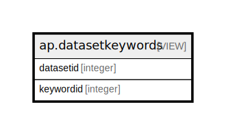

# ap.datasetkeywords

## Description

<details>
<summary><strong>Table Definition</strong></summary>

```sql
CREATE VIEW datasetkeywords AS (
 SELECT DISTINCT s.datasetid,
    k.keywordid
   FROM (ndb.samples s
     JOIN ndb.samplekeywords k ON ((s.sampleid = k.sampleid)))
)
```

</details>

## Columns

| # | Name      | Type    | Default | Nullable | Children | Parents | Comment |
| - | --------- | ------- | ------- | -------- | -------- | ------- | ------- |
| 1 | datasetid | integer |         | true     |          |         |         |
| 2 | keywordid | integer |         | true     |          |         |         |

## Referenced Tables

| # | # | Name                                        | Columns | Comment                                                                                                                                                                                                                                                                                                                                                         | Type       |
| - | - | ------------------------------------------- | ------- | --------------------------------------------------------------------------------------------------------------------------------------------------------------------------------------------------------------------------------------------------------------------------------------------------------------------------------------------------------------- | ---------- |
| 1 | 1 | [ndb.samples](ndb.samples.md)               | 12      | This table stores sample data. Samples belong to Analysis Units, which belong to Collection Units, which belong to Sites. Samples also belong to a Dataset, and the Dataset determines the type of sample. Thus, there could be two different samples from the same Analysis Unit, one belonging to a pollen dataset, the other to a plant macrofossil dataset. | BASE TABLE |
| 2 | 2 | [ndb.samplekeywords](ndb.samplekeywords.md) | 4       | This table lists the Sample Analysts.                                                                                                                                                                                                                                                                                                                           | BASE TABLE |

## Relations



---

> Generated by [tbls](https://github.com/k1LoW/tbls)