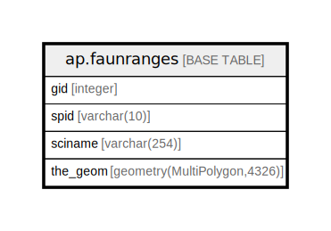

# ap.faunranges

## Description

## Columns

| # | Name     | Type                        | Default                                    | Nullable | Children | Parents | Comment |
| - | -------- | --------------------------- | ------------------------------------------ | -------- | -------- | ------- | ------- |
| 1 | gid      | integer                     | nextval('ap.faunranges_gid_seq'::regclass) | false    |          |         |         |
| 2 | sciname  | varchar(254)                |                                            | true     |          |         |         |
| 3 | spid     | varchar(10)                 |                                            | true     |          |         |         |
| 4 | the_geom | geometry(MultiPolygon,4326) |                                            | true     |          |         |         |

## Constraints

| # | Name            | Type        | Definition        |
| - | --------------- | ----------- | ----------------- |
| 1 | faunranges_pkey | PRIMARY KEY | PRIMARY KEY (gid) |

## Indexes

| # | Name            | Definition                                                             |
| - | --------------- | ---------------------------------------------------------------------- |
| 1 | faunranges_pkey | CREATE UNIQUE INDEX faunranges_pkey ON ap.faunranges USING btree (gid) |
| 2 | geom_idx        | CREATE INDEX geom_idx ON ap.faunranges USING gist (the_geom)           |
| 3 | sciname_idx     | CREATE INDEX sciname_idx ON ap.faunranges USING btree (sciname)        |

## Relations

---

> Generated by [tbls](https://github.com/k1LoW/tbls)