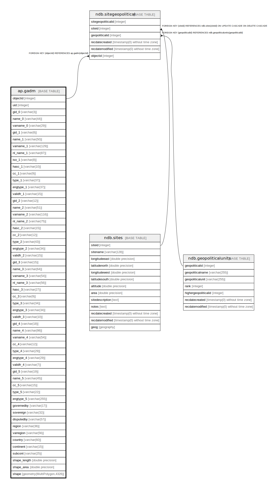

# ap.gadm

## Description

## Columns

| #  | Name         | Type                        | Default                                   | Nullable | Children                                        | Parents | Comment |
| -- | ------------ | --------------------------- | ----------------------------------------- | -------- | ----------------------------------------------- | ------- | ------- |
| 1  | cc_1         | varchar(9)                  |                                           | true     |                                                 |         |         |
| 2  | cc_2         | varchar(12)                 |                                           | true     |                                                 |         |         |
| 3  | cc_3         | varchar(9)                  |                                           | true     |                                                 |         |         |
| 4  | cc_4         | varchar(12)                 |                                           | true     |                                                 |         |         |
| 5  | cc_5         | varchar(15)                 |                                           | true     |                                                 |         |         |
| 6  | continent    | varchar(15)                 |                                           | true     |                                                 |         |         |
| 7  | country      | varchar(60)                 |                                           | true     |                                                 |         |         |
| 8  | disputedby   | varchar(57)                 |                                           | true     |                                                 |         |         |
| 9  | engtype_1    | varchar(37)                 |                                           | true     |                                                 |         |         |
| 10 | engtype_2    | varchar(34)                 |                                           | true     |                                                 |         |         |
| 11 | engtype_3    | varchar(34)                 |                                           | true     |                                                 |         |         |
| 12 | engtype_4    | varchar(29)                 |                                           | true     |                                                 |         |         |
| 13 | engtype_5    | varchar(255)                |                                           | true     |                                                 |         |         |
| 14 | gid_0        | varchar(3)                  |                                           | true     |                                                 |         |         |
| 15 | gid_1        | varchar(8)                  |                                           | true     |                                                 |         |         |
| 16 | gid_2        | varchar(12)                 |                                           | true     |                                                 |         |         |
| 17 | gid_3        | varchar(15)                 |                                           | true     |                                                 |         |         |
| 18 | gid_4        | varchar(18)                 |                                           | true     |                                                 |         |         |
| 19 | gid_5        | varchar(19)                 |                                           | true     |                                                 |         |         |
| 20 | governedby   | varchar(17)                 |                                           | true     |                                                 |         |         |
| 21 | hasc_1       | varchar(10)                 |                                           | true     |                                                 |         |         |
| 22 | hasc_2       | varchar(15)                 |                                           | true     |                                                 |         |         |
| 23 | hasc_3       | varchar(27)                 |                                           | true     |                                                 |         |         |
| 24 | iso_1        | varchar(8)                  |                                           | true     |                                                 |         |         |
| 25 | name_0       | varchar(44)                 |                                           | true     |                                                 |         |         |
| 26 | name_1       | varchar(50)                 |                                           | true     |                                                 |         |         |
| 27 | name_2       | varchar(51)                 |                                           | true     |                                                 |         |         |
| 28 | name_3       | varchar(64)                 |                                           | true     |                                                 |         |         |
| 29 | name_4       | varchar(98)                 |                                           | true     |                                                 |         |         |
| 30 | name_5       | varchar(45)                 |                                           | true     |                                                 |         |         |
| 31 | nl_name_1    | varchar(87)                 |                                           | true     |                                                 |         |         |
| 32 | nl_name_2    | varchar(75)                 |                                           | true     |                                                 |         |         |
| 33 | nl_name_3    | varchar(56)                 |                                           | true     |                                                 |         |         |
| 34 | objectid     | integer                     | nextval('ap.gadm_objectid_seq'::regclass) | false    | [ndb.sitegeopolitical](ndb.sitegeopolitical.md) |         |         |
| 35 | region       | varchar(36)                 |                                           | true     |                                                 |         |         |
| 36 | shape        | geometry(MultiPolygon,4326) |                                           | true     |                                                 |         |         |
| 37 | shape_area   | double precision            |                                           | true     |                                                 |         |         |
| 38 | shape_length | double precision            |                                           | true     |                                                 |         |         |
| 39 | sovereign    | varchar(32)                 |                                           | true     |                                                 |         |         |
| 40 | subcont      | varchar(25)                 |                                           | true     |                                                 |         |         |
| 41 | type_1       | varchar(37)                 |                                           | true     |                                                 |         |         |
| 42 | type_2       | varchar(43)                 |                                           | true     |                                                 |         |         |
| 43 | type_3       | varchar(34)                 |                                           | true     |                                                 |         |         |
| 44 | type_4       | varchar(29)                 |                                           | true     |                                                 |         |         |
| 45 | type_5       | varchar(22)                 |                                           | true     |                                                 |         |         |
| 46 | uid          | integer                     |                                           | true     |                                                 |         |         |
| 47 | validfr_1    | varchar(15)                 |                                           | true     |                                                 |         |         |
| 48 | validfr_2    | varchar(15)                 |                                           | true     |                                                 |         |         |
| 49 | validfr_3    | varchar(10)                 |                                           | true     |                                                 |         |         |
| 50 | validfr_4    | varchar(7)                  |                                           | true     |                                                 |         |         |
| 51 | varname_0    | varchar(29)                 |                                           | true     |                                                 |         |         |
| 52 | varname_1    | varchar(129)                |                                           | true     |                                                 |         |         |
| 53 | varname_2    | varchar(116)                |                                           | true     |                                                 |         |         |
| 54 | varname_3    | varchar(54)                 |                                           | true     |                                                 |         |         |
| 55 | varname_4    | varchar(54)                 |                                           | true     |                                                 |         |         |
| 56 | varregion    | varchar(56)                 |                                           | true     |                                                 |         |         |

## Constraints

| # | Name      | Type        | Definition             |
| - | --------- | ----------- | ---------------------- |
| 1 | gadm_pkey | PRIMARY KEY | PRIMARY KEY (objectid) |

## Indexes

| # | Name                | Definition                                                      |
| - | ------------------- | --------------------------------------------------------------- |
| 1 | gadm_pkey           | CREATE UNIQUE INDEX gadm_pkey ON ap.gadm USING btree (objectid) |
| 2 | gadm_shape_geom_idx | CREATE INDEX gadm_shape_geom_idx ON ap.gadm USING gist (shape)  |

## Relations

---

> Generated by [tbls](https://github.com/k1LoW/tbls)