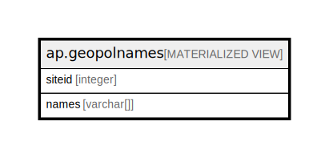

# ap.geopolnames

## Description

<details>
<summary><strong>Table Definition</strong></summary>

```sql
CREATE MATERIALIZED VIEW geopolnames AS (
 SELECT DISTINCT sq.siteid,
    array_agg(sq.geopoliticalname) AS names
   FROM ( SELECT DISTINCT p.siteid,
            gpu.geopoliticalname,
            gpu.rank
           FROM (ndb.geopoliticalunits gpu
             JOIN ( SELECT p_1.siteid,
                    unnest(p_1.geopol) AS unnest
                   FROM ap.querytable p_1) p ON ((p.unnest = gpu.geopoliticalid)))
          ORDER BY p.siteid, gpu.rank) sq
  GROUP BY sq.siteid
)
```

</details>

## Columns

| # | Name   | Type      | Default | Nullable | Children | Parents | Comment |
| - | ------ | --------- | ------- | -------- | -------- | ------- | ------- |
| 1 | names  | varchar[] |         | true     |          |         |         |
| 2 | siteid | integer   |         | true     |          |         |         |

## Referenced Tables

| # | # | Name                                              | Columns | Comment                                                                                                                                                                                                                                                                                                                                                                                                                                                                                                                                                                                                                                                                                                                                                                                                                                                                                                                                                                                                                                                                                                                                                                                                                                                                                                                                                                                                                                                                                                                                                                                        | Type       |
| - | - | ------------------------------------------------- | ------- | ---------------------------------------------------------------------------------------------------------------------------------------------------------------------------------------------------------------------------------------------------------------------------------------------------------------------------------------------------------------------------------------------------------------------------------------------------------------------------------------------------------------------------------------------------------------------------------------------------------------------------------------------------------------------------------------------------------------------------------------------------------------------------------------------------------------------------------------------------------------------------------------------------------------------------------------------------------------------------------------------------------------------------------------------------------------------------------------------------------------------------------------------------------------------------------------------------------------------------------------------------------------------------------------------------------------------------------------------------------------------------------------------------------------------------------------------------------------------------------------------------------------------------------------------------------------------------------------------- | ---------- |
| 1 | 1 | [ndb.geopoliticalunits](ndb.geopoliticalunits.md) | 7       | Lookup table of GeoPoliticalUnits. Table is referenced by the SiteGeoPolitical table. These are countries and various subdivisions. Countries and subdivisions were acquired from the U.S. Central Intelligence Agency World Factbook8 and the ISO 3166-1 and ISO 3166-2 databases9.<br>Each GeoPolitical Unit has a rank. GeoPolitical Units with Rank 1 are generally countries. There are a few exceptions, including Antarctica and island territories, such as Greenland, which although a Danish territory, is geographically separate and distinct. Rank 2 units are generally secondary political divisions with various designations: e.g. states in the United States, provinces in Canada, and regions in France. For some countries, the secondary divisions are not political but rather distinct geographic entities, such as islands. The secondary divisions of some island nations include either groups of islands or sections of more highly populated islands; however, the actual island on which a site is located is more important information. Some countries also have Rank 3 units, e.g. counties in the United States and metropolitan departments in France. In addition to purely political units, various other administrative regions and geographic entities can be contained in this table. Examples of administrative regions are National Parks and Forests. It might be quite useful, for example, to have a record of all the sites in Yellowstone National Park. These additional units are Rank 4, and they can be added to the database as warranted. | BASE TABLE |
| 2 | 2 | [ap.querytable](ap.querytable.md)                 | 20      |                                                                                                                                                                                                                                                                                                                                                                                                                                                                                                                                                                                                                                                                                                                                                                                                                                                                                                                                                                                                                                                                                                                                                                                                                                                                                                                                                                                                                                                                                                                                                                                                | BASE TABLE |

## Indexes

| # | Name          | Definition                                                               |
| - | ------------- | ------------------------------------------------------------------------ |
| 1 | gpsiteidindex | CREATE UNIQUE INDEX gpsiteidindex ON ap.geopolnames USING btree (siteid) |

## Relations



---

> Generated by [tbls](https://github.com/k1LoW/tbls)