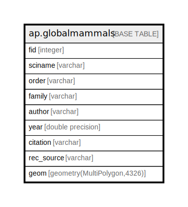

# ap.globalmammals

## Description

## Columns

| # | Name       | Type                        | Default                                       | Nullable | Children | Parents | Comment |
| - | ---------- | --------------------------- | --------------------------------------------- | -------- | -------- | ------- | ------- |
| 1 | fid        | integer                     | nextval('ap.globalmammals_fid_seq'::regclass) | false    |          |         |         |
| 2 | sciname    | varchar                     |                                               | true     |          |         |         |
| 3 | order      | varchar                     |                                               | true     |          |         |         |
| 4 | family     | varchar                     |                                               | true     |          |         |         |
| 5 | author     | varchar                     |                                               | true     |          |         |         |
| 6 | year       | double precision            |                                               | true     |          |         |         |
| 7 | citation   | varchar                     |                                               | true     |          |         |         |
| 8 | rec_source | varchar                     |                                               | true     |          |         |         |
| 9 | geom       | geometry(MultiPolygon,4326) |                                               | true     |          |         |         |

## Constraints

| # | Name               | Type        | Definition        |
| - | ------------------ | ----------- | ----------------- |
| 1 | globalmammals_pkey | PRIMARY KEY | PRIMARY KEY (fid) |

## Indexes

| # | Name                        | Definition                                                                     |
| - | --------------------------- | ------------------------------------------------------------------------------ |
| 1 | globalmammals_pkey          | CREATE UNIQUE INDEX globalmammals_pkey ON ap.globalmammals USING btree (fid)   |
| 2 | globalmammals_geom_geom_idx | CREATE INDEX globalmammals_geom_geom_idx ON ap.globalmammals USING gist (geom) |

## Relations

---

> Generated by [tbls](https://github.com/k1LoW/tbls)