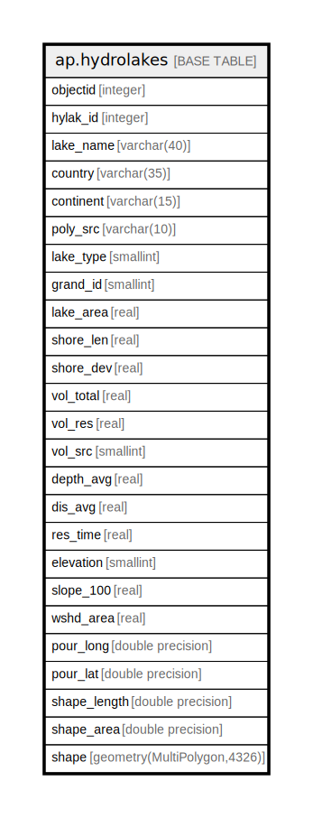

# ap.hydrolakes

## Description

## Columns

| #  | Name         | Type                        | Default                                         | Nullable | Children | Parents | Comment |
| -- | ------------ | --------------------------- | ----------------------------------------------- | -------- | -------- | ------- | ------- |
| 1  | continent    | varchar(15)                 |                                                 | true     |          |         |         |
| 2  | country      | varchar(35)                 |                                                 | true     |          |         |         |
| 3  | depth_avg    | real                        |                                                 | true     |          |         |         |
| 4  | dis_avg      | real                        |                                                 | true     |          |         |         |
| 5  | elevation    | smallint                    |                                                 | true     |          |         |         |
| 6  | grand_id     | smallint                    |                                                 | true     |          |         |         |
| 7  | hylak_id     | integer                     |                                                 | true     |          |         |         |
| 8  | lake_area    | real                        |                                                 | true     |          |         |         |
| 9  | lake_name    | varchar(40)                 |                                                 | true     |          |         |         |
| 10 | lake_type    | smallint                    |                                                 | true     |          |         |         |
| 11 | objectid     | integer                     | nextval('ap.hydrolakes_objectid_seq'::regclass) | false    |          |         |         |
| 12 | poly_src     | varchar(10)                 |                                                 | true     |          |         |         |
| 13 | pour_lat     | double precision            |                                                 | true     |          |         |         |
| 14 | pour_long    | double precision            |                                                 | true     |          |         |         |
| 15 | res_time     | real                        |                                                 | true     |          |         |         |
| 16 | shape        | geometry(MultiPolygon,4326) |                                                 | true     |          |         |         |
| 17 | shape_area   | double precision            |                                                 | true     |          |         |         |
| 18 | shape_length | double precision            |                                                 | true     |          |         |         |
| 19 | shore_dev    | real                        |                                                 | true     |          |         |         |
| 20 | shore_len    | real                        |                                                 | true     |          |         |         |
| 21 | slope_100    | real                        |                                                 | true     |          |         |         |
| 22 | vol_res      | real                        |                                                 | true     |          |         |         |
| 23 | vol_src      | smallint                    |                                                 | true     |          |         |         |
| 24 | vol_total    | real                        |                                                 | true     |          |         |         |
| 25 | wshd_area    | real                        |                                                 | true     |          |         |         |

## Constraints

| # | Name            | Type        | Definition             |
| - | --------------- | ----------- | ---------------------- |
| 1 | hydrolakes_pkey | PRIMARY KEY | PRIMARY KEY (objectid) |

## Indexes

| # | Name                      | Definition                                                                       |
| - | ------------------------- | -------------------------------------------------------------------------------- |
| 1 | gist_lakes_2geog          | CREATE INDEX gist_lakes_2geog ON ap.hydrolakes USING gist (((shape)::geography)) |
| 2 | hydrolakes_pkey           | CREATE UNIQUE INDEX hydrolakes_pkey ON ap.hydrolakes USING btree (objectid)      |
| 3 | hydrolakes_shape_geom_idx | CREATE INDEX hydrolakes_shape_geom_idx ON ap.hydrolakes USING gist (shape)       |

## Relations

---

> Generated by [tbls](https://github.com/k1LoW/tbls)