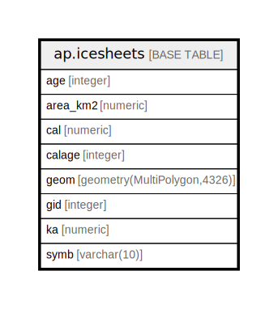

# ap.icesheets

## Description

A spatial layer to render glacial extents as part of the Neotoma Explorer after Dyke et al. 2002.

## Columns

| # | Name     | Type                        | Default                                   | Nullable | Children | Parents | Comment                                                                                                                     |
| - | -------- | --------------------------- | ----------------------------------------- | -------- | -------- | ------- | --------------------------------------------------------------------------------------------------------------------------- |
| 1 | age      | integer                     |                                           | true     |          |         | Age in radiocarbon years before present of the ice sheet extent.                                                            |
| 2 | area_km2 | numeric                     |                                           | true     |          |         | Total area of the layer in square kilometers.                                                                               |
| 3 | cal      | numeric                     |                                           | true     |          |         | Layer age in calibrated radiocarbon years. This calibration is likely based on an out of date INTCAL curve.                 |
| 4 | calage   | integer                     |                                           | true     |          |         | Layer age in calibrated radiocarbon years. This calibration is likely based on an out of date INTCAL curve. Just cal x 1000 |
| 5 | geom     | geometry(MultiPolygon,4326) |                                           | true     |          |         | Multipolygon using EPSG:4326 representing the ice sheet at the indicated time period.                                       |
| 6 | gid      | integer                     | nextval('ap.icesheets_gid_seq'::regclass) | false    |          |         | Unique numerical index for the layer.                                                                                       |
| 7 | ka       | numeric                     |                                           | true     |          |         | Age expressed in thousands of radiocarbon years before present.                                                             |
| 8 | symb     | varchar(10)                 |                                           | true     |          |         | Intended as a symbology for layers, all layers in this table have the value ICE.                                            |

## Constraints

| # | Name           | Type        | Definition        |
| - | -------------- | ----------- | ----------------- |
| 1 | icesheets_pkey | PRIMARY KEY | PRIMARY KEY (gid) |

## Indexes

| # | Name               | Definition                                                           |
| - | ------------------ | -------------------------------------------------------------------- |
| 1 | icesheets_geom_idx | CREATE INDEX icesheets_geom_idx ON ap.icesheets USING gist (geom)    |
| 2 | icesheets_pkey     | CREATE UNIQUE INDEX icesheets_pkey ON ap.icesheets USING btree (gid) |

## Relations

---

> Generated by [tbls](https://github.com/k1LoW/tbls)