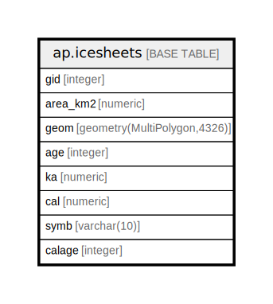

# ap.icesheets

## Description

## Columns

| # | Name     | Type                        | Default                                   | Nullable | Children | Parents | Comment |
| - | -------- | --------------------------- | ----------------------------------------- | -------- | -------- | ------- | ------- |
| 1 | gid      | integer                     | nextval('ap.icesheets_gid_seq'::regclass) | false    |          |         |         |
| 2 | area_km2 | numeric                     |                                           | true     |          |         |         |
| 3 | geom     | geometry(MultiPolygon,4326) |                                           | true     |          |         |         |
| 4 | age      | integer                     |                                           | true     |          |         |         |
| 5 | ka       | numeric                     |                                           | true     |          |         |         |
| 6 | cal      | numeric                     |                                           | true     |          |         |         |
| 7 | symb     | varchar(10)                 |                                           | true     |          |         |         |
| 8 | calage   | integer                     |                                           | true     |          |         |         |

## Constraints

| # | Name           | Type        | Definition        |
| - | -------------- | ----------- | ----------------- |
| 1 | icesheets_pkey | PRIMARY KEY | PRIMARY KEY (gid) |

## Indexes

| # | Name               | Definition                                                           |
| - | ------------------ | -------------------------------------------------------------------- |
| 1 | icesheets_pkey     | CREATE UNIQUE INDEX icesheets_pkey ON ap.icesheets USING btree (gid) |
| 2 | icesheets_geom_idx | CREATE INDEX icesheets_geom_idx ON ap.icesheets USING gist (geom)    |

## Relations

---

> Generated by [tbls](https://github.com/k1LoW/tbls)