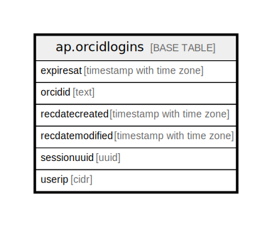

# ap.orcidlogins

## Description

A table used to manage logins through ORCID for Neotoma-related applications.

## Columns

| # | Name            | Type                     | Default | Nullable | Children | Parents | Comment                                                                                      |
| - | --------------- | ------------------------ | ------- | -------- | -------- | ------- | -------------------------------------------------------------------------------------------- |
| 1 | expiresat       | timestamp with time zone |         | true     |          |         | A datetime object at which the login period expires.                                         |
| 2 | orcidid         | text                     |         | true     |          |         | A valid ORCID ID assigned to a user who is using their ORCID to log into the Neotoma system. |
| 3 | recdatecreated  | timestamp with time zone |         | true     |          |         | datetime the record was created.                                                             |
| 4 | recdatemodified | timestamp with time zone |         | true     |          |         | datetime the record was last modified.                                                       |
| 5 | sessionuuid     | uuid                     |         | true     |          |         | A unique UUID for the login instance.                                                        |
| 6 | userip          | cidr                     |         | true     |          |         | An IP address from the user who is logging in to the database system                         |

## Relations

---

> Generated by [tbls](https://github.com/k1LoW/tbls)