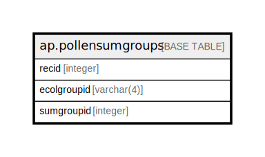

# ap.pollensumgroups

## Description

## Columns

| # | Name        | Type       | Default | Nullable | Children | Parents | Comment |
| - | ----------- | ---------- | ------- | -------- | -------- | ------- | ------- |
| 1 | ecolgroupid | varchar(4) |         | false    |          |         |         |
| 2 | recid       | integer    |         | false    |          |         |         |
| 3 | sumgroupid  | integer    |         | false    |          |         |         |

## Constraints

| # | Name                 | Type        | Definition          |
| - | -------------------- | ----------- | ------------------- |
| 1 | pollensumgroups_pkey | PRIMARY KEY | PRIMARY KEY (recid) |

## Indexes

| # | Name                 | Definition                                                                         |
| - | -------------------- | ---------------------------------------------------------------------------------- |
| 1 | pollensumgroups_pkey | CREATE UNIQUE INDEX pollensumgroups_pkey ON ap.pollensumgroups USING btree (recid) |

## Relations

---

> Generated by [tbls](https://github.com/k1LoW/tbls)