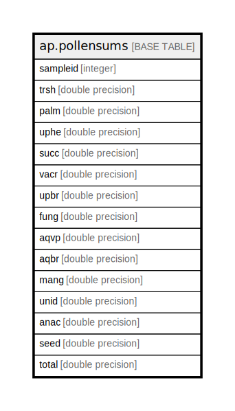

# ap.pollensums

## Description

## Columns

| #  | Name     | Type             | Default | Nullable | Children | Parents | Comment |
| -- | -------- | ---------------- | ------- | -------- | -------- | ------- | ------- |
| 1  | anac     | double precision |         | true     |          |         |         |
| 2  | aqbr     | double precision |         | true     |          |         |         |
| 3  | aqvp     | double precision |         | true     |          |         |         |
| 4  | fung     | double precision |         | true     |          |         |         |
| 5  | mang     | double precision |         | true     |          |         |         |
| 6  | palm     | double precision |         | true     |          |         |         |
| 7  | sampleid | integer          |         | false    |          |         |         |
| 8  | seed     | double precision |         | true     |          |         |         |
| 9  | succ     | double precision |         | true     |          |         |         |
| 10 | total    | double precision |         | false    |          |         |         |
| 11 | trsh     | double precision |         | true     |          |         |         |
| 12 | unid     | double precision |         | true     |          |         |         |
| 13 | upbr     | double precision |         | true     |          |         |         |
| 14 | uphe     | double precision |         | true     |          |         |         |
| 15 | vacr     | double precision |         | true     |          |         |         |

## Relations

---

> Generated by [tbls](https://github.com/k1LoW/tbls)