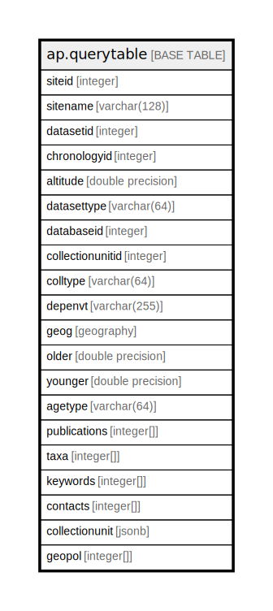

# ap.querytable

## Description

## Columns

| #  | Name             | Type             | Default | Nullable | Children | Parents | Comment |
| -- | ---------------- | ---------------- | ------- | -------- | -------- | ------- | ------- |
| 1  | agetype          | varchar(64)      |         | true     |          |         |         |
| 2  | altitude         | double precision |         | true     |          |         |         |
| 3  | chronologyid     | integer          |         | true     |          |         |         |
| 4  | collectionunit   | jsonb            |         | true     |          |         |         |
| 5  | collectionunitid | integer          |         | true     |          |         |         |
| 6  | colltype         | varchar(64)      |         | true     |          |         |         |
| 7  | contacts         | integer[]        |         | true     |          |         |         |
| 8  | databaseid       | integer          |         | true     |          |         |         |
| 9  | datasetid        | integer          |         | true     |          |         |         |
| 10 | datasettype      | varchar(64)      |         | true     |          |         |         |
| 11 | depenvt          | varchar(255)     |         | true     |          |         |         |
| 12 | geog             | geography        |         | true     |          |         |         |
| 13 | geopol           | integer[]        |         | true     |          |         |         |
| 14 | keywords         | integer[]        |         | true     |          |         |         |
| 15 | older            | double precision |         | true     |          |         |         |
| 16 | publications     | integer[]        |         | true     |          |         |         |
| 17 | siteid           | integer          |         | true     |          |         |         |
| 18 | sitename         | varchar(128)     |         | true     |          |         |         |
| 19 | taxa             | integer[]        |         | true     |          |         |         |
| 20 | younger          | double precision |         | true     |          |         |         |

## Viewpoints

| Name                                        | Definition                                                       |
| ------------------------------------------- | ---------------------------------------------------------------- |
| [Dataset related tables](viewpoint-3.md)    | Tables that help define and structure datasets.                  |
| [Contact related tables](viewpoint-4.md)    | Tables that relate to people, or are connected to the contactid. |
| [Chronology related tables](viewpoint-5.md) | Tables related to chronology and age assignments.                |

## Indexes

| #  | Name                      | Definition                                                                                                                          |
| -- | ------------------------- | ----------------------------------------------------------------------------------------------------------------------------------- |
| 1  | altitudeidx               | CREATE INDEX altitudeidx ON ap.querytable USING btree (altitude)                                                                    |
| 2  | atyindex                  | CREATE INDEX atyindex ON ap.querytable USING btree (agetype)                                                                        |
| 3  | contactidindex            | CREATE INDEX contactidindex ON ap.querytable USING gin (contacts gin__int_ops)                                                      |
| 4  | datasetidindex            | CREATE INDEX datasetidindex ON ap.querytable USING btree (datasetid)                                                                |
| 5  | depenvindex               | CREATE INDEX depenvindex ON ap.querytable USING btree (depenvt)                                                                     |
| 6  | distinctrows              | CREATE UNIQUE INDEX distinctrows ON ap.querytable USING btree (datasetid, chronologyid)                                             |
| 7  | dstindex                  | CREATE INDEX dstindex ON ap.querytable USING btree (datasettype)                                                                    |
| 8  | geoidindex                | CREATE INDEX geoidindex ON ap.querytable USING gin (geopol gin__int_ops)                                                            |
| 9  | idx_querytable_composite  | CREATE INDEX idx_querytable_composite ON ap.querytable USING btree (siteid, datasetid) INCLUDE (sitename, altitude, younger, older) |
| 10 | idx_querytable_pagination | CREATE INDEX idx_querytable_pagination ON ap.querytable USING btree (siteid, datasetid)                                             |
| 11 | keywordidindex            | CREATE INDEX keywordidindex ON ap.querytable USING gin (keywords gin__int_ops)                                                      |
| 12 | olderidx                  | CREATE INDEX olderidx ON ap.querytable USING btree (older)                                                                          |
| 13 | publicationidindex        | CREATE INDEX publicationidindex ON ap.querytable USING gin (publications gin__int_ops)                                              |
| 14 | siteidindex               | CREATE INDEX siteidindex ON ap.querytable USING btree (siteid)                                                                      |
| 15 | sitename                  | CREATE INDEX sitename ON ap.querytable USING gist (sitename gist_trgm_ops)                                                          |
| 16 | spatialgeom               | CREATE INDEX spatialgeom ON ap.querytable USING gist (geog)                                                                         |
| 17 | taxonidindex              | CREATE INDEX taxonidindex ON ap.querytable USING gin (taxa gin__int_ops)                                                            |
| 18 | youngeridx                | CREATE INDEX youngeridx ON ap.querytable USING btree (younger)                                                                      |

## Relations

---

> Generated by [tbls](https://github.com/k1LoW/tbls)