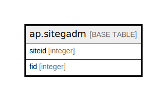

# ap.sitegadm

## Description

## Columns

| # | Name   | Type    | Default | Nullable | Children | Parents | Comment |
| - | ------ | ------- | ------- | -------- | -------- | ------- | ------- |
| 1 | fid    | integer |         | true     |          |         |         |
| 2 | siteid | integer |         | true     |          |         |         |

## Relations

---

> Generated by [tbls](https://github.com/k1LoW/tbls)