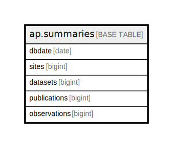

# ap.summaries

## Description

## Columns

| # | Name         | Type   | Default | Nullable | Children | Parents | Comment |
| - | ------------ | ------ | ------- | -------- | -------- | ------- | ------- |
| 1 | dbdate       | date   |         | false    |          |         |         |
| 2 | sites        | bigint |         | true     |          |         |         |
| 3 | datasets     | bigint |         | true     |          |         |         |
| 4 | publications | bigint |         | true     |          |         |         |
| 5 | observations | bigint |         | true     |          |         |         |

## Constraints

| # | Name           | Type        | Definition           |
| - | -------------- | ----------- | -------------------- |
| 1 | summaries_pkey | PRIMARY KEY | PRIMARY KEY (dbdate) |

## Indexes

| # | Name           | Definition                                                              |
| - | -------------- | ----------------------------------------------------------------------- |
| 1 | summaries_pkey | CREATE UNIQUE INDEX summaries_pkey ON ap.summaries USING btree (dbdate) |

## Relations

---

> Generated by [tbls](https://github.com/k1LoW/tbls)