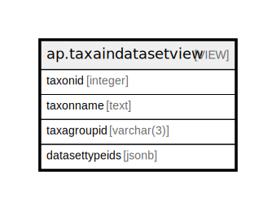

# ap.taxaindatasetview

## Description

<details>
<summary><strong>Table Definition</strong></summary>

```sql
CREATE VIEW taxaindatasetview AS (
 SELECT t.taxonid,
    t.taxonname,
    t.taxagroupid,
    jsonb_agg(dtgt.datasettypeid) AS datasettypeids
   FROM ((ndb.taxa t
     LEFT JOIN ndb.datasettaxagrouptypes dtgt ON (((t.taxagroupid)::text = (dtgt.taxagroupid)::text)))
     JOIN ndb.variables v ON ((t.taxonid = v.taxonid)))
  WHERE (t.valid = true)
  GROUP BY t.taxonid, t.taxonname, t.taxagroupid
  ORDER BY t.taxonname
)
```

</details>

## Columns

| # | Name           | Type       | Default | Nullable | Children | Parents | Comment |
| - | -------------- | ---------- | ------- | -------- | -------- | ------- | ------- |
| 1 | taxonid        | integer    |         | true     |          |         |         |
| 2 | taxonname      | text       |         | true     |          |         |         |
| 3 | taxagroupid    | varchar(3) |         | true     |          |         |         |
| 4 | datasettypeids | jsonb      |         | true     |          |         |         |

## Referenced Tables

| # | # | Name                                                      | Columns | Comment                                                                                                                                                                                                                                                              | Type       |
| - | - | --------------------------------------------------------- | ------- | -------------------------------------------------------------------------------------------------------------------------------------------------------------------------------------------------------------------------------------------------------------------- | ---------- |
| 1 | 1 | [ndb.taxa](ndb.taxa.md)                                   | 14      | This table lists all taxa in the database. Most taxa are biological taxa; however, some are biometric measures and some are physical parameters.                                                                                                                     | BASE TABLE |
| 2 | 2 | [ndb.datasettaxagrouptypes](ndb.datasettaxagrouptypes.md) | 4       |                                                                                                                                                                                                                                                                      | BASE TABLE |
| 3 | 3 | [ndb.variables](ndb.variables.md)                         | 7       | This table lists Variables, which always consist of a Taxon and Units of measurement. Variables can also have Elements, Contexts, and Modifications. Thus, the same taxon with different measurement units (e.g. present/absent, NISP, MNI) are different Variables. | BASE TABLE |

## Relations



---

> Generated by [tbls](https://github.com/k1LoW/tbls)