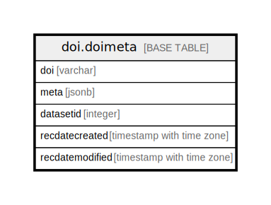

# doi.doimeta

## Description

Metadata for DOIs generated through the Neotoma DOI/DataCite generation system.

## Columns

| # | Name            | Type                     | Default | Nullable | Children | Parents | Comment                                                                                                                                        |
| - | --------------- | ------------------------ | ------- | -------- | -------- | ------- | ---------------------------------------------------------------------------------------------------------------------------------------------- |
| 1 | datasetid       | integer                  |         | true     |          |         | Foreign key to ndb.datasets.datasetid. This is not tied to a foreign key constraint so that we can retain information if datasets are deleted. |
| 2 | doi             | varchar                  |         | false    |          |         |                                                                                                                                                |
| 3 | meta            | jsonb                    |         | true     |          |         | DOI metadata for the record, as recorded on DataCite. Retained locally.                                                                        |
| 4 | recdatecreated  | timestamp with time zone | now()   | false    |          |         | datetime the record was created.                                                                                                               |
| 5 | recdatemodified | timestamp with time zone | now()   | false    |          |         | datetime the record was last modified.                                                                                                         |

## Constraints

| # | Name         | Type        | Definition        |
| - | ------------ | ----------- | ----------------- |
| 1 | doimeta_pkey | PRIMARY KEY | PRIMARY KEY (doi) |

## Indexes

| # | Name            | Definition                                                                      |
| - | --------------- | ------------------------------------------------------------------------------- |
| 1 | doimeta_doi_idx | CREATE UNIQUE INDEX doimeta_doi_idx ON doi.doimeta USING btree (doi, datasetid) |
| 2 | doimeta_pkey    | CREATE UNIQUE INDEX doimeta_pkey ON doi.doimeta USING btree (doi)               |

## Triggers

| # | Name            | Definition                                                                                                            |
| - | --------------- | --------------------------------------------------------------------------------------------------------------------- |
| 1 | update_modified | CREATE TRIGGER update_modified AFTER UPDATE ON doi.doimeta FOR EACH ROW EXECUTE FUNCTION ndb.update_recdatemodified() |

## Relations

---

> Generated by [tbls](https://github.com/k1LoW/tbls)