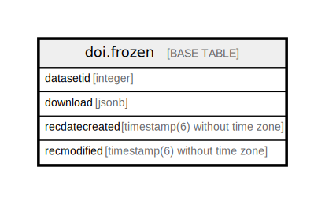

# doi.frozen

## Description

## Columns

| # | Name           | Type                           | Default | Nullable | Children | Parents | Comment |
| - | -------------- | ------------------------------ | ------- | -------- | -------- | ------- | ------- |
| 1 | datasetid      | integer                        |         | true     |          |         |         |
| 2 | download       | jsonb                          |         | false    |          |         |         |
| 3 | recdatecreated | timestamp(6) without time zone | now()   | true     |          |         |         |
| 4 | recmodified    | timestamp(6) without time zone | now()   | true     |          |         |         |

## Indexes

| # | Name                 | Definition                                                              |
| - | -------------------- | ----------------------------------------------------------------------- |
| 1 | frozen_datasetid_idx | CREATE INDEX frozen_datasetid_idx ON doi.frozen USING btree (datasetid) |

## Relations

---

> Generated by [tbls](https://github.com/k1LoW/tbls)