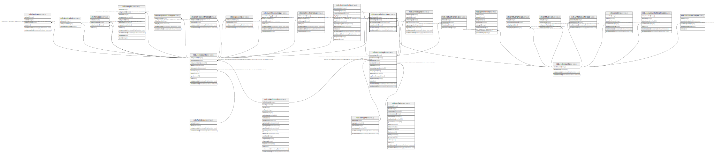

# ndb.accumulationrates

## Description

## Columns

| # | Name             | Type                           | Default                      | Nullable | Children | Parents                                   | Comment |
| - | ---------------- | ------------------------------ | ---------------------------- | -------- | -------- | ----------------------------------------- | ------- |
| 1 | accumulationrate | double precision               |                              | false    |          |                                           |         |
| 2 | analysisunitid   | integer                        |                              | false    |          | [ndb.analysisunits](ndb.analysisunits.md) |         |
| 3 | chronologyid     | integer                        |                              | false    |          | [ndb.chronologies](ndb.chronologies.md)   |         |
| 4 | recdatecreated   | timestamp(0) without time zone | timezone('UTC'::text, now()) | false    |          |                                           |         |
| 5 | recdatemodified  | timestamp(0) without time zone |                              | false    |          |                                           |         |
| 6 | variableunitsid  | integer                        |                              | false    |          | [ndb.variableunits](ndb.variableunits.md) |         |

## Viewpoints

| Name                                        | Definition                                        |
| ------------------------------------------- | ------------------------------------------------- |
| [Chronology related tables](viewpoint-5.md) | Tables related to chronology and age assignments. |

## Constraints

| # | Name                               | Type        | Definition                                                                                                      |
| - | ---------------------------------- | ----------- | --------------------------------------------------------------------------------------------------------------- |
| 1 | accumulationrates_pkey             | PRIMARY KEY | PRIMARY KEY (analysisunitid, chronologyid)                                                                      |
| 2 | fk_accumulationrates_analysisunits | FOREIGN KEY | FOREIGN KEY (analysisunitid) REFERENCES ndb.analysisunits(analysisunitid) ON UPDATE CASCADE ON DELETE CASCADE   |
| 3 | fk_accumulationrates_chronologies  | FOREIGN KEY | FOREIGN KEY (chronologyid) REFERENCES ndb.chronologies(chronologyid)                                            |
| 4 | fk_accumulationrates_variableunits | FOREIGN KEY | FOREIGN KEY (variableunitsid) REFERENCES ndb.variableunits(variableunitsid) ON UPDATE CASCADE ON DELETE CASCADE |

## Indexes

| # | Name                   | Definition                                                                                                     |
| - | ---------------------- | -------------------------------------------------------------------------------------------------------------- |
| 1 | accumulationrates_pkey | CREATE UNIQUE INDEX accumulationrates_pkey ON ndb.accumulationrates USING btree (analysisunitid, chronologyid) |

## Triggers

| # | Name                | Definition                                                                                                                                     |
| - | ------------------- | ---------------------------------------------------------------------------------------------------------------------------------------------- |
| 1 | tr_sites_modifydate | CREATE TRIGGER tr_sites_modifydate BEFORE INSERT OR UPDATE ON ndb.accumulationrates FOR EACH ROW EXECUTE FUNCTION ndb.update_recdatemodified() |

## Relations

---

> Generated by [tbls](https://github.com/k1LoW/tbls)