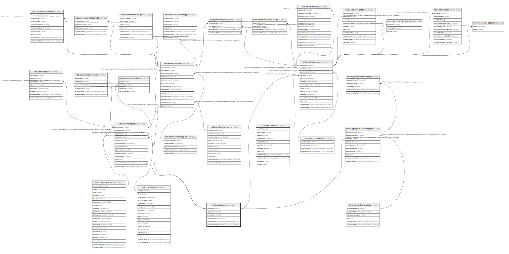

# ndb.agetypes

## Description

Lookup table of Age Types or units. This table is referenced by the Chronologies and Geochronology tables.

## Columns

| # | Name            | Type                           | Default                                         | Nullable | Children                                                                                                                                                                              | Parents | Comment                                                                                                                                                |
| - | --------------- | ------------------------------ | ----------------------------------------------- | -------- | ------------------------------------------------------------------------------------------------------------------------------------------------------------------------------------- | ------- | ------------------------------------------------------------------------------------------------------------------------------------------------------ |
| 1 | agetypeid       | integer                        | nextval('ndb.seq_agetypes_agetypeid'::regclass) | false    | [ndb.chronologies](ndb.chronologies.md) [ndb.aggregatechronologies](ndb.aggregatechronologies.md) [ndb.chroncontrols](ndb.chroncontrols.md) [ndb.geochronology](ndb.geochronology.md) |         | PK: An arbitrary Age Type identification number                                                                                                        |
| 2 | agetype         | varchar(64)                    |                                                 | false    |                                                                                                                                                                                       |         | Age type or units: * Calendar years AD/BC * Calendar years BP * Calibrated radiocarbon years BP * Radiocarbon years BP * Varve years BP |
| 3 | precedence      | integer                        |                                                 | true     |                                                                                                                                                                                       |         |                                                                                                                                                        |
| 4 | shortagetype    | varchar(32)                    |                                                 | true     |                                                                                                                                                                                       |         |                                                                                                                                                        |
| 5 | recdatecreated  | timestamp(0) without time zone | timezone('UTC'::text, now())                    | false    |                                                                                                                                                                                       |         |                                                                                                                                                        |
| 6 | recdatemodified | timestamp(0) without time zone |                                                 | false    |                                                                                                                                                                                       |         |                                                                                                                                                        |

## Viewpoints

| Name                                      | Definition                           |
| ----------------------------------------- | ------------------------------------ |
| [Controlled Vocabularies](viewpoint-0.md) | Tables with controlled vocabularies. |

## Constraints

| # | Name          | Type        | Definition              |
| - | ------------- | ----------- | ----------------------- |
| 1 | agetypes_pkey | PRIMARY KEY | PRIMARY KEY (agetypeid) |

## Indexes

| # | Name          | Definition                                                                |
| - | ------------- | ------------------------------------------------------------------------- |
| 1 | agetypes_pkey | CREATE UNIQUE INDEX agetypes_pkey ON ndb.agetypes USING btree (agetypeid) |

## Triggers

| # | Name                | Definition                                                                                                                            |
| - | ------------------- | ------------------------------------------------------------------------------------------------------------------------------------- |
| 1 | tr_sites_modifydate | CREATE TRIGGER tr_sites_modifydate BEFORE INSERT OR UPDATE ON ndb.agetypes FOR EACH ROW EXECUTE FUNCTION ndb.update_recdatemodified() |

## Relations

---

> Generated by [tbls](https://github.com/k1LoW/tbls)