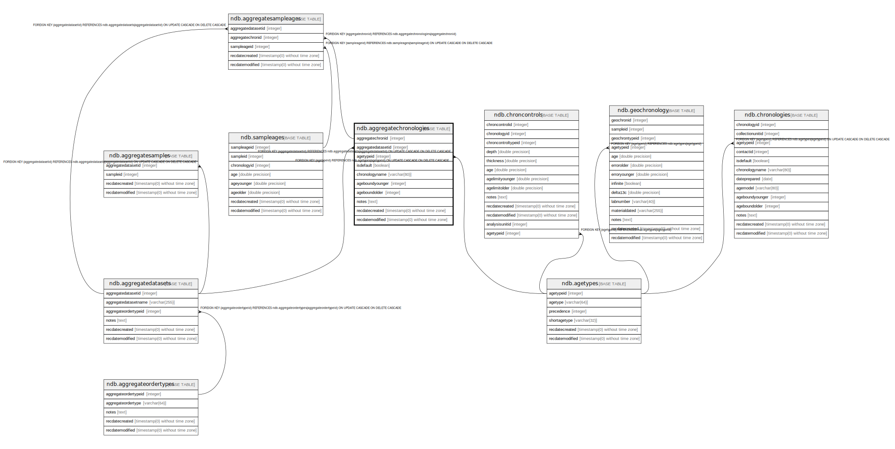

# ndb.aggregatechronologies

## Description

This table stores metadata for Aggregate Chronologies. An Aggregate Chronology refers to an explicit chronology assigned to a sample Aggregate. The individual Aggregate Samples have ages assigned in the AggregateSampleAges table. An Aggregate Chronology would be used, for example, for a set of packrat middens assigned to an AggregateDataset. The Aggregate Chronology is analogous to the Chronology assigned to samples from a single Collection Unit.  
An Aggregate may have more than one Aggregate Chronology, for example one in radiocarbon years and another in calibrated radiocarbon years. One Aggregate Chronology per Age Type may be designated the default, which is the Aggregate Chronology currently preferred by the database stewards.

## Columns

| #  | Name               | Type                           | Default                                                             | Nullable | Children                                              | Parents                                           | Comment                                                                                                                                                                                                                                                                                                                                                                                                                      |
| -- | ------------------ | ------------------------------ | ------------------------------------------------------------------- | -------- | ----------------------------------------------------- | ------------------------------------------------- | ---------------------------------------------------------------------------------------------------------------------------------------------------------------------------------------------------------------------------------------------------------------------------------------------------------------------------------------------------------------------------------------------------------------------------- |
| 1  | aggregatechronid   | integer                        | nextval('ndb.seq_aggregatechronologies_aggregatechronid'::regclass) | false    | [ndb.aggregatesampleages](ndb.aggregatesampleages.md) |                                                   | PK: An arbitrary Aggregate Chronology identification number                                                                                                                                                                                                                                                                                                                                                                  |
| 2  | aggregatedatasetid | integer                        |                                                                     | false    |                                                       | [ndb.aggregatedatasets](ndb.aggregatedatasets.md) | Dataset to which the Aggregate Chronology applies. Field links to the AggregateDatasets table.                                                                                                                                                                                                                                                                                                                               |
| 3  | agetypeid          | integer                        |                                                                     | false    |                                                       | [ndb.agetypes](ndb.agetypes.md)                   | Age type or units. Field links to the AgeTypes table.                                                                                                                                                                                                                                                                                                                                                                        |
| 4  | isdefault          | boolean                        |                                                                     | false    |                                                       |                                                   | Indicates whether the Aggregate Chronology is a default or not. Default status is determined by a Neotoma data steward. Aggregate Datasets may have more than one default Aggregate Chronology, but may have only one default Aggregate Chronology per Age Type.                                                                                                                                                             |
| 5  | chronologyname     | varchar(80)                    |                                                                     | true     |                                                       |                                                   | Optional name for the Chronology.                                                                                                                                                                                                                                                                                                                                                                                            |
| 6  | ageboundyounger    | integer                        |                                                                     | true     |                                                       |                                                   | The younger reliable age bound for the Aggregate Chronology. Younger ages may be assigned to samples, but are not regarded as reliable. If the entire Chronology is considered reliable, AgeBoundYounger is assigned the youngest sample age rounded down to the nearest 10. Thus, for 72 BP, AgeBoundYounger = 70 BP; for -45 BP, AgeBoundYounger = -50 BP.                                                                 |
| 7  | ageboundolder      | integer                        |                                                                     | true     |                                                       |                                                   | The older reliable age bound for the Aggregate Chronology. Ages older than AgeOlderBound may be assigned to samples, but are not regarded as reliable. This situation is particularly true for ages extrapolated beyond the oldest Chron Control. If the entire Chronology is considered reliable, AgeBoundOlder is assigned the oldest sample age rounded up to the nearest 10. Thus, for 12564 BP, AgeBoundOlder is 12570. |
| 8  | notes              | text                           |                                                                     | true     |                                                       |                                                   | Free form notes or comments about the Aggregate Chronology.                                                                                                                                                                                                                                                                                                                                                                  |
| 9  | recdatecreated     | timestamp(0) without time zone | timezone('UTC'::text, now())                                        | false    |                                                       |                                                   |                                                                                                                                                                                                                                                                                                                                                                                                                              |
| 10 | recdatemodified    | timestamp(0) without time zone |                                                                     | false    |                                                       |                                                   |                                                                                                                                                                                                                                                                                                                                                                                                                              |

## Constraints

| # | Name                                       | Type        | Definition                                                                                                                |
| - | ------------------------------------------ | ----------- | ------------------------------------------------------------------------------------------------------------------------- |
| 1 | fk_aggregatechronologies_agetypes          | FOREIGN KEY | FOREIGN KEY (agetypeid) REFERENCES ndb.agetypes(agetypeid) ON UPDATE CASCADE ON DELETE CASCADE                            |
| 2 | aggregatechronologies_pkey                 | PRIMARY KEY | PRIMARY KEY (aggregatechronid)                                                                                            |
| 3 | fk_aggregatechronologies_aggregatedatasets | FOREIGN KEY | FOREIGN KEY (aggregatedatasetid) REFERENCES ndb.aggregatedatasets(aggregatedatasetid) ON UPDATE CASCADE ON DELETE CASCADE |

## Indexes

| # | Name                       | Definition                                                                                                 |
| - | -------------------------- | ---------------------------------------------------------------------------------------------------------- |
| 1 | aggregatechronologies_pkey | CREATE UNIQUE INDEX aggregatechronologies_pkey ON ndb.aggregatechronologies USING btree (aggregatechronid) |

## Triggers

| # | Name                | Definition                                                                                                                                         |
| - | ------------------- | -------------------------------------------------------------------------------------------------------------------------------------------------- |
| 1 | tr_sites_modifydate | CREATE TRIGGER tr_sites_modifydate BEFORE INSERT OR UPDATE ON ndb.aggregatechronologies FOR EACH ROW EXECUTE FUNCTION ndb.update_recdatemodified() |

## Relations

---

> Generated by [tbls](https://github.com/k1LoW/tbls)