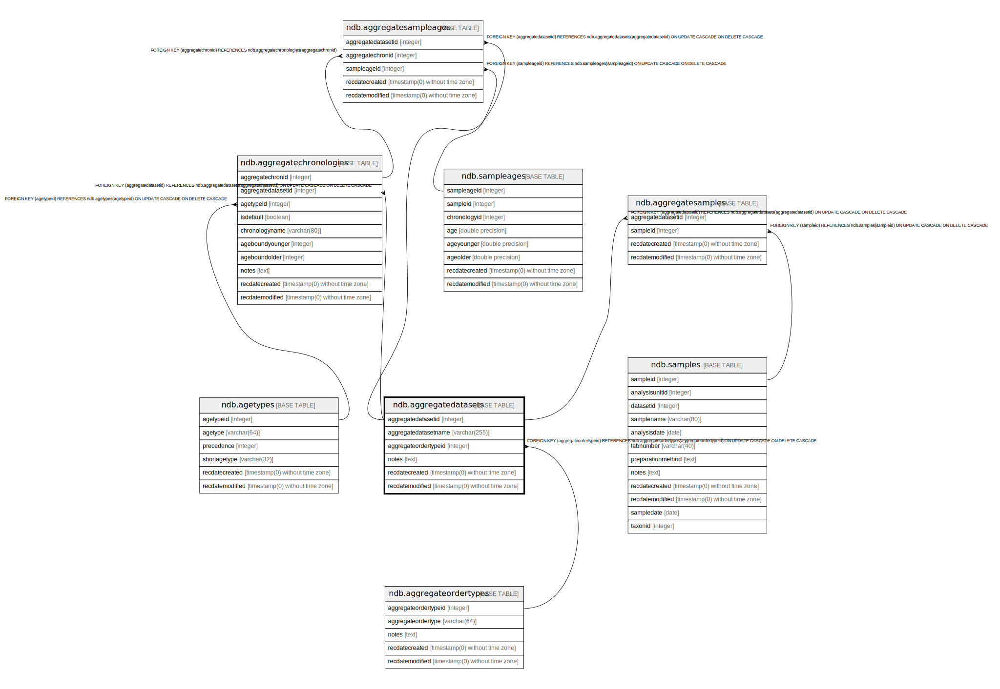

# ndb.aggregatedatasets

## Description

Aggregate Datasets are aggregates of samples of a particular data type. Some examples:    
* Plant macrofossil samples from a group of packrat middens collected from a particular valley, mountain range, or other similarly defined geographic area. Each midden is from a different Site or Collection Unit, but they are grouped into time series for that area and are published as a single dataset.  
* Samples collected from 32 cutbanks along several km of Roberts Creek, northeast Iowa. Each sample is from a different site, but they form a time series from 0-12,510 14C yr BP, and pollen, plant macrofossils, and beetles were published and graphed as if from a single site.  
* A set of pollen surface samples from a particular region or study that were published and analyzed as a single dataset and submitted to the database as a single dataset.  
The examples above are datasets predefined in the database. New aggregate datasets could be assembled for particular studies, for example all the pollen samples for a given time slice for a given geographic region.

## Columns

| # | Name                 | Type                           | Default                                                           | Nullable | Children                                                                                                                                                        | Parents                                               | Comment                                                                                          |
| - | -------------------- | ------------------------------ | ----------------------------------------------------------------- | -------- | --------------------------------------------------------------------------------------------------------------------------------------------------------------- | ----------------------------------------------------- | ------------------------------------------------------------------------------------------------ |
| 1 | aggregatedatasetid   | integer                        | nextval('ndb.seq_aggregatedatasets_aggregatedatasetid'::regclass) | false    | [ndb.aggregatechronologies](ndb.aggregatechronologies.md) [ndb.aggregatesampleages](ndb.aggregatesampleages.md) [ndb.aggregatesamples](ndb.aggregatesamples.md) |                                                       | An arbitrary Aggregate Dataset identification number.                                            |
| 2 | aggregatedatasetname | varchar(255)                   |                                                                   | false    |                                                                                                                                                                 |                                                       | Name of Aggregate Dataset.                                                                       |
| 3 | aggregateordertypeid | integer                        |                                                                   | false    |                                                                                                                                                                 | [ndb.aggregateordertypes](ndb.aggregateordertypes.md) | Aggregate Order Type identification number. Field links to the AggregateOrderTypes lookup table. |
| 4 | notes                | text                           |                                                                   | true     |                                                                                                                                                                 |                                                       | Free form notes about the Aggregate Order Type.                                                  |
| 5 | recdatecreated       | timestamp(0) without time zone | timezone('UTC'::text, now())                                      | false    |                                                                                                                                                                 |                                                       |                                                                                                  |
| 6 | recdatemodified      | timestamp(0) without time zone |                                                                   | false    |                                                                                                                                                                 |                                                       |                                                                                                  |

## Constraints

| # | Name                                     | Type        | Definition                                                                                                                      |
| - | ---------------------------------------- | ----------- | ------------------------------------------------------------------------------------------------------------------------------- |
| 1 | aggregatedatasets_pkey                   | PRIMARY KEY | PRIMARY KEY (aggregatedatasetid)                                                                                                |
| 2 | fk_aggregatedatasets_aggregateordertypes | FOREIGN KEY | FOREIGN KEY (aggregateordertypeid) REFERENCES ndb.aggregateordertypes(aggregateordertypeid) ON UPDATE CASCADE ON DELETE CASCADE |

## Indexes

| # | Name                   | Definition                                                                                           |
| - | ---------------------- | ---------------------------------------------------------------------------------------------------- |
| 1 | aggregatedatasets_pkey | CREATE UNIQUE INDEX aggregatedatasets_pkey ON ndb.aggregatedatasets USING btree (aggregatedatasetid) |

## Triggers

| # | Name                | Definition                                                                                                                                     |
| - | ------------------- | ---------------------------------------------------------------------------------------------------------------------------------------------- |
| 1 | tr_sites_modifydate | CREATE TRIGGER tr_sites_modifydate BEFORE INSERT OR UPDATE ON ndb.aggregatedatasets FOR EACH ROW EXECUTE FUNCTION ndb.update_recdatemodified() |

## Relations

---

> Generated by [tbls](https://github.com/k1LoW/tbls)