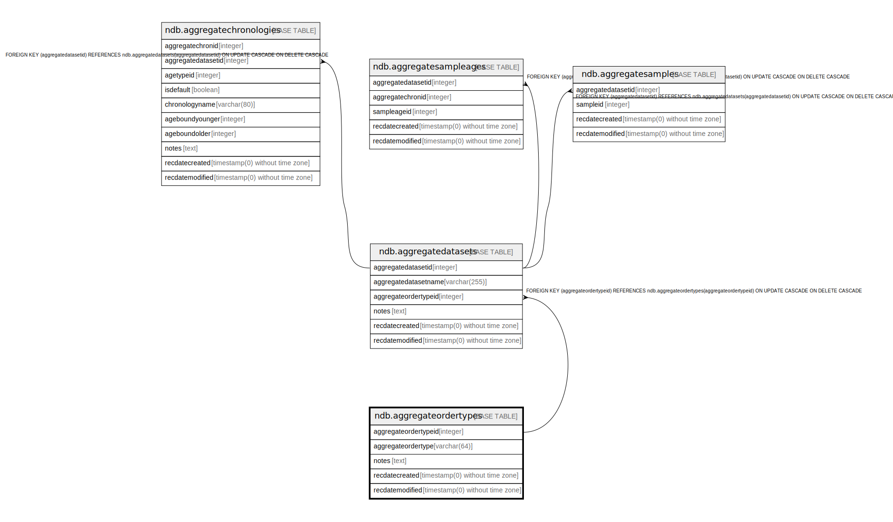

# ndb.aggregateordertypes

## Description

Lookup table for Aggregate Order Types. Table is referenced by the AggregateDatasets table.

## Columns

| # | Name                 | Type                           | Default                                                               | Nullable | Children                                          | Parents | Comment                                                     |
| - | -------------------- | ------------------------------ | --------------------------------------------------------------------- | -------- | ------------------------------------------------- | ------- | ----------------------------------------------------------- |
| 1 | aggregateordertypeid | integer                        | nextval('ndb.seq_aggregateordertypes_aggregateordertypeid'::regclass) | false    | [ndb.aggregatedatasets](ndb.aggregatedatasets.md) |         | An arbitrary Aggregate Order Type identification number.    |
| 2 | aggregateordertype   | varchar(64)                    |                                                                       | false    |                                                   |         | The Aggregate Order Type.                                   |
| 3 | notes                | text                           |                                                                       | true     |                                                   |         | Free form notes or comments about the Aggregate Order Type. |
| 4 | recdatecreated       | timestamp(0) without time zone | timezone('UTC'::text, now())                                          | false    |                                                   |         |                                                             |
| 5 | recdatemodified      | timestamp(0) without time zone |                                                                       | false    |                                                   |         |                                                             |

## Constraints

| # | Name                     | Type        | Definition                         |
| - | ------------------------ | ----------- | ---------------------------------- |
| 1 | aggregateordertypes_pkey | PRIMARY KEY | PRIMARY KEY (aggregateordertypeid) |

## Indexes

| # | Name                     | Definition                                                                                                 |
| - | ------------------------ | ---------------------------------------------------------------------------------------------------------- |
| 1 | aggregateordertypes_pkey | CREATE UNIQUE INDEX aggregateordertypes_pkey ON ndb.aggregateordertypes USING btree (aggregateordertypeid) |

## Triggers

| # | Name                | Definition                                                                                                                                       |
| - | ------------------- | ------------------------------------------------------------------------------------------------------------------------------------------------ |
| 1 | tr_sites_modifydate | CREATE TRIGGER tr_sites_modifydate BEFORE INSERT OR UPDATE ON ndb.aggregateordertypes FOR EACH ROW EXECUTE FUNCTION ndb.update_recdatemodified() |

## Relations

---

> Generated by [tbls](https://github.com/k1LoW/tbls)