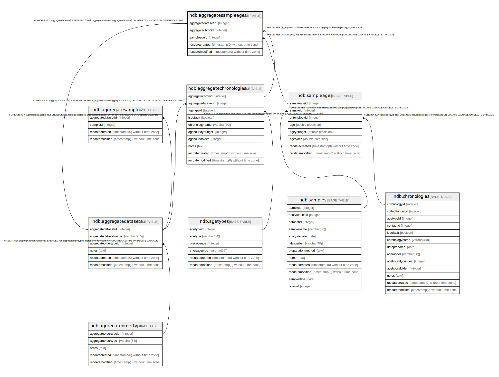

# ndb.aggregatesampleages

## Description

This table stores the links to the ages of samples in an Aggregate Dataset. The table is necessary because samples may be from Collection Units with multiple chronologies, and this table stores the links to the sample ages desired for the Aggregate Dataset.

## Columns

| # | Name               | Type                           | Default                      | Nullable | Children | Parents                                                   | Comment                                                                                    |
| - | ------------------ | ------------------------------ | ---------------------------- | -------- | -------- | --------------------------------------------------------- | ------------------------------------------------------------------------------------------ |
| 1 | aggregatechronid   | integer                        |                              | false    |          | [ndb.aggregatechronologies](ndb.aggregatechronologies.md) | Aggregate Chronology identification number Field links to the AggregateChronologies table. |
| 2 | aggregatedatasetid | integer                        |                              | false    |          | [ndb.aggregatedatasets](ndb.aggregatedatasets.md)         | Aggregate Dataset identification number. Field links to the AggregateDatasets table.       |
| 3 | recdatecreated     | timestamp(0) without time zone | timezone('UTC'::text, now()) | false    |          |                                                           |                                                                                            |
| 4 | recdatemodified    | timestamp(0) without time zone |                              | false    |          |                                                           |                                                                                            |
| 5 | sampleageid        | integer                        |                              | false    |          | [ndb.sampleages](ndb.sampleages.md)                       | Sample Age ID number. Field links to the SampleAges table.                                 |

## Viewpoints

| Name                                        | Definition                                        |
| ------------------------------------------- | ------------------------------------------------- |
| [Chronology related tables](viewpoint-5.md) | Tables related to chronology and age assignments. |

## Constraints

| # | Name                                         | Type        | Definition                                                                                                                |
| - | -------------------------------------------- | ----------- | ------------------------------------------------------------------------------------------------------------------------- |
| 1 | aggregatesampleages_pkey                     | PRIMARY KEY | PRIMARY KEY (aggregatedatasetid, aggregatechronid, sampleageid)                                                           |
| 2 | fk_aggregatesampleages_aggregatechronologies | FOREIGN KEY | FOREIGN KEY (aggregatechronid) REFERENCES ndb.aggregatechronologies(aggregatechronid)                                     |
| 3 | fk_aggregatesampleages_aggregatedatasets     | FOREIGN KEY | FOREIGN KEY (aggregatedatasetid) REFERENCES ndb.aggregatedatasets(aggregatedatasetid) ON UPDATE CASCADE ON DELETE CASCADE |
| 4 | fk_aggregatesampleages_sampleages            | FOREIGN KEY | FOREIGN KEY (sampleageid) REFERENCES ndb.sampleages(sampleageid) ON UPDATE CASCADE ON DELETE CASCADE                      |

## Indexes

| # | Name                     | Definition                                                                                                                              |
| - | ------------------------ | --------------------------------------------------------------------------------------------------------------------------------------- |
| 1 | aggregatesampleages_pkey | CREATE UNIQUE INDEX aggregatesampleages_pkey ON ndb.aggregatesampleages USING btree (aggregatedatasetid, aggregatechronid, sampleageid) |

## Triggers

| # | Name                | Definition                                                                                                                                       |
| - | ------------------- | ------------------------------------------------------------------------------------------------------------------------------------------------ |
| 1 | tr_sites_modifydate | CREATE TRIGGER tr_sites_modifydate BEFORE INSERT OR UPDATE ON ndb.aggregatesampleages FOR EACH ROW EXECUTE FUNCTION ndb.update_recdatemodified() |

## Relations

---

> Generated by [tbls](https://github.com/k1LoW/tbls)