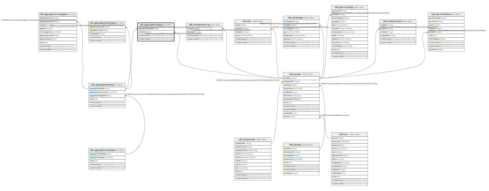

# ndb.aggregatesamples

## Description

This table stores the samples in Aggregate Datasets.

## Columns

| # | Name               | Type                           | Default                      | Nullable | Children | Parents                                           | Comment                                                                                               |
| - | ------------------ | ------------------------------ | ---------------------------- | -------- | -------- | ------------------------------------------------- | ----------------------------------------------------------------------------------------------------- |
| 1 | aggregatedatasetid | integer                        |                              | false    |          | [ndb.aggregatedatasets](ndb.aggregatedatasets.md) | An arbitrary Aggregate Dataset identification number. Field links to the AggregateDatasets table.  |
| 2 | sampleid           | integer                        |                              | false    |          | [ndb.samples](ndb.samples.md)                     | Sample ID number. Field links to the Samples table.                                                   |
| 3 | recdatecreated     | timestamp(0) without time zone | timezone('UTC'::text, now()) | false    |          |                                                   |                                                                                                       |
| 4 | recdatemodified    | timestamp(0) without time zone |                              | false    |          |                                                   |                                                                                                       |

## Constraints

| # | Name                                  | Type        | Definition                                                                                                                |
| - | ------------------------------------- | ----------- | ------------------------------------------------------------------------------------------------------------------------- |
| 1 | fk_aggregatesamples_aggregatedatasets | FOREIGN KEY | FOREIGN KEY (aggregatedatasetid) REFERENCES ndb.aggregatedatasets(aggregatedatasetid) ON UPDATE CASCADE ON DELETE CASCADE |
| 2 | aggregatesamples_pkey                 | PRIMARY KEY | PRIMARY KEY (aggregatedatasetid, sampleid)                                                                                |
| 3 | fk_aggregatesamples_samples           | FOREIGN KEY | FOREIGN KEY (sampleid) REFERENCES ndb.samples(sampleid) ON UPDATE CASCADE ON DELETE CASCADE                               |

## Indexes

| # | Name                  | Definition                                                                                                   |
| - | --------------------- | ------------------------------------------------------------------------------------------------------------ |
| 1 | aggregatesamples_pkey | CREATE UNIQUE INDEX aggregatesamples_pkey ON ndb.aggregatesamples USING btree (aggregatedatasetid, sampleid) |

## Triggers

| # | Name                | Definition                                                                                                                                    |
| - | ------------------- | --------------------------------------------------------------------------------------------------------------------------------------------- |
| 1 | tr_sites_modifydate | CREATE TRIGGER tr_sites_modifydate BEFORE INSERT OR UPDATE ON ndb.aggregatesamples FOR EACH ROW EXECUTE FUNCTION ndb.update_recdatemodified() |

## Relations

---

> Generated by [tbls](https://github.com/k1LoW/tbls)