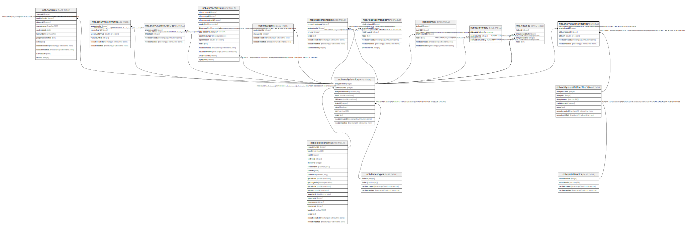

# ndb.analysisunitaltdepths

## Description

## Columns

| # | Name            | Type                           | Default                      | Nullable | Children | Parents                                                             | Comment |
| - | --------------- | ------------------------------ | ---------------------------- | -------- | -------- | ------------------------------------------------------------------- | ------- |
| 1 | altdepth        | double precision               |                              | false    |          |                                                                     |         |
| 2 | altdepthscaleid | integer                        |                              | false    |          | [ndb.analysisunitaltdepthscales](ndb.analysisunitaltdepthscales.md) |         |
| 3 | analysisunitid  | integer                        |                              | false    |          | [ndb.analysisunits](ndb.analysisunits.md)                           |         |
| 4 | recdatecreated  | timestamp(0) without time zone | timezone('UTC'::text, now()) | false    |          |                                                                     |         |
| 5 | recdatemodified | timestamp(0) without time zone |                              | false    |          |                                                                     |         |

## Constraints

| # | Name                                                | Type        | Definition                                                                                                                   |
| - | --------------------------------------------------- | ----------- | ---------------------------------------------------------------------------------------------------------------------------- |
| 1 | analysisunitaltdepths_pkey                          | PRIMARY KEY | PRIMARY KEY (altdepthscaleid, analysisunitid)                                                                                |
| 2 | fk_analysisunitaltdepths_analysisunitaltdepthscales | FOREIGN KEY | FOREIGN KEY (altdepthscaleid) REFERENCES ndb.analysisunitaltdepthscales(altdepthscaleid) ON UPDATE CASCADE ON DELETE CASCADE |
| 3 | fk_analysisunitaltdepths_analysisunits              | FOREIGN KEY | FOREIGN KEY (analysisunitid) REFERENCES ndb.analysisunits(analysisunitid) ON UPDATE CASCADE ON DELETE CASCADE                |

## Indexes

| # | Name                       | Definition                                                                                                                |
| - | -------------------------- | ------------------------------------------------------------------------------------------------------------------------- |
| 1 | analysisunitaltdepths_pkey | CREATE UNIQUE INDEX analysisunitaltdepths_pkey ON ndb.analysisunitaltdepths USING btree (altdepthscaleid, analysisunitid) |

## Triggers

| # | Name                | Definition                                                                                                                                         |
| - | ------------------- | -------------------------------------------------------------------------------------------------------------------------------------------------- |
| 1 | tr_sites_modifydate | CREATE TRIGGER tr_sites_modifydate BEFORE INSERT OR UPDATE ON ndb.analysisunitaltdepths FOR EACH ROW EXECUTE FUNCTION ndb.update_recdatemodified() |

## Relations

---

> Generated by [tbls](https://github.com/k1LoW/tbls)