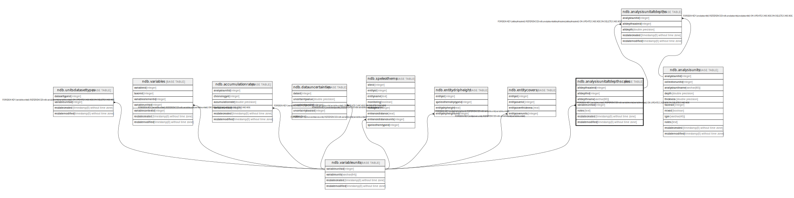

# ndb.analysisunitaltdepthscales

## Description

## Columns

| # | Name            | Type                           | Default                                                                 | Nullable | Children                                                  | Parents                                   | Comment |
| - | --------------- | ------------------------------ | ----------------------------------------------------------------------- | -------- | --------------------------------------------------------- | ----------------------------------------- | ------- |
| 1 | altdepthid      | integer                        |                                                                         | false    |                                                           |                                           |         |
| 2 | altdepthname    | varchar(80)                    |                                                                         | false    |                                                           |                                           |         |
| 3 | altdepthscaleid | integer                        | nextval('ndb.seq_analysisunitaltdepthscales_altdepthscaleid'::regclass) | false    | [ndb.analysisunitaltdepths](ndb.analysisunitaltdepths.md) |                                           |         |
| 4 | notes           | text                           |                                                                         | true     |                                                           |                                           |         |
| 5 | recdatecreated  | timestamp(0) without time zone | timezone('UTC'::text, now())                                            | false    |                                                           |                                           |         |
| 6 | recdatemodified | timestamp(0) without time zone |                                                                         | false    |                                                           |                                           |         |
| 7 | variableunitsid | integer                        |                                                                         | false    |                                                           | [ndb.variableunits](ndb.variableunits.md) |         |

## Viewpoints

| Name                                      | Definition                           |
| ----------------------------------------- | ------------------------------------ |
| [Controlled Vocabularies](viewpoint-0.md) | Tables with controlled vocabularies. |

## Constraints

| # | Name                                   | Type        | Definition                                                                                                      |
| - | -------------------------------------- | ----------- | --------------------------------------------------------------------------------------------------------------- |
| 1 | analysisunitaltdepthscales_pkey        | PRIMARY KEY | PRIMARY KEY (altdepthscaleid)                                                                                   |
| 2 | fk_analysisunitaltdepths_variableunits | FOREIGN KEY | FOREIGN KEY (variableunitsid) REFERENCES ndb.variableunits(variableunitsid) ON UPDATE CASCADE ON DELETE CASCADE |

## Indexes

| # | Name                            | Definition                                                                                                          |
| - | ------------------------------- | ------------------------------------------------------------------------------------------------------------------- |
| 1 | analysisunitaltdepthscales_pkey | CREATE UNIQUE INDEX analysisunitaltdepthscales_pkey ON ndb.analysisunitaltdepthscales USING btree (altdepthscaleid) |

## Triggers

| # | Name                | Definition                                                                                                                                              |
| - | ------------------- | ------------------------------------------------------------------------------------------------------------------------------------------------------- |
| 1 | tr_sites_modifydate | CREATE TRIGGER tr_sites_modifydate BEFORE INSERT OR UPDATE ON ndb.analysisunitaltdepthscales FOR EACH ROW EXECUTE FUNCTION ndb.update_recdatemodified() |

## Relations

---

> Generated by [tbls](https://github.com/k1LoW/tbls)