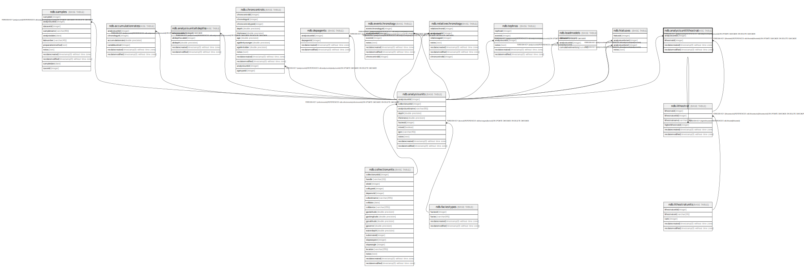

# ndb.analysisunitlithostrat

## Description

## Columns

| # | Name            | Type                           | Default                      | Nullable | Children | Parents                                   | Comment |
| - | --------------- | ------------------------------ | ---------------------------- | -------- | -------- | ----------------------------------------- | ------- |
| 1 | analysisunitid  | integer                        |                              | false    |          | [ndb.analysisunits](ndb.analysisunits.md) |         |
| 2 | lithostratid    | integer                        |                              | false    |          | [ndb.lithostrat](ndb.lithostrat.md)       |         |
| 3 | recdatecreated  | timestamp(0) without time zone | timezone('UTC'::text, now()) | false    |          |                                           |         |
| 4 | recdatemodified | timestamp(0) without time zone |                              | false    |          |                                           |         |

## Constraints

| # | Name                                    | Type        | Definition                                                                                                    |
| - | --------------------------------------- | ----------- | ------------------------------------------------------------------------------------------------------------- |
| 1 | analysisunitlithostrat_pkey             | PRIMARY KEY | PRIMARY KEY (analysisunitid, lithostratid)                                                                    |
| 2 | fk_analysisunitlithostrat_analysisunits | FOREIGN KEY | FOREIGN KEY (analysisunitid) REFERENCES ndb.analysisunits(analysisunitid) ON UPDATE CASCADE ON DELETE CASCADE |
| 3 | fk_analysisunitlithostrat_lithostrat    | FOREIGN KEY | FOREIGN KEY (lithostratid) REFERENCES ndb.lithostrat(lithostratid) ON UPDATE CASCADE ON DELETE CASCADE        |

## Indexes

| # | Name                        | Definition                                                                                                               |
| - | --------------------------- | ------------------------------------------------------------------------------------------------------------------------ |
| 1 | analysisunitlithostrat_pkey | CREATE UNIQUE INDEX analysisunitlithostrat_pkey ON ndb.analysisunitlithostrat USING btree (analysisunitid, lithostratid) |

## Triggers

| # | Name                | Definition                                                                                                                                          |
| - | ------------------- | --------------------------------------------------------------------------------------------------------------------------------------------------- |
| 1 | tr_sites_modifydate | CREATE TRIGGER tr_sites_modifydate BEFORE INSERT OR UPDATE ON ndb.analysisunitlithostrat FOR EACH ROW EXECUTE FUNCTION ndb.update_recdatemodified() |

## Relations

---

> Generated by [tbls](https://github.com/k1LoW/tbls)