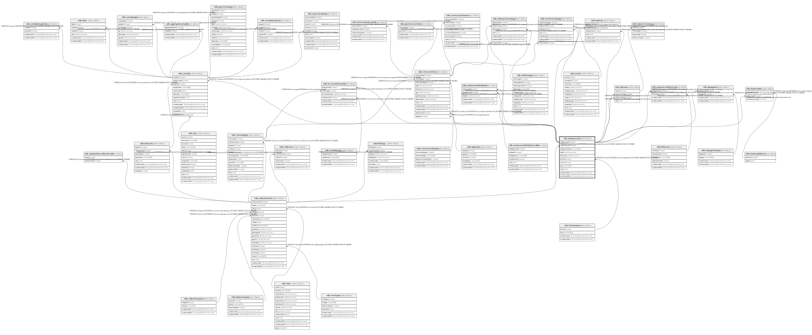

# ndb.analysisunits

## Description

This table stores the data for Analysis Units.

## Columns

| #  | Name             | Type                           | Default                                                   | Nullable | Children                                                                                                                                                                                                                                                                                                                                                                                                                                                                              | Parents                                       | Comment                                                                                                                                                                                                                                                                                                                                                                                                                                                                                                                                                                                                                                                                                                                                                                                                                                                                                                                                                                                                                                                                                                                                                     |
| -- | ---------------- | ------------------------------ | --------------------------------------------------------- | -------- | ------------------------------------------------------------------------------------------------------------------------------------------------------------------------------------------------------------------------------------------------------------------------------------------------------------------------------------------------------------------------------------------------------------------------------------------------------------------------------------- | --------------------------------------------- | ----------------------------------------------------------------------------------------------------------------------------------------------------------------------------------------------------------------------------------------------------------------------------------------------------------------------------------------------------------------------------------------------------------------------------------------------------------------------------------------------------------------------------------------------------------------------------------------------------------------------------------------------------------------------------------------------------------------------------------------------------------------------------------------------------------------------------------------------------------------------------------------------------------------------------------------------------------------------------------------------------------------------------------------------------------------------------------------------------------------------------------------------------------- |
| 1  | analysisunitid   | integer                        | nextval('ndb.seq_analysisunits_analysisunitid'::regclass) | false    | [ndb.accumulationrates](ndb.accumulationrates.md) [ndb.analysisunitaltdepths](ndb.analysisunitaltdepths.md) [ndb.analysisunitlithostrat](ndb.analysisunitlithostrat.md) [ndb.chroncontrols](ndb.chroncontrols.md) [ndb.depagents](ndb.depagents.md) [ndb.eventchronology](ndb.eventchronology.md) [ndb.hiatuses](ndb.hiatuses.md) [ndb.leadmodels](ndb.leadmodels.md) [ndb.relativechronology](ndb.relativechronology.md) [ndb.samples](ndb.samples.md) [ndb.tephras](ndb.tephras.md) |                                               | An arbitrary Analysis Unit identification number.                                                                                                                                                                                                                                                                                                                                                                                                                                                                                                                                                                                                                                                                                                                                                                                                                                                                                                                                                                                                                                                                                                           |
| 2  | analysisunitname | varchar(80)                    |                                                           | true     |                                                                                                                                                                                                                                                                                                                                                                                                                                                                                       |                                               | Optional name for an Analysis Unit. Analysis Units are usually designated with either a depth or a name, sometimes both.                                                                                                                                                                                                                                                                                                                                                                                                                                                                                                                                                                                                                                                                                                                                                                                                                                                                                                                                                                                                                                    |
| 3  | collectionunitid | integer                        |                                                           | false    |                                                                                                                                                                                                                                                                                                                                                                                                                                                                                       | [ndb.collectionunits](ndb.collectionunits.md) | Collection Unit ID number. Field links to CollectionUnits table. Every Analysis Unit belongs to a Collection Unit.                                                                                                                                                                                                                                                                                                                                                                                                                                                                                                                                                                                                                                                                                                                                                                                                                                                                                                                                                                                                                                          |
| 4  | depth            | double precision               |                                                           | true     |                                                                                                                                                                                                                                                                                                                                                                                                                                                                                       |                                               | Optional depth of the Analysis Unit in cm. Depths are typically designated for Analysis Units from cores and for Analysis Units excavated in arbitrary (e.g. 10 cm) levels. Depths are normally the midpoints of arbitrary levels. For example, for a level excavated from 10 to 20 cm or for a core section from 10 to 15 cm, the depth is 15. Designating depths as midpoints and thicknesses facilitates calculation of ages from age models that utilize single midpoint depths for Analysis Units rather than top and bottom depths. Of course, top and bottom depths can be calculated from midpoint depths and thicknesses. For many microfossil core samples, only the midpoint depths are known or published; the diameter or width of the sampling device is often not given.                                                                                                                                                                                                                                                                                                                                                                     |
| 5  | faciesid         | integer                        |                                                           | true     |                                                                                                                                                                                                                                                                                                                                                                                                                                                                                       | [ndb.faciestypes](ndb.faciestypes.md)         | Sedimentary facies of the Analysis Unit. Field links to the FaciesTypes table.                                                                                                                                                                                                                                                                                                                                                                                                                                                                                                                                                                                                                                                                                                                                                                                                                                                                                                                                                                                                                                                                              |
| 6  | igsn             | varchar(40)                    |                                                           | true     |                                                                                                                                                                                                                                                                                                                                                                                                                                                                                       |                                               | International Geo Sample Number. The IGSN is a unique identifier for a Geoscience sample. They are assigned by the SESAR, the System for Earth Sample Registration (www.geosamples.org), which is a registry that provides and administers the unique identifiers. IGSN’s may be assigned to all types of geoscience samples, including cores, rocks, minerals, and even fluids. Their purpose is to facilitate sharing and correlation of samples and sample-based data. For data in Neotoma, their primary value would be for correlation various samples from the same Analysis Units, for example pollen, charcoal, diatoms, and geochemical analyses. Conceivably, the AnalysisUnitID could be used for this purpose; however, IGSN’s could be assigned by projects before their data are submitted to the database. Moreover, AnalysisUnitID’s are intended to be internal to the database. Although IGSN’s could be assigned to Neotoma Collection Units and Samples, their primary value lies in their assignment to Analysis Units. IGSN’s are not yet assigned to Neotoma Analysis Units; however, that may change after consultation with SESAR. |
| 7  | mixed            | boolean                        |                                                           | false    |                                                                                                                                                                                                                                                                                                                                                                                                                                                                                       |                                               | Indicates whether specimens in the Analysis Unit are of mixed ages, for example Pleistocene fossils occurring with late Holocene fossils. Although Analysis Units may be mixed, samples from the Analysis Unit may not be, for example individually radiocarbon dated specimens.                                                                                                                                                                                                                                                                                                                                                                                                                                                                                                                                                                                                                                                                                                                                                                                                                                                                            |
| 8  | notes            | text                           |                                                           | true     |                                                                                                                                                                                                                                                                                                                                                                                                                                                                                       |                                               | Free form notes or comments about the Analysis Unit.                                                                                                                                                                                                                                                                                                                                                                                                                                                                                                                                                                                                                                                                                                                                                                                                                                                                                                                                                                                                                                                                                                        |
| 9  | recdatecreated   | timestamp(0) without time zone | timezone('UTC'::text, now())                              | false    |                                                                                                                                                                                                                                                                                                                                                                                                                                                                                       |                                               |                                                                                                                                                                                                                                                                                                                                                                                                                                                                                                                                                                                                                                                                                                                                                                                                                                                                                                                                                                                                                                                                                                                                                             |
| 10 | recdatemodified  | timestamp(0) without time zone |                                                           | false    |                                                                                                                                                                                                                                                                                                                                                                                                                                                                                       |                                               |                                                                                                                                                                                                                                                                                                                                                                                                                                                                                                                                                                                                                                                                                                                                                                                                                                                                                                                                                                                                                                                                                                                                                             |
| 11 | thickness        | double precision               |                                                           | true     |                                                                                                                                                                                                                                                                                                                                                                                                                                                                                       |                                               | Optional thickness of the Analysis Unit in cm. For many microfossil core samples, the depths are treated as points, and the thicknesses are not given in the publications, although 0.5 to 1.0 cm would be typical.                                                                                                                                                                                                                                                                                                                                                                                                                                                                                                                                                                                                                                                                                                                                                                                                                                                                                                                                         |

## Constraints

| # | Name                             | Type        | Definition                                                                                                          |
| - | -------------------------------- | ----------- | ------------------------------------------------------------------------------------------------------------------- |
| 1 | analysisunits_pkey               | PRIMARY KEY | PRIMARY KEY (analysisunitid)                                                                                        |
| 2 | fk_analysisunits_collectionunits | FOREIGN KEY | FOREIGN KEY (collectionunitid) REFERENCES ndb.collectionunits(collectionunitid) ON UPDATE CASCADE ON DELETE CASCADE |
| 3 | fk_analysisunits_faciestypes     | FOREIGN KEY | FOREIGN KEY (faciesid) REFERENCES ndb.faciestypes(faciesid) ON UPDATE CASCADE ON DELETE CASCADE                     |

## Indexes

| # | Name                       | Definition                                                                                  |
| - | -------------------------- | ------------------------------------------------------------------------------------------- |
| 1 | analysisunits_collunit_idx | CREATE INDEX analysisunits_collunit_idx ON ndb.analysisunits USING btree (collectionunitid) |
| 2 | analysisunits_facies_idx   | CREATE INDEX analysisunits_facies_idx ON ndb.analysisunits USING btree (faciesid)           |
| 3 | analysisunits_pkey         | CREATE UNIQUE INDEX analysisunits_pkey ON ndb.analysisunits USING btree (analysisunitid)    |

## Triggers

| # | Name                | Definition                                                                                                                                 |
| - | ------------------- | ------------------------------------------------------------------------------------------------------------------------------------------ |
| 1 | tr_sites_modifydate | CREATE TRIGGER tr_sites_modifydate BEFORE INSERT OR UPDATE ON ndb.analysisunits FOR EACH ROW EXECUTE FUNCTION ndb.update_recdatemodified() |

## Relations

---

> Generated by [tbls](https://github.com/k1LoW/tbls)