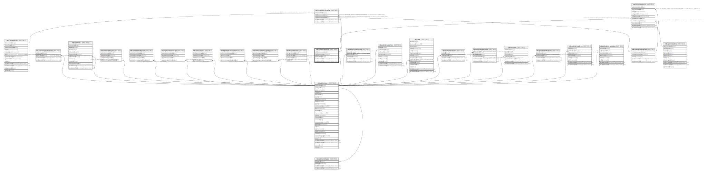

# ndb.calibrationcurves

## Description

## Columns

| # | Name               | Type                           | Default                                                           | Nullable | Children                                                                                              | Parents                                 | Comment |
| - | ------------------ | ------------------------------ | ----------------------------------------------------------------- | -------- | ----------------------------------------------------------------------------------------------------- | --------------------------------------- | ------- |
| 1 | calibrationcurveid | integer                        | nextval('ndb.seq_calibrationcurves_calibrationcurveid'::regclass) | false    | [ndb.chroncontrolscal14c](ndb.chroncontrolscal14c.md) [ndb.specimendatescal](ndb.specimendatescal.md) |                                         |         |
| 2 | calibrationcurve   | varchar(24)                    |                                                                   | false    |                                                                                                       |                                         |         |
| 3 | publicationid      | integer                        |                                                                   | false    |                                                                                                       | [ndb.publications](ndb.publications.md) |         |
| 4 | recdatecreated     | timestamp(0) without time zone | timezone('UTC'::text, now())                                      | false    |                                                                                                       |                                         |         |
| 5 | recdatemodified    | timestamp(0) without time zone |                                                                   | false    |                                                                                                       |                                         |         |

## Viewpoints

| Name                                      | Definition                           |
| ----------------------------------------- | ------------------------------------ |
| [Controlled Vocabularies](viewpoint-0.md) | Tables with controlled vocabularies. |

## Constraints

| # | Name                              | Type        | Definition                                                                                                 |
| - | --------------------------------- | ----------- | ---------------------------------------------------------------------------------------------------------- |
| 1 | calibrationcurves_pkey            | PRIMARY KEY | PRIMARY KEY (calibrationcurveid)                                                                           |
| 2 | fk_calibrationcurves_publications | FOREIGN KEY | FOREIGN KEY (publicationid) REFERENCES ndb.publications(publicationid) ON UPDATE CASCADE ON DELETE CASCADE |

## Indexes

| # | Name                   | Definition                                                                                           |
| - | ---------------------- | ---------------------------------------------------------------------------------------------------- |
| 1 | calibrationcurves_pkey | CREATE UNIQUE INDEX calibrationcurves_pkey ON ndb.calibrationcurves USING btree (calibrationcurveid) |

## Triggers

| # | Name                | Definition                                                                                                                                     |
| - | ------------------- | ---------------------------------------------------------------------------------------------------------------------------------------------- |
| 1 | tr_sites_modifydate | CREATE TRIGGER tr_sites_modifydate BEFORE INSERT OR UPDATE ON ndb.calibrationcurves FOR EACH ROW EXECUTE FUNCTION ndb.update_recdatemodified() |

## Relations

---

> Generated by [tbls](https://github.com/k1LoW/tbls)