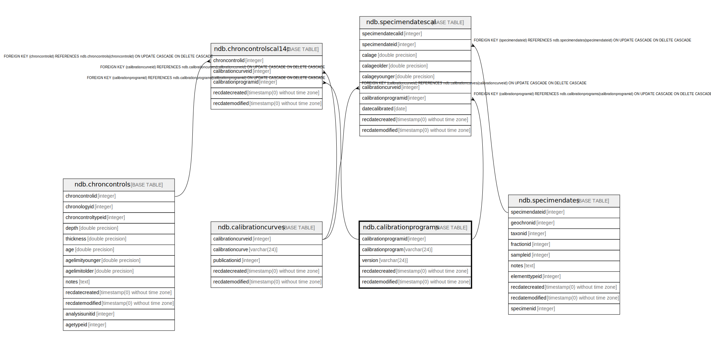

# ndb.calibrationprograms

## Description

## Columns

| # | Name                 | Type                           | Default                                                               | Nullable | Children                                                                                              | Parents | Comment |
| - | -------------------- | ------------------------------ | --------------------------------------------------------------------- | -------- | ----------------------------------------------------------------------------------------------------- | ------- | ------- |
| 1 | calibrationprogram   | varchar(24)                    |                                                                       | false    |                                                                                                       |         |         |
| 2 | calibrationprogramid | integer                        | nextval('ndb.seq_calibrationprograms_calibrationprogramid'::regclass) | false    | [ndb.chroncontrolscal14c](ndb.chroncontrolscal14c.md) [ndb.specimendatescal](ndb.specimendatescal.md) |         |         |
| 3 | recdatecreated       | timestamp(0) without time zone | timezone('UTC'::text, now())                                          | false    |                                                                                                       |         |         |
| 4 | recdatemodified      | timestamp(0) without time zone |                                                                       | false    |                                                                                                       |         |         |
| 5 | version              | varchar(24)                    |                                                                       | true     |                                                                                                       |         |         |

## Viewpoints

| Name                                        | Definition                                        |
| ------------------------------------------- | ------------------------------------------------- |
| [Controlled Vocabularies](viewpoint-0.md)   | Tables with controlled vocabularies.              |
| [Chronology related tables](viewpoint-5.md) | Tables related to chronology and age assignments. |

## Constraints

| # | Name                     | Type        | Definition                         |
| - | ------------------------ | ----------- | ---------------------------------- |
| 1 | calibrationprograms_pkey | PRIMARY KEY | PRIMARY KEY (calibrationprogramid) |

## Indexes

| # | Name                     | Definition                                                                                                 |
| - | ------------------------ | ---------------------------------------------------------------------------------------------------------- |
| 1 | calibrationprograms_pkey | CREATE UNIQUE INDEX calibrationprograms_pkey ON ndb.calibrationprograms USING btree (calibrationprogramid) |

## Triggers

| # | Name                | Definition                                                                                                                                       |
| - | ------------------- | ------------------------------------------------------------------------------------------------------------------------------------------------ |
| 1 | tr_sites_modifydate | CREATE TRIGGER tr_sites_modifydate BEFORE INSERT OR UPDATE ON ndb.calibrationprograms FOR EACH ROW EXECUTE FUNCTION ndb.update_recdatemodified() |

## Relations

---

> Generated by [tbls](https://github.com/k1LoW/tbls)