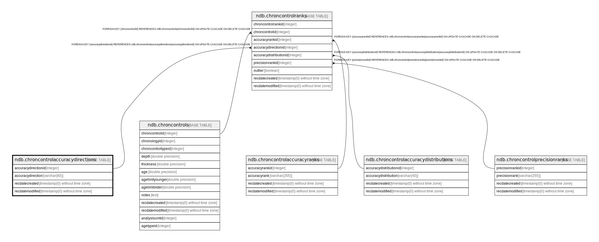

# ndb.chroncontrolaccuracydirections

## Description

## Columns

| # | Name                | Type                           | Default                                                                         | Nullable | Children                                          | Parents | Comment |
| - | ------------------- | ------------------------------ | ------------------------------------------------------------------------------- | -------- | ------------------------------------------------- | ------- | ------- |
| 1 | accuracydirectionid | integer                        | nextval('ndb.seq_chroncontrolaccuracydirections_accuracydirectionid'::regclass) | false    | [ndb.chroncontrolranks](ndb.chroncontrolranks.md) |         |         |
| 2 | accuracydirection   | varchar(80)                    |                                                                                 | false    |                                                   |         |         |
| 3 | recdatecreated      | timestamp(0) without time zone | timezone('UTC'::text, now())                                                    | false    |                                                   |         |         |
| 4 | recdatemodified     | timestamp(0) without time zone |                                                                                 | false    |                                                   |         |         |

## Constraints

| # | Name                                | Type        | Definition                        |
| - | ----------------------------------- | ----------- | --------------------------------- |
| 1 | chroncontrolaccuracydirections_pkey | PRIMARY KEY | PRIMARY KEY (accuracydirectionid) |

## Indexes

| # | Name                                | Definition                                                                                                                      |
| - | ----------------------------------- | ------------------------------------------------------------------------------------------------------------------------------- |
| 1 | chroncontrolaccuracydirections_pkey | CREATE UNIQUE INDEX chroncontrolaccuracydirections_pkey ON ndb.chroncontrolaccuracydirections USING btree (accuracydirectionid) |

## Triggers

| # | Name                | Definition                                                                                                                                                  |
| - | ------------------- | ----------------------------------------------------------------------------------------------------------------------------------------------------------- |
| 1 | tr_sites_modifydate | CREATE TRIGGER tr_sites_modifydate BEFORE INSERT OR UPDATE ON ndb.chroncontrolaccuracydirections FOR EACH ROW EXECUTE FUNCTION ndb.update_recdatemodified() |

## Relations

---

> Generated by [tbls](https://github.com/k1LoW/tbls)