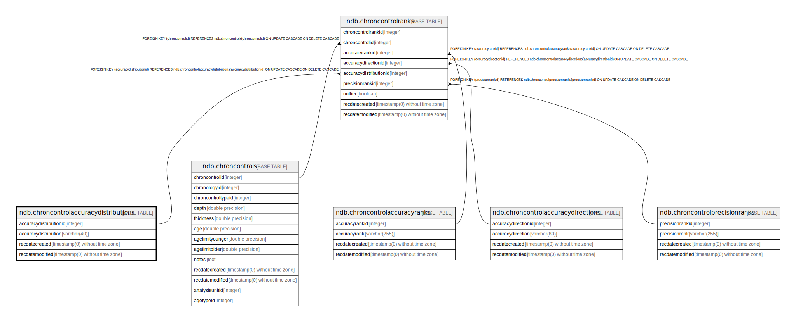

# ndb.chroncontrolaccuracydistributions

## Description

## Columns

| # | Name                   | Type                           | Default                                                                               | Nullable | Children                                          | Parents | Comment |
| - | ---------------------- | ------------------------------ | ------------------------------------------------------------------------------------- | -------- | ------------------------------------------------- | ------- | ------- |
| 1 | accuracydistributionid | integer                        | nextval('ndb.seq_chroncontrolaccuracydistributions_accuracydistributionid'::regclass) | false    | [ndb.chroncontrolranks](ndb.chroncontrolranks.md) |         |         |
| 2 | accuracydistribution   | varchar(40)                    |                                                                                       | false    |                                                   |         |         |
| 3 | recdatecreated         | timestamp(0) without time zone | timezone('UTC'::text, now())                                                          | false    |                                                   |         |         |
| 4 | recdatemodified        | timestamp(0) without time zone |                                                                                       | false    |                                                   |         |         |

## Constraints

| # | Name                                   | Type        | Definition                           |
| - | -------------------------------------- | ----------- | ------------------------------------ |
| 1 | chroncontrolaccuracydistributions_pkey | PRIMARY KEY | PRIMARY KEY (accuracydistributionid) |

## Indexes

| # | Name                                   | Definition                                                                                                                               |
| - | -------------------------------------- | ---------------------------------------------------------------------------------------------------------------------------------------- |
| 1 | chroncontrolaccuracydistributions_pkey | CREATE UNIQUE INDEX chroncontrolaccuracydistributions_pkey ON ndb.chroncontrolaccuracydistributions USING btree (accuracydistributionid) |

## Triggers

| # | Name                | Definition                                                                                                                                                     |
| - | ------------------- | -------------------------------------------------------------------------------------------------------------------------------------------------------------- |
| 1 | tr_sites_modifydate | CREATE TRIGGER tr_sites_modifydate BEFORE INSERT OR UPDATE ON ndb.chroncontrolaccuracydistributions FOR EACH ROW EXECUTE FUNCTION ndb.update_recdatemodified() |

## Relations

---

> Generated by [tbls](https://github.com/k1LoW/tbls)