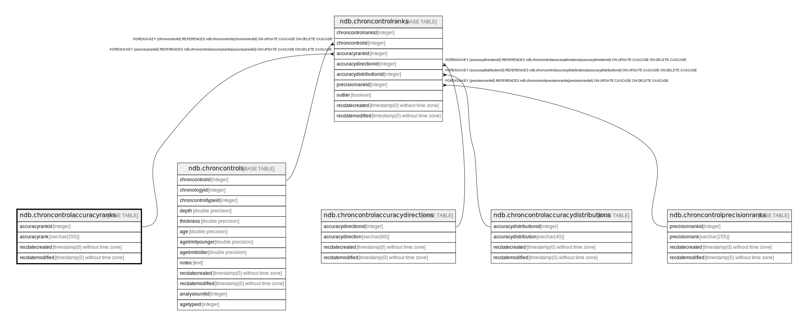

# ndb.chroncontrolaccuracyranks

## Description

## Columns

| # | Name            | Type                           | Default                                                               | Nullable | Children                                          | Parents | Comment |
| - | --------------- | ------------------------------ | --------------------------------------------------------------------- | -------- | ------------------------------------------------- | ------- | ------- |
| 1 | accuracyrank    | varchar(255)                   |                                                                       | false    |                                                   |         |         |
| 2 | accuracyrankid  | integer                        | nextval('ndb.seq_chroncontrolaccuracyranks_accuracyrankid'::regclass) | false    | [ndb.chroncontrolranks](ndb.chroncontrolranks.md) |         |         |
| 3 | recdatecreated  | timestamp(0) without time zone | timezone('UTC'::text, now())                                          | false    |                                                   |         |         |
| 4 | recdatemodified | timestamp(0) without time zone |                                                                       | false    |                                                   |         |         |

## Viewpoints

| Name                                        | Definition                                        |
| ------------------------------------------- | ------------------------------------------------- |
| [Chronology related tables](viewpoint-5.md) | Tables related to chronology and age assignments. |

## Constraints

| # | Name                           | Type        | Definition                   |
| - | ------------------------------ | ----------- | ---------------------------- |
| 1 | chroncontrolaccuracyranks_pkey | PRIMARY KEY | PRIMARY KEY (accuracyrankid) |

## Indexes

| # | Name                           | Definition                                                                                                       |
| - | ------------------------------ | ---------------------------------------------------------------------------------------------------------------- |
| 1 | chroncontrolaccuracyranks_pkey | CREATE UNIQUE INDEX chroncontrolaccuracyranks_pkey ON ndb.chroncontrolaccuracyranks USING btree (accuracyrankid) |

## Triggers

| # | Name                | Definition                                                                                                                                             |
| - | ------------------- | ------------------------------------------------------------------------------------------------------------------------------------------------------ |
| 1 | tr_sites_modifydate | CREATE TRIGGER tr_sites_modifydate BEFORE INSERT OR UPDATE ON ndb.chroncontrolaccuracyranks FOR EACH ROW EXECUTE FUNCTION ndb.update_recdatemodified() |

## Relations

---

> Generated by [tbls](https://github.com/k1LoW/tbls)