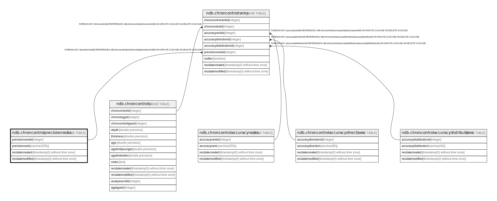

# ndb.chroncontrolprecisionranks

## Description

## Columns

| # | Name            | Type                           | Default                                                                 | Nullable | Children                                          | Parents | Comment |
| - | --------------- | ------------------------------ | ----------------------------------------------------------------------- | -------- | ------------------------------------------------- | ------- | ------- |
| 1 | precisionrank   | varchar(255)                   |                                                                         | false    |                                                   |         |         |
| 2 | precisionrankid | integer                        | nextval('ndb.seq_chroncontrolprecisionranks_precisionrankid'::regclass) | false    | [ndb.chroncontrolranks](ndb.chroncontrolranks.md) |         |         |
| 3 | recdatecreated  | timestamp(0) without time zone | timezone('UTC'::text, now())                                            | false    |                                                   |         |         |
| 4 | recdatemodified | timestamp(0) without time zone |                                                                         | false    |                                                   |         |         |

## Viewpoints

| Name                                        | Definition                                        |
| ------------------------------------------- | ------------------------------------------------- |
| [Chronology related tables](viewpoint-5.md) | Tables related to chronology and age assignments. |

## Constraints

| # | Name                            | Type        | Definition                    |
| - | ------------------------------- | ----------- | ----------------------------- |
| 1 | chroncontrolprecisionranks_pkey | PRIMARY KEY | PRIMARY KEY (precisionrankid) |

## Indexes

| # | Name                            | Definition                                                                                                          |
| - | ------------------------------- | ------------------------------------------------------------------------------------------------------------------- |
| 1 | chroncontrolprecisionranks_pkey | CREATE UNIQUE INDEX chroncontrolprecisionranks_pkey ON ndb.chroncontrolprecisionranks USING btree (precisionrankid) |

## Triggers

| # | Name                | Definition                                                                                                                                              |
| - | ------------------- | ------------------------------------------------------------------------------------------------------------------------------------------------------- |
| 1 | tr_sites_modifydate | CREATE TRIGGER tr_sites_modifydate BEFORE INSERT OR UPDATE ON ndb.chroncontrolprecisionranks FOR EACH ROW EXECUTE FUNCTION ndb.update_recdatemodified() |

## Relations

---

> Generated by [tbls](https://github.com/k1LoW/tbls)