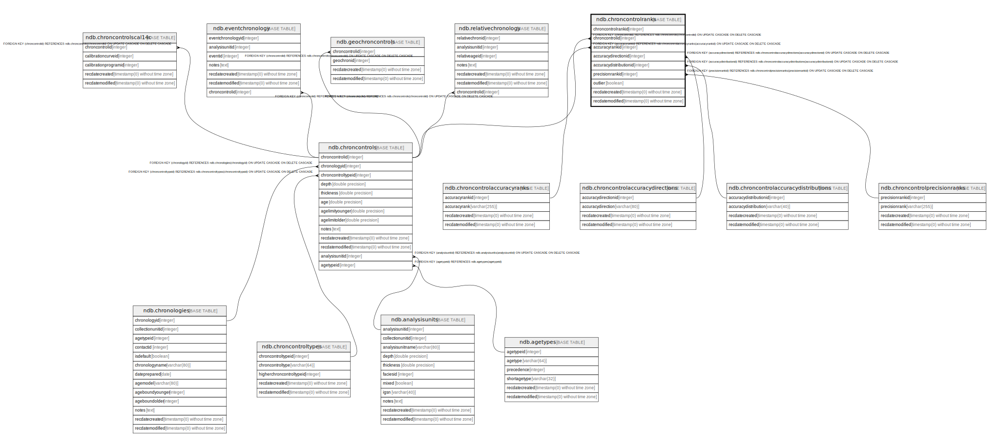

# ndb.chroncontrolranks

## Description

## Columns

| # | Name                   | Type                           | Default                                                           | Nullable | Children | Parents                                                                           | Comment |
| - | ---------------------- | ------------------------------ | ----------------------------------------------------------------- | -------- | -------- | --------------------------------------------------------------------------------- | ------- |
| 1 | accuracydirectionid    | integer                        |                                                                   | true     |          | [ndb.chroncontrolaccuracydirections](ndb.chroncontrolaccuracydirections.md)       |         |
| 2 | accuracydistributionid | integer                        |                                                                   | true     |          | [ndb.chroncontrolaccuracydistributions](ndb.chroncontrolaccuracydistributions.md) |         |
| 3 | accuracyrankid         | integer                        |                                                                   | true     |          | [ndb.chroncontrolaccuracyranks](ndb.chroncontrolaccuracyranks.md)                 |         |
| 4 | chroncontrolid         | integer                        |                                                                   | true     |          | [ndb.chroncontrols](ndb.chroncontrols.md)                                         |         |
| 5 | chroncontrolrankid     | integer                        | nextval('ndb.seq_chroncontrolranks_chroncontrolrankid'::regclass) | false    |          |                                                                                   |         |
| 6 | outlier                | boolean                        |                                                                   | true     |          |                                                                                   |         |
| 7 | precisionrankid        | integer                        |                                                                   | true     |          | [ndb.chroncontrolprecisionranks](ndb.chroncontrolprecisionranks.md)               |         |
| 8 | recdatecreated         | timestamp(0) without time zone | timezone('UTC'::text, now())                                      | false    |          |                                                                                   |         |
| 9 | recdatemodified        | timestamp(0) without time zone |                                                                   | false    |          |                                                                                   |         |

## Viewpoints

| Name                                        | Definition                                        |
| ------------------------------------------- | ------------------------------------------------- |
| [Chronology related tables](viewpoint-5.md) | Tables related to chronology and age assignments. |

## Constraints

| # | Name                                                   | Type        | Definition                                                                                                                                        |
| - | ------------------------------------------------------ | ----------- | ------------------------------------------------------------------------------------------------------------------------------------------------- |
| 1 | chroncontrolranks_pkey                                 | PRIMARY KEY | PRIMARY KEY (chroncontrolrankid)                                                                                                                  |
| 2 | fk_chroncontrolranks_chroncontrolaccuracydirections    | FOREIGN KEY | FOREIGN KEY (accuracydirectionid) REFERENCES ndb.chroncontrolaccuracydirections(accuracydirectionid) ON UPDATE CASCADE ON DELETE CASCADE          |
| 3 | fk_chroncontrolranks_chroncontrolaccuracydistributions | FOREIGN KEY | FOREIGN KEY (accuracydistributionid) REFERENCES ndb.chroncontrolaccuracydistributions(accuracydistributionid) ON UPDATE CASCADE ON DELETE CASCADE |
| 4 | fk_chroncontrolranks_chroncontrolaccuracyranks         | FOREIGN KEY | FOREIGN KEY (accuracyrankid) REFERENCES ndb.chroncontrolaccuracyranks(accuracyrankid) ON UPDATE CASCADE ON DELETE CASCADE                         |
| 5 | fk_chroncontrolranks_chroncontrolprecisionranks        | FOREIGN KEY | FOREIGN KEY (precisionrankid) REFERENCES ndb.chroncontrolprecisionranks(precisionrankid) ON UPDATE CASCADE ON DELETE CASCADE                      |
| 6 | fk_chroncontrolranks_chroncontrols                     | FOREIGN KEY | FOREIGN KEY (chroncontrolid) REFERENCES ndb.chroncontrols(chroncontrolid) ON UPDATE CASCADE ON DELETE CASCADE                                     |

## Indexes

| # | Name                   | Definition                                                                                           |
| - | ---------------------- | ---------------------------------------------------------------------------------------------------- |
| 1 | chroncontrolranks_pkey | CREATE UNIQUE INDEX chroncontrolranks_pkey ON ndb.chroncontrolranks USING btree (chroncontrolrankid) |

## Triggers

| # | Name                | Definition                                                                                                                                     |
| - | ------------------- | ---------------------------------------------------------------------------------------------------------------------------------------------- |
| 1 | tr_sites_modifydate | CREATE TRIGGER tr_sites_modifydate BEFORE INSERT OR UPDATE ON ndb.chroncontrolranks FOR EACH ROW EXECUTE FUNCTION ndb.update_recdatemodified() |

## Relations

---

> Generated by [tbls](https://github.com/k1LoW/tbls)