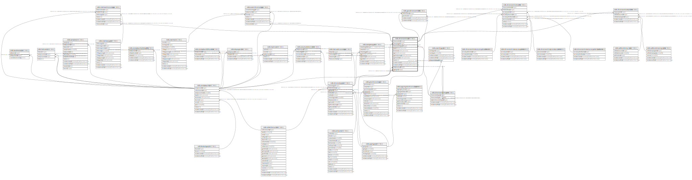

# ndb.chroncontrols

## Description

This table stores data for Chronology Controls, which are the age-depth control points used for age models. These controls may be geophysical controls, such as radiocarbon dates, but include many other kinds of age controls, such as biostratigraphic controls, archaeological cultural associations, and volcanic tephras. In the case of radiocarbon dates, a Chronology Control may not simply be the raw radiocarbon date reported by the laboratory, but perhaps a radiocarbon date corrected for an old carbon reservoir, a calibrated radiocarbon date, or an average of several radiocarbon dates from the same level. A common control for lake-sediment cores is the age of the top of the core, which may be the year the core was taken or perhaps an estimate of 0 BP if a few cm of surficial sediment were lost.

## Columns

| #  | Name               | Type                           | Default                                                   | Nullable | Children                                                                                                                                                                                                                                                  | Parents                                           | Comment                                                                                                                                                                                                                                                                                           |
| -- | ------------------ | ------------------------------ | --------------------------------------------------------- | -------- | --------------------------------------------------------------------------------------------------------------------------------------------------------------------------------------------------------------------------------------------------------- | ------------------------------------------------- | ------------------------------------------------------------------------------------------------------------------------------------------------------------------------------------------------------------------------------------------------------------------------------------------------- |
| 1  | age                | double precision               |                                                           | true     |                                                                                                                                                                                                                                                           |                                                   | Age of the Chronology Control.                                                                                                                                                                                                                                                                    |
| 2  | agelimitolder      | double precision               |                                                           | true     |                                                                                                                                                                                                                                                           |                                                   | The older age limit of a Chronology Control.                                                                                                                                                                                                                                                      |
| 3  | agelimityounger    | double precision               |                                                           | true     |                                                                                                                                                                                                                                                           |                                                   | The younger age limit of a Chronology Control. This limit may be explicitly defined, for example the younger of the 2-sigma range limits of a calibrated radiocarbon date, or it may be more loosely defined, for example the younger limit on the range of dates for a biostratigraphic horizon. |
| 4  | agetypeid          | integer                        |                                                           | true     |                                                                                                                                                                                                                                                           | [ndb.agetypes](ndb.agetypes.md)                   |                                                                                                                                                                                                                                                                                                   |
| 5  | analysisunitid     | integer                        |                                                           | true     |                                                                                                                                                                                                                                                           | [ndb.analysisunits](ndb.analysisunits.md)         |                                                                                                                                                                                                                                                                                                   |
| 6  | chroncontrolid     | integer                        | nextval('ndb.seq_chroncontrols_chroncontrolid'::regclass) | false    | [ndb.chroncontrolranks](ndb.chroncontrolranks.md) [ndb.chroncontrolscal14c](ndb.chroncontrolscal14c.md) [ndb.eventchronology](ndb.eventchronology.md) [ndb.geochroncontrols](ndb.geochroncontrols.md) [ndb.relativechronology](ndb.relativechronology.md) |                                                   | An arbitrary Chronology Control identification number.                                                                                                                                                                                                                                            |
| 7  | chroncontroltypeid | integer                        |                                                           | true     |                                                                                                                                                                                                                                                           | [ndb.chroncontroltypes](ndb.chroncontroltypes.md) | The type of Chronology Control. Field links to the ChronControlTypes table.                                                                                                                                                                                                                       |
| 8  | chronologyid       | integer                        |                                                           | false    |                                                                                                                                                                                                                                                           | [ndb.chronologies](ndb.chronologies.md)           | Chronology to which the ChronControl belongs. Field links to the Chronolgies table.                                                                                                                                                                                                               |
| 9  | depth              | double precision               |                                                           | true     |                                                                                                                                                                                                                                                           |                                                   | Depth of the Chronology Control in cm.                                                                                                                                                                                                                                                            |
| 10 | notes              | text                           |                                                           | true     |                                                                                                                                                                                                                                                           |                                                   | Free form notes or comments about the Chronology Control.                                                                                                                                                                                                                                         |
| 11 | recdatecreated     | timestamp(0) without time zone | timezone('UTC'::text, now())                              | false    |                                                                                                                                                                                                                                                           |                                                   |                                                                                                                                                                                                                                                                                                   |
| 12 | recdatemodified    | timestamp(0) without time zone |                                                           | false    |                                                                                                                                                                                                                                                           |                                                   |                                                                                                                                                                                                                                                                                                   |
| 13 | thickness          | double precision               |                                                           | true     |                                                                                                                                                                                                                                                           |                                                   | Thickness of the Chronology Control in cm.                                                                                                                                                                                                                                                        |

## Viewpoints

| Name                                        | Definition                                        |
| ------------------------------------------- | ------------------------------------------------- |
| [Chronology related tables](viewpoint-5.md) | Tables related to chronology and age assignments. |

## Constraints

| # | Name                               | Type        | Definition                                                                                                                |
| - | ---------------------------------- | ----------- | ------------------------------------------------------------------------------------------------------------------------- |
| 1 | chroncontrols_pkey                 | PRIMARY KEY | PRIMARY KEY (chroncontrolid)                                                                                              |
| 2 | fk_chroncontrols_agetypes          | FOREIGN KEY | FOREIGN KEY (agetypeid) REFERENCES ndb.agetypes(agetypeid)                                                                |
| 3 | fk_chroncontrols_analysisunits     | FOREIGN KEY | FOREIGN KEY (analysisunitid) REFERENCES ndb.analysisunits(analysisunitid) ON UPDATE CASCADE ON DELETE CASCADE             |
| 4 | fk_chroncontrols_chroncontroltypes | FOREIGN KEY | FOREIGN KEY (chroncontroltypeid) REFERENCES ndb.chroncontroltypes(chroncontroltypeid) ON UPDATE CASCADE ON DELETE CASCADE |
| 5 | fk_chroncontrols_chronologies      | FOREIGN KEY | FOREIGN KEY (chronologyid) REFERENCES ndb.chronologies(chronologyid) ON UPDATE CASCADE ON DELETE CASCADE                  |

## Indexes

| # | Name                           | Definition                                                                                  |
| - | ------------------------------ | ------------------------------------------------------------------------------------------- |
| 1 | ccrchronage_idx                | CREATE INDEX ccrchronage_idx ON ndb.chroncontrols USING btree (age)                         |
| 2 | ccroldage_idx                  | CREATE INDEX ccroldage_idx ON ndb.chroncontrols USING btree (agelimitolder)                 |
| 3 | ccryoungage_idx                | CREATE INDEX ccryoungage_idx ON ndb.chroncontrols USING btree (agelimityounger)             |
| 4 | chroncontrols_chronologyid_idx | CREATE INDEX chroncontrols_chronologyid_idx ON ndb.chroncontrols USING btree (chronologyid) |
| 5 | chroncontrols_pkey             | CREATE UNIQUE INDEX chroncontrols_pkey ON ndb.chroncontrols USING btree (chroncontrolid)    |

## Triggers

| # | Name                | Definition                                                                                                                                 |
| - | ------------------- | ------------------------------------------------------------------------------------------------------------------------------------------ |
| 1 | tr_sites_modifydate | CREATE TRIGGER tr_sites_modifydate BEFORE INSERT OR UPDATE ON ndb.chroncontrols FOR EACH ROW EXECUTE FUNCTION ndb.update_recdatemodified() |

## Relations

---

> Generated by [tbls](https://github.com/k1LoW/tbls)