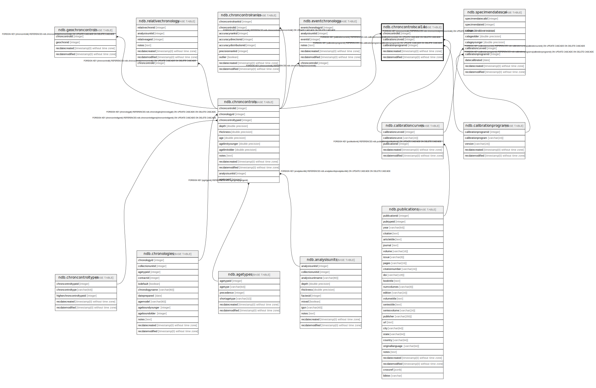

# ndb.chroncontrolscal14c

## Description

## Columns

| # | Name                 | Type                           | Default                      | Nullable | Children | Parents                                               | Comment |
| - | -------------------- | ------------------------------ | ---------------------------- | -------- | -------- | ----------------------------------------------------- | ------- |
| 1 | calibrationcurveid   | integer                        |                              | false    |          | [ndb.calibrationcurves](ndb.calibrationcurves.md)     |         |
| 2 | calibrationprogramid | integer                        |                              | false    |          | [ndb.calibrationprograms](ndb.calibrationprograms.md) |         |
| 3 | chroncontrolid       | integer                        |                              | false    |          | [ndb.chroncontrols](ndb.chroncontrols.md)             |         |
| 4 | recdatecreated       | timestamp(0) without time zone | timezone('UTC'::text, now()) | false    |          |                                                       |         |
| 5 | recdatemodified      | timestamp(0) without time zone |                              | false    |          |                                                       |         |

## Viewpoints

| Name                                        | Definition                                        |
| ------------------------------------------- | ------------------------------------------------- |
| [Chronology related tables](viewpoint-5.md) | Tables related to chronology and age assignments. |

## Constraints

| # | Name                                       | Type        | Definition                                                                                                                      |
| - | ------------------------------------------ | ----------- | ------------------------------------------------------------------------------------------------------------------------------- |
| 1 | chroncontrolscal14c_pkey                   | PRIMARY KEY | PRIMARY KEY (chroncontrolid)                                                                                                    |
| 2 | fk_chroncontrolscal14c_calibrationcurves   | FOREIGN KEY | FOREIGN KEY (calibrationcurveid) REFERENCES ndb.calibrationcurves(calibrationcurveid) ON UPDATE CASCADE ON DELETE CASCADE       |
| 3 | fk_chroncontrolscal14c_calibrationprograms | FOREIGN KEY | FOREIGN KEY (calibrationprogramid) REFERENCES ndb.calibrationprograms(calibrationprogramid) ON UPDATE CASCADE ON DELETE CASCADE |
| 4 | fk_chroncontrolscal14c_chroncontrols       | FOREIGN KEY | FOREIGN KEY (chroncontrolid) REFERENCES ndb.chroncontrols(chroncontrolid) ON UPDATE CASCADE ON DELETE CASCADE                   |

## Indexes

| # | Name                     | Definition                                                                                           |
| - | ------------------------ | ---------------------------------------------------------------------------------------------------- |
| 1 | chroncontrolscal14c_pkey | CREATE UNIQUE INDEX chroncontrolscal14c_pkey ON ndb.chroncontrolscal14c USING btree (chroncontrolid) |

## Triggers

| # | Name                | Definition                                                                                                                                       |
| - | ------------------- | ------------------------------------------------------------------------------------------------------------------------------------------------ |
| 1 | tr_sites_modifydate | CREATE TRIGGER tr_sites_modifydate BEFORE INSERT OR UPDATE ON ndb.chroncontrolscal14c FOR EACH ROW EXECUTE FUNCTION ndb.update_recdatemodified() |

## Relations

---

> Generated by [tbls](https://github.com/k1LoW/tbls)