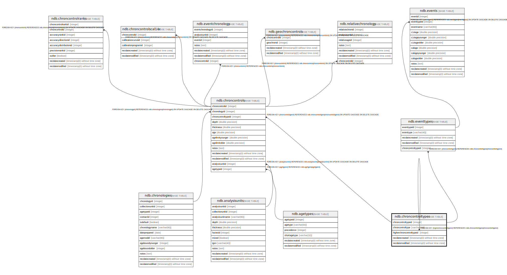

# ndb.chroncontroltypes

## Description

Lookup table of Chronology Control Types. This table is referenced by the ChronControls table.

## Columns

| # | Name                     | Type                           | Default                                                           | Nullable | Children                                                                                                                        | Parents                                           | Comment                                                                                                                                                                                                                                                                                                                                                                                                |
| - | ------------------------ | ------------------------------ | ----------------------------------------------------------------- | -------- | ------------------------------------------------------------------------------------------------------------------------------- | ------------------------------------------------- | ------------------------------------------------------------------------------------------------------------------------------------------------------------------------------------------------------------------------------------------------------------------------------------------------------------------------------------------------------------------------------------------------------ |
| 1 | chroncontroltype         | varchar(64)                    |                                                                   | true     |                                                                                                                                 |                                                   | The Chronology Control Type. Chronology Controls include such geophysical controls as radiocarbon dates, calibrated radiocarbon dates, averages of several radiocarbon dates, potassium-argon dates, and thermoluminescence dates, as well as biostratigraphic controls, sediment stratigraphic controls, volcanic tephras, archaeological cultural associations, and any other types of age controls. |
| 2 | chroncontroltypeid       | integer                        | nextval('ndb.seq_chroncontroltypes_chroncontroltypeid'::regclass) | false    | [ndb.chroncontrols](ndb.chroncontrols.md) [ndb.chroncontroltypes](ndb.chroncontroltypes.md) [ndb.eventtypes](ndb.eventtypes.md) |                                                   | An arbitrary Chronology Control Type identification number.                                                                                                                                                                                                                                                                                                                                            |
| 3 | higherchroncontroltypeid | integer                        |                                                                   | true     |                                                                                                                                 | [ndb.chroncontroltypes](ndb.chroncontroltypes.md) |                                                                                                                                                                                                                                                                                                                                                                                                        |
| 4 | recdatecreated           | timestamp(0) without time zone | timezone('UTC'::text, now())                                      | false    |                                                                                                                                 |                                                   |                                                                                                                                                                                                                                                                                                                                                                                                        |
| 5 | recdatemodified          | timestamp(0) without time zone |                                                                   | false    |                                                                                                                                 |                                                   |                                                                                                                                                                                                                                                                                                                                                                                                        |

## Viewpoints

| Name                                        | Definition                                        |
| ------------------------------------------- | ------------------------------------------------- |
| [Controlled Vocabularies](viewpoint-0.md)   | Tables with controlled vocabularies.              |
| [Hierarchical Tables](viewpoint-1.md)       | Tables with internal hierarchies.                 |
| [Chronology related tables](viewpoint-5.md) | Tables related to chronology and age assignments. |

## Constraints

| # | Name                        | Type        | Definition                                                                                  |
| - | --------------------------- | ----------- | ------------------------------------------------------------------------------------------- |
| 1 | chroncontroltypes_pkey      | PRIMARY KEY | PRIMARY KEY (chroncontroltypeid)                                                            |
| 2 | fk_higherchroncontroltypeid | FOREIGN KEY | FOREIGN KEY (higherchroncontroltypeid) REFERENCES ndb.chroncontroltypes(chroncontroltypeid) |

## Indexes

| # | Name                   | Definition                                                                                           |
| - | ---------------------- | ---------------------------------------------------------------------------------------------------- |
| 1 | chroncontroltypes_pkey | CREATE UNIQUE INDEX chroncontroltypes_pkey ON ndb.chroncontroltypes USING btree (chroncontroltypeid) |

## Triggers

| # | Name                | Definition                                                                                                                                     |
| - | ------------------- | ---------------------------------------------------------------------------------------------------------------------------------------------- |
| 1 | tr_sites_modifydate | CREATE TRIGGER tr_sites_modifydate BEFORE INSERT OR UPDATE ON ndb.chroncontroltypes FOR EACH ROW EXECUTE FUNCTION ndb.update_recdatemodified() |

## Relations

---

> Generated by [tbls](https://github.com/k1LoW/tbls)