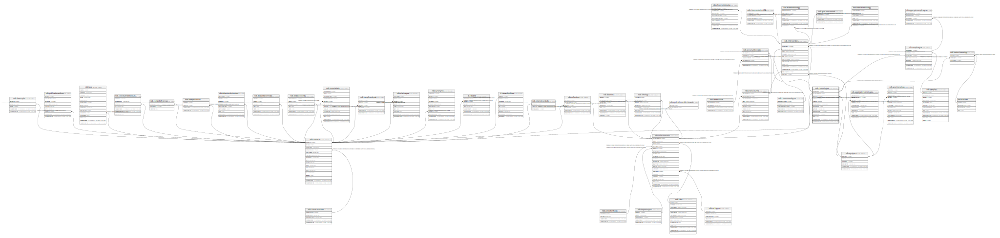

# ndb.chronologies

## Description

This table stores Chronology data. A Chronology refers to an explicit chronology assigned to a Collection Unit. A Chronology has Chronology Controls, the actual age-depth control points, which are stored in the ChronControls table. A Chronology is also based on an Age Model, which may be a numerical method that fits a curve to a set of age-depth control points or may simply be individually dated Analysis Units.  
A Collection Unit may have more than one Chronology, for example one in radiocarbon years and another in calibrated radiocarbon years. There may be a Chronology developed by the original author and another developed by a later research project. Chronologies may be stored for archival reasons, even though they are now believed to have problems, if they were used for an important research project. One Chronology per Age Type may be designated the default Chronology, which is the Chronology currently preferred by the database stewards.  
Based upon the Chronology, which includes the Age Model and the Chron Controls, ages are assigned to individual samples, which are stored in the SampleAges table.  
A younger and older age bounds are assigned to the Chronology. Within these bounds the Chronology is regarded as reliable. Ages may be assigned to samples beyond the reliable age bounds, but these are not considered reliable

## Columns

| #  | Name             | Type                           | Default                                                | Nullable | Children                                                                                                                                                                        | Parents                                       | Comment                                                                                                                                                                                                                                                                                                                                                                                                                                                                                                                                                                                                                                                                          |
| -- | ---------------- | ------------------------------ | ------------------------------------------------------ | -------- | ------------------------------------------------------------------------------------------------------------------------------------------------------------------------------- | --------------------------------------------- | -------------------------------------------------------------------------------------------------------------------------------------------------------------------------------------------------------------------------------------------------------------------------------------------------------------------------------------------------------------------------------------------------------------------------------------------------------------------------------------------------------------------------------------------------------------------------------------------------------------------------------------------------------------------------------- |
| 1  | chronologyid     | integer                        | nextval('ndb.seq_chronologies_chronologyid'::regclass) | false    | [ndb.sampleages](ndb.sampleages.md) [ndb.accumulationrates](ndb.accumulationrates.md) [ndb.chroncontrols](ndb.chroncontrols.md) [ndb.hiatuschronology](ndb.hiatuschronology.md) |                                               | An arbitrary Chronology identification number.                                                                                                                                                                                                                                                                                                                                                                                                                                                                                                                                                                                                                                   |
| 2  | collectionunitid | integer                        |                                                        | false    |                                                                                                                                                                                 | [ndb.collectionunits](ndb.collectionunits.md) | Collection Unit to which the Chronology applies. Field links to the CollectionUnits table.                                                                                                                                                                                                                                                                                                                                                                                                                                                                                                                                                                                       |
| 3  | agetypeid        | integer                        |                                                        | false    |                                                                                                                                                                                 | [ndb.agetypes](ndb.agetypes.md)               | Age type or units. Field links to the AgeTypes table.                                                                                                                                                                                                                                                                                                                                                                                                                                                                                                                                                                                                                            |
| 4  | contactid        | integer                        |                                                        | true     |                                                                                                                                                                                 | [ndb.contacts](ndb.contacts.md)               | Person who developed the Age Model. Field links to the Contacts table.                                                                                                                                                                                                                                                                                                                                                                                                                                                                                                                                                                                                           |
| 5  | isdefault        | boolean                        |                                                        | false    |                                                                                                                                                                                 |                                               | Indicates whether the Chronology is a default chronology or not. Default status is determined by a Neotoma data steward. Collection Units may have more than one default Chronology, but may have only one default Chronology per Age Type. Thus, there may be a default radiocarbon year Chronology and a default calibrated radiocarbon year Chronology, but only one of each. Default Chronologies may be used by the Neotoma web site, or other web sites, for displaying default diagrams or time series of data. Default Chronologies may also be of considerable use for actual research purposes; however, users may of course choose to develop their own chronologies. |
| 6  | chronologyname   | varchar(80)                    |                                                        | true     |                                                                                                                                                                                 |                                               | Optional name for the Chronology. Some examples are: COHMAP chron 1 A Chronology assigned by the COHMAP project. COHMAP chron 2 An alternative Chronology assigned by the COHMAP project NAPD 1 A Chronology assigned by the North American Pollen Database. Gajewski 1995 A Chronology assigned by Gajewski (1995).                                                                                                                                                                                                                                                                                                                                                 |
| 7  | dateprepared     | date                           |                                                        | true     |                                                                                                                                                                                 |                                               | Date that the Chronology was prepared.                                                                                                                                                                                                                                                                                                                                                                                                                                                                                                                                                                                                                                           |
| 8  | agemodel         | varchar(80)                    |                                                        | true     |                                                                                                                                                                                 |                                               | The age model used for the Chronology. Some examples are: linear interpolation, 3rd order polynomial, and individually dated analysis units.                                                                                                                                                                                                                                                                                                                                                                                                                                                                                                                                     |
| 9  | ageboundyounger  | integer                        |                                                        | true     |                                                                                                                                                                                 |                                               | The younger reliable age bound for the Chronology. Younger ages may be assigned to samples, but are not regarded as reliable. If the entire Chronology is considered reliable, AgeBoundYounger is assigned the youngest sample age rounded down to the nearest 10. Thus, for 72 BP, AgeBoundYounger = 70 BP; for -45 BP, AgeBoundYounger = -50 BP.                                                                                                                                                                                                                                                                                                                               |
| 10 | ageboundolder    | integer                        |                                                        | true     |                                                                                                                                                                                 |                                               | The older reliable age bound for the Chronology. Ages older than AgeOlderBound may be assigned to samples, but are not regarded as reliable. This situation is particularly true for ages extrapolated beyond the oldest Chron Control. . If the entire Chronology is considered reliable, AgeBoundOlder is assigned the oldest sample age rounded up to the nearest 10. Thus, for 12564 BP, AgeBoundOlder is 12570.                                                                                                                                                                                                                                                             |
| 11 | notes            | text                           |                                                        | true     |                                                                                                                                                                                 |                                               | Free form notes or comments about the Chronology.                                                                                                                                                                                                                                                                                                                                                                                                                                                                                                                                                                                                                                |
| 12 | recdatecreated   | timestamp(0) without time zone | timezone('UTC'::text, now())                           | false    |                                                                                                                                                                                 |                                               |                                                                                                                                                                                                                                                                                                                                                                                                                                                                                                                                                                                                                                                                                  |
| 13 | recdatemodified  | timestamp(0) without time zone |                                                        | false    |                                                                                                                                                                                 |                                               |                                                                                                                                                                                                                                                                                                                                                                                                                                                                                                                                                                                                                                                                                  |

## Constraints

| # | Name                            | Type        | Definition                                                                                                          |
| - | ------------------------------- | ----------- | ------------------------------------------------------------------------------------------------------------------- |
| 1 | fk_chronologies_agetypes        | FOREIGN KEY | FOREIGN KEY (agetypeid) REFERENCES ndb.agetypes(agetypeid) ON UPDATE CASCADE ON DELETE CASCADE                      |
| 2 | chronologies_pkey               | PRIMARY KEY | PRIMARY KEY (chronologyid)                                                                                          |
| 3 | fk_chronologies_collectionunits | FOREIGN KEY | FOREIGN KEY (collectionunitid) REFERENCES ndb.collectionunits(collectionunitid) ON UPDATE CASCADE ON DELETE CASCADE |
| 4 | fk_chronologies_contacts        | FOREIGN KEY | FOREIGN KEY (contactid) REFERENCES ndb.contacts(contactid) ON UPDATE CASCADE                                        |

## Indexes

| # | Name              | Definition                                                                           |
| - | ----------------- | ------------------------------------------------------------------------------------ |
| 1 | chronologies_pkey | CREATE UNIQUE INDEX chronologies_pkey ON ndb.chronologies USING btree (chronologyid) |
| 2 | chroldage_idx     | CREATE INDEX chroldage_idx ON ndb.chronologies USING btree (ageboundolder)           |
| 3 | chryoungage_idx   | CREATE INDEX chryoungage_idx ON ndb.chronologies USING btree (ageboundyounger)       |
| 4 | oldage_idx        | CREATE INDEX oldage_idx ON ndb.chronologies USING btree (ageboundolder)              |
| 5 | youngage_idx      | CREATE INDEX youngage_idx ON ndb.chronologies USING btree (ageboundyounger)          |

## Triggers

| # | Name                | Definition                                                                                                                                |
| - | ------------------- | ----------------------------------------------------------------------------------------------------------------------------------------- |
| 1 | tr_sites_modifydate | CREATE TRIGGER tr_sites_modifydate BEFORE INSERT OR UPDATE ON ndb.chronologies FOR EACH ROW EXECUTE FUNCTION ndb.update_recdatemodified() |

## Relations

---

> Generated by [tbls](https://github.com/k1LoW/tbls)