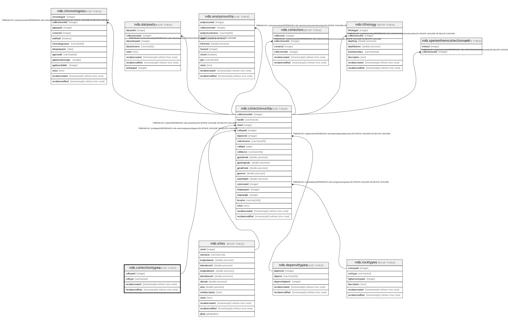

# ndb.collectiontypes

## Description

This table is a lookup table for types of Collection Units, or Collection Types. Table is referenced by the CollectionUnits table.

## Columns

| # | Name            | Type                           | Default                                                 | Nullable | Children                                      | Parents | Comment                                                                                                                                                                                                                                                                                                                          |
| - | --------------- | ------------------------------ | ------------------------------------------------------- | -------- | --------------------------------------------- | ------- | -------------------------------------------------------------------------------------------------------------------------------------------------------------------------------------------------------------------------------------------------------------------------------------------------------------------------------- |
| 1 | colltype        | varchar(64)                    |                                                         | true     |                                               |         | The Collection Type. Types include cores, sections, excavations, and animal middens. Collection Units may be modern collections, surface float, or isolated specimens. Composite Collections Units include different kinds of Analysis Units, for example a modern surface sample for ostracodes and an associated water sample. |
| 2 | colltypeid      | integer                        | nextval('ndb.seq_collectiontypes_colltypeid'::regclass) | false    | [ndb.collectionunits](ndb.collectionunits.md) |         | An arbitrary Collection Type identification number.                                                                                                                                                                                                                                                                              |
| 3 | recdatecreated  | timestamp(0) without time zone | timezone('UTC'::text, now())                            | false    |                                               |         |                                                                                                                                                                                                                                                                                                                                  |
| 4 | recdatemodified | timestamp(0) without time zone |                                                         | false    |                                               |         |                                                                                                                                                                                                                                                                                                                                  |

## Constraints

| # | Name                 | Type        | Definition               |
| - | -------------------- | ----------- | ------------------------ |
| 1 | collectiontypes_pkey | PRIMARY KEY | PRIMARY KEY (colltypeid) |

## Indexes

| # | Name                 | Definition                                                                               |
| - | -------------------- | ---------------------------------------------------------------------------------------- |
| 1 | collectiontypes_pkey | CREATE UNIQUE INDEX collectiontypes_pkey ON ndb.collectiontypes USING btree (colltypeid) |

## Triggers

| # | Name                | Definition                                                                                                                                   |
| - | ------------------- | -------------------------------------------------------------------------------------------------------------------------------------------- |
| 1 | tr_sites_modifydate | CREATE TRIGGER tr_sites_modifydate BEFORE INSERT OR UPDATE ON ndb.collectiontypes FOR EACH ROW EXECUTE FUNCTION ndb.update_recdatemodified() |

## Relations

---

> Generated by [tbls](https://github.com/k1LoW/tbls)