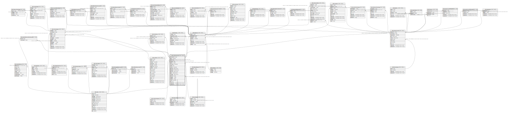

# ndb.collectionunits

## Description

This table stores data for Collection Units.

## Columns

| #  | Name             | Type                           | Default                                                       | Nullable | Children                                                                                                                                                                                                                                                | Parents                                       | Comment                                                                                                                                                                                                                                                                                                                                                                                                                                                          |
| -- | ---------------- | ------------------------------ | ------------------------------------------------------------- | -------- | ------------------------------------------------------------------------------------------------------------------------------------------------------------------------------------------------------------------------------------------------------- | --------------------------------------------- | ---------------------------------------------------------------------------------------------------------------------------------------------------------------------------------------------------------------------------------------------------------------------------------------------------------------------------------------------------------------------------------------------------------------------------------------------------------------- |
| 1  | collectionunitid | integer                        | nextval('ndb.seq_collectionunits_collectionunitid'::regclass) | false    | [ndb.chronologies](ndb.chronologies.md) [ndb.datasets](ndb.datasets.md) [ndb.analysisunits](ndb.analysisunits.md) [ndb.collectors](ndb.collectors.md) [ndb.lithology](ndb.lithology.md) [ndb.speleothemcollectionunit](ndb.speleothemcollectionunit.md) |                                               | An arbitrary Collection Unit identification number.                                                                                                                                                                                                                                                                                                                                                                                                              |
| 2  | handle           | varchar(10)                    |                                                               | false    |                                                                                                                                                                                                                                                         |                                               | Code name for the Collection Unit. This code may be up to 10 characters, but an effort is made to keep these to 8 characters or less. Data are frequently distributed by Collection Unit, and the Handle is used for file names.                                                                                                                                                                                                                                 |
| 3  | siteid           | integer                        |                                                               | false    |                                                                                                                                                                                                                                                         | [ndb.sites](ndb.sites.md)                     | Site where CollectionUnit was located. Field links to Sites table.                                                                                                                                                                                                                                                                                                                                                                                               |
| 4  | colltypeid       | integer                        |                                                               | true     |                                                                                                                                                                                                                                                         | [ndb.collectiontypes](ndb.collectiontypes.md) | Type of Collection Unit. Field links to the CollectionTypes table.                                                                                                                                                                                                                                                                                                                                                                                               |
| 5  | depenvtid        | integer                        |                                                               | true     |                                                                                                                                                                                                                                                         | [ndb.depenvttypes](ndb.depenvttypes.md)       | Depositional environment of the CollectionUnit. Normally, this key refers to the modern environment. For example, the site may be located on a colluvial slope, in which case the Depositional Environment may be Colluvium or Colluvial Fan. However, an excavation may extend into alluvial sediments, which represent a different depositional environment. These are accounted for by the Facies of the AnalysisUnit. Field links to the DepEnvtTypes table. |
| 6  | collunitname     | varchar(255)                   |                                                               | true     |                                                                                                                                                                                                                                                         |                                               | Name of the Collection Unit. Examples: Core BPT82A, Structure 9, P4A Test 57. If faunal data are reported from a site or locality without explicit Collection Units, then data are assigned to a single Collection Unit with the name «Locality».                                                                                                                                                                                                                |
| 7  | colldate         | date                           |                                                               | true     |                                                                                                                                                                                                                                                         |                                               | Date Collection Unit was collected.                                                                                                                                                                                                                                                                                                                                                                                                                              |
| 8  | colldevice       | varchar(255)                   |                                                               | true     |                                                                                                                                                                                                                                                         |                                               | Device used for obtain Collection Unit. This field applies primarily to cores, for example «Wright square-rod piston corer (5 cm)».                                                                                                                                                                                                                                                                                                                              |
| 9  | gpslatitude      | double precision               |                                                               | true     |                                                                                                                                                                                                                                                         |                                               | Precise latitude of the Collection Unit, typically taken with a GPS, although may be precisely measured from a map.                                                                                                                                                                                                                                                                                                                                              |
| 10 | gpslongitude     | double precision               |                                                               | true     |                                                                                                                                                                                                                                                         |                                               | Precise longitude of the Collection Unit, typically taken with a GPS, although may be precisely measured from a map.                                                                                                                                                                                                                                                                                                                                             |
| 11 | gpsaltitude      | double precision               |                                                               | true     |                                                                                                                                                                                                                                                         |                                               | Precise altitude of the Collection Unit, typically taken with a GPS or precisely obtained from a map.                                                                                                                                                                                                                                                                                                                                                            |
| 12 | gpserror         | double precision               |                                                               | true     |                                                                                                                                                                                                                                                         |                                               | Error in the horizontal GPS coordinates, if known.                                                                                                                                                                                                                                                                                                                                                                                                               |
| 13 | waterdepth       | double precision               |                                                               | true     |                                                                                                                                                                                                                                                         |                                               | Depth of water at the Collection Unit location. This field applies mainly to Collection Units from lakes.                                                                                                                                                                                                                                                                                                                                                        |
| 14 | substrateid      | integer                        |                                                               | true     |                                                                                                                                                                                                                                                         | [ndb.rocktypes](ndb.rocktypes.md)             | Substrate or rock type on which the Collection Unit lies. Field links to the RockTypes table. This field is especially used for rodent middens.                                                                                                                                                                                                                                                                                                                  |
| 15 | slopeaspect      | integer                        |                                                               | true     |                                                                                                                                                                                                                                                         |                                               | For Collection Units on slopes, the horizontal direction to which a slope faces measured in degrees clockwise from north. This field is especially used for rodent middens.                                                                                                                                                                                                                                                                                      |
| 16 | slopeangle       | integer                        |                                                               | true     |                                                                                                                                                                                                                                                         |                                               | For Collection Units on slopes, the angle of slope from horizontal. field is especially used for rodent middens.                                                                                                                                                                                                                                                                                                                                                 |
| 17 | location         | varchar(255)                   |                                                               | true     |                                                                                                                                                                                                                                                         |                                               | Short description of the location of the Collection Unit within the site.                                                                                                                                                                                                                                                                                                                                                                                        |
| 18 | notes            | text                           |                                                               | true     |                                                                                                                                                                                                                                                         |                                               | Free form notes or comments about the Collection Unit.                                                                                                                                                                                                                                                                                                                                                                                                           |
| 19 | recdatecreated   | timestamp(0) without time zone | timezone('UTC'::text, now())                                  | false    |                                                                                                                                                                                                                                                         |                                               |                                                                                                                                                                                                                                                                                                                                                                                                                                                                  |
| 20 | recdatemodified  | timestamp(0) without time zone |                                                               | false    |                                                                                                                                                                                                                                                         |                                               |                                                                                                                                                                                                                                                                                                                                                                                                                                                                  |

## Constraints

| # | Name                               | Type        | Definition                                                                                              |
| - | ---------------------------------- | ----------- | ------------------------------------------------------------------------------------------------------- |
| 1 | fk_collectionunits_collectiontypes | FOREIGN KEY | FOREIGN KEY (colltypeid) REFERENCES ndb.collectiontypes(colltypeid) ON UPDATE CASCADE ON DELETE CASCADE |
| 2 | collectionunits_pkey               | PRIMARY KEY | PRIMARY KEY (collectionunitid)                                                                          |
| 3 | fk_collectionunits_depenvttypes    | FOREIGN KEY | FOREIGN KEY (depenvtid) REFERENCES ndb.depenvttypes(depenvtid) ON UPDATE CASCADE ON DELETE CASCADE      |
| 4 | fk_collectionunits_rocktypes       | FOREIGN KEY | FOREIGN KEY (substrateid) REFERENCES ndb.rocktypes(rocktypeid) ON UPDATE CASCADE ON DELETE CASCADE      |
| 5 | fk_collectionunits_sites           | FOREIGN KEY | FOREIGN KEY (siteid) REFERENCES ndb.sites(siteid) ON UPDATE CASCADE ON DELETE CASCADE                   |

## Indexes

| # | Name                                | Definition                                                                                                                    |
| - | ----------------------------------- | ----------------------------------------------------------------------------------------------------------------------------- |
| 1 | collectionunits_pkey                | CREATE UNIQUE INDEX collectionunits_pkey ON ndb.collectionunits USING btree (collectionunitid)                                |
| 2 | ix_collectionunitid_collectionunits | CREATE INDEX ix_collectionunitid_collectionunits ON ndb.collectionunits USING btree (collectionunitid) WITH (fillfactor='10') |
| 3 | ix_depenvtid_collectionunits        | CREATE INDEX ix_depenvtid_collectionunits ON ndb.collectionunits USING btree (depenvtid) WITH (fillfactor='10')               |
| 4 | ix_siteid_collectionunits           | CREATE INDEX ix_siteid_collectionunits ON ndb.collectionunits USING btree (siteid) WITH (fillfactor='10')                     |

## Triggers

| # | Name                | Definition                                                                                                                                   |
| - | ------------------- | -------------------------------------------------------------------------------------------------------------------------------------------- |
| 1 | tr_sites_modifydate | CREATE TRIGGER tr_sites_modifydate BEFORE INSERT OR UPDATE ON ndb.collectionunits FOR EACH ROW EXECUTE FUNCTION ndb.update_recdatemodified() |

## Relations

---

> Generated by [tbls](https://github.com/k1LoW/tbls)