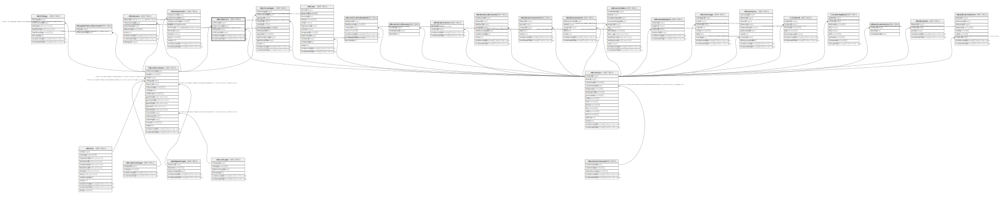

# ndb.collectors

## Description

The Collectors table lists the people who collected Collection Units.

## Columns

| # | Name             | Type                           | Default                                             | Nullable | Children | Parents                                       | Comment                                                                                                                          |
| - | ---------------- | ------------------------------ | --------------------------------------------------- | -------- | -------- | --------------------------------------------- | -------------------------------------------------------------------------------------------------------------------------------- |
| 1 | collectorid      | integer                        | nextval('ndb.seq_collectors_collectorid'::regclass) | false    |          |                                               | An arbitrary Collector identification number.                                                                                    |
| 2 | collectionunitid | integer                        |                                                     | false    |          | [ndb.collectionunits](ndb.collectionunits.md) | CollectionUnit collected. Field links to CollectionUnits table.                                                                  |
| 3 | contactid        | integer                        |                                                     | false    |          | [ndb.contacts](ndb.contacts.md)               | Person who collected the CollectionUnit. Multiple individuals are listed in separate records. Field links to the Contacts table. |
| 4 | collectororder   | integer                        |                                                     | true     |          |                                               | Order in which Collectors should be listed.                                                                                      |
| 5 | recdatecreated   | timestamp(0) without time zone | timezone('UTC'::text, now())                        | false    |          |                                               |                                                                                                                                  |
| 6 | recdatemodified  | timestamp(0) without time zone |                                                     | false    |          |                                               |                                                                                                                                  |

## Constraints

| # | Name                          | Type        | Definition                                                                                                          |
| - | ----------------------------- | ----------- | ------------------------------------------------------------------------------------------------------------------- |
| 1 | fk_collectors_collectionunits | FOREIGN KEY | FOREIGN KEY (collectionunitid) REFERENCES ndb.collectionunits(collectionunitid) ON UPDATE CASCADE ON DELETE CASCADE |
| 2 | collectors_pkey               | PRIMARY KEY | PRIMARY KEY (collectorid)                                                                                           |
| 3 | fk_collectors_contacts        | FOREIGN KEY | FOREIGN KEY (contactid) REFERENCES ndb.contacts(contactid) ON UPDATE CASCADE                                        |

## Indexes

| # | Name            | Definition                                                                      |
| - | --------------- | ------------------------------------------------------------------------------- |
| 1 | collectors_pkey | CREATE UNIQUE INDEX collectors_pkey ON ndb.collectors USING btree (collectorid) |

## Triggers

| # | Name                | Definition                                                                                                                              |
| - | ------------------- | --------------------------------------------------------------------------------------------------------------------------------------- |
| 1 | tr_sites_modifydate | CREATE TRIGGER tr_sites_modifydate BEFORE INSERT OR UPDATE ON ndb.collectors FOR EACH ROW EXECUTE FUNCTION ndb.update_recdatemodified() |

## Relations

---

> Generated by [tbls](https://github.com/k1LoW/tbls)