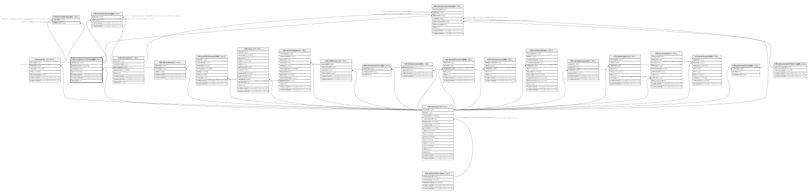

# ndb.constituentdatabases

## Description

## Columns

| # | Name            | Type                           | Default                                                      | Nullable | Children                                                                                                                                          | Parents                         | Comment |
| - | --------------- | ------------------------------ | ------------------------------------------------------------ | -------- | ------------------------------------------------------------------------------------------------------------------------------------------------- | ------------------------------- | ------- |
| 1 | contactid       | integer                        |                                                              | true     |                                                                                                                                                   | [ndb.contacts](ndb.contacts.md) |         |
| 2 | databaseid      | integer                        | nextval('ndb.seq_constituentdatabases_databaseid'::regclass) | false    | [ndb.datasetdatabases](ndb.datasetdatabases.md) [ndb.datasetsubmissions](ndb.datasetsubmissions.md) [ti.stewarddatabases](ti.stewarddatabases.md) |                                 |         |
| 3 | databasename    | varchar(80)                    |                                                              | false    |                                                                                                                                                   |                                 |         |
| 4 | description     | text                           |                                                              | true     |                                                                                                                                                   |                                 |         |
| 5 | recdatecreated  | timestamp(0) without time zone | timezone('UTC'::text, now())                                 | false    |                                                                                                                                                   |                                 |         |
| 6 | recdatemodified | timestamp(0) without time zone |                                                              | false    |                                                                                                                                                   |                                 |         |
| 7 | url             | varchar(128)                   |                                                              | true     |                                                                                                                                                   |                                 |         |

## Constraints

| # | Name                             | Type        | Definition                                                 |
| - | -------------------------------- | ----------- | ---------------------------------------------------------- |
| 1 | constituentdatabases_pkey        | PRIMARY KEY | PRIMARY KEY (databaseid)                                   |
| 2 | fk_constituentdatabases_contacts | FOREIGN KEY | FOREIGN KEY (contactid) REFERENCES ndb.contacts(contactid) |

## Indexes

| # | Name                      | Definition                                                                                         |
| - | ------------------------- | -------------------------------------------------------------------------------------------------- |
| 1 | constituentdatabases_pkey | CREATE UNIQUE INDEX constituentdatabases_pkey ON ndb.constituentdatabases USING btree (databaseid) |

## Triggers

| # | Name                | Definition                                                                                                                                        |
| - | ------------------- | ------------------------------------------------------------------------------------------------------------------------------------------------- |
| 1 | tr_sites_modifydate | CREATE TRIGGER tr_sites_modifydate BEFORE INSERT OR UPDATE ON ndb.constituentdatabases FOR EACH ROW EXECUTE FUNCTION ndb.update_recdatemodified() |

## Relations

---

> Generated by [tbls](https://github.com/k1LoW/tbls)