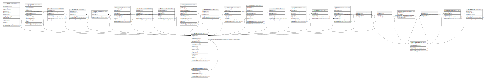

# ndb.contactreferences

## Description

## Columns

| # | Name         | Type    | Default | Nullable | Children | Parents                                           | Comment |
| - | ------------ | ------- | ------- | -------- | -------- | ------------------------------------------------- | ------- |
| 1 | contactid    | integer |         | true     |          | [ndb.contacts](ndb.contacts.md)                   |         |
| 2 | exdatabaseid | integer |         | true     |          | [ndb.externaldatabases](ndb.externaldatabases.md) |         |
| 3 | identifier   | text    |         | true     |          |                                                   |         |

## Constraints

| # | Name                                | Type        | Definition                                                                 |
| - | ----------------------------------- | ----------- | -------------------------------------------------------------------------- |
| 1 | contactreferences_contactid_fkey    | FOREIGN KEY | FOREIGN KEY (contactid) REFERENCES ndb.contacts(contactid)                 |
| 2 | contactreferences_exdatabaseid_fkey | FOREIGN KEY | FOREIGN KEY (exdatabaseid) REFERENCES ndb.externaldatabases(extdatabaseid) |

## Relations

---

> Generated by [tbls](https://github.com/k1LoW/tbls)