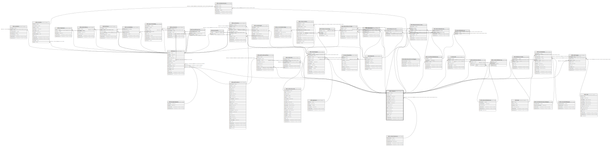

# ndb.contacts

## Description

This table lists persons and organizations referenced by the Chronologies, Collectors, DatasetPIs, DatasetSubmissions, Projects, PublicationAuthors, SampleAnalysts, and SiteImages tables.

## Columns

| #  | Name            | Type                           | Default                                         | Nullable | Children                                                                                                                                                                                                                                                                                                                                                                                                                                                                                                                                                                                                                                                                                                                                                                          | Parents                                       | Comment                                                                                                                                                                                                                                                           |
| -- | --------------- | ------------------------------ | ----------------------------------------------- | -------- | --------------------------------------------------------------------------------------------------------------------------------------------------------------------------------------------------------------------------------------------------------------------------------------------------------------------------------------------------------------------------------------------------------------------------------------------------------------------------------------------------------------------------------------------------------------------------------------------------------------------------------------------------------------------------------------------------------------------------------------------------------------------------------- | --------------------------------------------- | ----------------------------------------------------------------------------------------------------------------------------------------------------------------------------------------------------------------------------------------------------------------- |
| 1  | contactid       | integer                        | nextval('ndb.seq_contacts_contactid'::regclass) | false    | [ndb.datasetpis](ndb.datasetpis.md) [ndb.publicationauthors](ndb.publicationauthors.md) [ndb.taxa](ndb.taxa.md) [ndb.chronologies](ndb.chronologies.md) [ndb.constituentdatabases](ndb.constituentdatabases.md) [ndb.collectors](ndb.collectors.md) [ndb.contactreferences](ndb.contactreferences.md) [ndb.dataprocessors](ndb.dataprocessors.md) [ndb.datasetsubmissions](ndb.datasetsubmissions.md) [ndb.datasettaxonnotes](ndb.datasettaxonnotes.md) [ndb.datataxonnotes](ndb.datataxonnotes.md) [ndb.isometadata](ndb.isometadata.md) [ndb.sampleanalysts](ndb.sampleanalysts.md) [ndb.siteimages](ndb.siteimages.md) [ndb.synonymy](ndb.synonymy.md) [ti.stewards](ti.stewards.md) [ti.stewardupdates](ti.stewardupdates.md) [ndb.externalcontacts](ndb.externalcontacts.md) |                                               | An arbitrary Contact identification number.                                                                                                                                                                                                                       |
| 2  | aliasid         | integer                        |                                                 | true     |                                                                                                                                                                                                                                                                                                                                                                                                                                                                                                                                                                                                                                                                                                                                                                                   |                                               | The ContactID of a person’s current name. If the AliasID is different from the ContactID, the ContactID refers to the person’s former name. For example, if J. L. Bouvier became J. B. Kennedy, the ContactID for J. B. Kennedy is the AliasID for J. L. Bouvier. |
| 3  | contactname     | varchar(80)                    |                                                 | false    |                                                                                                                                                                                                                                                                                                                                                                                                                                                                                                                                                                                                                                                                                                                                                                                   |                                               | Full name of the person, last name first (e.g. «Simpson, George Gaylord») or name of organization or project (e.g. «Great Plains Flora Association»).                                                                                                             |
| 4  | contactstatusid | integer                        |                                                 | true     |                                                                                                                                                                                                                                                                                                                                                                                                                                                                                                                                                                                                                                                                                                                                                                                   | [ndb.contactstatuses](ndb.contactstatuses.md) | Current status of the person, organization, or project. Field links to the ContactStatuses lookup table.                                                                                                                                                          |
| 5  | familyname      | varchar(80)                    |                                                 | true     |                                                                                                                                                                                                                                                                                                                                                                                                                                                                                                                                                                                                                                                                                                                                                                                   |                                               | Family or surname name of a person.                                                                                                                                                                                                                               |
| 6  | leadinginitials | varchar(16)                    |                                                 | true     |                                                                                                                                                                                                                                                                                                                                                                                                                                                                                                                                                                                                                                                                                                                                                                                   |                                               | Leading initials for given or forenames without spaces (e.g. «G.G.»).                                                                                                                                                                                             |
| 7  | givennames      | varchar(80)                    |                                                 | true     |                                                                                                                                                                                                                                                                                                                                                                                                                                                                                                                                                                                                                                                                                                                                                                                   |                                               | Given or forenames of a person (e.g. «George Gaylord»). Initials with spaces are used if full given names are not known (e.g. «G. G»).                                                                                                                            |
| 8  | suffix          | varchar(16)                    |                                                 | true     |                                                                                                                                                                                                                                                                                                                                                                                                                                                                                                                                                                                                                                                                                                                                                                                   |                                               | Suffix of a person’s name (e.g. «Jr.», «III»).                                                                                                                                                                                                                    |
| 9  | title           | varchar(16)                    |                                                 | true     |                                                                                                                                                                                                                                                                                                                                                                                                                                                                                                                                                                                                                                                                                                                                                                                   |                                               | A person’s title (e.g. «Dr.», «Prof.», «Prof. Dr»).                                                                                                                                                                                                               |
| 10 | phone           | varchar(64)                    |                                                 | true     |                                                                                                                                                                                                                                                                                                                                                                                                                                                                                                                                                                                                                                                                                                                                                                                   |                                               | Telephone number.                                                                                                                                                                                                                                                 |
| 11 | fax             | varchar(64)                    |                                                 | true     |                                                                                                                                                                                                                                                                                                                                                                                                                                                                                                                                                                                                                                                                                                                                                                                   |                                               | Fax number.                                                                                                                                                                                                                                                       |
| 12 | email           | varchar(64)                    |                                                 | true     |                                                                                                                                                                                                                                                                                                                                                                                                                                                                                                                                                                                                                                                                                                                                                                                   |                                               | Email address.                                                                                                                                                                                                                                                    |
| 13 | url             | varchar(255)                   |                                                 | true     |                                                                                                                                                                                                                                                                                                                                                                                                                                                                                                                                                                                                                                                                                                                                                                                   |                                               | Universal Resource Locator, an Internet World Wide Web address.                                                                                                                                                                                                   |
| 14 | address         | text                           |                                                 | true     |                                                                                                                                                                                                                                                                                                                                                                                                                                                                                                                                                                                                                                                                                                                                                                                   |                                               | Full mailing address.                                                                                                                                                                                                                                             |
| 15 | notes           | text                           |                                                 | true     |                                                                                                                                                                                                                                                                                                                                                                                                                                                                                                                                                                                                                                                                                                                                                                                   |                                               | Free form notes or comments about the person, organization, or project.                                                                                                                                                                                           |
| 16 | recdatecreated  | timestamp(0) without time zone | timezone('UTC'::text, now())                    | false    |                                                                                                                                                                                                                                                                                                                                                                                                                                                                                                                                                                                                                                                                                                                                                                                   |                                               |                                                                                                                                                                                                                                                                   |
| 17 | recdatemodified | timestamp(0) without time zone |                                                 | false    |                                                                                                                                                                                                                                                                                                                                                                                                                                                                                                                                                                                                                                                                                                                                                                                   |                                               |                                                                                                                                                                                                                                                                   |

## Constraints

| # | Name                        | Type        | Definition                                                                                                         |
| - | --------------------------- | ----------- | ------------------------------------------------------------------------------------------------------------------ |
| 1 | contacts_pkey               | PRIMARY KEY | PRIMARY KEY (contactid)                                                                                            |
| 2 | fk_contacts_contactstatuses | FOREIGN KEY | FOREIGN KEY (contactstatusid) REFERENCES ndb.contactstatuses(contactstatusid) ON UPDATE CASCADE ON DELETE SET NULL |

## Indexes

| # | Name            | Definition                                                                       |
| - | --------------- | -------------------------------------------------------------------------------- |
| 1 | contacts_pkey   | CREATE UNIQUE INDEX contacts_pkey ON ndb.contacts USING btree (contactid)        |
| 2 | familynames_idx | CREATE INDEX familynames_idx ON ndb.contacts USING gin (familyname gin_trgm_ops) |

## Triggers

| # | Name                | Definition                                                                                                                            |
| - | ------------------- | ------------------------------------------------------------------------------------------------------------------------------------- |
| 1 | tr_sites_modifydate | CREATE TRIGGER tr_sites_modifydate BEFORE INSERT OR UPDATE ON ndb.contacts FOR EACH ROW EXECUTE FUNCTION ndb.update_recdatemodified() |

## Relations

---

> Generated by [tbls](https://github.com/k1LoW/tbls)