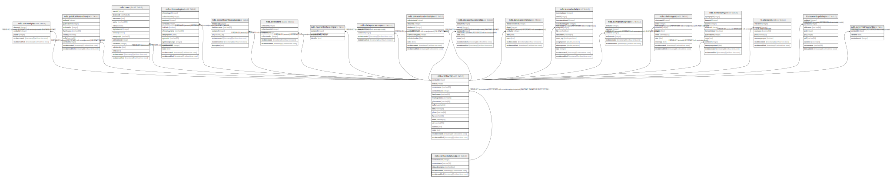

# ndb.contactstatuses

## Description

Lookup table of Contact Statuses. Table is referenced by the Contacts table.

## Columns

| # | Name              | Type                           | Default                                                      | Nullable | Children                        | Parents | Comment                                            |
| - | ----------------- | ------------------------------ | ------------------------------------------------------------ | -------- | ------------------------------- | ------- | -------------------------------------------------- |
| 1 | contactstatus     | varchar(16)                    |                                                              | true     |                                 |         | Status of person, organization, or project.        |
| 2 | contactstatusid   | integer                        | nextval('ndb.seq_contactstatuses_contactstatusid'::regclass) | false    | [ndb.contacts](ndb.contacts.md) |         | An arbitrary Contact Status identification number. |
| 3 | recdatecreated    | timestamp(0) without time zone | timezone('UTC'::text, now())                                 | false    |                                 |         |                                                    |
| 4 | recdatemodified   | timestamp(0) without time zone |                                                              | false    |                                 |         |                                                    |
| 5 | statusdescription | varchar(255)                   |                                                              | true     |                                 |         | Description of the status.                         |

## Constraints

| # | Name                 | Type        | Definition                    |
| - | -------------------- | ----------- | ----------------------------- |
| 1 | contactstatuses_pkey | PRIMARY KEY | PRIMARY KEY (contactstatusid) |

## Indexes

| # | Name                 | Definition                                                                                    |
| - | -------------------- | --------------------------------------------------------------------------------------------- |
| 1 | contactstatuses_pkey | CREATE UNIQUE INDEX contactstatuses_pkey ON ndb.contactstatuses USING btree (contactstatusid) |

## Triggers

| # | Name                | Definition                                                                                                                                   |
| - | ------------------- | -------------------------------------------------------------------------------------------------------------------------------------------- |
| 1 | tr_sites_modifydate | CREATE TRIGGER tr_sites_modifydate BEFORE INSERT OR UPDATE ON ndb.contactstatuses FOR EACH ROW EXECUTE FUNCTION ndb.update_recdatemodified() |

## Relations

---

> Generated by [tbls](https://github.com/k1LoW/tbls)