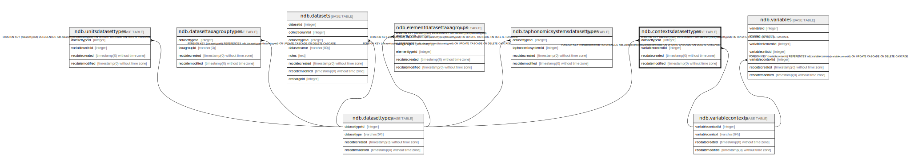

# ndb.contextsdatasettypes

## Description

## Columns

| # | Name              | Type                           | Default                      | Nullable | Children | Parents                                         | Comment |
| - | ----------------- | ------------------------------ | ---------------------------- | -------- | -------- | ----------------------------------------------- | ------- |
| 1 | datasettypeid     | integer                        |                              | false    |          | [ndb.datasettypes](ndb.datasettypes.md)         |         |
| 2 | variablecontextid | integer                        |                              | false    |          | [ndb.variablecontexts](ndb.variablecontexts.md) |         |
| 3 | recdatecreated    | timestamp(0) without time zone | timezone('UTC'::text, now()) | false    |          |                                                 |         |
| 4 | recdatemodified   | timestamp(0) without time zone |                              | false    |          |                                                 |         |

## Constraints

| # | Name                                     | Type        | Definition                                                                                                             |
| - | ---------------------------------------- | ----------- | ---------------------------------------------------------------------------------------------------------------------- |
| 1 | contextsdatasettypes_pkey                | PRIMARY KEY | PRIMARY KEY (datasettypeid, variablecontextid)                                                                         |
| 2 | fk_contextsdatasettypes_datasettypes     | FOREIGN KEY | FOREIGN KEY (datasettypeid) REFERENCES ndb.datasettypes(datasettypeid) ON UPDATE CASCADE ON DELETE CASCADE             |
| 3 | fk_contextsdatasettypes_variablecontexts | FOREIGN KEY | FOREIGN KEY (variablecontextid) REFERENCES ndb.variablecontexts(variablecontextid) ON UPDATE CASCADE ON DELETE CASCADE |

## Indexes

| # | Name                      | Definition                                                                                                               |
| - | ------------------------- | ------------------------------------------------------------------------------------------------------------------------ |
| 1 | contextsdatasettypes_pkey | CREATE UNIQUE INDEX contextsdatasettypes_pkey ON ndb.contextsdatasettypes USING btree (datasettypeid, variablecontextid) |

## Triggers

| # | Name                | Definition                                                                                                                                        |
| - | ------------------- | ------------------------------------------------------------------------------------------------------------------------------------------------- |
| 1 | tr_sites_modifydate | CREATE TRIGGER tr_sites_modifydate BEFORE INSERT OR UPDATE ON ndb.contextsdatasettypes FOR EACH ROW EXECUTE FUNCTION ndb.update_recdatemodified() |

## Relations

---

> Generated by [tbls](https://github.com/k1LoW/tbls)