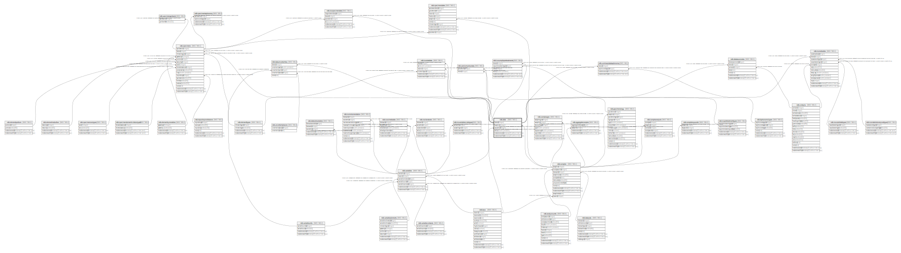

# ndb.data

## Description

The primary data table in the database. Each occurrence of a Variable in a sample comprises a record in the Data table.

## Columns

| # | Name            | Type                           | Default                                  | Nullable | Children                                                                                                                                                                                                                                                                                                                                                                                                                          | Parents                           | Comment                                                         |
| - | --------------- | ------------------------------ | ---------------------------------------- | -------- | --------------------------------------------------------------------------------------------------------------------------------------------------------------------------------------------------------------------------------------------------------------------------------------------------------------------------------------------------------------------------------------------------------------------------------- | --------------------------------- | --------------------------------------------------------------- |
| 1 | dataid          | integer                        | nextval('ndb.seq_data_dataid'::regclass) | false    | [ndb.datataxonnotes](ndb.datataxonnotes.md) [ndb.isometadata](ndb.isometadata.md) [ndb.isosamplepretreatments](ndb.isosamplepretreatments.md) [ndb.isospecimendata](ndb.isospecimendata.md) [ndb.isostratdata](ndb.isostratdata.md) [ndb.specimens](ndb.specimens.md) [ndb.summarydatataphonomy](ndb.summarydatataphonomy.md) [ndb.datauncertainties](ndb.datauncertainties.md) [ndb.uraniumseriesdata](ndb.uraniumseriesdata.md) |                                   |                                                                 |
| 2 | sampleid        | integer                        |                                          | false    |                                                                                                                                                                                                                                                                                                                                                                                                                                   | [ndb.samples](ndb.samples.md)     | Sample identification number. Field links to Samples table.     |
| 3 | variableid      | integer                        |                                          | false    |                                                                                                                                                                                                                                                                                                                                                                                                                                   | [ndb.variables](ndb.variables.md) | Variable identification number. Field links to Variables table. |
| 4 | value           | double precision               |                                          | true     |                                                                                                                                                                                                                                                                                                                                                                                                                                   |                                   | The value of the variable.                                      |
| 5 | recdatecreated  | timestamp(0) without time zone | timezone('UTC'::text, now())             | false    |                                                                                                                                                                                                                                                                                                                                                                                                                                   |                                   |                                                                 |
| 6 | recdatemodified | timestamp(0) without time zone |                                          | false    |                                                                                                                                                                                                                                                                                                                                                                                                                                   |                                   |                                                                 |

## Constraints

| # | Name              | Type        | Definition                                                                                        |
| - | ----------------- | ----------- | ------------------------------------------------------------------------------------------------- |
| 1 | data_pkey         | PRIMARY KEY | PRIMARY KEY (dataid)                                                                              |
| 2 | fk_data_samples   | FOREIGN KEY | FOREIGN KEY (sampleid) REFERENCES ndb.samples(sampleid) ON UPDATE CASCADE ON DELETE CASCADE       |
| 3 | fk_data_variables | FOREIGN KEY | FOREIGN KEY (variableid) REFERENCES ndb.variables(variableid) ON UPDATE CASCADE ON DELETE CASCADE |

## Indexes

| # | Name              | Definition                                                          |
| - | ----------------- | ------------------------------------------------------------------- |
| 1 | data_pkey         | CREATE UNIQUE INDEX data_pkey ON ndb.data USING btree (dataid)      |
| 2 | data_sample_idx   | CREATE INDEX data_sample_idx ON ndb.data USING btree (sampleid)     |
| 3 | data_variable_idx | CREATE INDEX data_variable_idx ON ndb.data USING btree (variableid) |

## Triggers

| # | Name                | Definition                                                                                                                        |
| - | ------------------- | --------------------------------------------------------------------------------------------------------------------------------- |
| 1 | tr_sites_modifydate | CREATE TRIGGER tr_sites_modifydate BEFORE INSERT OR UPDATE ON ndb.data FOR EACH ROW EXECUTE FUNCTION ndb.update_recdatemodified() |

## Relations

---

> Generated by [tbls](https://github.com/k1LoW/tbls)