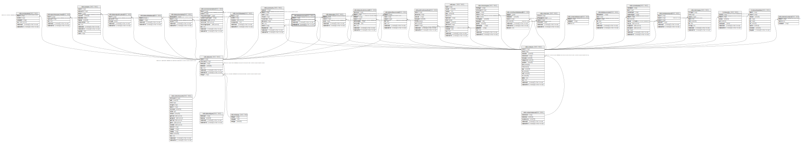

# ndb.dataprocessors

## Description

## Columns

| # | Name            | Type                           | Default                      | Nullable | Children | Parents                         | Comment |
| - | --------------- | ------------------------------ | ---------------------------- | -------- | -------- | ------------------------------- | ------- |
| 1 | contactid       | integer                        |                              | false    |          | [ndb.contacts](ndb.contacts.md) |         |
| 2 | datasetid       | integer                        |                              | false    |          | [ndb.datasets](ndb.datasets.md) |         |
| 3 | recdatecreated  | timestamp(0) without time zone | timezone('UTC'::text, now()) | false    |          |                                 |         |
| 4 | recdatemodified | timestamp(0) without time zone |                              | false    |          |                                 |         |

## Viewpoints

| Name                                     | Definition                                                       |
| ---------------------------------------- | ---------------------------------------------------------------- |
| [Contact related tables](viewpoint-4.md) | Tables that relate to people, or are connected to the contactid. |

## Constraints

| # | Name                       | Type        | Definition                                                                                     |
| - | -------------------------- | ----------- | ---------------------------------------------------------------------------------------------- |
| 1 | dataprocessors_pkey        | PRIMARY KEY | PRIMARY KEY (datasetid, contactid)                                                             |
| 2 | fk_dataprocessors_contacts | FOREIGN KEY | FOREIGN KEY (contactid) REFERENCES ndb.contacts(contactid) ON UPDATE CASCADE                   |
| 3 | fk_dataprocessors_datasets | FOREIGN KEY | FOREIGN KEY (datasetid) REFERENCES ndb.datasets(datasetid) ON UPDATE CASCADE ON DELETE CASCADE |

## Indexes

| # | Name                | Definition                                                                                       |
| - | ------------------- | ------------------------------------------------------------------------------------------------ |
| 1 | dataprocessors_pkey | CREATE UNIQUE INDEX dataprocessors_pkey ON ndb.dataprocessors USING btree (datasetid, contactid) |

## Triggers

| # | Name                | Definition                                                                                                                                  |
| - | ------------------- | ------------------------------------------------------------------------------------------------------------------------------------------- |
| 1 | tr_sites_modifydate | CREATE TRIGGER tr_sites_modifydate BEFORE INSERT OR UPDATE ON ndb.dataprocessors FOR EACH ROW EXECUTE FUNCTION ndb.update_recdatemodified() |

## Relations

---

> Generated by [tbls](https://github.com/k1LoW/tbls)